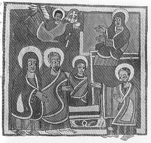

  
[Intangible Textual Heritage](../../index)  [Christianity](../index) 
[Africa](../../afr/index)  [Index](index)  [Previous](07)  [Next](09) 

------------------------------------------------------------------------

  
*The Kebra Nagast*, by E.A. Wallis Budge, \[1932\], at Intangible
Textual Heritage

------------------------------------------------------------------------

PLATE VIII

 

1\. An angel bringing food to Mary when she was living in the Temple  
2. The high priest addressing Ḥannâ and Joachim and their daughter Mary

*From Brit. Mus. Orient. No. 481, fol. 101 b*

------------------------------------------------------------------------

[Next: IX.](09)

