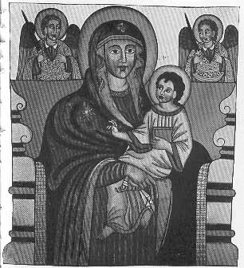

  
[Intangible Textual Heritage](../../index)  [Christianity](../index) 
[Africa](../../afr/index)  [Index](index)  [Previous](08)  [Next](10) 

------------------------------------------------------------------------

  
*The Kebra Nagast*, by E.A. Wallis Budge, \[1932\], at Intangible
Textual Heritage

------------------------------------------------------------------------

PLATE IX

 

Portrait of Our Blessed Lady Mary, the two-fold Virgin, and Child. By
her side stand the Archangels Michael and Gabriel

*From the Book of the Miracles of the Virgin Mary
(edited by Budge, London, 1900, frontispiece)*

------------------------------------------------------------------------

[Next: X.](10)

