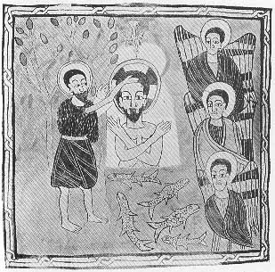

  
[Intangible Textual Heritage](../../index)  [Christianity](../index) 
[Africa](../../afr/index)  [Index](index)  [Previous](15)  [Next](17) 

------------------------------------------------------------------------

  
*The Kebra Nagast*, by E.A. Wallis Budge, \[1932\], at Intangible
Textual Heritage

------------------------------------------------------------------------

PLATE XVI

 

The Baptism of Christ by John. Immediately above His halo is the dove;
on the left of Christ are the three chief Archangels

*From Brit. Mus. Orient. No. 481, fol. 101 b*

------------------------------------------------------------------------

[Next: XVII.](17)

