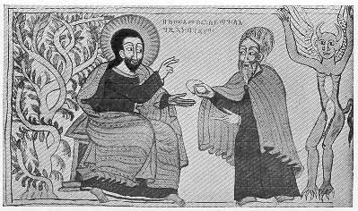

  
[Intangible Textual Heritage](../../index)  [Christianity](../index) 
[Africa](../../afr/index)  [Index](index)  [Previous](17)  [Next](19) 

------------------------------------------------------------------------

  
*The Kebra Nagast*, by E.A. Wallis Budge, \[1932\], at Intangible
Textual Heritage

------------------------------------------------------------------------

PLATE XVIII

 

The Temptation of Christ in the Desert. The Devil appears in the form of
an elderly bearded man and is offering a stone to our Lord. Behind him
stands the Spirit of Satan in the form of a man with wings, horns, and
claws instead of feet

*From Brit. Mus. Orient. No. 510, fol. 12 b*

------------------------------------------------------------------------

[Next: XIX.](19)

