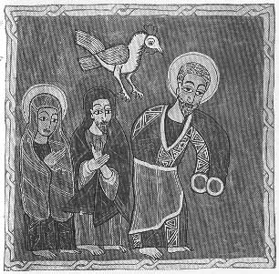

  
[Intangible Textual Heritage](../../index)  [Christianity](../index) 
[Africa](../../afr/index)  [Index](index)  [Previous](21)  [Next](23) 

------------------------------------------------------------------------

  
*The Kebra Nagast*, by E.A. Wallis Budge, \[1932\], at Intangible
Textual Heritage

------------------------------------------------------------------------

PLATE XXII

 

The cock crowing after St. Peter's denial of our Lord. The figures to
the left are those of Mary and John

*From Brit. Mus. Orient. No. 481, fol. 104 b*

------------------------------------------------------------------------

[Next: XXIII.](23)

