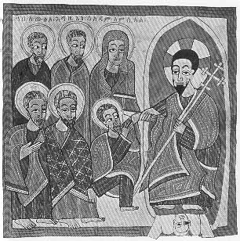

  
[Intangible Textual Heritage](../../index)  [Christianity](../index) 
[Africa](../../afr/index)  [Index](index)  [Previous](28)  [Next](30) 

------------------------------------------------------------------------

  
*The Kebra Nagast*, by E.A. Wallis Budge, \[1932\], at Intangible
Textual Heritage

------------------------------------------------------------------------

PLATE XXIX

 

Christ taking Adam out of Sheol and trampling the Devil under His feet

*From Brit. Mus. Orient. No. 481, fol. 108 b*

------------------------------------------------------------------------

[Next: XXX.](30)

