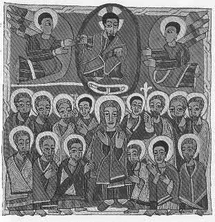

  
[Intangible Textual Heritage](../../index)  [Christianity](../index) 
[Africa](../../afr/index)  [Index](index)  [Previous](29)  [Next](31) 

------------------------------------------------------------------------

  
*The Kebra Nagast*, by E.A. Wallis Budge, \[1932\], at Intangible
Textual Heritage

------------------------------------------------------------------------

PLATE XXX

 

Christ ascending into heaven and being received by angels. Below are the
Virgin Mary and the Apostles

*From Brit. Mus. Orient. No. 481, fol. 109 b*

------------------------------------------------------------------------

[Next: XXXI.](31)

