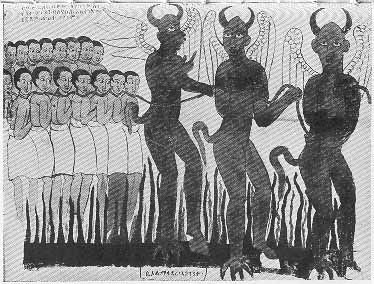

  
[Intangible Textual Heritage](../../index)  [Christianity](../index) 
[Africa](../../afr/index)  [Index](index)  [Previous](31) 

------------------------------------------------------------------------

  
*The Kebra Nagast*, by E.A. Wallis Budge, \[1932\], at Intangible
Textual Heritage

------------------------------------------------------------------------

PLATE XXXII

 

Sheol, the abode of the Devil and his angels. Three of Satan's chief
devils dragging the souls of the damned with chains of fire through the
fire-pits of hell

*From Brit. Mus. Orient. No. 510, fol. 63 a*
