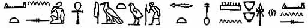
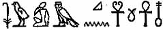

  
[Intangible Textual Heritage](../../index)  [Christianity](../index) 
[Africa](../../afr/index)  [Index](index)  [Previous](kn000-4) 
[Next](kn001) 

------------------------------------------------------------------------

  
*The Kebra Nagast*, by E.A. Wallis Budge, \[1932\], at Intangible
Textual Heritage

------------------------------------------------------------------------

p. xxxi

## INTRODUCTION

|     |                                                                                                                                                                                                                                                                                                                                                                                                                                                                                                                                                                                          |
|-----|------------------------------------------------------------------------------------------------------------------------------------------------------------------------------------------------------------------------------------------------------------------------------------------------------------------------------------------------------------------------------------------------------------------------------------------------------------------------------------------------------------------------------------------------------------------------------------------|
| 1\. | *The Manuscripts of the* KEBRA NAGAST *and their Arrival in Europe. The Labours of* BRUCE*,* DILLMANN*,* PRÆTORIUS*,* WRIGHT*,* ZOTENBERG*, and* BEZOLD*. King* JOHN'S *Letter to Lord* GRANVILLE*. Date of Compilation of the* KEBRA NAGAST*. The Ethiopian Work Based on Coptic and Arabic Sources, &c.* |

   The KEBRA NAGAST, or the Book of the Glory
of the Kings \[of ETHIOPIA\], has been held
in the highest esteem and honour throughout the length and breadth of
ABYSSINIA for a thousand years at least, and
even to-day it is believed by every educated man in that country to
contain the true history of the origin of the Solomonic line of kings in
ETHIOPIA, and is regarded as the final
authority on the history of the conversion of the ETHIOPIANS from the worship of the sun, moon, and
stars to that of the Lord God of ISRAEL.

   The existence of the KEBRA NAGAST appears
to have been unknown in Europe until the second quarter of the sixteenth
century, when scholars began to take an interest in the country of
"PRESTER JOHN" through the writings of FRANCISCO ALVAREZ, chaplain to the Embassy which
EMMANUEL, King of PORTUGAL, sent to DAVID,
King of ETHIOPIA, under the leadership of
DON RODERIGO DE LIMA (1520-1527). In the
collection of documents concerning this Embassy, ALVAREZ included an account of the King of ETHIOPIA, and of the manners and customs of his
subjects, and a description in Portuguese of the habits of the ETHIOPIANS (alcuni costumi di esso Serenissimo
DAVID, e del suo paese e genti, tradotta di
lingua ethiopica in Portogalese);[1](#page_xxxi_note_1) and in his *Ho Preste
Joam das Indias* (COIMBRA, 1540), and his
*Historia de las cosas d'Etiopia* (ANVERS
1557, SARAGOSSE 1561 and TOLEDO 1588) this account was greatly
amplified.[2](#page_xxxi_note_2)

p. xxxii

   In the first quarter of the sixteenth century, P.
N. GODINHO published some traditions about King SOLOMON and his son MĔNYĔLĔK or MĔNYĔLÎK,
derived from the KEBRA NAGAST,[1](#page_xxxii_note_1) and further
information on the subject was included by the Jesuit priest MANOEL ALMEIDA (1580-1646) in his *Historia ger̄al
de Ethiopia*, which does not appear to have been published in its
entirety. MANOEL ALMEIDA was sent out as a
missionary to ETHIOPIA, and had abundant
means of learning about the KEBRA NAGAST at
first hand, and his manuscript *Historia* is a valuable work. His
brother, APOLLINARE, also went out to the
country as a missionary, and was, with his two companions, stoned to
death in TIGRÉ.

   Still fuller information about the contents of the KEBRA NAGAST was supplied by F.
BALTHAZAR TELLEZ (1595-1675), the author of the *Historia general
de Ethiopia Alta ov Preste Joã e do que nella obraram os Padres da
Companhia de JESUS composta na mesma Ethiopia
pelo Padre Manoel d'Almeyda. Abreviada com nova releçam e methodo pelo
Padre Balthezar Tellez*, COIMBRA, 1660,
folio. The sources of his work were the histories of MANOEL ALMEIDA, ALFONZO
MENDEZ, JERONINO LOBO, and Father
PAYS. The *Historia* of TELLEZ was well known to JOB
LUDOLF, and he refers to it several times in his *Historia
Æthiopica*, which was published at FRANKFORT
in 1681, but it is pretty certain that he had no first-hand knowledge of
the KEBRA NAGAST as a whole. Though he
regarded much of its contents as fabulous, he was prepared to accept the
statement of TELLEZ as to the great
reputation and popularity which the book enjoyed in ABYSSINIA.

   Little, apparently, was heard in Europe about the KEBRA NAGAST until the close of the eighteenth
century when JAMES BRUCE of KINNAIRD (1730-1794), the famous African traveller,
published an account of his travels in search of the sources of the
NILE. When he was leaving p. xxxiii GONDAR,
RÂS MICHAEL, the all-powerful Wazîr of King
TAKLA HAYMÂNÔT, gave him several most
valuable Ethiopic manuscripts, and among them was a copy of the KEBRA NAGAST to which he attached great importance.
During the years that BRUCE lived in ABYSSINIA he learned how highly this work was
esteemed among all classes of ABYSSINIANS,
and in the third edition of his *Travels*[1](#page_xxxiii_note_1) (vol. iii, pp.
411-416) there appeared a description of its contents, the first to be
published in any European language. Not content with this manuscript
BRUCE brought away with him a copy of the
KEBRA NAGAST which he had made for himself,
and in due course he gave both manuscripts to the Bodleian Library,
where they are known as "Bruce 93" and "Bruce 87" respectively. The
former, which is the "Liber Axumea" of BRUCE'S *Travels*, was described at great length by
DILLMANN,[2](#page_xxxiii_note_2) who to his brief
description of the latter added a transcript of its important
colophon.[3](#page_xxxiii_note_3) Thanks to DILLMANN, who printed the headings of all the
chapters of the *Fĕtha Nagasti* in the original Ethiopic, there was no
longer any doubt about the exact nature and contents of the work, though
there was nothing in it to show exactly when and by whom the work was
compiled.

   In 1870 (?) FRANCIS PRÆTORIUS
published,[4](#page_xxxiii_note_4) with a Latin
translation, the Ethiopic text of Chapters xix to xxxii of the KEBRA NAGAST edited from the manuscript at Berlin
(Orient. 395), which LEPSIUS acquired from
DOMINGO LORDA, and sent to the KÖNIGLICHE BIBLIOTHEK in 1843. To the Berlin text
he added the variant readings supplied from the MSS. Orient. 818 and 819
in the p. xxxiv BRITISH
MUSEUM by Professor W. WRIGHT of CAMBRIDGE. In 1877 WRIGHT published a full description of the MS. of
the KEBRA NAGAST in the MAḲDALÂ Collection in the BRITISH MUSEUM. The work of Praetorius made known
for the first time the exact form of the Ethiopian legend that makes the
King of ETHIOPIA to be a descendant of SOLOMON, King of ISRAEL,
by MÂKĔDÂ, the Queen of ’AZÊB, who is better known as the "Queen of SHEBA".

   In August, 1868, the great collection of Ethiopic manuscripts, which
the British Army brought away from MAḲDALÂ
after the defeat and suicide of King THEODORE, was brought to the BRITISH MUSEUM, and among them were two fine copies
of the KEBRA NAGAST. Later these were
numbered Oriental 818 and Oriental 819 respectively, and were described
very fully and carefully by Wright in his *Catalogue of the Ethiopic
MSS. in the British Museum*, London, 1877,[1](#page_xxxiv_note_1) No. cccxci, p. 297,
and in the *Zeitschrift der Deutschen Morgenländischen Gesellschaft*,
Bd. xxiv, pp. 614-615. It was the fate of Oriental 819, a fine
manuscript which was written in the reign of ’ÎYÂSÛ I, A.D.
1682-1706, to return to ABYSSINIA, and this
came about in the following manner. On 10 Aug., 1872, Prince KASA, who was subsequently crowned as King JOHN IV, wrote to Earl GRANVILLE thus: "And now again I have another thing
to explain to you: that there was a Picture called QURATA REZOO, which is a Picture of our Lord and
Saviour JESUS CHRIST, and was found with many
books at MAGDALA by the English. This Picture
King THEODORE took from GONDAR to MAGDALA, and
it is now in England; all round the Picture is gold, and the midst of it
coloured.

   "Again there is a book called KIVERA
NEGUST (i.e. KEBRA NAGAST), which
contains the Law of the whole of ETHIOPIA,
and the names of the SHUMS (i.e. Chiefs),
p. xxxv Churches, and Provinces are in this
book. I pray you will find out who has got this book, and send it to me,
for in my Country my people will not obey my orders without it".

   When a copy of this letter was sent to the BRITISH MUSEUM the Trustees decided to grant King
JOHN'S request, and the manuscript was
restored to him on 14 December, 1872. King JOHN'S letter proves that very great importance was
attached to the KEBRA NAGAST by the Ethiopian
peoples, even in the second half of the nineteenth century. M. HUGUES LE ROUX, a French envoy from the
President of the French Republic to MENYELEK
II, King of ETHIOPIA, went to ADDIS ALEM where the king was staying, in order to
see this manuscript and to obtain his permission to translate it into
French. Having made his request to MENYELEK
II personally the king made a reply, which M.
LE ROUX translates thus: "Je suis d'avis qu'un peuple ne se
défend pas seulement avec ses armes, mais avec ses livres. Celui dont
vous parlez est la fierté de ce Royaume. Depuis moi, l'Empereur,
jusqu'au plus pauvre soldat qui marche dans les chemins, tous les
Éthiopiens seront heureux que ce livre soit traduit dans la langue
française et porté à la connaissance des amis que nous avons dans le
monde. Ainsi l'on verra clairement quels liens nous unissent avec le
peuple de Dieu, quels trésors ont été confiés à notre garde. On
comprendra mieux pourquoi le secours de Dieu ne nous a jamais manqué
contre les ennemis qui nous attaquaient". The king then gave orders that
the manuscript was to be fetched from ADDIS
ABEBA, where the monks tried to keep it on the pretext of copying
the text, and in less than a week it was placed in the hands of M. LE ROUX, who could hardly believe his eyes.
Having described the manuscript and noted on the last folio the words,
"This volume was returned to the King of ETHIOPIA by order of the Trustees of the BRITISH MUSEUM, Dec. 14th, 1872. J. WINTER JONES, Principal p.
xxxvi Librarian". M. LE ROUX says: "Il
n'y avait plus de doute possible: le livre que je tenais dans mes mains
était bien cette version de l'histoire de la Reine de Saba et de
Salomon, que Négus et Prêtres d'Éthiopie considèrent comme le plus
authentique de toutes celles qui circulent dans les bibliothèques
européennes et dans les monastètes abyssins. C'était le livre que
Théodoros avait caché sous son oreiller, la nuit où il se suicida, celui
que les soldats anglais avaient emporté à Londres, qu'un ambassadeur
rendit à l'Empereur Jean, que ce même Jean feuilleta dans sa tente, le
matin du jour où il tomba sous les cimeterres des Mahdistes, celui que
les moines avaient dérobé".[1](#page_xxxvi_note_1) With the help of a
friend M. LE ROUX translated several of the
Chapters of the KEBRA NAGAST, and in due
course published his translation.[2](#page_xxxvi_note_2)

   The catalogues of the Ethiopic MSS. in OXFORD, LONDON and PARIS, which had been published by DILLMANN, WRIGHT and
ZOTENBERG, supplied a good deal of
information about the contents of the KEBRA
NAGAST in general, but scholars felt that it was impossible to
judge of the literary and historical value of the work by transcription
and translations of the headings of the chapters only. In 1882 under the
auspices of the Bavarian Government, DR. C.
BEZOLD undertook to prepare an edition of the Ethiopic text
edited from the best MSS., with a German translation, which the ROYAL BAVARIAN ACADEMY made arrangements to
publish. After much unavoidable delay this work appeared in 1909, and is
entitled *Kebra Nagast. Die Herrlichkeit der Könige (Abhandlungen der
Königlich Bayerischen Akademie*, Band XXIII, Abth. 1, Munich, 1909
\[Band LXXVII of the *Denkschriften*\]). The text is prefaced by a
learned introduction, which was greatly appreciated by Orientalists to
whom the edition was specially addressed. The p.
xxxvii chief authority for the Ethiopic text in BEZOLD'S edition is the now famous manuscript which
was sent as a gift to LOUIS PHILIPPE by SÂHLA (or SÂHLÛ) DĔNGĔL, King of ETHIOPIA, who died early in 1855. According to
ZOTENBERG (*Catalogue des manuscrits
Éthiopiens*, p. 6) this manuscript must belong to the thirteenth
century; if this be so it is probably the oldest Ethiopic manuscript in
existence. Though there seems to be no really good reason for assigning
this very early date to the manuscript, there can be no doubt as to its
being the oldest known Codex of the KEBRA
NAGAST, and therefore BEZOLD was fully
justified in making its text the base of his edition of that work. I
have collated the greater part of the BRITISH
MUSEUM Codex, Oriental 818, with his printed text, and though the
variants are numerous they are not of great importance, in fact, as is
the case in several other Codices of the KEBRA
NAGAST, they are due chiefly to the haste or carelessness or
fatigue of the scribe. As BEZOLD'S text
represents the KEBRA NAGAST in the form that
the Ethiopian priests and scribes have considered authoritative, I have
made the English translation which is printed in the following pages
from it.

   Unfortunately, none of the Codices of the KEBRA
NAGAST gives us any definite information about the compiler of
the work—for it certainly is a compilation—or the time when he wrote, or
the circumstances under which it was compiled. DILLMANN, the first European scholar who had read
the whole book in the original Ethiopic, contented himself with saying
in 1848, "de vero compositionis tempore nihil liquet" (*Catalogus*, p.
72), but later he thought it might be as old as the fourteenth century.
ZOTENBERG (*Catalogue*, p. 222) was inclined
to think that "it was composed soon after the restoration of the
so-called Solomonic line of kings", that is to say, soon after the
throne of ETHIOPIA was occupied by TASFÂ ’ÎYASÛS,or YĔKÛNÔ
’AMLÂK, who reigned from A.M. 6762-77,
i.e. A.D. 1270-1285. A Colophon, p. xxxviii (see pp. 228, 229)which is found in
several of the Codices of the KEBRA NAGAST in
OXFORD, LONDON and
PARIS, states that the Ethiopic text was
translated from the Arabic version, which, in turn, was translated from
the Coptic. The Arabic translation was, it continues, made by ’ABU ’L-‛IZZ and ’ABU
’L-FARAJ, in the "year of mercy" 409, during the reign of GABRA MASḲAL (’AMDA SEYÔN
I), i.e. between A.D. 1314 and 1344,
when GEORGE was Patriarch of ALEXANDRIA. These statements are clear enough and
definite enough, yet DILLMANN did not believe
them, but thought that the whole Colophon was the result of the
imagination of some idle scribe (ab otioso quodam librario inventa). The
statements about the Ethiopic version being made from the Coptic through
the Arabic, he treated as obvious fictions (plane fictitia esse), and he
condemned the phrasing of the Colophon because he considered its
literary style inferior to that used in the narrative of the KEBRA NAGAST itself (dictio hujus subscriptionis
pessima est, et ab oratione eleganti libri ipsius quam maxime differt).
ZOTENBERG (*Catalogue*, p. 223, col. 1) a
very competent scholar, saw no reason for doubting the truth of the
statements in the Colophon generally, but thought it possible that an
Arab author might have supplied the fundamental facts of the narrative,
and that the author or authors of the Ethiopic version stated that the
original source of their work was a Coptic archetype in order to give it
an authority and importance which it would not otherwise possess. On the
other hand, WRIGHT merely regarded the KEBRA NAGAST as an "apocryphal work", and judging
from the list of kings at the end of the work in Oriental 818, fol.
46B,which ends with YĔKWĔNÔ ’AMLÂK, who died
in 1344, concluded that it was a product of the fourteenth century
(*Catalogue*, p. 301, col. 2).

   A careful study of the KEBRA NAGAST, made
whilst translating the work into English, has convinced me that p. xxxix the opening statements in the Colophon
are substantially correct, and that it is quite possible that in its
original form the Arabic version of the book was translated from Coptic
MSS. belonging to the Patriarchal Library at ALEXANDRIA, and copies of this Arabic translation,
probably enlarged and greatly supplemented by the scribes in the various
monasteries of EGYPT, would soon find their
way into ETHIOPIA or ABYSSINIA, viâ the BLUE
NILE. The principal theme of the KEBRA
NAGAST, *i.e.* the descent of the Kings of ETHIOPIA from SOLOMON,
King of ISRAEL, and the "Queen of the South,
or the "Queen of SHEBA", was certainly well
known in ETHIOPIA for centuries before the
KEBRA NAGAST was compiled, but the general
treatment of it in this work was undoubtedly greatly influenced by
supplementary legends and additions, which in their simplest forms seem
to me to have been derived from Coptic and even Syrian writers.

   It is well known that the Solomonic line of kings continued to rule
over ETHIOPIA until that somewhat mythical
woman ESTHER, or JUDITH as some call her, succeeded in dethroning
DELNA’AD and placing on the throne MARÂ TAKLA HÂYMÂNÔT, the first of the eleven ZÂGUÊ kings, who dispossessed the Solomonic kings
for three hundred and fifty-four years (A.D.
914-1268) and reigned at AKSÛM. Written
accounts of the descent of the kings of ETHIOPIA from SOLOMON
must have existed in ETHIOPIA before the
close of the ninth century A.D. and these
were, no doubt, drawn up in Ethiopic and in Arabic. During the
persecution of the Christians in EGYPT and
ETHIOPIA by the MUḤAMMADANS in the tenth, eleventh, and twelfth
centuries, many churches and their libraries of manuscripts perished. We
may, however, be sure that the Solomonic kings, who settled in the
province of SHOA during the period of the
ZÂGUÊ domination, managed to preserve
chronological lists and other historical documents that contained the
Annals of their predecessors.

p. xl

   The second part of the Colophon mentions ’ABU
’L-‛IZZ and ’ABU ’L-FARAJ as being
concerned with translating the book into Arabic, and makes one ISAAC (?), who was apparently the Ethiopian
translator, ask why they did not translate it into Ethiopic. In answer
to this question he says that the KEBRA
NAGAST appeared during the period of the ZÂGUÊ rule, when it is obvious that the publication
of any work that supported the claims of the Solomonic kings would meet
with a very unfavourable reception, and cause the death of its editors
and translators. Therefore it is fairly certain that the KEBRA NAGAST existed in Arabic in some form during
the three and a half centuries of the ZÂGUÊ
rule, and that no attempt was made to multiply copies of it in Ethiopic
until the restoration of the line of Solomonic kings in the days of
YĔKÛNÔ ’AMLÂK (A.D. 1270-1285). The Ethiopic work as we know it
now is probably in much the same state as it was in the days of GABRA MASḲAL. (‛AMDA
ṢĔYÔN) in the first half of the fourteenth century of our era. Of
ISAAC we unfortunately know nothing, but
there seem to be no good grounds for attributing the complete authorship
of the KEBRA NAGAST to him. Yet he was
evidently not merely a scribe or copyist, and when he speaks of the
greatness of the toil which he undertook for the sake of the glory of
the heavenly ZION, and ETHIOPIA and her king, he seems to suggest that he
was the general redactor or editor who directed the work of his devoted
companions YAMHARANA-’AB, ḤEZBA- KRESTÔS, ANDREW,
PHILIP, and MAḤÂRÎ-’AB.

   Now, however important the KEBRA NAGAST
may have been considered by the Ethiopians in bygone centuries, and
notwithstanding the almost superstitious awe with which the book is
still regarded in ABYSSINIA, we are hardly
justified in accepting it as a connected historical document. But it is
undoubtedly a very fine work, and many sections of it merit careful
consideration p. xli and study. For many of
the statements in it there are historical foundations, and the greater
part of the narrative is based upon legends and sayings and traditions,
many of which are exceedingly ancient. The legends and traditions are
derived from many sources, and can be traced to the Old Testament and
Chaldean TARGÛMS, to Syriac works like the
"Book of the Bee", to Coptic lives of saints, to ancient Ḳur’ânic
stories and commentaries, to apocryphal books like the "Book of ADAM and EVE", the "Book
of ENOCH", "KÛFÂLÊ", the "Instructions of ST. PETER to his disciple CLEMENT" ( i.e. the ḲALÊMĔNṬÔS), the Life of ḤANNÂ, the Mother of the Virgin Mary", the "Book of
the Pearl", and the "Ascension of ISAIAH",
&c. Side by side with the extracts from these works we have long
sections in which works attributed to GREGORY
THAUMATURGUS, to TIMOTHEUS (?),
Patriarch of CONSTANTINOPLE, and to CYRIL are quoted at great length.

   The object of the author, or compiler, and the later editors of the
KEBRA NAGAST (no matter what its original
form may have been), was to glorify ETHIOPIA
by narrating the history of the coming of the "spiritual and heavenly
ZION", the Tabernacle of the Law of the God
of ISRAEL, of her own free will from JERUSALEM to ETHIOPIA,
and to make it quite clear that the King of ETHIOPIA was descended from SOLOMON, the son of DAVID, King of ISRAEL,
and through him from Abraham and the early Patriarchs. But CHRIST also was descended from SOLOMON and the early Patriarchs, and he was the
Son of God, so the King of ETHIOPIA being a
kinsman of CHRIST was also a son of God, and
he was therefore both God and king to his people. The KEBRA NAGAST was intended to make the people of
ETHIOPIA believe that their country was
specially chosen by God to be the new home of the spiritual and heavenly
ZION, of which His chosen people the JEWS had become unworthy. This ZION existed originally in an immaterial form in
heaven, where it p. xlii was the habitation
of God. MOSES made, under Divine directions,
a copy of it in wood and gold, and placed in it the Two Tables of the
Law, the pot of manna, the rod of AARON; and
the SHECHINAH dwelt on it and in it. This
material copy was called "ZION, the
Tabernacle of the Law of God". When SOLOMON
finished building his Temple ZION was
established therein in the Holy of Holies, and from it God made known
His commands when He visited the Temple. It was at all times held to be
the visible emblem of God Almighty and the material duplicate of the
immaterial ZION in heaven.

   The fame of the wisdom of SOLOMON reached
the ends of the earth, chiefly because he traded with merchants from the
sea coast and from the countries to the south of PALESTINE on each side of the RED SEA. These merchants brought the precious woods
and stones, and the scents, and the spices, and the rich stuffs and
other objects with which he decorated the Temple and his own palace, and
when their caravans returned home their servants described to eager
listeners the great works that the King of ISRAEL was carrying out in JERUSALEM. Among the masters, or leaders, of these
caravans was one TÂMRÎN, who managed the
business affairs of a "Queen of the South", whom Arab writers call
"BALKÎS", and Ethiopian writers "MÂKĔDÂ"; but neither of these names is ancient, and
it is very doubtful if either represents in any way the true name of the
southern queen. It is doubtful also if she was an Ethiopian, and it is
far more probable that her home was SHĔBHÂ,
or SABA, or SHEBA,
in the south-west of ARABIA. As she was a
worshipper of the sun she was probably a princess among the SABAEANS. On the other hand, her ancestors may have
been merely settlers in ARABIA, and some of
them of Ethiopian origin. The KEBRA NAGAST
says that she was a very beautiful, bright, and intelligent woman, but
tells us nothing about her family. A manuscript at OXFORD (see DILLMANN,
p. xliii *Catalogus Bibl. Bodl.*, p. 26),
says that five kings reigned in ETHIOPIA
before MÂKĔDÂ, viz. ARÂWÎ 400 years, ANGÂBÔ
200 years, GIEDUR 100 years, SIEBADÔ 50 years, and KAWNÂSYÂ 1 year. If these kings were indeed her
ancestors she was probably a native of some country on the western shore
of the RED SEA. Be this as it may, she must
have been a woman of great enterprise and intelligence, for having heard
what TÂMRÎN, the captain of her caravans, had
told her about SOLOMON'S wisdom, she
determined to go to JERUSALEM and to put to
him a series of difficult questions that were puzzling her.

   When MÂKĔDÂ arrived in JERUSALEM, she lodged in the splendid quarters
which SOLOMON prepared for her, and she had
frequent opportunities of conversing with the King. The more she saw him
the more she was impressed with the handsomeness of his person, and with
piety and wisdom, and with the eloquence of his speech, which he uttered
in a low, musical and sympathetic voice. She spent several months in
JERUSALEM as the King's guest, and one night
after a great and splendid banquet which SOLOMON gave to the notables of his kingdom, in her
honour, he took her to wife. When MÂKĔDÂ knew
that she was with child, she bade farewell to SOLOMON, and having received from him a ring as a
token, she returned to her own country, where her son MĔNYĔLĔK, or MĔNYĔLÎK,
was born. In Ethiopic literature this son is often called WALDA-TABBÎB, i.e. "son of the wise man" (SOLOMON), or ’ĔBNA
ḤAKÎM, or BAYNA-LEḤKĔM, i.e. IBN AL-ḤAKÎM, or "the son of the wise man". When
the boy reached early manhood he pressed MÂKĔDÂ to allow him to go to see his father SOLOMON in JERUSALEM,
and his importunity was so great that at length she gave him the ring
which SOLOMON had given her, and sent him
thither under the care of TÂMRÎN. On his
arrival at GÂZÂ the people in the city and
everywhere in the district recognized his striking likeness to SOLOMON, and almost royal honours were paid to him
by p. xliv them. The same thing happened in
JERUSALEM, and when the officials of SOLOMON'S palace were leading him to the presence
chamber all the household knew without telling that a son was being
taken in to his father. Father and son fell into each other's arms when
they met, and the son had no need to prove his identity by producing the
ring which his father had given to his beloved MÂKĔDÂ, for SOLOMON
proclaimed straightway the young man's parentage, and made him to occupy
the royal throne with him, after he had arrayed him in royal apparel.

   SOLOMON spared no pains in providing both
instruction and amusement for BAYNA-LĔHKĔM
(BIN ’L-ḤAKÎM) whilst he was in JERUSALEM, for he hoped to keep him with him; but
after a few months the young man was eager to get back to his mother and
to his own country, and TÂMRÎN, the leader of
MÂKĔDÂ'S caravans, wanted to be gone. BAYNA-LĔHKĔM, or MENYELEK, as we may now call him, saw that REHOBOAM must succeed SOLOMON on the throne of ISRAEL, and had no wish to occupy the subordinate
position of a second son in JERUSALEM, and he
therefore pressed SOLOMON to give him leave
to depart. When the King had arranged that the elder sons of his nobles
should accompany MENYELEK on his return to
his mother's capital, DABRA MÂKĔDÂ, and had
arranged with MENYELEK for the establishment
of a duplicate Jewish kingdom in ETHIOPIA, he
permitted him to depart. When MÂKĔDÂ was in
JERUSALEM she learned that the Tabernacle
ZION in the Temple of JERUSALEM was the abode of the God of ISRAEL, and the place where God Almighty was
pleased to dwell, and in her letter to SOLOMON she begged him to send her, as a holy
talisman, a portion of the fringe of the covering of the Tabernacle.
SOLOMON told MENYELEK that he would grant MÂKĔDÂ'S request, but this satisfied neither MENYELEK nor his nobles, and, to speak briefly,
MENYELEK and TÂMRÎN and the eldest sons of the Jewish notables
who p. xlv were destined to help MENYELEK to found his kingdom in ETHIOPIA, entered into a conspiracy together to
steal the Tabernacle ZION and to carry it off
to ETHIOPIA. Their object was to keep the God
of ISRAEL with them, and this they expected
to be able to effect by stealing the Tabernacle made of gold and wood
(according to the pattern of the original Spirit-Tabernacle in heaven)
which contained the Two Tables of the Law, the pot of manna, AARON'S rod, &c. One of the conspirators who had
access to the chamber in which the Tabernacle ZION rested, removed it from under its curtain, and
substituted a construction in wood of exactly the same size and shape,
which he had caused to be made for the purpose. The theft was not
discovered until MENYELEK, and TÂMRÎN, and their company of young JEWS and ETHIOPIANS were
well on their road to the RED SEA, and though
SOLOMON sent out swift horsemen to overtake
them and cut them off, and himself followed with all the speed possible,
the thieves made good their escape, and the King of ISRAEL returned to JERUSALEM in great grief. In due course MENYELEK reached his mother's capital, and he and
the Tabernacle ZION were received with
frantic rejoicings, and MÂKĔDÂ having
abdicated in favour of her son, MENYELEK
established in ETHIOPIA a kingdom modelled on
that of ISRAEL, and introduced into his
country the Laws of God and the admonitions of MOSES and the social rules and regulations with
which the name of the great Lawgiver was associated in those days.

   The KEBRA NAGAST tells us nothing about
MENYELEK after his coronation, except that he
carried on one or two campaigns against the enemies of his country, and
the book is silent in respect of Queen MÂKĔDÂ'S history after her voluntary abdication.
The author seems to expect his readers to assume that ETHIOPIA was ruled over by descendants of SOLOMON and Queen MÂKĔDÂ
from the tenth century before CHRIST to about
the tenth century p. xlvi A.D., i.e. for about two thousand years, and that
the religion, laws, social customs, &c., of the ETHIOPIANS were substantially those of the Hebrews
in PALESTINE under the kings of ISRAEL. In connection with this assumption
reference may be made here briefly to a series of chapters which now
form part of the KEBRA NAGAST, in which the
author endeavours to prove that the kings of the MOABITES, PHILISTINES,
EGYPTIANS, PERSIANS, BABYLONIANS
and the BYZANTINES, are of Semitic origin.
The fantastic legends which he invented or reproduced contain much
falsified history and bad philology, but it would be interesting to know
their source and their author; these chapters seem to suggest that he
was a Semite, probably a Jew.

   In another group of chapters, which can hardly have formed a part of
the oldest version of the KEBRA NAGAST, the
author summarizes the prophecies in the Old Testament that concern the
Coming of the Messiah, and applies them to JESUS
CHRIST with very considerable skill. And he devotes much space to
the VIRGIN MARY, and quotes numerous passages
from the Old Testament, with the view of identifying her symbolically
with the Tabernacle of the Covenant.

 

|     |                                                                                                                                                                                                                                                                                                            |
|-----|------------------------------------------------------------------------------------------------------------------------------------------------------------------------------------------------------------------------------------------------------------------------------------------------------------|
| 2\. | *English Translation of the Arabic Text Describing How the Kingdom of* DAVID *was Transferred from* JERUSALEM *to* ETHIOPIA.[1](#page_xlvi_note_1) |

   \[*Here is*\] *The Explanation of the Reason for the Transfer of the
Kingdom of* DAVID *from his Son* SOLOMON*, King of* ISRAEL*, to the Country of the Negus, that is to
say, to* ABYSSINIA.

   When the Lord, praise be unto Him! wished SOLOMON to build the House of the Lord in JERUSALEM, after the death of his father DAVID, the son of JESSE,
who had p. xlvii reigned over the children
of ISRAEL, and SOLOMON, in accordance with his most excellent
desire, began to build the House of the Lord, praise be unto Him! SOLOMON the King gave the command that the stones
for the building should be hewn in immense sizes. But the workmen were
unable to hew such large blocks of stone, and their tools broke when
they attempted the work, and they cried out to SOLOMON the King and besought him to think out in
his wisdom some plan for lightening their labour. And SOLOMON entreated God, the bestower of wisdom, to
suggest some means to him. And behold, SOLOMON summoned the hunters and commanded them to
bring a young Rukh bird, and in accordance with his orders they brought
a young Rukh bird. And he commanded them likewise to bring a brass pot
with a space inside it sufficiently large to contain the Rukh bird; and
the pot had three legs, each one cubit in height, and it stood upon the
ground. Then SOLOMON commanded them to set
down the Rukh bird in the palace and to put the brass pot over it, but
the wings of the Rukh bird protruded from under the aforementioned pot,
and raised it above the ground. Now when the \[mother\] Rukh bird
returned to her nest in the high mountains, and did not find her young
one there, she was disturbed, and she flew round and round over the
earth seeking for it. And she flew over JERUSALEM and saw her young one under the
aforementioned pot, but had not the power to seize it. And she mounted
up into the heights and went towards the Paradise of God, in the eastern
part of Eden, and she found below Paradise a piece of wood which had
been cast down there as if for her to carry away. And then she seized
it, and by reason of her great sorrow for her young one she took no rest
until she had brought it to JERUSALEM, and
hurled it down upon the brass pot. And by the might of God a miracle
took place forthwith, for the pot split into two halves, and the mother
Rukh saw her young, and caught it up and p.
xlviii bore it off to her nest. And when SOLOMON and all the children of ISRAEL saw this miracle, with a loud voice they
praised the Almighty (or, the Governor of the Universe), Who had
bestowed upon a bird that was not endowed with reasoning powers the
instinct to do that which human beings could not do. And straightway
King SOLOMON commanded the stone-masons to
take that piece of holy and blessed wood, and, when they had marked out
and measured the stone which they wished to split, to lay the
afore-mentioned piece of wood on the place marked. And when they had
done this, by the might of God the stone split wheresoever they wished
it to split, and they found their work easy. Then SOLOMON became certain in his mind that the
Governor of the Universe regarded the building of the Holy Temple with
favour. And when the construction of the Temple was finished, the
afore-mentioned piece of wood remained in the entrance chamber of the
forecourt of the porch, and as the building of the Temple had stopped
the operative power of the afore-mentioned piece of wood came to an end,
but it was still held in respect.

   Now God, praise be unto Him! having willed that the kingdom of DAVID and his son SOLOMON should be transferred to the blessed land
of ABYSSINIA, stirred up the Queen of that
country to make a journey to JERUSALEM to
hear some of the wisdom of SOLOMON, even as
the Holy Gospel saith, "The Queen of the South shall rise up in the
judgement and shall judge this generation, because she came from the
ends of the earth to hear SOLOMON".[1](#page_xlviii_note_1) And behold, from the
earliest times, the kingdom of ABYSSINIA was
ruled over by royal princesses. And when the mother of this Queen was
with child of her she saw a fat and handsome-looking goat, and she
looked upon him with greedy desire, and said, "How handsome the beast
is! And how handsome its p. xlix feet are!"
And she longed for it after the manner of women who are with child. And
when the afore-mentioned daughter was fashioned completely in the womb
of her mother, she had one foot like the foot of a man and another like
the foot of a goat. Great and exalted be the Creator of the Universe,
Who is to be praised! And when the mother of the Queen had brought forth
this extraordinary being, and had reared her, and the maiden was ready
for marriage, she (i.e. the maiden) did not want to marry any man
because of her malformed foot; and she continued in her virginity until
she began to reign. And when the thought to visit SOLOMON to hear his wisdom rose in her mind—as has
already been mentioned—this had already been ordained in the wisdom of
God, praise be unto Him! so that the kingdom of DAVID might last to the end of the world according
to the word of DAVID by the Holy Ghost, "The
Lord hath sworn a true oath to DAVID from
which He will never turn aside: Of the fruit of thy loins I will seat
upon thy throne. If they will keep the allegiance of My Covenant and of
My testimony which I shall teach them, their children shall sit upon thy
throne for ever".[1](#page_xlix_note_1) And besides this
passage there are many other passages in the Psalms and in the other
Books that refer to this \[oath\]. This passage nevertheless showeth
also that the kingdom was to be rent from the children of ISRAEL; and since they changed \[the Covenant\],
and did not observe the truth, and ceased to believe in Him Who was
expected, God rent from them Prophecy, Priesthood, and Sovereignty.

   And when the afore-mentioned Queen arrived in JERUSALEM, and SOLOMON
the King had heard of it, and was quite certain from the information,
which he had received from his spies, that one of her feet was the foot
of a goat, he planned a cunning plan in his wisdom, whereby he might be
able to see her foot without asking p. l \[her
to show it to him\]. He placed his throne by the side of the courtyard
of the Temple, and he ordered his servants to open the sluices so that
the courtyard of the Temple might be filled with water. This was done,
and the aforementioned piece of wood that was in the courtyard, having
been brought there by the eagle (*sic*) from below Paradise, was
submerged by the water, but no one noticed this thing which had been
decreed aforetime by the wisdom of God. And behold when the Queen
arrived at the gate of the Temple—now she was riding—she found the water
there, and she determined to ride into the presence of King SOLOMON on her beast, but they made her to know
that this was the door of the House of God, and that no one whatsoever
might enter it riding on a beast. And they caused her to dismount from
her beast, and her servants who were in attendance upon her supported
her; and she stretched out her hand and drew up the lower parts of her
cloak and her garments beneath it so that she might step into the water.
Thus SOLOMON saw her feet without asking her
\[to show them to him\]. And behold, she stepped into the water in the
courtyard, and her foot touched that afore-mentioned piece of wood, and
as the foot that was fashioned like the foot of a goat touched the wood,
the Might of God made itself manifest, and the goat's foot became
exactly like its fellow foot which was that of a man. And immediately
she understood that mighty Power that had seized her great fear and
trembling came upon her, but she \[straightway\] rejoiced and stepped
further into the water, and at length she came into the presence of King
SOLOMON. And SOLOMON welcomed her with gladness, and brought her
up on his throne, and paid her honour, and permitted her to sit by his
side. And the Queen informed him that she had come from the ends of the
earth solely to worship in JERUSALEM and to
hear his wisdom. Then she asked him questions, saying, "When I came to
thy honourable p. li kingdom and dipped my
foot in to the water, that foot being the foot of a goat, my foot
touched something that was submerged in the water, whereupon it became
straightway like its fellow foot. Thereupon great fear and trembling
came upon me, and then joy, because of that which had happened unto me
through the compassion of the Governor of the Universe". And then she
showed him both her feet. Then SOLOMON
praised and glorified God, Who alone worketh mighty and wonderful
things, and he testified to her that he had only made the water in order
to cause her to lift her cloak so that he might see her foot, that is to
say, the goat's foot. Then straightway he commanded that the water be
made to go back to its place, and the courtyard became visible, and the
piece of wood which she had touched with her foot stood out clearly. And
SOLOMON related to her the story of the piece
of wood. And when the Queen understood the matter truly she commanded
that honour should be paid to the wood, and she decorated it with a
collar of silver, and when SOLOMON saw her do
this he also decorated the piece of wood with another collar of silver
and assigned unto it a place in the Temple, in the Temple of the Lord.
And it came to pass that each and every one of SOLOMON'S successors, who came to the Temple of God
to pray, as soon as they heard the story of the piece of wood decorated
it with silver rings. And from the days of SOLOMON to the coming of CHRIST this piece of wood was decorated with thirty
collars of silver.

   And it came to pass that, when the Lord, praise be unto Him! wished
to complete His Dispensation, and to effect the deliverance of ADAM and his posterity from out of the hand of the
accursed Enemy—whom may God put to everlasting shame—JUDAS made a covenant with the high priests and
with the cunning folk among the JEWS to
deliver CHRIST unto them, so that they might
be able to condemn Him to death. And the high p.
lii priests undertook to give JUDAS
the afore-mentioned collars of silver on the wood, and they sent and had
the piece of wood brought by night to the place where the high priests
were, and they stripped off from it the afore-mentioned collars of
silver, and delivered them over to JUDAS. And
JUDAS took them and delivered the LORD CHRIST over to them, even as the Gospel saith.
And when the morning of the fifth day of the week had come, on which
they condemned the LORD CHRIST to death on
the cross, they took the piece of wood afore-mentioned, and they
commanded a carpenter to make a cross out of it, and they crucified the
Redeemer upon it. And this is a clear proof, even as the Tongue of gold
(i.e. CHRYSOSTOM) said that our father ADAM was led astray when he ate of the fruit of the
tree in Paradise, and it was because of this that he was stripped of his
glory and driven out from Paradise, and Satan reigned over him and over
his race. And ADAM'S deliverance also took
place by the Dispensation of God through the coming of this piece of
wood from the region of Paradise. And it became an honoured thing to
kings, and at length the King of Kings came and was crucified upon it.
And He redeemed ADAM and his descendants from
the hand of the Accursed One by means of a piece of wood, even as the
fruit of a piece of wood had led him into error. And concerning this,
DAVID the Prophet said in the Psalm,[1](#page_lii_note_1) "Declare ye among the
nations that God reigneth from the wood". And this piece of wood became
most honourable because the Body of our Lord was raised up on it, and at
length when they laid it upon a dead body that body rose up again. And
the similitude \[of the Cross\] became a protection to kings and a
strengthening of the remainder of the Christians for evermore. And as
for the thirty collars of silver aforementioned JUDAS cast them, back to the accursed p. liii JEWS, and after
this he hanged himself and departed this life by reason of his love of
money. And the JEWS took them and bought with
them the field of the potter, and it is a place of burial for strangers
unto this day. This is what happened through the piece of wood.

   And now we will return to the subject with which we began, namely,
how the kingdom of DAVID was removed to the
country of ABYSSINIA, and will relate the
conclusion of the story. Behold, SOLOMON the
King paid honour to the Queen, and he made her and her retinue and her
soldiers to alight by the side of his palace, and every day she visited
him in order to hear his wisdom. And SOLOMON
loved women passionately, and it came to pass that, when her visits to
him multiplied, he longed for her greatly and entreated her to yield
herself to him. But she would not surrender herself to him, and she said
unto him, "I came to thee a maiden, a virgin; shall I go back despoiled
of my virginity, and suffer disgrace in my kingdom?" And SOLOMON said unto her, "I will only take thee to
myself in lawful marriage—I am the King, and thou shalt be the Queen."
And she answered him never a word. And he said unto her. "Strike a
covenant with me that I am only to take thee to wife of thine own free
will—this shall be the condition between us: when thou shalt come to me
by night as I am lying on the cushions of my bed, thou shalt become my
wife by the Law of Kings." And behold she struck this covenant with him
determining within herself that she would preserve her virginity from
him; and this \[happened\] through the dispensation of God, the Most
High, to Whom be praise! And SOLOMON by his
wisdom instructed her for a number of days, and he did not again demand
from her the surrender of her person, and the matter was good in her
sight, because she thought that he had driven her out of his mind.

   And after these things SOLOMON summoned
the p. liv cooks and commanded them to
prepare and cook food for all those who were in the palace, for himself
and for the Queen, dainty and highly seasoned dishes, and he gave them
pungent and aromatic and strong-smelling herbs and spices for this
purpose, and the cooks did even as he had commanded them. Now when the
Queen had eaten of these meats that were filled with spice and pepper
and pungent herbs, she craved for cold water which she drank in large
quantities by day and by night, but this did not help her to \[quench
her thirst\]. And when the third night had come SOLOMON secretly gave the order to all those who
were about the palace, both those who were inside it and those who were
outside it, that none of them was to leave with the afore-mentioned
Queen the smallest quantity of water to drink, and \[he swore\] that any
one of them who showed her where water was or gave her any of the water
which was his own should be put to death forthwith and without trial.
And he commanded that, if any of them were to be asked for water by her
during the night, they were to say unto her, "Thou wilt find no water
except by the couch of the king." And it came to pass that when the
night had come, a great and fiery heat rose up in the heart of the Queen
because of the highly spiced food \[that she had eaten\], and she sought
for water to drink, but found none, and she was sorely agitated and was
smitten with death. Then she cried out with a loud voice to her
servants, but they were unable to find any water to give her to drink.
Then by reason of the consuming thirst that had seized upon her, she
wandered into the palace and went round about to every one who had water
therein to find some water to drink, and every person whom she asked
said unto her, "Verily, by thy kingdom, thou wilt only find water to
quench the flame of thy thirst by the bedside of the King." Then the
Queen went back to her couch, but she could not control herself and keep
still, and her spirit p. lv was about to
depart from her body, and she was swooning. Then she made haste and went
to the place where SOLOMON was, so that she
might drink some water there. Now SOLOMON was
in truth wide-awake, nevertheless he pretended to be asleep, and the
Queen drank a very large quantity of water and assuaged her thirst, and
she recovered her spirit, and she felt that her strength was restored
after having \[nearly\] died. And when the Queen wanted to return to her
couch, King SOLOMON started up hurriedly, and
seized her, and said unto her, "Verily thou hast now become my wife
according to the Law of Kings." And she remembered the covenant that
existed between him and her. And she gave herself into his embrace
willingly and yielded to his desire, according to that which she had
covenanted with him.

   And it came to pass that after these things she became with child by
him, and she said unto him, "I am going to return to my country and to
my kingdom, and what shall I do with thy child if it be that God shall
desire to give him life?" And SOLOMON said
unto her, "If God doth will this thing and thou dost bear to me a man
child, so soon as he hath reached man's estate send him to me, and I
will make him king, and thy kingdom shall be his; but if thou dost bear
a woman child let her stay with thee." And the Queen said unto him, "If
I send thee thy son how wilt thou be certain that he is thy son?" And
SOLOMON gave her his ring, and said unto her,
"Guard carefully this ring, and covenant with me that thou wilt not in
the smallest degree break the conditions of the true and righteous
covenant that existeth between us, and God, the Governor of the
Universe, the God of Abraham, and ISAAC, and
Jacob, the God of my father DAVID, shall be
the witness between me and between thee. And when thou dost send my son
to me, give him my ring, and let him wear it on his own hand, and I
shall know that in very truth he is my son, and I will make him king
p. lvi and send him back to thee." And she
accepted from SOLOMON this just covenant, and
he and the Queen took farewell of each other, and she set out with her
retinue to go to her own country, surrounded by the peace of God.

   And behold, on her arrival in her own country the Queen fulfilled the
number of her days, and she brought forth a man child, and she rejoiced
with an exceedingly great joy, and she called him DAVID, according to the name of his grandfather,
and she had him reared in great state and splendour. And when he had
arrived at manhood's estate, he was hale, and strong, and wise, and
understanding like his father. And it fell out on a day that he spake
unto his mother and said unto her, "O my mother, who is my father? Did
he, peradventure, die during my childhood?" Then the Queen answered and
said unto him, "My son, thy father is alive, and he is SOLOMON, the son of DAVID, the Prophet of God and King of ISRAEL, and his Kingdom is in JERUSALEM. And behold, the seal of the kingdom of
thy father is in my possession, and it is laid up ready for thee so that
thou mayest become thereby king over the country of ABYSSINIA. And this is God's Will, and it is not
due to me; the kingdom is no longer mine but thine, and thou, the King's
son, art King." And this pleased the young man greatly, and he gave
thanks to the Queen. And the Queen said unto him, "O my darling son,
gather together for thy use gifts and soldiers, and get thee to JERUSALEM that thou mayest pray there, and see thy
father and his kingdom, \[and hear\] his great wisdom, and that he may
make thee king according to the covenant that existeth between him and
me, the Governor of the Universe being witness between us." And thus
saying, straightway she put his father's ring on his right hand. And by
the Will of God—praise be unto Him!—he gathered together soldiers, and
with them and the royal gifts he set out on p.
lvii his journey, and in due course he arrived in JERUSALEM. And when SOLOMON knew that a king was coming to him he
commanded soldiers to meet him. And when the young man arrived at the
gate of the palace of his father SOLOMON, the
king was not certain that he was his son. And behold, when the young man
came closer and saw the riding beast of his father standing there with
his saddle on his back and his bridle in his mouth, straightway he
leaped up and mounted him and pranced about, and unsheathed his sword
with his hand. And when SOLOMON saw this the
matter was grievous to him, but he hid his displeasure. And when they
met \[later\] SOLOMON spoke openly what he
had in his mind about the matter of the riding beast, and how the young
man had mounted him and snatched the sword with his hand. And the young
man said unto him, "The owner of this ring made me king of his kingdom
when I was in my mother's womb, and this hath happened by the Will of
God." And when SOLOMON had looked at the
ring, and was certain about the matters connected with it, he was
overcome with joy, and he stood up by his throne and threw his arms
round the young man's neck, and he cried out, saying, "Welcome, my
darling boy, \[thou\] son of DAVID." And
straightway he put the crown of his father DAVID on his head, and made him to sit upon the
throne of DAVID his father, and the
trumpeters sounded their horns, and the proclaimers of tidings cried
out, saying, "This is DAVID, the son of SOLOMON, the son of DAVID, the King of ISRAEL." And the matter was noised abroad, and the
rumour spread about among all the tribes of the children of ISRAEL that the son of SOLOMON, the son of the Queen of the South, had
come to his father SOLOMON, and that SOLOMON had made him ruler over the kingdom of his
father DAVID, and had crowned him king, and
had seated him upon his throne.

   Now in the House of the Lord which SOLOMON
had p. lviii built and consecrated was the
Tabernacle of the Covenant of God, and inside it were the two Tablets of
stone that had been written by the Finger of God, and the rod of AARON, and the pot (or, chest) of manna. And this
Tabernacle was covered with plates of gold and was draped with draperies
of cloth woven with gold. And \[in connection with the Tabernacle\] a
miracle which was seen by all the people of ISRAEL was wrought. Whensoever the priests prayed,
and the supplications of themselves \[and of the people\] were presented
before the Governor of the Universe, and they had made an end of their
prostrations, the Tabernacle of the Covenant of God used to raise itself
up from off the ground, and they \[and the people\] knew that in very
truth their supplications had been accepted. And when they had made an
end of their prostrations and the Tabernacle did not raise itself from
off the ground, the priests knew of a certainty that some sin had been
committed by themselves or by the people. Then they continued to make
their supplications unto the Lord, and at the same time they searched
out him that had done wrong, and they punished the guilty one, and when
the Tabernacle raised itself up from off the ground they knew that God
had removed His displeasure from them.

   And it came to pass that the afore-mentioned king, the son of SOLOMON, went into the House of the Lord to pray,
and he saw the Tabernacle of the Covenant of God raising itself up—a
matter which it is impossible for the human mind to understand—and this
was pleasing in his sight, and he determined to carry off the Tabernacle
of the Covenant of God to his own country. And he broke the matter to
his begetter SOLOMON, the King of ISRAEL, and he said unto him, "I am going to carry
off the Tabernacle of the Covenant of God to my country." And SOLOMON said unto him, "O my darling son, thou
canst not do this. Behold, there is no one p.
lix except a priest who can carry the Tabernacle, and whosoever
toucheth the Tabernacle except the priests, his soul departeth from him
immediately. Moreover the children of ISRAEL
have no protection whatsoever against their enemies except the
Tabernacle of the Covenant of God." But these words did not satisfy him,
and he said unto SOLOMON, "I ask of thee
neither gold nor silver, for in my country men gather in heaps gold from
its earth. I ask from thee nothing but the Tabernacle of the Covenant of
God, so that it may protect me on my journey, and may be a support for
my kingdom and for my soldiers in my country." And SOLOMON said unto his son, "O my son, if it be the
Will of God, the Governor of the Universe, that thou shalt take away the
Tabernacle with thee, it will be an easy thing for thee to do so. But
when thou carriest away the Tabernacle do not let me know about it, and
when thou goest away with it do not bid me farewell. For, behold,
without doubt, the priests and the elders of the fortress of ISRAEL will make me to swear an oath by the Name of
God concerning this matter, and when I have to swear an oath by the Name
of God I must swear what is true."

   Then the young man summoned to himself secretly a workman, who made a
wooden case of the same length and breadth and depth and shape as the
Tabernacle, and then the young man killed him by night. Then he brought
in other artificers, and they overlaid the wooden case with plates of
gold similar to those that covered the Tabernacle, and he treated those
men even as he had treated the carpenter, and then the young man covered
the case with draperies into which gold had been woven. Now whilst he
was making his preparations for his departure SOLOMON the King knew nothing whatsoever about
them. Then the young man summoned to him four of the priests who could
be trusted, and he made them believe that he had done so p. lx in order to ask them to pray for him before
his departure, and he gave them much gold to pray for him, and he bribed
them to assist him whensoever he needed them. And when the night of his
departure had arrived, these priests came to him in order to bid him
farewell, and he took them into his own apartment, so that they might
pray for him. And when they had entered and were in the apartment with
him, he bound them in iron fetters for the night, and commanded his
soldiers to mount and depart without sounding the trumpets. Then he took
with him a company of his servants who were carrying spears in their
hands, and he took those priests whom he had bound with iron fetters for
the night so that they might not escape, and he went into the House of
God. And he commanded the priests who were with him to carry away the
Tabernacle of the Covenant of God, and then he deposited the case which
he had had made to resemble it in the place thereof. And he went forth
by night having with him the Tabernacle, which was carried by the
priests, and he neither bade his father farewell nor allowed him to know
of his departure. And this happened by the Dispensation of God the Most
High, praise be unto Him! for the protection of the holy Tabernacle of
His Covenant, so that it might abide for ever even as the Davidic
kingdom, for even so did God make the promise to DAVID that the offspring of his loins should sit
upon his throne for ever. And in this manner, enveloped in the
protection of God, did the young man set out on his journey.

   And it came to pass that, when the morning had come, the children of
ISRAEL and the priests went into the House of
God according to their wont to pray. And it came to pass that, when the
priests had made an end of their prostrations and had presented their
supplications unto the Governor of the Universe, the Tabernacle did not
rise up into the air, and it did not p. lxi
stir from its place. And they said, "Behold, some folk have sinned"; and
they ordered fasting and prayer for three days, and they searched among
the people to find out who had committed sin and folly, but they found
no \[guilty\] person. And after this the priests went up to the
Tabernacle, and O what calamity, and terror, and grief were there for
them when they did not find the Tabernacle of the Covenant of God and
its holy things, but only an empty case resting upon the place where the
Tabernacle had stood! Then they knew that of a certainty the son of King
SOLOMON had taken it away. And they searched
and made an examination into the number of the priests who were among
the tribes of ISRAEL, but they were not able
to find those priests whom the young man had taken with him, and thus it
became clear to them that the sin lay with them (i.e. the four priests).

   And behold, the priests and the elders of ISRAEL went to SOLOMON
the King, and they were weeping and sorrowing because of the absence of
the Tabernacle of the Covenant of God from its Holy Shrine, and they
said unto SOLOMON, "It is thou who hast
commanded thy son to take the Tabernacle." And SOLOMON wept and cried out in pain, and displayed
exceedingly great sorrow, and he swore an oath to them, saying that he
had not given his son permission to do this thing, and that he had not
bidden him farewell, and that he knew nothing whatsoever about his
departure or when it took place. And the priests and elders answered,
saying, "May the King live! If this thing hath taken place without thy
wish and without thy permission, despatch thou with us armed soldiers
that we may pursue him and take from him the holy Tabernacle of the
Covenant of God, so that we may bring it back to His sacred House." And
SOLOMON gave them soldiers, and money, and
provisions, and they set out in quest of the young man, and they rode on
their way continuously p. lxii for forty
days. And they found merchants riding towards them on their return
journey, and they enquired of them concerning the Tabernacle, and
whether they had seen it. And the merchants answered them, saying, "We
have seen a great king and his numerous soldiers, and the Box of the
Covenant of God was with them. And they were travelling along like the
clouds when they are driven before the attack of mighty winds for a very
long distance at a time, and the natives of the villages through which
we have passed informed us that they travelled each day the distance of
a forty days' journey." And they returned defeated and disheartened, and
weeping and regretting; but regret in no way helped them. And behold,
the young man arrived in his country safe and sound, and his mother met
him, and she abdicated in his favour, and he rose up as king on the
throne of DAVID his father, and the kingdom
of ABYSSINIA belonged to the throne of DAVID for ever and ever, and the Tabernacle of the
Covenant of God remained therein.

   This is what happened in respect of the Tabernacle of the Lord, and
this is the reason why it was transferred to the country of the NĔGÛS; and this state of affairs continued until
the birth of our Lord JESUS CHRIST of the
pure MARY. And He completed His Dispensation
upon earth and set free ADAM and his
posterity. And after His Ascension into heaven the Disciples preached
the Gospel in His Name in all the earth. And concerning the story of the
eunuch, the Deputy of ḲANDÂḲES, it is related
that the cause of his visit to JERUSALEM was
to pray \[there\]. And on his return journey the Holy Spirit sent to him
the Apostle PHILIP, and the eunuch believed
and was baptized; and when he went back to his native land he preached
CHRIST therein, and all the people believed
through him. And after this PÂRMENÂS, one of
the Seven, went to them, and he baptized them, and consecrated for them
priests and deacons, and he p. lxiii
ordained that their Father should be of the throne of MARK the Evangelist. And the orthodox Faith was
established in the country of ABYSSINIA, and
the sovereignty of \[the house of\] DAVID
remained fixed therein for ever and ever. Glory, and praise, and
majesty, and honour, and supplication be unto the Holy Trinity for ever
and ever! Amen. This is what is found \[written\] in the Histories of
the ancient Fathers of the Coptic Church. Praise be unto the Giver of
understanding and wisdom to His creatures; may His mercy be upon us for
ever!

|     |                                                                                                                                                                               |
|-----|-------------------------------------------------------------------------------------------------------------------------------------------------------------------------------|
| 3\. | *Legends of* SOLOMON *and the Queen of* SHEBA *in the* ḲUR’ÂN *and in Muhammadan literature* |

   The author, or editor, of the ḲUR’ÂN
devoted a considerable section of Surah XXVII to the correspondence that
passed between the Queen of SHEBA and King
SOLOMON, and to their interviews. Among the
many gifts that God bestowed upon SOLOMON
were the understanding of the speech of birds, and knowledge of every
kind. He was the lord of men, genii and birds. When he travelled through
the air on his magical carpet of green silk, which was borne aloft by
the wind according to the King's direction, the men stood on the right
of it, and the spirits on the left, and a vast army of birds of every
kind kept flying over the carpet to protect its occupants from the heat
of the sun. One day when he was reviewing the birds he perceived that
the lapwing was absent, and he asked why she was absent, and threatened
to punish her for not making her appearance with the other birds. Very
soon after he had spoken the lapwing appeared, and she excused herself
for her absence by saying that she had been looking upon a country that
the king had never seen, and that she had seen SÂBA, which was ruled over by a queen called "BALḲÎS", who was very rich, and who sat upon a
throne made of gold and silver and set with precious stones, p. lxiv eighty cubits long, forty cubits broad,
and thirty cubits high. The queen and her people were idolaters and
worshipped the sun, and they were under the influence of SATAN, who had turned them from the right way.
Thereupon SOLOMON wrote the following letter
to the Queen of SHEBA: "From the servant of
God, SOLOMON, the son of DAVID, unto BALḲÎS
(\#\#\#) Queen of SHEBA. In the Name of the
most merciful God. Peace be unto him who followeth the true direction.
Rise not up against me, but come and render yourselves unto me." Having
perfumed this letter with musk and sealed it with his wonderful seal,
SOLOMON gave it to the lapwing and told the
bird to go and drop it in SÂBA, and to turn
aside afterwards and wait for the Queen's answer. The lapwing departed
and delivered the letter, some saying that she flew into the Queen's
private apartment through the window, and others that she dropped the
letter into the Queen's bosom[1](#page_lxiv_note_1) as she was standing
surrounded by her army. Having read the letter the Queen called upon her
nobles to advise her what to do, but they reminded her that they were
soldiers, who were ready to march against SOLOMON if she ordered them to do so, and that the
letter was addressed to her and she must make the decision. Wishing to
avoid invasion and the evils that would follow in its train, the Queen
decided to send gifts to SOLOMON, and she
despatched forthwith five hundred male and five hundred female slaves,
five hundred ingots of gold, a crown studded with precious stones, and a
large quantity of musk, amber, spices, precious woods, etc. The lapwing
returned quickly to SOLOMON and told him what
had happened, and that an embassy from the Queen bearing gifts was on
its way. When the men of SÂBA arrived they
were received by SOLOMON in a large square
surrounded by a wall, the p. lxv bricks of
which were made of gold and silver. SOLOMON
spoke slightingly of the Queen's gifts and sent the embassy back,
bidding them tell their mistress that he would send invincible troops
against her city, and that they would capture it and expel its
inhabitants in disgrace. When BALḲÎS received
this message, she determined to go to SOLOMON
and to tender her submission to him, and having locked up her throne in
a certain strong fortress, and set a guard over it to protect it, she
set out for JERUSALEM, accompanied by a large
army. Whilst she was on her way SOLOMON said
one day to his nobles, "Which of you will bring the Queen's throne here
to me before she and her company arrive?" And an ‛IFRÎT, one of the genii, whose aspect was most
terrible, and who was called DHAKWÂN \#\#\#
or ṢAKHR, \#\#\# , said, "I will bring it to
thee before thou hast finished thy session. Now SOLOMON used to sit in judgment until noon
daily.[1](#page_lxv_note_1) Some one who had
knowledge of books and who was present seemed to think that the ‛IFRÎT was demanding too much time in which to
fulfil the King's urgent wish, and he said, I will bring thee the throne
before thou canst cast thine eyes on an object and remove them again."
The commentators are in doubt about the identity of the person who made
this offer to SOLOMON, for some say he was
ÂṢAF, the son of BARKHÎYÂ, the wazîr of SOLOMON, and others that he was KHIDHR (ELIJAH), or
GABRIEL, or some other angel, or even SOLOMON himself.[2](#page_lxv_note_2) It is generally thought
that the person was ÂṢAF, for he knew the
ineffable Name of God. Be this as it may, SOLOMON accepted the offer, and raising his eyes to
heaven brought them down quickly to earth again, and when his eyes
rested on the earth he saw the throne of BALḲÎS standing before him. Then SOLOMON had the throne altered, with the view of
preventing her knowing her own throne when she p.
lxvi arrived. When BALḲÎS came into
his presence, he pointed to the throne, saying, "Is thy throne like unto
this?" And she replied, "It is all one with this." Then BALḲÎS was invited to go into the palace which
SOLOMON had built specially for her
reception. The walls were made of blocks of white glass, and the floor
was made also of glass, over which water flowed, and in the running
water fishes swam. When BALḲÎS turned to
enter the palace and saw the water, thinking that it was deep, she drew
up the skirts of her garments before attempting to walk through it. By
this act she uncovered her legs, and SOLOMON
had proof that the rumour that the feet and legs of BALḲÎS were covered with hair like the coat of an
ass, was true. The sight of the glass building with its floor of glass
amazed BALḲÎS, who said, "O Lord, verily I
have dealt unjustly with my own soul, and I resign myself, together with
SOLOMON, unto God, the Lord of all
creatures." Some commentators think that the Queen uttered these words
partly in repentance for having worshipped the sun, and partly through
fear of being drowned in the water which she saw before her. JALÂL AD-DÎN says that SOLOMON thought of marrying BALḲÎS, but could not bring himself to do so
because of the hair on her feet and legs. The devils who were always in
attendance on SOLOMON removed the hair by the
use of some infernal depilatory,[1](#page_lxvi_note_1) but it is doubtful if
even then SOLOMON married her. AL-BEIDHAWÎ says that it is very doubtful who
married BALḲÎS, but is inclined to think that
it was one of the chiefs of the Hamdân tribe.[2](#page_lxvi_note_2)

|     |                                                                                                            |
|-----|------------------------------------------------------------------------------------------------------------|
| 4\. | *Modern Legends of* SOLOMON *and the Queen of* SHEBA |

   A curious and interesting legend of the way in which King SOLOMON became the father of MENYELEK is found in a number of slightly varying
versions among many of p. lxvii the tribes
of Northern ABYSSINIA.[1](#page_lxvii_note_1) According to this the
mother of MENYELEK was a Tigrê girl called
ĔTĔYÊ AZÊB (i.e. Queen of the South), and her
people worshipped a dragon or serpent, to which each man in turn had to
present as an offering his eldest daughter, and large quantities of
sweet beer and milk. When the turn of her parents came they tied her to
a tree where the dragon used to come for his food, and soon after this
seven saints came and seated themselves under the tree for the sake of
the shade it gave. As they sat a tear dropped from the maiden above
them, and when they looked up and saw her bound to the tree they asked
her if she was a human being or a spirit, and she told them that she was
a human being and, in answer to a further question, she told them that
she was bound to the tree so that she might become food for the dragon.
When the seven saints saw the dragon, one of them, Abbâ TCHÊḤAMÂ, plucked at his own beard, another, Abbâ
GARÎMÂ exclaimed "He hath frightened me", and
a third, Abbâ MENṬELÎT, cried out, "Let us
seize him"; and he forthwith attacked the monster, and aided by his
companions they killed him by smiting him with a cross. As they were
killing him some blood spurted out from him and fell on the heel of
ĔTĔYÊ AZÊB, and from that moment her heel
became like the heel of an ass. The saints untied her fetters and sent
her to her village, but the people drove her away, thinking that she had
escaped from the dragon, and she climbed up into a tree and passed the
night there. On the following day she fetched some people from the
village and showed them the dead dragon, and they straightway made her
their chieftainess, and she chose for her chief officer a maiden like
herself. Soon after this ĔTĔYÊ AZÊB heard a
report of the medical skill of King SOLOMON,
and she determined p. lxviii to go to him
so that he might restore her deformed heel to its original shape. She
and her chief officer dressed their hair after the manner of men, and
girded on swords, and departed to the Court of SOLOMON at JERUSALEM.
Her arrival was announced to SOLOMON, who
ordered his servants to bring the King of ABYSSINIA into his presence, and as soon as her
deformed foot touched the threshold it recovered its natural form. SOLOMON had bread, meat, and beer brought in and
set before the two women who were disguised as men, but they ate and
drank so little that SOLOMON suspected that
his guests were women. When night fell he caused two beds to be made for
his guests in his own bedroom, and he hung up in the room a skin with
honey\[comb\] in it, and he pierced the skin and the honey dropped down
into a bowl set there to catch it, and SOLOMON and his guests betook themselves to their
beds. At night the king was accustomed to keep vigil with his eyes
closed, and to sleep with them half-open, and thus when the two women,
who were longing to get off their beds and to go and drink honey from
the bowl, saw him with his eyes half-open they thought that the king was
awake, and they curbed their desire for the honey and lay still. After a
time the king woke up and closed his eyes, but the women, thinking he
was asleep, rose from their beds and went to the bowl of honey and began
to eat. By this SOLOMON knew that his two
guests were women, and he got up and went with them to their beds and
lay with both of them. When he left them he gave to each woman a silver
staff and a ring, and he said, "If the child be a girl let her take this
staff and come to me, and if it be a boy let him take the ring and come
to me"; and each woman being with child returned to her own country. In
due course each woman gave birth to a son, and each told her child that
SOLOMON was his father. When the boys grew up
their mothers sent them to JERUSALEM, and the
Queen of SHEBA gave her son, who p. lxix resembled SOLOMON in every way, a mirror which she had
brought when she visited SOLOMON, and told
him to go with it to the king, who would hide from him, and not to speak
to any other man who might be sitting on his throne. When the two youths
arrived in JERUSALEM and SOLOMON knew that they claimed to be his sons, he
gave orders for them to wait for an interview, and kept them waiting for
three years. At the close of the third year he arrayed a friend in his
royal robes, and seated him upon his throne, whilst he dressed himself
in rags and went and sat in a stable, and then ordered the two young men
to be admitted to the presence. When the young men entered the throne
room the son of the Queen of SHEBA'S minister
grasped the hand of the man on the throne, who personified SOLOMON, thinking that he was the king, but the son
of the Queen of SHEBA, who was called "MENYELEK", stood upright and made no obeisance, and
when he looked in the mirror which his mother had given him, and saw
that the features of the occupant of the throne were entirely different
from his own, he knew that he was not standing in the presence of SOLOMON. Then he turned about in all directions and
looked at all the faces that were round about him, and found none
resembling his own; after a time he looked up and saw SOLOMON gazing at him from the stable, and he knew
him at once, and went to the stable and did homage to him as king. And
SOLOMON said, "My true son! The other is also
my son, but he is a fool." MENYELEK then took
up his abode in JERUSALEM and assisted SOLOMON in ruling the kingdom, but after a time the
people found that father and son did not always agree in their judicial
decisions, and they became dissatisfied. On one occasion in the case of
a trespass of cattle the king decided that the owner of the field might
confiscate the cattle which had trespassed, but MENYELEK ordered him to accept six measures of
grain instead of confiscating the cattle. p.
lxx Thereupon the people told the king that they would not be
ruled by two chiefs, and that he must send his son back to his native
country. When SOLOMON told his son of the
people's complaint MENYELEK advised his
father to say to them, "Is not MENYELEK my
first-born son? I will send him away if you will send your first-born
sons with him"; and the people agreed to send their first-born sons to
ABYSSINIA with MENYELEK. When SOLOMON
was arranging for MENYELEK'S departure he
told him to take the Ark of MICHAEL with him,
but MENYELEK, believing the Ark of MARY to be of greater importance, changed the
covers of the two Arks, and took with him the Ark of MARY. A few days after the departure of MENYELEK a storm visited JERUSALEM, and SOLOMON
told his servants to find out if the Ark of MARY was in its place, presumably with the idea of
securing its protection against the storm. His servants went and looked
and, seeing an Ark with the cover of MARY'S
Ark upon it, assumed that it was the Ark of MARY, and reported to SOLOMON that the Ark of MARY was in its place. He then told them to take
off the cover, and when they had done so they found that the Ark was
MICHAEL'S, and though SOLOMON sent a messenger after MENYELEK to bring back the Ark of MARY, his son refused to give it up. Meanwhile
MENYELEK and his party went on their way, and
when they arrived at ḲAYĔḤ KÔR, a deacon who
was carrying the Ark of MARY died, and was
buried there. After the burial they wished to resume their journey, but
the Ark of MARY refused to move. They then
dug up the deacon's body, and laid it in a coffin, and buried it again,
but still the Ark refused to move, and when MENYELEK again ordered them to dig up the body,
they found a finger of the deacon outside the coffin. When they had
placed the deacon's finger in the coffin with the rest of his body, the
Ark of MARY allowed itself to be moved, and
MENYELEK and his companions went on their
way. In due course they came to TEGRÂY and
p. lxxi arrived in AKSÛM, where they found SATAN building a house to fight against God. When
they told him that the Ark of MARY had come
he stopped building, threw down what he had built, and went away; and
the stones which he had collected were used by MENYELEK in building a church to hold the Ark of
MARY. One very large stone, which SATAN was carrying to his building when the news
came of the arrival of the Ark of MARY, was
dropped by him at once, and at the present day that stone stands on the
same spot on which he dropped it.

|     |                                                                           |
|-----|---------------------------------------------------------------------------|
| 5\. | *The Contents of the* KEBRA NAGAST *Described* |

   The book opens with an interpretation and explanation of the Three
Hundred and Eighteen Orthodox Fathers concerning the children of ADAM, and the statement that the Trinity lived in
ZION, the Tabernacle of the Law of God, which
God made in the fortress of His holiness before He made anything else.
The Trinity agreed to make man in God's image, and the Son agreed to put
on the flesh of ADAM; man was made to take
the place of SATAN and to praise God. In due
course CHRIST, the second ADAM, was born of the flesh of MARY the Virgin, the Second ZION (Chap. 1).

   In Chap. 2 ISAAC, the translator of the
Ethiopic text, next quotes GREGORY the
Illuminator, the son of ANAG, a native of
BALKH, who was born about 257 A.D. and died about 330. Whilst GREGORY was suffering the tortures inflicted upon
him by TIRIDATES III he pondered on the
question, Of what doth the glory of kings consist? In the end he came to
the conclusion that ADAM'S kingship bestowed
upon him by God was greater than that of any of the Kings of ARMENIA.

   Chaps. 3-6 deal with the birth of CAIN and
ABEL; the face of CAIN was sullen and that of ABEL good tempered, and ADAM made ABEL his heir
because of his pleasing countenance. CAIN and
ABEL had twin sisters. CAIN'S p. lxxii sister
LĔBHÛDHÂ had a good- tempered face, and ADAM gave her in marriage to ABEL; ABEL'S sister
ḲALÎMATH had a sullen face like CAIN, and ADAM gave her
in marriage to CAIN.[1](#page_lxxii_note_1) Moved by SATAN to envy, and filled with wrath against ADAM for taking his twin sister from him, CAIN rose up and slew ABEL. ADAM was consoled
for ABEL'S death by the birth of Seth. The
descendants of CAIN were wicked men, and
neglected God, and passed their time in singing lewd songs to stringed
instruments and pipes and they lived lawless and abominable lives. ISAAC credits them with having produced the mule,
and condemns the crossing of mares with asses. In the tenth generation
from ADAM NOAH
lived, and he refused to deal in any way with the children of CAIN, whose arrogance, pride, fraud, deceit, and
uncleanness cried aloud to heaven. At length God sent the Flood, which
destroyed everything on the earth except Eight Souls, and seven of every
clean beast, and two of every unclean beast (Chap. 8). God made a
covenant with NOAH not to destroy the earth
again by a flood, and when NOAH died SHEM succeeded him (Chaps. 9 and 10). In Chap. 11
we have another declaration by the 318 Orthodox Fathers that: 1. The
Tabernacle of the Law (i.e. the Ark of the Covenant) was created before
the heavens, the earth and its pillars, the sea, and men and angels; 2.
It was made by God for His own abode; 3. It is on the earth. The ZION wherein God dwelt in heaven before the
creation was the type and similitude of the VIRGIN
MARY.

   The seven sons of CANAAN, who were the
sons of HAM, seized seven cities that
belonged to SHEM'S children, but eventually
had to relinquish them. The nations seized by CANAAN'S sons were the CANAANITES, the PERIZZITES, the HIVITES,
the HITTITES, the AMORITES, the JEBUSITES,
the GIRGASITES. In the days of TERAH men made p.
lxxiii magical images, and placed on the tombs of their fathers
statues, out of which devils spake and commanded them to offer up their
sons and daughters as sacrifices to "filthy devils" (Chap. 12). TERAH'S son ABRAHAM,
having proved for himself the powerlessness of idols, smashed the idols
which his father sent him to sell, and then called upon the Creator of
the Universe to be his God. A chariot of fire appeared (Chap. 13) and
with it God, Who made a covenant with him, and told him to depart to
another country. ABRAHAM took his wife, and
departed to SALEM, where he reigned in
righteousness according to God's command. He had a bodyguard of
eighteen[1](#page_lxxiii_note_1) stalwart men who wore
crowns and belts of gold, and gold-embroidered tunics.

   ISAAC and JACOB
pleased God in their lives (Chap. 15), but REUBEN transgressed and the succession passed from
him (Chap. 16); under the curse of JACOB,
with whose concubine BILHAH REUBEN had lain, the children of REUBEN became leprous and scabby.

   Chap. 17 describes the glory of ZION, i.e.
the Tabernacle of the Law of God which God brought down from heaven to
earth, and showed MOSES, and ordered him to
make a copy of it. MOSES therefore made a box
of acacia wood two and a half cubits long, one and a half cubits broad
and one and a half cubits deep, i.e. a portable shrine measuring 3 ft. 9
in. by 2 ft. 3 in. by 2 ft. 3 in. or 4 ft. 2 in. by 2 ft. 6 in. by 2 ft.
6 in. In this shrine he placed the Two Tables of the Covenant, a gold
pot containing one omer of manna, and the wonderful rod of AARON, which put forth buds when it was withered.
This rod had been broken in two places and was in three pieces, and each
piece became a separate and complete rod (see p. 13 and Exod. xvi. 33,
34; Hebrews ix. 2; Numbers xvii. 10). We may note that in 2 Chron. v.
10, it is said that there was nothing in the Ark except p. lxxiv the Two Tables which MOSES put therein in HOREB. MOSES covered the
Ark with gold, inside and outside, and made all the vessels, hangings,
&c., according to the patterns given to him by God. But there was
something else in the Ark made by MOSES. By
God's orders he made a case, presumably of gold, in the shape of the
"belly of a ship" (p. 15), and in this the Two Tables were to rest. As
the VIRGIN MARY is called the "new ship who
carried the wealth of the world", this "belly of a ship" was a type of
her. The case for the Two Tables symbolized her womb, the case carried
the Word cut on stone, and MARY carried the
Living Word incarnate. And the Ark made by MOSES was the abode of God, Who dwelt with the Two
Tables.

   With Chap 19 ISAAC, the translator of the
KEBRA NAGAST, begins a long extract from an
apocryphal work which "DOMITIUS, Archbishop
of CONSTANTINOPLE", says he found among the
manuscripts in the library of Saint SOPHIA. I
have failed to identify either DOMITIUS or
the work he quotes. According to this work the Emperor of ETHIOPIA and the Emperor of RÔMÊ (i.e. BYZANTIUM)
are the sons of SHEM, and they divide the
world between them (Chap. 20). From the same work we have a description
of MÂKĔDÂ the "Queen of the South" (Matt.
xii. 42), who was shrewd, intelligent in mind, beautiful in face and
form, and exceedingly rich. She carried on a large business on land by
means of caravans, and on sea by means of ships, and she traded with the
merchants of INDIA and NUBIA and ASWÂN (SYENE). As the Queen came from the south her home
was probably in Southern ARABIA, and she is
far more likely to have been of ARAB than
ETHIOPIAN origin. The head of her trading
caravans was TÂMRÎN, a clever man of affairs
who directed the operations of 520 camels and 73 ships (Chap. 22). At
this time SOLOMON wanted gold, ebony and
sapphires for the building of the Temple of God in JERUSALEM, and he opened negotiations p. lxxv with TÂMRÎN for
the supply of the same. TÂMRÎN loaded his
camels and took his goods to SOLOMON, who
proved to be a generous customer, and his wisdom and handsome appearance
and riches greatly impressed the merchant from the South. TÂMRÎN saw with amazement that SOLOMON was employing 700 carpenters and 800 masons
on the building of the Temple (Chaps. 22, 23). When TÂMRÎN returned to his mistress he told the Queen
all that he had seen at JERUSALEM, and day by
day he described to her SOLOMON'S power and
wisdom and the magnificence of the state in which he lived. Little by
little, desire to see this wonderful man and to imbibe his wisdom grew
in the Queen's mind, and at length she (Chap. 24) decided to go to JERUSALEM. Thereupon 797 camels and mules and asses
innumerable were loaded, and she left her kingdom, and made her way
direct to JERUSALEM.

   When the Queen met SOLOMON she gave him
rich presents, (Chap. 25), and he established her in a lodging, and
supplied her with food and servants and rich apparel. The Queen was
fascinated as much by his wisdom as by his physical perfections, and she
marvelled at the extent and variety of his knowledge. When she saw him
instructing the mason, the carpenter, the blacksmith, and directing all
the workmen, and at the same time acting as judge and ruler of his
people and household, her astonishment was unbounded.

   During her stay in JERUSALEM MÂKĔDÂ conversed daily (Chaps. 26, 27) with SOLOMON, and she learned from him about the God of
the Hebrews, the Creator of the heavens and the earth. She herself
worshipped the sun, moon and stars, and trees, and idols of gold and
silver, but under the influence of SOLOMON'S
beautiful voice and eloquent words she renounced ṢÂBÂISM, and worshipped not the sun but the sun's
Creator, the God of ISRAEL (Chap. 28). And
she vowed that her seed after her should adore the Tabernacle of the God
of ISRAEL, p.
lxxvi the abode of God upon earth. MÂKĔDÂ and SOLOMON
exchanged visits frequently and the more she saw of him the more she
appreciated his wisdom. The birds and the beasts also came to hear his
wisdom, and SOLOMON talked to them, each in
his own language, and they went back to their native lands and told
their fellow creatures what they had seen and heard.

   At length MÂKĔDÂ sent a message to SOLOMON, saying that the time had arrived for her
to return to her own country. When SOLOMON
heard this he pondered deeply and determined to company with her, for he
loved her physical beauty and her shrewd native intelligence, and he
wished to beget a son by her. SOLOMON had 400
wives and 600 concubines,[1](#page_lxxvi_note_1) and among them were
women from SYRIA, PALESTINE, the DELTA,
UPPER EGYPT and NUBIA. Our translator, ISAAC, excuses SOLOMON
for his excessive love of women, and says that he was not addicted to
fornication, but only took these thousand women to wife that he might
get sons by each of them. These children were to inherit the countries
of his enemies and destroy idolaters. Moreover, SOLOMON lived under the Law of the Flesh, for the
Holy Spirit was not given to men in his time. In answer to MÂKĔDÂ'S message SOLOMON
sent her an invitation to a splendid banquet, which the Queen accepted,
and she went to a place which he had prepared specially for her in the
great tent (Chap. 29). The courses were ten in number, and the dishes
were dainty, highly seasoned, and abundant, and the Queen was satisfied
with their smell only. The tent was furnished with truly Oriental
magnificence, scented oils had been sprinkled about with a lavish hand,
the air was heavy with the perfumes of burning myrrh and cassia, and the
Queen ate and drank heartily. When all the other guests had departed and
SOLOMON and MÂKĔDÂ
were alone, the King showed her a couch and invited her to sleep p. lxxvii there. MÂKĔDÂ agreed on the condition that he did not
attempt to take her by force, and in reply SOLOMON said that he would not touch her provided
that she did not attempt to take anything that was in his house.
Thereupon each vowed to respect the property of the other, and the Queen
lay down to sleep. After a short time the highly-spiced meats began to
have their effect, and the Queen was seized with violent thirst (Chap.
30). She got up and searched for water but found none. At length she saw
a vessel of water by the King's bed, and thinking that he was asleep,
she went and took up the vessel and was about to drink when SOLOMON jumped up, and stopped her, and accused her
of breaking her oath not to steal anything of his. The agony of thirst
was so great that the Queen retracted her oath, and SOLOMON allowed her to drink her fill, and then she
retired with him to his couch and slept there. MÂKĔDÂ was a virgin Queen and had reigned over her
country six years, when SOLOMON took her to
wife. That same night SOLOMON saw a dream in
which the sun came down from heaven, and shone brilliantly over ISRAEL, and then departed to ETHIOPIA to shine there for ever. Then a Sun far
more brilliant came down and shone over ISRAEL, and the ISRAELITES rejected that Sun and destroyed it, and
buried it; but that Sun rose again and ascended into heaven, and paid no
further heed to ISRAEL. When SOLOMON understood the meaning of that vision he
was greatly disturbed and troubled in his mind, for he knew that the
departure of the sun from ISRAEL typified the
departure of God.

   At length MÂKĔDÂ departed from JERUSALEM, but before she left, SOLOMON gave her six thousand wagonloads of
beautiful things, two specially constructed vehicles, one in which to
travel over the sea, and one in which to travel through the air. Thus
SOLOMON anticipated the motor boat and the
airship. Besides all these things SOLOMON
gave her the ring that was on his p.
lxxviii little finger (Chap. 31), as a token whereby she might
remember him.

   Nine months and five days after MÂKĔDÂ
bade SOLOMON farewell she brought forth a man
child, and in due course she arrived in her own country, where she was
received with great joy and delight. She called her son BAYNA-LEḤKEM, i.e. IBN
AL-ḤAKÎM, "the son of the wise man", and he grew into a strong
and handsome young man. At the age of twelve he questioned his mother as
to his parentage, and in spite of rebuffs by her he continued to do so
until she told him; ten years later no power could keep him in his own
country, and MÂKĔDÂ sent him to JERUSALEM, accompanied by her old chief of
caravans, TÂMRÎN (Chaps. 32, 33). With him
she sent a letter to SOLOMON, telling him
that in future a king should reign over her country, and not a virgin
queen, and that her people should adopt the religion of ISRAEL. Finally she sent salutations to the
Tabernacle of the Law of God, and begged SOLOMON to send her a portion of the fringe from
the Covering of ZION, so that it might be
treasured by her as a holy possession for ever. In saying farewell to
her son, MÂKĔDÂ gave him the ring which SOLOMON had given her, so that if necessary he
might use it as a proof that he was the son of MÂKĔDÂ by SOLOMON.

   When the young man arrived at GÂZÂ, a
district which SOLOMON had given to the Queen
of SHEBA (Chap. 34), all the people were
astonished at his close resemblance to SOLOMON, and some of them went so far so to declare
that he *was* SOLOMON in person. The minds of
the people were much exercised about the matter, and messengers were
sent to SOLOMON from GÂZÂ announcing the arrival of a merchant who
resembled him in face and features, and in form and stature, and in
manners and carriage and behaviour. At that time SOLOMON was depressed, by reason of the miscarriage
of his plans in respect of obtaining a large posterity, like "the stars
p. lxxix of heaven and the sands on the
seashore." He had married one thousand women, meaning to beget by them
one thousand sons, but God only gave him three children! Therefore, when
he heard of the arrival of the young merchant who resembled himself, he
knew at once that it was his son by the Queen of SHEBA who had come to see him, and he sent out
BENAIAH, the son of JEHOIADA, to meet him and to bring him to JERUSALEM (Chap. 35). In due course BENAIAH met BAYNA-LEḤKEM, and he and his fifty guards escorted
him into the presence of SOLOMON, who
acknowledged him straightway, and embraced him, and kissed him on his
forehead and eyes and mouth (Chap. 36). He then took him into his
chamber and arrayed him in gorgeous apparel, and gave him a belt of gold
and a gold crown, and set a ring upon his finger, and when he presented
him to the nobles of ISRAEL, they accepted
him as SOLOMON'S son and brought gifts to
him. Then BAYNA-LEḤKEM produced the ring
which he had brought from his mother and gave it to SOLOMON, who said that it was unnecessary, for his
face and stature proclaimed that he was his son.

   Soon after this TÂMRÎN had an audience of
SOLOMON, and he asked him to anoint BAYNA-LEḤKEM king, to consecrate and to bless him
and then to send him back to his mother as soon as possible, for such
was her desire. This old and faithful servant was afraid that the
luxurious living of SOLOMON'S house would
have an ill effect upon his future king, and he was anxious to get him
away from JERUSALEM as soon as possible. To
this SOLOMON replied that after a woman had
brought forth her son and suckled him she had nothing more to do with
him, for a boy belongs to his father and a girl to her mother. And SOLOMON refused to give up his first-born son. But
BAYNA-LEḤKEM himself was anxious to leave
JERUSALEM (Chap. 36), and he begged SOLOMON to give him a portion of the fringe of the
Tabernacle of the Law of God, and to let him depart. He had no wish to
live p. lxxx as SOLOMON'S second son in JERUSALEM, for he knew that SOLOMON had another son, REHOBOAM, who was six years old at that time and
had been begotten in lawful marriage, whilst he himself was the son of
an unmarried mother. SOLOMON promised to give
him the kingdom of ISRAEL, and wives and
concubines, and argued and pleaded with him long and earnestly, but to
no purpose (Chap. 37); BAYNA-LEḤKEM said that
he had sworn by his mother's breasts to return to her quickly, and not
to marry a wife in ISRAEL. To swear by a
woman's breasts was a serious matter, and we have an echo of a somewhat
similar ceremony in the Annals of the Nubian NASTASEN, King of NUBIA
after 500 B.C. (?). This king paid a visit to
the goddess BAST of TERT, his good mother, and he says that she gave
him life, great old age, happiness, \[and\] her two breasts \[on\] the
left (?) side, and placed him in her living, beautiful bosom."[1](#page_lxxx_note_1) We may be certain that
NASTASEN swore to do something in return for
the gracious kindness of the goddess BAST.

   When SOLOMON saw that it was impossible to
keep BAYNA-LEḤKEM in JERUSALEM, he summoned the elders of ISRAEL (Chap. 38) and declared to them his
intention of making the young man King of ETHIOPIA, and asked them to send their eldest sons
with him to that far country to found a Jewish colony and kingdom there.
The elders of course agreed to the king's request, and then ZADOK the priest and BENAIAH, the son of JEHOIADA, anointed BAYNA-LEḤKEM king in the Holy of Holies (Chap. 39);
the name which he received at his anointing was DAVID \[II\], the name of his grandfather. Then
SOLOMON commanded ZADOK to describe to the young King of ETHIOPIA the curses that would fall upon him if
p. lxxxi he failed to obey God's commands
(Chap. 40), and the blessings that would accrue to him if he performed
the Will of God (Chap. 41). ZADOK did so, and
then recited the Ten Commandments (Chap. 42) as given by MOSES, and a number of Hebrew laws concerning
marriage, adultery, fornication, incest, sodomy, &c. The anointing of
SOLOMON'S son to be king over ETHIOPIA was pleasing to the people, but all those
whose first-born sons were to leave JERUSALEM
with him sorrowed and cursed SOLOMON secretly
in their hearts. In Chap. 43 we have a list of the names of those who
were to hold positions of honour under DAVID
II in ETHIOPIA, and Chap. 44 contains
a series of warnings against abusing and reviling kings.

   Now the children of ISRAEL who were to go
to ETHIOPIA sorrowed greatly at the thought
of leaving their country, but the matter that troubled them most was
leaving the Tabernacle of the Law of God behind them (Chap. 45). At
length AZARYAS suggested that they should
take ZION with them, and having sworn his
fellow sufferers to secrecy he declared to them the plan which he had
devised. This was simple enough, for he determined to have a box made of
the same size and shape as the Tabernacle, and when he had taken the
Tabernacle out of the Holy of Holies, to set it in its place. He
collected 140 double drachmas and employed a carpenter to construct the
box he required. In the Arabic version of the story it is SOLOMON'S son who has the box made, and he puts the
carpenter to death as soon as he had made it, knowing that dead men tell
no tales. One night whilst these things were being carried out AZARYAS had a dream in which God told him to make
BAYNA-LEḤKEM offer up a sacrifice before he
departed to ETHIOPIA, and during the
performance of the ceremony to bring the Tabernacle out from the Holy of
Holies into the fore part of the Temple (Chap. 46). SOLOMON agreed to the offering being made, and
provided animals for sacrifice (Chap. 47). When the offering had been
made, the Angel of p. lxxxii the Lord
appeared to AZARYAS (Chap. 48), and having
opened the doors of the Holy of Holies with the keys which he had in his
hand, he told him to go and bring in the box that had been made to
replace the Tabernacle. When he had done this AZARYAS, and ELMEYAS,
and ABESA, and MAKARI brought out the Tabernacle and carried it
into the house of AZARYAS, and then they
returned to the Temple and put together the box that was to replace the
Tabernacle, and locked the doors, and came out. BAYNA-LEḤKEM, who was well acquainted with all that
had been done, then went and bade SOLOMON
farewell, and received his father's blessing (Chap. 49). Then AZARYAS set the Tabernacle ZION upon a wagon and covered it over with baggage
of all kinds (Chap. 50), and accompanied by the cries of men, the
wailings of women, the howlings of dogs, and the screams of asses, it
was driven out of JERUSALEM. Both SOLOMON and his people knew instinctively that the
glory of ISRAEL had departed with it. Then
SOLOMON told ZADOK
the priest to go into the Holy of Holies and bring out the covering of
the Tabernacle, and to spread over the Tabernacle in its stead the new
covering which he had had specially made for the purpose (Chap. 51); and
thus saying he placed the new covering in the bands of the high priest.
The Queen of SHEBA had asked him for a piece
of the fringe of the covering of the Tabernacle, and she had repeated
her request by the mouth of her son, and SOLOMON determined to send the complete covering to
her. The text mentions the "five mice and ten emerods" which were given
to ZION, but it is not clear whether SOLOMON meant them to be given to the Queen with
the covering of the Tabernacle. Acting on SOLOMON'S instructions, ZADOK went and fetched the covering of the
Tabernacle (Chap. 52), and gave it to BAYNA-LEḤKEM, or DAVID,
together with a chain of gold.

   Then the wagons were loaded, and BAYNA-LEḤKEM p.
lxxxiii and his companions set out on their journey. The
Archangel MICHAEL led the way, and he cut a
path for them, and sheltered them from the heat. Neither man nor beast
touched the ground with their feet, but were carried along above the
ground with the speed of the bat and the eagle, and even the wagons were
borne along without touching the earth (Chap. 52).

   MICHAEL halted the company at GÂZÂ, which city SOLOMON
had given to the Queen of SHEBA, and another
day's march brought them to the frontier of EGYPT, and they encamped by "the River" (TAKKAZI), i.e. the NILE.
Thus they had performed in one day a journey that generally took the
caravans thirteen days to complete (Chap. 53). Whilst they were here his
companions took the opportunity of revealing to DAVID the fact that they had carried off the
Tabernacle ZION, and that it was there with
them. AZARYAS told ELMEYAS to "beautify and dress our Lady", and when
DAVID II saw her he rose up and skipped like
a young sheep, and danced before the Tabernacle even as did his
grandfather DAVID I (2 Sam. vi. 14). Then he
stood up before ZION and made the address to
her which is given in Chap. 54. When the natives heard that the
Tabernacle of the Law of God was in their midst, they beat drums and
played upon flutes and pipes, and the people shouted, and the pylons of
the temples, and the idols that were in the forms of men, and dogs, and
cats, fell down and were broken in pieces (Chaps. 54, 55). And AZARYAS dressed ZION,
and spread their gifts before her, and he set her on a wagon with
draperies of purple about her. On the following morning DAVID and his company resumed their journey, and
men and beasts and wagons were all raised above the ground to the height
of one cubit as before. They passed through the air like shadows, and
the people ran alongside ZION and worshipped
her. When they came to the RED SEA ZION passed over its waters, and the whole company
were raised above p. lxxxiv them to a
height of three cubits. The waves leaped up to welcome ZION, and the billows thundered forth praise of
her, and the breakers roared their acclamations, and all the creatures
in the sea worshipped her as she passed over them. In due course the
company arrived at a place opposite Mount SINAI and encamped in KÂDÊS, and then passing through MEDYÂM and BÊLÔNTÔS they
came to ETHIOPIA, where they were received
with great rejoicings. The description of the route followed by DAVID II is very vague, and it is clear that ISAAC'S geographical knowledge was incomplete.

   Meanwhile ZADOK had returned from the
Temple in JERUSALEM to SOLOMON'S palace and found the king very sorrowful,
for he had been thinking over the dream which he had twenty-two years
before, and feared that the glory of ISRAEL
had either departed or was about to depart. ZADOK was greatly troubled when he heard what the
king's dream was, and prophesied woe to ISRAEL if the Tabernacle had been carried off by
DAVID. SOLOMON
asked him if he had made sure that the Tabernacle was in the Holy of
Holies the day before when he removed the outside covering to give it to
DAVID, and ZADOK
said he had not done so (Chap. 56). Then SOLOMON told him to go at once and see, and when he
had gone into the Holy of Holies he found there nothing but the box
which AZARYAS had had made to take the place
of the Tabernacle. When ZADOK saw that ZION had departed he fainted, and BENAIAH found him lying there like a dead man. When
ZADOK revived he cast ashes on his head, and
went to the doors of the Temple and in a loud voice bewailed the loss of
the glory and protection of ISRAEL. When
SOLOMON heard the news he commanded men to
make ready to pursue those who had stolen ZION, and to slay them when they found them (Chap.
57). When the soldiers were ready SOLOMON set
himself at their head, and his mounted scouts rode in all p. lxxxv haste to EGYPT, where they learned that the fugitives had
left the place nine days before (Chap. 58). When SOLOMON himself arrived at GÂZÂ he found that the report which his scouts had
made to him was true, and his heart sank. Near EGYPT he met envoys of PHARAOH who had been sent to him with presents, and
he asked one of them for news of the thieves. This man told him that he
had seen the company of DAVID II in CAIRO travelling through the air, and that all the
statues of kings and gods in EGYPT had fallen
down in the presence of the Tabernacle of ZION, and were dashed in pieces (Chap. 59). When
SOLOMON heard this he returned to his tent
and wept bitterly, and gave vent to the lamentations that form (Chap.
60).

   When SOLOMON returned to JERUSALEM he went with the elders into the House of
God, and he and ZADOK embraced each other and
wept bitterly. Then they dried their tears and the elders made a long
speech to SOLOMON in which they sketched the
past history of the Ark of the Covenant, i.e. the Tabernacle ZION. They reminded him how the PHILISTINES captured it and carried it into the
house of DAGON, and how they sent it away
with sixty gold figures of mice, and sixty phalli, and how, when it came
to JUDAH, the men of DAN slew the camels that drew the wagon on which it
travelled, and cut up and burnt the wagon, and how it withdrew to its
place and was ministered to by SAMUEL, and
how it refused to be carried to the Valley of GILBOA, and how DAVID,
the father of SOLOMON, brought it from SAMARIA to JERUSALEM.
They proved to the king that the Tabernacle ZION could not have been carried off against God's
will, and that if it was God's will it would return to JERUSALEM, and if it was not then it would not. Of
one thing they were quite certain: the Tabernacle was able to take care
of itself (Chap. 61).

   When SOLOMON had heard all they had to say
he agreed with them that the Will of God was irresistible, and p. lxxxvi called upon them to kneel down with
him in the Holy of Holies (Chap. 62). When they had poured out prayer
and supplication and dried their tears, SOLOMON advised them to keep the matter of the
theft a secret among themselves, so that the uncircumcised might not
boast over their misfortune. At his suggestion the elders set up the box
which AZARYAS had made, and covered the
boards over with gold, and decorated the box with coverings, and placed
a copy of the Book of the Law inside it in lieu of the Two Tables. They
remembered that JERUSALEM the free was as the
heavens, and that their own earthly JERUSALEM
was the Gate of Heaven, and they determined to do God's Will so that He
Himself might be ever with them to watch over ISRAEL and to protect His people. The suggestion is
that God would be a better protector than even the Tabernacle ZION.

   But the loss of the Tabernacle ZION had a
sad effect upon SOLOMON, for his love for God
waned, and his wisdom forsook him, and he devoted himself to women
during the last eleven years of his life. He married MÂḲSHÂRÂ, an Egyptian princess, who first seduced
his household into worshipping her idols, and then worked upon him with
her beauty in such a way that he tolerated all she said and did (Chap.
63). When she knew that DAVID II had stolen
the Tabernacle ZION, she reminded SOLOMON that his Lady ZION had been carried off, and that it would be
better for him now to worship the gods of her fathers; but for a time he
refused to forsake the God of ISRAEL. One
day, however, overcome by her beauty he promised to do whatsoever she
wished. Thereupon she tied a scarlet thread across the door of her gods,
and she placed three locusts in the house of her gods. Then she called
upon SOLOMON to enter without breaking the
thread, and to kill the locusts and "pull out their necks." In some way,
which I cannot explain, in doing this SOLOMON
performed an act p. lxxxvii of worship of
the Egyptian gods, and MÂḲSHÂRÂ was content;
besides this, to enter into an Egyptian temple was an offence against
the God of ISRAEL (Chaps. 64, 65). In spite
of his weakness and sin, SOLOMON is regarded
in some respects as a type of CHRIST, and as
he committed no sin like that of his father DAVID in the matter of the murder of URIAH, he is enumerated with the Patriarchs (Chap.
66).

   When SOLOMON was sixty years of age he
fell sick, and the Angel of Death drew nigh to him, and he wept and
prayed for mercy (Chap. 67). And the Angel of God came to him and
rebuked him for his excessive love of women and for marrying alien
women. In a long speech the Angel refers to SOLOMON'S three sons, i.e. DAVID and REHOBOAM and
’ADRÂMÎ, his son by a Greek slave, and then
he shows him how JOSEPH, and MOSES, and JOSHUA, were
types of CHRIST, and how CHRIST should spring from SOLOMON'S seed and redeem mankind. In Chap. 68 the
Angel prophesies concerning the VIRGIN MARY,
and narrates to SOLOMON the history of the
Pearl which passed from the body of ADAM to
ABRAHAM, ISAAC,
JACOB, PEREZ,
JESSE, DAVID,
SOLOMON, REHOBOAM,
and JOACHIM, who passed it into the body of
ḤANNA, the mother of the VIRGIN MARY. Finally, the Angel told SOLOMON that MICHAEL
would remain with the Tabernacle in ETHIOPIA,
and he (GABRIEL) with REHOBOAM, and URIEL with
’ADRÂMÎ. And SOLOMON gave thanks to God, and asked the Angel
when the Saviour would come (Chap. 69), and the Angel replied, "After
three and thirty generations." When the Angel told him that the ISRAELITES would crucify the Saviour, and be
scattered over the face of the earth, SOLOMON
wept, and the words of his lamentations fill the rest of Chap. 69.

   SOLOMON died, and ZADOK anointed REHOBOAM
king, and when he had laid a wooden tablet,[1](#page_lxxxvii_note_1) with SOLOMON'S

p. lxxxviii name inserted upon it, upon
the Tabernacle, the people set him on the royal mule and cried, Hail!
Long live the royal father (Chap. 70). Owing to REHOBOAM'S arrogant behaviour the people revolted,
and they armed themselves and went to BÊTH
EFRÂTÂ, and made JEROBOAM, the son of
NEBAT, king over them. From REHOBOAM to JOACHIM, the
grandfather of CHRIST, were forty-one
generations. The VIRGIN MARY and JOSEPH the carpenter were akin, each being
descended from DAVID, King of ISRAEL (Chap. 71).

   According to traditions which ISAAC has
grouped in Chap. 72, RÔM, RÔMÊ, or RÛM, i.e. BYZANTIUM, was originally the inheritance of JAPHET, the son of NOAH.
He attributes the building of ANTIOCH, TYRE, PARTHIA (?) and
CONSTANTINOPLE (?) to DARIUS, and says that from DARIUS to SOLOMON there
were eighteen generations. One of his descendants, an astrologer and
clockmaker called ZANBARÊS, prophesied that
BYZANTIUM would pass into the possession of
the sons of SHEM. His daughter married SOLOMON, who begot by her a son called ’ADRÂMÎ, and this son married ’ADLÔNYÂ, the daughter of BALṬASÔR, the King of BYZANTIUM. When ’ADRÂMÎ
was living in BYZANTIUM with his wife, his
father-in-law, wishing to test his ability as a judge, set him to try a
difficult case of trespass on the part of a flock of sheep on the one
side and unlawful detention of property on the other (Chap. 72). He
decided the case in such a way as to gain the approval of BALṬASÔR, and in due course he reigned in his stead
(Chap. 73). ISAAC further proves that the
King of MEDYÂM (Chap. 74) and the King of
BABYLON were SEMITES (Chap. 75). The narrative of KARMÎN and the false swearing of ZARYÔS and KÂRMÊLÔS, the
flight of KARMÎN to BABYLON, the infidelity of the merchant's wife, and
the exchange of children by the nurses, together make up a story more
suitable for the "One Thousand Nights and a Night" than the KEBRA NAGAST. According to it NEBUCHADNEZZAR II p.
lxxxix was the son of KARMÎN, and
therefore a SEMITE; the etymology given of
the name is, of course, wholly wrong (Chap. 76). In Chap. 77 ISAAC tries to show that the King of PERSIA was a SEMITE, and
that he was descended from PEREZ, a son of
TAMAR. The incestuous origin of the MOABITES and AMALEKITES,
as described in GENESIS, is repeated in
Chaps. 78 and 79.

   In Chap. 80 is the history of SAMSON with
details of an apocryphal character. According to this, SAMSON married a woman of the PHILISTINES, and so transgressed the Will of God.
The PHILISTINES made him act the buffoon, and
in revenge he pulled the roof down upon them and slew 700,000 of them,
and 700,000 more with iron and stone, and wood and the jaw-bone of an
ass. When SAMSON died he left DELILAH, the sister of MAKSÂBÂ, wife of ḲWÔLÂSÔN, King of the PHILISTINES, with child. After SAMSON had slain ḲWÔLÂSÔN the two sisters lived together, and in due
course each brought forth a man child. The boys grew up together, and
their mothers dressed them in rich apparel, and hung chains round their
necks, and gave them daggers to wear. One day AKAMḤÊL, SAMSON'S son,
asked his mother why he was not reigning over the city, and told her
that he intended to reign over PHILISTIA. A
little time later the two boys were eating with their mothers, and AKAMḤÊL took from the dish a piece of meat as large
as his two hands, and began to eat it. ṬEBRÊLÊS, the son of MAKSÂBÂ, snatched a piece of the meat from him,
whereupon AKAMḤÊL drew his dagger and cut off
the head of ṬEBRÊLÊS, which fell into the
dish. DELILAH seized the sword from the body
of ṬEBRÊLÊS and tried to kill AKAMḤÊL, but he hid behind a pillar and in turn
tried to kill her. When MAKSÂBÂ strove to
pacify him he turned on the two women like a wild bear and drove them
from the apartment. Before she left MAKSÂBÂ
gave him purple cloths from her couch, and promised p. xc him the throne of PHILISTIA, and that evening AKAMḤÊL took possession of it and was acclaimed
king. In Chaps. 82 and 83 the well-known story of ABRAHAM'S visit to EGYPT
with SARAH is told, and a description of
ISHMAEL'S kingdom is added.

   ISAAC'S narrative now returns to MENYELEK. He and his company and ZION travelled from JERUSALEM to WAḲÊRÔ in
one day, and he sent messengers to MÂKĔDÂ,
his mother, to announce their arrival (Chap. 84). In due course he
arrived at DABRA MÂKĔDÂ (AXUM ?), the seat of his mother's Government, where
the Queen was waiting to receive him. He pitched his tent in the plain
at the foot of the mountain, and 32,000 stalled oxen and bulls were
killed and a great feast was made. Seven hundred swordsmen were
appointed to watch over ZION (Chap. 85), and
the Queen and all her people rejoiced. On the third day MÂKĔDÂ abdicated in favour of her son MENYELEK, and she handed over to him 17,700 fine
horses and 7,700 mares, 1,700 mules, robes of honour, and a large
quantity of gold and silver (Chap. 86). Further, she made the nobles
swear that henceforth no woman should rule over ETHIOPIA (Chap. 87), and that only the male
offspring of her son DAVID should be kings of
that country. At the coming of ZION to ETHIOPIA the people cast away their idols, and
abandoned divination, and sorcery, and magic, and omens, and repented
with tears, and adopted the religion of the HEBREWS. MENYELEK swore
to render obedience to his mother, and AZARYAS was to be high priest and ALMEYAS Keeper of ZION,
the Ark of the Covenant. MENYELEK then
related to MÂKĔDÂ the story of his anointing
by ZADOK in JERUSALEM, and when she heard it she admonished him
to observe the Will of God, and to put his trust in ZION; and she called upon AZARYAS and ALMEYAS to
help him to follow the path of righteousness (Chap. 88). She then
addressed a long speech to her nobles (Chap. 89) and the new ISRAELITES, and p. xci
prayed to God for wisdom and understanding. Her prayer was followed by
an edict ordering every man to forsake the religion and manners and
customs which he had formerly observed, and to adopt the new religion
under penalty of the confiscation of his property and separation from
his wife and children. In Chaps. 90 and 91, AZARYAS makes an address to MÂKĔDÂ and praises her for her wisdom. He compares
favourably the country of ETHIOPIA with JUDAH, and says that, although the ETHIOPIANS are black of face, nothing can do them
any harm provided that God lighteth their hearts. He then proclaims a
number of laws, derived for the most part from the Pentateuch, and
appends a list of clean and unclean animals. Curiously enough, a short
paragraph is devoted to the explanation of the Queen's name MÂKĔDÂ (page 161). When AZARYAS had finished his exhortations he made
preparations to "renew the Kingdom of DAVID",
King of ISRAEL, in ETHIOPIA (Chap. 92), and with the blowing of the
jubilee trumpets and music and singing and dancing and games of all
kinds, MENYELEK, or DAVID
II, was formally proclaimed King of ETHIOPIA. The boundaries of his kingdom are
carefully described. After the three months that followed the
proclamation of MENYELEK'S sovereignty, the
Law of the Kingdom and the Creed of the ETHIOPIANS were written, presumably upon skins, and
deposited in the Ark of the Covenant as a "memorial for the later days"
(Chap. 93). ISAAC says that the belief of the
Kings of RÔMÊ (RÛMÎ) and that of the Kings of ETHIOPIA was identical for 130 years, but that
after that period the former corrupted the Faith of CHRIST by introducing into it the heresies of NESTORIUS, ARIUS and
others.

   Soon after MENYELEK had established his
kingdom, he set out, accompanied by the Ark of the Covenant and MÂKĔDÂ (Chap. 94), to wage war against his enemies.
He attacked the peoples to the west, south, and east of his country, and
invaded the lands of the NUBIANS, p. xcii EGYPTIANS,
ARABIANS, and INDIANS; and many kings sent him tribute and did
homage to him. The Ark of the Covenant went at the head of his army, and
made the ETHIOPIANS victorious everywhere;
many peoples were blotted out and whole districts laid waste. In Chap.
95 ISAAC couples the King of RÔMÊ with the King of ETHIOPIA, and condemns the JEWS for their ill-treatment of CHRIST, Who was born of the Pearl that was hidden
in ADAM'S body when he was created. And ISAAC proclaims what the KEBRA
NAGAST was written to prove, namely, that "the King of ETHIOPIA is more exalted and more honourable than
any other king upon the earth, because of the glory and greatness of the
heavenly ZION." Following several remarks, in
which the JEWS are compared unfavourably with
the ETHIOPIANS, comes a long extract from the
writings of GREGORY, the "worker of wonders"
(THAUMATURGUS), in which it is shown that the
coming of CHRIST was known to the Prophets of
ISRAEL, and passages from their books are
quoted in support of this view. The beginning of all things was the Law
which proclaimed CHRIST, and the Holy Spirit
existed at the Creation. The brazen serpent was a symbol of CHRIST (Chap. 96). ABRAHAM was a type of God the Father, and ISAAC a symbol of CHRIST, the ram of sacrifice. EVE slew mankind, but the VIRGIN MARY gave them life. MARY was the "door", and that it was closed
symbolized her virginity, which was God's seal upon her. She was the
burning bush described by MOSES; she was the
censer used by MOSES, the coals were CHRIST, and the perfume of the incense was His
perfume (Chap. 97), on which prayer ascended to heaven. The chains of
the censer were JACOB'S ladder. AARON'S rod was MARY,
and the bud thereof was CHRIST (Chap. 98).
The Ark made by MOSES was the abode of God on
earth; it symbolized MARY, and the
indestructible wood of which it was made symbolized the indestructible
CHRIST. The pot that held the manna was MARY, and the manna was p.
xciii the body of CHRIST; the Words of
the Law also were CHRIST. The Pearl in MARY'S body was CHRIST.
The rock smitten by MOSES was CHRIST, and MOSES smote
it lengthwise and breadthwise to symbolize the Cross of CHRIST. MOSES' ROD was
the Cross, the water that flowed from the rock was the teaching of the
Apostles. The darkness brought upon EGYPT for
three days symbolized the darkness of the Crucifixion. The AMALEKITES symbolized the devils, and AARON and HÔR, who held
up MOSES' hands, symbolized the two thieves
who were crucified with CHRIST. In a parable
given in Chap. 99 a king symbolizes CHRIST,
and SATAN an arrogant servant and ADAM a humble servant.

   The history of the angels who rebelled is given in Chap. 100. These
angels were wroth with God for creating ADAM,
and they reviled God and ADAM because of his
transgression. God reminded them that ADAM
was only a creature made of dust and water and wind and fire, whilst
they were made of air and fire. They were made specially to praise God,
whilst ADAM could be influenced by SATAN; had they been made of water and dust they
would have sinned more than ADAM. In answer
the angels said, "Make us even as ADAM, and
put us to the test "; and God gave them flesh and blood and a heart like
that of the children of men. Thereupon they came down to earth, mingled
with the children of CAIN, and gave
themselves up to singing, dancing, and fornication. The daughters of
CAIN scented themselves to please the men who
had been angels, and were debauched by any and every man who cared to
take them. And they conceived, but were unable to bring forth their
children in the natural way, and the children split open their mothers'
bodies and came forth. These children grew up into giants, and their
"height reached unto the clouds." God bore with them for 120 years, and
then the waters of the Flood destroyed them. He p.
xciv told NOAH to build an Ark, and it
was the wood of that Ark that saved him, as the wood of the Cross saved
mankind when CHRIST died upon it.

   In Chap. 101 God is made to declare by the mouth of MOSES that He is everywhere and in everything, and
that everything supports itself on Him; He is the Master of everything,
He fills everything, He is above the Seven Heavens and everything, He is
beneath the deepest deep and the thickest darkness, and balances all
creation. In Chap. 102 is a series of extracts from the Old and New
Testaments which are to show that CHRIST was
the Beginning, and that all things were made in and by Him. He was the
Maker and Creator, the Light of Light, the God of God, the Refuge, the
Feeder, and the Director. The Ark, or Tabernacle, symbolizes the horns
of the altar and the tomb of CHRIST. The
offering on the altar symbolizes and is the Body of CHRIST (Chap. 103). Returning to the Ark of NOAH (Chap. 104), the writer says that NOAH was saved by wood, ABRAHAM held converse with God in the wood of MANBAR, the thicket that caught the ram saved ISAAC, and the rods of wood that JACOB laid in running water saved him. The wood of
the Ark made by MOSES was a means of
salvation, even as was the wood of the Cross. The greater part of this
Chapter appears to be a translation of a part of a homily by CYRIL, Archbishop of ALEXANDRIA, and it is possible that Chap. 105 is
merely a continuation of Chap. 104. It deals with ABRAHAM'S visit to MELCHIZEDEK, who gave him the mystery of bread and
wine, which is also celebrated in "our Passover." Prophecies concerning
the Coming of CHRIST, collected from the
Books of the Old Testament, are given in Chap. 106, but ISAAC or the copyists have made many mistakes as to
their authorship, especially in the case of some of the Minor Prophets.
Many appear to have been written down from memory. Another series of
prophecies concerning CHRIST'S triumphal
entry into p. xcv JERUSALEM is given in Chap. 107, and CHRIST is identified with the unicorn. Prophecies
dealing with the wickedness of the JEWS are
given in Chap. 108, Chap. 109 consists of prophecies concerning the
Crucifixion; in Chaps. 110 and 111 many prophecies foretelling the
Resurrection and Ascension of CHRIST and His
Second Coming are enumerated. The Patriarchs and Prophets were
forerunners and symbols of CHRIST (Chap.
112), especially ISAAC, JACOB, MOSES, JOSEPH, and JONAH.

   The chariot containing ZION, i.e. the
vehicle on which the Tabernacle of the Law was borne, was in ETHIOPIA, and the Cross, which was discovered by
Queen Helena, was in RÔMÊ (RÛMÎ), and the Archbishops asked GREGORY how long the chariot of ZION and the Cross were to remain where they were
(Chap. 113). GREGORY replied that the
Persians would attack the King of RÔMÊ, and
defeat him, and make him a prisoner, together with the horse of the
Cross, which would go mad, and rush into the sea and perish. But the
nails of the Cross would shine in the sea until the Second Coming of
CHRIST. On the other hand, the chariot of
ZION would remain in ETHIOPIA, and the ETHIOPIANS would continue to be orthodox to the end
of the world. At the Second Coming of CHRIST
the Tabernacle of the Law shall return to Mount ZION in JERUSALEM (Chap.
114), and it shall be opened, and the JEWS
shall be made to look upon the Words of the Law that they have despised,
the pot of manna, and the rod of AARON. Chap.
115 described the judgement which shall fall upon the JEWS, who shall repent when it is too late and
shall be cast into hell. Of the CHRISTIANS
those who have sinned shall be punished according to the degree of their
sins. One day with God is as a thousand years; some shall be punished
for a whole day, some for twelve hours, some for three, and some for one
hour. Others shall be tried and acquitted. In answer to a further
question of the Archbishops GREGORY repeats
(Chap. 116) that the p. xcvi chariot of
ZION shall remain in ETHIOPIA until the Second Coming of CHRIST, and prophesies the war which the King of
RÔMÊ will wage in ARMENIA, and the war which the ETHIOPIANS will make on the JEWS of NÂGRÂN.[1](#page_xcchariot_note_1) The last Chapter
(117) deals with the extermination of the JEWS and the ARMENIANS
by the joint efforts of JUSTINUS, King of
RÔMÊ, and KÂLÊB,
King of ETHIOPIA, who are to meet in JERUSALEM, and exchange titles. The war of the
ETHIOPIANS against the JEWS of NÂGRÂN is to be
continued by GABRA MASḲAL or LÂLÎBALÂ, after his father KÂLÊB has adopted the monastic life in the
Monastery of Abbâ PANTALERN, and their defeat
by him is declared to be a certainty. Parts of the text of this Chapter
are difficult to understand.

### Footnotes

p. xxxi

[1](#page_xxxi_fr_1) Printed about
1533.

[2](#page_xxxi_fr_2) A French
translation from the Spanish version of this work appeared in Paris in
1558, folio.

p. xxxii

[1](#page_xxxii_fr_1) *De
Abassinorum rebus deque Æthiopiae Patriarchis*, Libri I-III, Leyden,
1615, 8vo, p. 35.

p. xxxiii

[1](#page_xxxiii_fr_1) *Travels to
Discover the Source of the Nile in the years* 1768-1773, *containing a
Journey through Egypt, the three Arabias and Ethiopia*. First edition in
five vols., 1790; second edition in six vols., in 1805; 3rd edition in
seven vols., 1813.

[2](#page_xxxiii_fr_2) *Cat. Codd.
MSS. Bibliothecae Bodleianae*, Oxford, 1848, No. xxvi, p. 68.

[3](#page_xxxiii_fr_3) *Ibid.*, p.
74 (No. xxvii).

[4](#page_xxxiii_fr_4) *Fabula de
Regina Sabaea apud Æthiopes. Dissertatio inauguralis.* Halle (No date).

p. xxxiv

[1](#page_xxxiv_fr_1) A description
of the very ancient copy of the KEBRA NAGAST
in the Bibliothèque Nationale, which Zotenberg assigned to the
thirteenth century, was published by him in his *Catalogue des MSS.
Éthiopiens*, Paris, 1877, No. 5, p. 6.

p. xxxvi

[1](#page_xxxvi_fr_1) *Chez la Reine
de Saba*, Paris, 1914, pp. 110-121.

[2](#page_xxxvi_fr_2) *Ibid*., pp.
125-227; see also a rendering of the French into English by Mrs. J. Van
Vorst, entitled *Magda, Queen of Sheba*, New York and London, 1907, 8vo.

p. xlvi

[1](#page_xlvi_fr_1) Translated from
the Arabic text printed by Bezold, *op. cit.*, p. xliv ff. A French
paraphrase of the Arabic was printed by Amélineau in his *Contes et
Romans*, Paris, 1888, tom. I, pp. 144 ff.

p. xlviii

[1](#page_xlviii_fr_1) Luke xi. 31;
see also 1 Kings x. 1; 2 Chron. ix. 1.

p. xlix

[1](#page_xlix_fr_1) Psalm cxxxii. 11
f.

p. lii

[1](#page_lii_fr_1) Psalm xcv (xcvi).
10. See the Douay Version, vol. ii, p. 176, and Swete, *Old Test. in
Greek*, vol. ii, p. 342.

p. lxiv

[1](#page_lxiv_fr_1) Ali Beidhawî's
Commentary on the Ḳur’ân (ed. Fleischer, pt. 3, p. 67).

p. lxv

[1](#page_lxv_fr_1) Al-Beidhawî, *op.
cit.*, p. 68.

[2](#page_lxv_fr_2) *Ibid.*, p. 69.

p. lxvi

[1](#page_lxvi_fr_1) Commentary of
Jalâl ad-Dîn Muḥammad bin Aḥmad, Cairo edit. A.H. 1311, pt. 2, p. 60.

[2](#page_lxvi_fr_2) *Ibid*., p. 70.

p. lxvii

[1](#page_lxvii_fr_1) See Littmann,
Dr. E., *The Legend of the Queen of Sheba in the Tradition of Axum*,
Leyden, 1904; Conti Rossini, *Ricordi di un Soggiorno in Eritrea*,
Asmara, 1903.

p. lxxii

[1](#page_lxxii_fr_1) See Malan,
*Book of Adam and Eve*, London, 1882, p. 92 ff., and Bezold,
*Schatzöhle*, Leipzig, 1883, p. 8.

p. lxxiii

[1](#page_lxxiii_fr_1) In Genesis
xiv. 14, ABRAHAM'S home-born armed servants
numbered 318.

p. lxxvi

[1](#page_lxxvi_fr_1) 1 Kings xi. 3,
says 700 wives, princesses, and 300 concubines.

p. lxxx

[1](#page_lxxx_fr_1)    
 . Budge, *Annals of
Nubian Kings*, p. 153.

p. lxxxvii

[1](#page_lxxxvii_fr_1) Several
examples of such wooden tablets are exhibited among the Christian
Antiquities in the White Wing of the British Museum.

p. xcvi

[1](#page_xc_fr_1) See Pereira,
*Historia dos Martyres de Nagran, Lisbon*, 1889.

 

 

 

 

 

 

 

 

 

 

 

 

 

 

 

------------------------------------------------------------------------

[Next: 1. Concerning the Glory of Kings](kn001)

