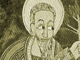

  
[Intangible Textual Heritage](../../index)  [Christianity](../index) 
[Africa](../../afr/index)  [Index](index)  [Previous](kn055) 
[Next](kn057) 

------------------------------------------------------------------------

  
*The Kebra Nagast*, by E.A. Wallis Budge, \[1932\], at Intangible
Textual Heritage

------------------------------------------------------------------------

### 56. *Of the Return of* ZADOK *the Priest, and the giving of the Gift*

   And when ZADOK the priest returned to
SOLOMON the King he found him sorrowful. And
the King answered and said unto ZADOK the
priest, "When the Queen came there appeared to me by night this vision:
It p. 85 seemed as if I were standing in the
chamber of JERUSALEM, and the sun came down
from heaven into the land of JUDAH, and
lighted it up with great splendour. And having tarried a time it went
down and lighted up the Country of ETHIOPIA,
and it did not return to the land of JUDAH.
And again the sun came down from heaven to the country of JUDAH, and lighted it up more brilliantly than it
did the first time; but the ISRAELITES paid
no heed to it, and they wished to extinguish its light. And it rose
below the earth in a place where it was not expected, and it illumined
the country of RÔM, and the country of ETHIOPIA, and afterwards all those who believed on
it."

   And ZADOK the priest answered and said
unto him, "O my lord, why didst thou not tell me before that thou hadst
seen a vision of this kind? Thou makest my knees to tremble. Woe be unto
us, if our sons have carried off our Lady, the holy, heavenly ZION, the Tabernacle of the Law of God!" And the
King answered and said unto him, "Our wisdom is forgotten and our
understanding is buried. Verily the sun that appeared unto me long ago
when I was sleeping with the Queen of ETHIOPIA was the symbol of the holy ZION. But tell me: yesterday when thou didst take
off the splendid covering that was lying upon ZION, didst thou not make certain that ZION was \[there\]?" And ZADOK the priest answered and said, "I did not,
lord; it had three coverings over it, and I took off the outermost, and
dressed ZION in the covering which thou didst
give me, and I brought \[the other\] to thee." And the King said unto
ZADOK, "Go quickly and look at our Lady and
examine her closely." And ZADOK the priest
took the keys, and went and opened the house of the sanctuary, and he
examined \[the place\] quickly, and he found there nothing except the
wooden boards which AZÂRYÂS had fastened
together and had made to resemble the sides of the pedestal of ZION.

------------------------------------------------------------------------

[Next: 57. Concerning the Fall of ZADOK the Priest](kn057)

