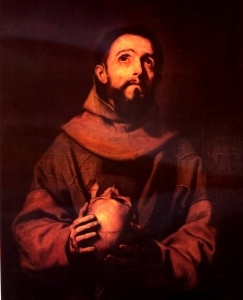

  
[Intangible Textual Heritage](../../index)  [Christianity](../index) 

------------------------------------------------------------------------

[Buy this Book at
Amazon.com](https://www.amazon.com/exec/obidos/ASIN/B002A7WE3W/internetsacredte)

------------------------------------------------------------------------

<table width="75%">
<colgroup>
<col style="width: 50%" />
<col style="width: 50%" />
</colgroup>
<tbody>
<tr class="odd">
<td width="50%" data-valign="TOP"> 
Saint Francis, by Jose de Ribera [1643] (Public Domain Image)</td>
<td width="50%" data-valign="CENTER"><h1 id="the-little-flowers-of-st.-francis" data-align="CENTER">The Little Flowers of St. Francis</h1>
<h2 id="tr.-by-w.-heywood" data-align="CENTER">tr. by W. Heywood</h2>
<h4 id="section" data-align="CENTER">[1906]</h4></td>
</tr>
</tbody>
</table>

------------------------------------------------------------------------

[Contents](#contents)    [Start Reading](lff000)    [Page
Index](pageidx)    [Text \[Zipped\]](lff.txt.gz)

------------------------------------------------------------------------

|                                                                                                                           |
|---------------------------------------------------------------------------------------------------------------------------|
|  |

The Little Flowers is a traditional collection of tales of St. Francis
and the early Franciscans. The legend of St. Francis (b. 1181, d. 1226),
the patron saint of animals, birds, and the environment, greatly
expanded as time went by, and accumulated in this work.

The Little Flowers is a much-loved spiritual classic. This translation
by W. Heywood has recently been republished by Vintage, introduced by
Madeline L'Engle.

------------------------------------------------------------------------

 [Title Page](lff000)  
[Contents](lff001)  
[Introduction](lff002)  
[Translator's Note](lff003)  

### The Little Flowers

[Chapter I](lff004)  
[Chapter II. Of Friar Bernard of Quintavalle, first companion of St.
Francis](lff005)  
[Chapter III. How for an evil thought which St. Francis had against
Friar Bernard. . .](lff006)  
[Chapter IV. How the Angel of God proposed a question to Friar Elias. .
.](lff007)  
[How the Holy Friar Bernard of Assisi was sent by St. Francis to
Bologna, and there founded a monastery](lff008)  
[Chapter VI. How St. Francis blessed the holy Friar Bernard, and left
him as his vicar. . .](lff009)  
[Chapter VII. How St. Francis passed a Lent in an island of the lake of
Perugia. . .](lff010)  
[Chapter VIII. How while St. Francis and Friar Leo were on a journey . .
.](lff011)  
[Chapter IX. How St. Francis taught Friar Leo to make answer. .
.](lff012)  
[Chapter X. How Friar Masseo, as if in raillery, said to St. Francis . .
.](lff013)  
[Chapter XI. How St. Francis made Friar Masseo turn round and round many
times, and thereafter gat him to Siena](lff014)  
[Chapter XII. How St. Francis laid upon Friar Masseo the service of the
gate . . .](lff015)  
[Chapter XIII. How St. Francis and Friar Masseo placed the bread which
they had begged upon a stone . . .](lff016)  
[Chapter XIV. How while St. Francis and his friars spake of God, He
appeared in the midst of them](lff017)  
[Chapter XV. How St. Clare ate with St. Francis and with the friars . .
.](lff018)  
[Chapter XVI. How St. Francis received the counsel of St. Clare . . .and
preached to the birds . . .](lff019)  
[Chapter XVII. How a boy friar, while St. Francis was praying by night,
saw Christ and the Virgin Mary . . .](lff020)  
[Chapter XVIII. Of the marvellous chapter which St. Francis held at
Santa Maria degli Angeli . . .](lff021)  
[Chapter XIX. How from the vineyard . . . the grapes were taken away . .
.](lff022)  
[Chapter XX. Of a very beautiful vision which was seen by a young friar
. . .](lff023)  
[Chapter XXI. Of the most holy miracle which St. Francis wrought when he
converted the very fierce wolf of Agobio](lff024)  
[Chapter XXII. How St. Francis tamed the wild turtle-doves](lff025)  
[Chapter XXIII. How St. Francis set free the friar who was in sin with
the demon](lff026)  
[Chapter XXIV. How St. Francis converted the Soldan of Babylon to the
faith](lff027)  
[Chapter XXV. How St. Francis miraculously healed one who was a leper
both in soul and body . . .](lff028)  
[Chapter XXVI. How St. Francis converted three robbers which were
murderers . . .](lff029)  
[Chapter XXVII. How St. Francis converted at Bologna two scholars, who
became friars. . .](lff030)  
[Chapter XXVIII. Of an ecstasy which came to Friar Bernard . .
.](lff031)  
[Chapter XXIX. How the devil in the form of Christ Crucified appeared .
. .](lff032)  
[Chapter XXX. Of the beautiful sermon . . . when they preached
naked](lff033)  
[Chapter XXXI. How St. Francis knew . . . the secrets of the hearts of
all his friars](lff034)  
[Chapter XXXII. How Friar Masseo obtained from Christ the virtue of his
humility](lff035)  
[Chapter XXXIII. How St. Clare, at the bidding of the Pope, blessed the
bread . . .](lff036)  
[Chapter XXXIV. How St. Louis, King of France, in the garb of a pilgrim
. . .](lff037)  
[Chapter XXXV. How, on Christmas Eve, St. Clare being sick was
miraculously carried . . .](lff038)  
[Chapter XXXVI. How St. Francis expounded unto Friar Leo a fair vision .
. .](lff039)  
[Chapter XXXVII. How Jesus Christ . . . caused a rich man to be
converted](lff040)  
[Chapter XXXVIII. How St. Francis knew in spirit that Friar Elias was
damned . . .](lff041)  
[Chapter XXXIX. Of the marvellous sermon which St. Antony of Padua, . .
. preached](lff042)  
[Chapter XL. When St. Antony . . . preached to the fishes of the
sea](lff043)  
[Chapter XLI. How the venerable Friar Simon delivered from a great
temptation a friar . . .](lff044)  
[Chapter XLII. Of beautiful miracles which God wrought through the holy
friars . . .](lff045)  
[Chapter XLIII. How Friar Conrad of Offida converted a young friar . .
.](lff046)  
[Chapter XLIV. How the Mother of Christ and St. John the Evangelist
appeared . . .](lff047)  
[Chapter XLV. Of the holy Friar John of Penna](lff048)  
[Chapter XLVI. Friar Pacificus and Humilis](lff049)  
[Chapter XLVII. Of that holy friar to whom the Mother of Christ appeared
. . .](lff050)  
[Chapter XLVIII. How Friar James of Massa saw in a vision all the minor
friars . . .](lff051)  
[Chapter XLIX. How Christ appeared to Friar John of Alvernia](lff052)  
[Chapter L. How . . . Friar John of Alvernia saw many souls liberated
from purgatory](lff053)  
[Chapter LI. Friar James of Fallerone appears after his death](lff054)  
[Chapter LII. Of the vision of Friar John of Alvernia . . .](lff055)  
[Chapter LIII. Friar John of Alvernia fell down as if he were dead while
saying mass](lff056)  

### Of The Most Holy Stigmata of St. Francis

[Introduction](lff057)  
[Of the First Consideration](lff058)  
[Of the Second Consideration](lff059)  
[Of the Third Consideration](lff060)  
[Of the Fourth Consideration](lff061)  
[Of the Fifth Consideration](lff062)  

### The Life of Friar Juniper

[Chapter I. How Friar Juniper cut off the foot of a pig to give it to a
sick man](lff063)  
[Chapter II. Great power of Friar Juniper against the devil](lff064)  
[Chapter III. How, through procurement of the devil, Friar Juniper was
condemned to the gallows](lff065)  
[Chapter IV. How Friar Juniper gave whatever he could to the poor, for
the love of God](lff066)  
[Chapter V. How Friar Juniper plucked off certain bells from the altar,
and gave them away for the love of God](lff067)  
[Chapter VI. How Friar Juniper kept silence for six months](lff068)  
[Chapter VII. Ensample against the temptations of the flesh](lff069)  
[Chapter VIII. How Friar Juniper abased himself for the glory of
God](lff070)  
[Chapter IX. How Friar Juniper, to abase himself, played at
see-saw](lff071)  
[Chapter X. How Friar Juniper once cooked for the friars food enough for
fifteen days](lff072)  
[Chapter XI. How Friar Juniper once went to Assisi for his
confusion](lff073)  
[Chapter XII. How Friar Juniper was rapt in ecstasy during the
celebration of the Mass](lff074)  
[Chapter XIII. Of the grief which Friar Juniper had for the death of his
companion, Friar Amazialbene](lff075)  
[Chapter XIV. Of the hand which Friar Juniper saw in the air](lff076)  
[Life of Friar Giles](lff077)  
[Chapter II. How Friar Giles went to St. James the Greater](lff078)  
[Chapter III. Of the manner of life which Friar Giles led when he went
to the Holy Sepulchre](lff079)  
[Chapter IV. How Friar Giles praised obedience more than
prayer](lff080)  
[Chapter V. How Friar Giles lived by the labour of his hands](lff081)  
[Chapter VI. How Friar Giles was miraculously provided for in his great
need . . .](lff082)  
[Chapter VII. Of the day of the death of the holy Friar Giles](lff083)  
[Chapter VIII. How a holy man, being in prayer, beheld the soul of Friar
Giles go to the life eternal](lff084)  
[Chapter IX. How through the merits of Friar Giles, the soul of a friend
of a certain Preaching Friar was delivered from the pains of
Purgatory](lff085)  
[Chapter X. How God had given graces unto Friar Giles, and of the year
of his death](lff086)  

### Teachings and Sayings of Friar Giles

[A Chapter of Vices and of Virtues](lff087)  
[Chapter of Faith](lff088)  
[Chapter of Holy Humility](lff089)  
[Chapter of the Holy Fear of God](lff090)  
[Chapter of Holy Patience](lff091)  
[Chapter of Sloth](lff092)  
[Chapter of the Irksomeness of Temporal Things](lff093)  
[Chapter of Holy Chastity](lff094)  
[Chapter of Temptations](lff095)  
[Chapter of Holy Penance](lff096)  
[Chapter of Holy Prayer](lff097)  
[Chapter of Holy Spiritual Prudence](lff098)  
[Chapter of Profitable and Unprofitable Knowledge](lff099)  
[Chapter of Good and Evil Speaking](lff100)  
[Chapter of Good Perseverance](lff101)  
[Chapter of the True Religion](lff102)  
[Chapter of Holy Obedience](lff103)  
[Chapter of the Remembrance of Death](lff104)  

### Addenda Taken From the Manuscripts

[Chapter I. An ensample of Friar Leo, how St. Francis bade him wash the
stone](lff105)  
[Chapter II. How St. Francis appeared to Friar Leo](lff106)  
[Chapter III. How Friar Leo saw a terrible vision in a dream](lff107)  
