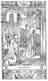
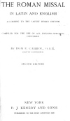

  
[Intangible Textual Heritage](../../index)  [Christianity](../index) 
[Index](index)  [Next](ord) 

------------------------------------------------------------------------

  
The Ordinary of the Mass (Latin/English), at Intangible Textual Heritage

------------------------------------------------------------------------

(AN EXCERPT FROM)

THE ROMAN MISSAL

IN LATIN AND ENGLISH

ACCORDING TO THE LATEST ROMAN EDITION

COMPILED FOR THE USE OF ALL ENGLISH-SPEAKING COUNTRIES

By Dom F. Cabrol, O.S.B.

ABBOT OF FARNBOROUGH

SECOND EDITION

NEW YORK

P. J. KENEDY AND SONS

PUBLISHERS TO THE HOLY APOSTOLIC SEE

  [  
Click to enlarge](img/front.jpg)

  [  
Click to enlarge](img/title.jpg)

  [  
Click to enlarge](img/verso.jpg)

*Imprimatur.*

 GULIELMUS EPŪS

Portus Magni, die 18a Octobris
1921.

Scanned, proofed and formatted at Intangible Textual Heritage, February
2008, by John Bruno Hare. This text is in the public domain in the
United States because it was published prior to 1923.

------------------------------------------------------------------------

[Next: The Ordinary of the Mass](ord)
