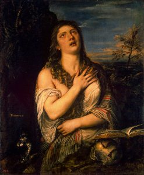

  
[Intangible Textual Heritage](../../index)  [Christianity](../index) 

------------------------------------------------------------------------

[Buy this Book on
Kindle](https://www.amazon.com/exec/obidos/ASIN/B001CL82NS/internetsacredte)

------------------------------------------------------------------------

<table width="75%">
<colgroup>
<col style="width: 50%" />
<col style="width: 50%" />
</colgroup>
<tbody>
<tr class="odd">
<td width="50%" data-valign="TOP"> 
St. Mary Magdeline, by Titian [1565] (Public Domain Image) -- See July 22.</td>
<td width="50%" data-valign="CENTER"><h1 id="lives-of-the-saints" data-align="CENTER">Lives of the Saints</h1>
<h2 id="by-alban-butler-benziger-bros.-edition" data-align="CENTER">by Alban Butler, Benziger Bros. edition</h2>
<h4 id="section" data-align="CENTER">[1894]</h4></td>
</tr>
</tbody>
</table>

------------------------------------------------------------------------

[Contents](#contents)    [Start Reading](lots000)    [Page
Index](pageidx)    [Text \[Zipped\]](lots.txt.gz)

------------------------------------------------------------------------

|                                                                                                                           |
|---------------------------------------------------------------------------------------------------------------------------|
|  |

This is the Benziger Brothers edition of Alban Butler's Lives of the
Saints. Butler (1711-1773), was an English Roman Catholic priest. This,
his principal literary work, was published between 1756 and 1759. Lives
of the Saints has hundreds of capsule descriptions of Catholic saints,
organized by the saint's day of the year. The 1894 Benziger Brothers
edition, originally published in 1878, was heavily edited by John
Gilmary Shea (here uncredited. Source: MELVYL). The 'Reflections' were
not in the original Butler text, and were probably added by Shea.

The full text of Alban Butlers' work, which occupies over 1,200 pages of
two-column small type, will have to wait for another time. However this
imprimatur edition was apparently widely used by American Catholics at
the turn of the 20th century, and remains accessible to contemporary
readers.

------------------------------------------------------------------------

[January](#section_002) \| [February](#section_003) \|
[March](#section_004) \| [April](#section_005) \| [May](#section_006) \|
[June](#section_007) \| [July](#section_008) \| [August](#section_009)
\| [September](#section_010) \| [October](#section_011) \|
[November](#section_012) \| [December](#section_013)

------------------------------------------------------------------------

[Title Page](lots000)  
[Index](lots001)  

### Lives of Certain Saints

[St. Philip of Jesus](lots002)  
[St. Turribius, Archbishop of Lima](lots003)  
[St. Francis Solano](lots004)  
[St. Teresa of the Infant Jesus](lots005)  
[St. Joan of Arc](lots006)  
[St. Rita of Cascia, Widow](lots007)  
[St. Gabriel of the Sorrowful Mother](lots008)  

### Lives of the Saints

### January

[1. The Circumcision of our Lord](lots009)  
[2. St. Fulgentius, Bishop](lots010)  
[2. St. Macarius of Alexandria](lots011)  
[3. St. Genevieve, Virgin](lots012)  
[4. St. Titus, Bishop](lots013)  
[4. St. Gregory, Bishop](lots014)  
[5. St. Simeon Stylites](lots015)  
[6. The Epiphany of Our Lord](lots016)  
[7. St. Lucian, Martyr](lots017)  
[8. St. Apollinaris, the Apologist, Bishop](lots018)  
[9. Ss. Julian and Basilissa, Martyrs](lots019)  
[10. St. William, Archbishop](lots020)  
[11. St. Theodosius, The Cenobiarch](lots021)  
[12. St. Aelred, Abbot](lots022)  
[13. St. Veronica of Milan](lots023)  
[14. St. Hilary of Poitiers](lots024)  
[15. St. Paul, the First Hermit](lots025)  
[16. St. Honoratus, Archbishop](lots026)  
[17. St. Antony, Patriarch of Monks](lots027)  
[18. St. Peter's Chair at Rome](lots028)  
[19. St. Canutus, King, Martyr](lots029)  
[20. St. Sebastian, Martyr](lots030)  
[21. St. Agnes, Virgin, Martyr](lots031)  
[22. St. Vincent, Martyr](lots032)  
[23. St. Raymund of Pennafort](lots033)  
[24. St. Timothy, Bishop, Martyr](lots034)  
[25. The Conversion of St. Paul](lots035)  
[26. St. Polycarp, Bishop, Martyr](lots036)  
[27. St. John Chrysostom](lots037)  
[28. St. Cyril of Alexandria](lots038)  
[29. St. Francis of Sales](lots039)  
[30. St. Bathildes, Queen](lots040)  
[31. St. Marcella, Widow](lots041)  

### February

[1. St. Bridgid, Abbess, and Patroness of Ireland](lots042)  
[1. St. Ignatius, Bishop, Martyr](lots043)  
[2. The Purification, Commonly Called Candlemas-Day](lots044)  
[3. St. Blase, Bishop and Martyr](lots045)  
[4. St. Jane of Valois](lots046)  
[5. St. Agatha, Virgin, Martyr](lots047)  
[5. The Martyrs of Japan](lots048)  
[6. St. Dorothy, Virgin, Martyr](lots049)  
[7. St. Romuald, Abbot](lots050)  
[8. St. John of Matha](lots051)  
[9. St. Apollonia and the Martyrs of Alexandria](lots052)  
[10. St. Scholastica, Abbess](lots053)  
[11. St. Severinus, Abbot of Agaunum](lots054)  
[12. St. Benedict of Anian](lots055)  
[13. St. Catherine of Ricci](lots056)  
[14. St. Valentine, Priest and Martyr](lots057)  
[15. Sts. Faustinus and Jovita, Martyrs](lots058)  
[16. Blessed John de Britto, Martyr](lots059)  
[16. St. Onesimus, Disciple of St. Paul](lots060)  
[17. St. Flavian, Bishop, Martyr](lots061)  
[18. St. Simeon, Bishop, Martyr](lots062)  
[19. St. Barbatus, Bishop](lots063)  
[20. St. Eucherius, Bishop](lots064)  
[21. St. Severianus, Martyr, Bishop](lots065)  
[22. St. Peter's Chair at Antioch](lots066)  
[23. St. Peter Damian](lots067)  
[23. St. Serenus, a Gardener, Martyr](lots068)  
[24. St. Matthias, Apostle](lots069)  
[25. St. Tarasius](lots070)  
[26. St. Porphyry, Bishop](lots071)  
[27. St. Leander, Bishop](lots072)  
[28. Sts. Romanus and Lupicinus, Abbots](lots073)  
[29. St. Oswald, Bishop](lots074)  

### March

[1. St. David, Bishop](lots075)  
[1. St. Albinus, Bishop](lots076)  
[2. St. Simplicius, Pope](lots077)  
[3. St. Cunegundes, Empress](lots078)  
[4. St. Casimir, King](lots079)  
[5. Sts. Adrian and Eubulus, Martyrs](lots080)  
[6. St. Colette, Virgin](lots081)  
[7. St. Thomas Aquinas](lots082)  
[8. St. John of God](lots083)  
[9. St. Frances of Rome](lots084)  
[10. The Forty Martyrs of Sebaste](lots085)  
[11. St. Eulogius, Martyr](lots086)  
[12. St. Gregory the Great](lots087)  
[13. St. Euphrasia, Virgin](lots088)  
[14. St. Maud. Queen](lots089)  
[15. St. Zachary, Pope](lots090)  
[16. Sts. Abraham and Mary](lots091)  
[17. St. Patrick, Bishop, Apostle of Ireland](lots092)  
[18. St. Cyril of Jerusalem](lots093)  
[19. St. Joseph, Spouse of the Blessed Virgin and Patron of the
Universal Church](lots094)  
[20. St. Wulfran, Archbishop](lots095)  
[21. St. Benedict, Abbot](lots096)  
[22. St. Catharine of Sweden, Virgin](lots097)  
[23. Sts. Victorian and Others, Martyrs](lots098)  
[24. St. Simon, Infant Martyr](lots099)  
[25. The Annunciation of the Blessed Virgin Mary](lots100)  
[26. St. Ludger, Bishop](lots101)  
[27. St. John of Egypt](lots102)  
[28. St. Gontran, King](lots103)  
[29. Sts. Jonas, Barachisius, and their Companions, Martyrs](lots104)  
[30. St. John Climacus](lots105)  
[31. St. Benjamin, Deacon, Martyr](lots106)  

### April

[1. St. Hugh, Bishop](lots107)  
[2. St. Francis of Paula](lots108)  
[3. St. Richard of Chichester](lots109)  
[4. St. Isidore, Archbishop](lots110)  
[5. St. Vincent Ferrer](lots111)  
[6. St. Celestine, Pope](lots112)  
[7. St. Hegesippus, a Primitive Father](lots113)  
[7. Blessed Herman Joseph of Steinfeld](lots114)  
[8. St. Perpetuus, Bishop](lots115)  
[9. St. Mary of Egypt](lots116)  
[9. St. John the Almoner](lots117)  
[10. St. Bademus, Martyr](lots118)  
[11. St. Leo the Great](lots119)  
[12. St. Julius, Pope](lots120)  
[13. St. Hermenegild, Martyr](lots121)  
[14. St. Benezet, or Little Bennet](lots122)  
[15. St. Paternus, Bishop](lots123)  
[16. Eighteen Martyrs of Saragossa, and St. Encratis, or Engratia,
Virgin, Martyr](lots124)  
[17. St. Anicetus, Pope, Martyr](lots125)  
[18. St. Apollonius, Martyr](lots126)  
[19. St. Elphege, Archbishop](lots127)  
[20. St. Marcellinus, Bishop](lots128)  
[21. St. Anselm, Archbishop](lots129)  
[22. St. Soter, Pope, Martyr](lots130)  
[22. St. Leonides, Martyr](lots131)  
[23. St. George, Martyr](lots132)  
[24. St. Fidelis of Sigmaringen](lots133)  
[25. St. Mark, Evangelist](lots134)  
[26. Sts. Cletus and Marcellinus, Popes, Martyrs](lots135)  
[27. St. Zita, Virgin](lots136)  
[28. St. Paul of the Cross](lots137)  
[28. St. Vitalis, Martyr](lots138)  
[29. St. Peter, Martyr](lots139)  
[29. St. Hugh, Abbot of Cluny](lots140)  
[30. St. Catherine of Siena](lots141)  

### May

[1. Sts. Philip and James, Apostles](lots142)  
[2. St. Athanasius, Bishop](lots143)  
[3. The Discovery of the Holy Cross](lots144)  
[4. St. Monica](lots145)  
[5. St. Pius V](lots146)  
[6. St. John Before the Latin Gate](lots147)  
[7. St. Stanislas, Bishop, Martyr](lots148)  
[8. The Apparition of St. Michael the Archangel](lots149)  
[9. St. Gregory Nazianzen](lots150)  
[10. St. Antoninus, Bishop](lots151)  
[11. St. Mammertus, Archbishop](lots152)  
[12. St. Epiphanius, Archbishop](lots153)  
[13. St. John the Silent](lots154)  
[14. St. Pachomius, Abbot](lots155)  
[15. Sts. Peter and Dionysia](lots156)  
[16. St. John Nepomucen](lots157)  
[17. St. Paschal Baylon](lots158)  
[18. St. Venantius, Martyr](lots159)  
[19. St. Peter Celestine](lots160)  
[20. St. Bernardine of Siena](lots161)  
[21. St. Hospitius, Recluse](lots162)  
[22. St. Yvo, Confessor](lots163)  
[23. St. Julia, Virgin, Martyr](lots164)  
[24. Sts. Donatian and Rogatian, Martyrs](lots165)  
[25. St. Gregory VII](lots166)  
[26. St. Philip Neri](lots167)  
[26. St. Augustine, Apostle of England](lots168)  
[27. St. Mary Magdalen of Pazzi](lots169)  
[27. Venerable Bede](lots170)  
[28. St. Germanus, Bishop](lots171)  
[29. St. Cyril, Martyr](lots172)  
[30. St. Felix I., Pope and Martyr](lots173)  
[31. St. Petronilla, Virgin](lots174)  

### June

[1. St. Justin, Martyr](lots175)  
[1. St. Pamphilus, Martyr](lots176)  
[2. Sts. Pothinus, Bishop, Sanctus, Attalus, Blandina, and the other
Martyrs of Lyons](lots177)  
[3. St. Clotilda, Queen](lots178)  
[4. St. Francis Caracciolo](lots179)  
[5. St. Boniface, Bishop, Martyr](lots180)  
[6. St. Norbert, Bishop](lots181)  
[7. St. Robert of Newminster](lots182)  
[7. St. Claude, Archbishop](lots183)  
[8. St. Medard, Bishop](lots184)  
[9. Sts. Primus and Felicianus, Martyrs](lots185)  
[9. St. Columba, or Columkille, Abbot](lots186)  
[10. St. Margaret of Scotland](lots187)  
[11. St. Barnabas, Apostle](lots188)  
[12. St. John of St. Fagondez](lots189)  
[13. St. Antony of Padua](lots190)  
[14. St. Basil the Great](lots191)  
[15. Sts. Vitus, Crescentia, and Modestus, Martyrs](lots192)  
[16. St. John Francis Regis](lots193)  
[17. St. Avitus, Abbot](lots194)  
[18. Sts. Marcus and Marcellianus, Martyrs](lots195)  
[19. St. Juliana Falconieri](lots196)  
[20. St. Silverius, Pope and Martyr](lots197)  
[21. St. Aloysius Gonzaga](lots198)  
[22. St. Paulinus of Nola](lots199)  
[23. St. Etheldreda, Abbess](lots200)  
[24. St. John the Baptist](lots201)  
[25. St. Prosper of Aquitaine. St William of Monte-Vergine](lots202)  
[26. Sts. John and Paul, Martyrs](lots203)  
[27. St. Ladislas, King](lots204)  
[28. St. Irenæus, Bishop, Martyr](lots205)  
[29. St. Peter, Apostle](lots206)  
[30. St. Paul](lots207)  

### July

[1. St. Gal, Bishop](lots208)  
[2. The Visitation of the Blessed Virgin](lots209)  
[3. St. Heliodorus, Bishop](lots210)  
[4. St. Bertha, Widow, Abbess](lots211)  
[5. St. Peter of Luxemburg](lots212)  
[6. St. Goar, Priest](lots213)  
[6. St. Palladius, Bishop, Apostle of the Scots](lots214)  
[7. St. Pantænus, Father of the Church](lots215)  
[8. St. Elizabeth of Portugal](lots216)  
[9. St. Ephrem, Deacon](lots217)  
[10. The Seven Brothers, Martyrs, and St. Felicitas, their
Mother](lots218)  
[11. St. James, Bishop](lots219)  
[12. St. John Gualbert](lots220)  
[13. St. Eugenius, Bishop](lots221)  
[14. St. Bonaventure](lots222)  
[15. St. Henry, Emperor](lots223)  
[16. St. Simon Stock](lots224)  
[17. St. Alexius](lots225)  
[18. St. Camillus Of Lellis](lots226)  
[19. St. Vincent of Paul](lots227)  
[20. St. Margaret, Virgin and Martyr](lots228)  
[20. St. Jerome Emiliani](lots229)  
[21. St. Victor, Martyr](lots230)  
[22. St. Mary Magdalen](lots231)  
[23. St. Apollinaris, Bishop and Martyr](lots232)  
[24. St. Christina, Virgin and Martyr](lots233)  
[25. St. James, Apostle](lots234)  
[26. St. Anne](lots235)  
[27. St. Pantaleon, Martyr](lots236)  
[28. Sts. Nazarius and Celsus, Martyrs](lots237)  
[29. St. Martha, Virgin](lots238)  
[30. St. Germanus, Bishop](lots239)  
[31. St. Ignatius of Loyola](lots240)  

### August

[1. St. Peter's Chains](lots241)  
[2. St. Stephen, Pope and Martyr](lots242)  
[2. St. Alphonsus Liguori](lots243)  
[3. The Finding of St. Stephen's Relics](lots244)  
[4. St. Dominic](lots245)  
[5. The Dedication of St. Mary ad Nives](lots246)  
[6. The Transfiguration of Our Lord](lots247)  
[7. St. Cajetan](lots248)  
[8. St. Cyriacus and His Companions, Martyrs](lots249)  
[8. Blessed Peter Favre](lots250)  
[9. St. Romanus, Martyr](lots251)  
[10. St. Laurence, Martyr](lots252)  
[11. Sts. Tiburtius and Susanna, Martyrs](lots253)  
[12. St. Clare, Abbess](lots254)  
[13. St. Radegundes, Queen](lots255)  
[14. St. Eusebius, Priest](lots256)  
[15. The Assumption of the Blessed Virgin Mary](lots257)  
[16. St. Hyacinth](lots258)  
[17. St. Liberatus, Abbot, and Six Monks, Martyrs](lots259)  
[18. St. Helena, Empress; St. Agapetus, Martyr](lots260)  
[19. St. Louis, Bishop](lots261)  
[20. St. Bernard](lots262)  
[21. St. Jane Frances de Chantal](lots263)  
[22. St. Symphorian, Martyr](lots264)  
[23. St. Philip Benizi](lots265)  
[24. St. Bartholomew, Apostle](lots266)  
[25. St. Louis, King](lots267)  
[26. St. Zephyrinus, Pope and Martyr](lots268)  
[27. St. Joseph Calasanctius](lots269)  
[28. St. Augustine of Hippo](lots270)  
[29. The Beheading of St. John the Baptist](lots271)  
[30. St. Rose of Lima](lots272)  
[30. St. Fiaker, Anchorite](lots273)  
[31. St. Raymund Nonnatus](lots274)  

### September

[1. St. Giles, Abbot](lots275)  
[2. St. Stephen, King](lots276)  
[3. St. Seraphia, Virgin and Martyr](lots277)  
[4. St. Rosalia, Virgin](lots278)  
[5. St. Laurence Justinian](lots279)  
[6. St. Eleutherius, Abbot](lots280)  
[7. St. Cloud, Confessor](lots281)  
[8. The Nativity of the Blessed Virgin](lots282)  
[8. The Festival, on the Sunday Within the Octave of Her Nativity, of
The Holy Name of Mary](lots283)  
[9. St. Omer, Bishop](lots284)  
[9. Saint Peter Claver](lots285)  
[10. St. Nicholas of Tolentino](lots286)  
[11. St. Paphnutius, Bishop](lots287)  
[12. St. Guy of Anderlecht](lots288)  
[13. St. Eulogius, Patriarch of Alexandria](lots289)  
[14. The Exaltation of the Holy Cross of Our Lord Jesus
Christ](lots290)  
[15. St. Catherine of Genoa](lots291)  
[16. St. Cyprian, Bishop, Martyr](lots292)  
[17. St. Lambert, Bishop, Martyr](lots293)  
[18. St. Thomas of Villanova](lots294)  
[19. St. Januarius, Martyr](lots295)  
[20. Sts. Eustachius and Companions, Martyrs](lots296)  
[21. St. Matthew, Apostle](lots297)  
[22. The Theban Legion](lots298)  
[23. St. Thecla, Virgin, Martyr](lots299)  
[24. The Blessed Virgin Mary of Mercy](lots300)  
[25. St. Firmin, Bishop, Martyr. St. Finbarr, Bishop](lots301)  
[26. Sts. Cyprian and Justina, Martyrs](lots302)  
[27. Sts. Cosmas and Damian, Martyrs](lots303)  
[28. St. Wenceslas, Martyr](lots304)  
[29. St. Michael, Archangel](lots305)  
[30. St. Jerome, Doctor](lots306)  

### October

[1. St. Remigius, Bishop](lots307)  
[2. The Holy Guardian Angels](lots308)  
[3. St. Gerard, Abbot](lots309)  
[4. St. Francis of Assisi](lots310)  
[5. St. Placid, Martyr](lots311)  
[6. St. Bruno](lots312)  
[7. St. Mark, Pope](lots313)  
[8. St. Bridget of Sweden](lots314)  
[9. St. Dionysius and his Companions, Martyrs. St. Louis
Bertrand](lots315)  
[10. St. Francis Borgia](lots316)  
[11. St. Tarachus and his Companions](lots317)  
[12. St. Wilfrid, Bishop](lots318)  
[13. St. Edward the Confessor](lots319)  
[14. St. Callistus, Pope, Martyr](lots320)  
[15. St. Teresa](lots321)  
[16. St. Gall, Abbot](lots322)  
[17. St. Hedwige. Saint Margaret Mary Alacoque](lots323)  
[18. St. Luke](lots324)  
[19. St. Peter of Alcantara](lots325)  
[20. St. John Cantius](lots326)  
[21. St. Ursula, Virgin and Martyr](lots327)  
[22. St. Mello, Bishop. St. Hilarion, Abbot](lots328)  
[23. St. Theodoret, Martyr](lots329)  
[24. St. Magloire, Bishop](lots330)  
[25. Sts. Crispin and Crispinian, Martyrs](lots331)  
[26. St. Evaristus, Pope and Martyr](lots332)  
[27. St. Frumentius, Bishop](lots333)  
[28. Sts. Simon and Jude](lots334)  
[29. St. Narcissus, Bishop](lots335)  
[30. St. Marcellus, the Centurion, Martyr](lots336)  
[31. St. Quintin, Martyr](lots337)  

### November

[1. All-Saints](lots338)  
[2. All-Souls](lots339)  
[2. St. Malachi, Bishop](lots340)  
[3. St. Hubert, Bishop](lots341)  
[4. St. Charles Borromeo](lots342)  
[5. St. Bertille, Abbess](lots343)  
[6. St. Leonard](lots344)  
[7. St. Willibrord](lots345)  
[8. The Feast of the Holy Relics](lots346)  
[9. St. Theodore Tyro, Martyr](lots347)  
[10: St. Andrew Avellino](lots348)  
[11. St. Martin of Tours](lots349)  
[12. St. Martin, Pope](lots350)  
[13. St. Stanislas Kostka](lots351)  
[14. St. Didacus](lots352)  
[14. St. Laurence O'Toole, Archbishop of Dublin](lots353)  
[15. St. Gertrude, Abbess](lots354)  
[16. St. Edmund of Canterbury](lots355)  
[17. St. Gregory Thaumaturgus](lots356)  
[18. St. Odo of Cluny](lots357)  
[19. St. Elizabeth of Hungary](lots358)  
[20. St. Felix of Valois](lots359)  
[21. The Presentation of the Blessed Virgin Mary](lots360)  
[22. St. Cecilia, Virgin, Martyr](lots361)  
[23. St. Clement of Rome](lots362)  
[24. St. John of the Cross](lots363)  
[25. St. Catherine of Alexandria](lots364)  
[26. St. Peter of Alexandria, Bishop, Martyr](lots365)  
[27. St. Maximus, Bishop](lots366)  
[28. St. James of La Marca of Ancona](lots367)  
[29. St. Saturninus, Martyr](lots368)  
[30. St. Andrew, Apostle](lots369)  

### December

[1. St. Eligius](lots370)  
[2. St. Bibiana, Virgin, Martyr](lots371)  
[3. St. Francis Xavier](lots372)  
[4. St. Barbara, Virgin, Martyr](lots373)  
[5. St. Sabas, Abbot](lots374)  
[6. St. Nicholas of Bari](lots375)  
[7. St. Ambrose, Bishop](lots376)  
[8. The Feast of the Immaculate Conception](lots377)  
[9. St. Leocadia, Virgin, Martyr](lots378)  
[10. St. Eulalia, Virgin, Martyr](lots379)  
[11. St. Damasus, Pope](lots380)  
[12. St. Valery, Abbot. St. Finian, Bishop](lots381)  
[13. St. Lucy, Virgin, Martyr](lots382)  
[14. St. Nicasius, Archbishop, and his Companions, Martyrs](lots383)  
[15. St. Mesmin](lots384)  
[16. St. Eusebius, Bishop](lots385)  
[17. St. Olympias, Widow](lots386)  
[18. St. Gatian, Bishop](lots387)  
[19. St. Nemesion, Martyr](lots388)  
[20. St. Philogonius, Bishop](lots389)  
[21. St. Thomas, Apostle](lots390)  
[22. St. Ischyrion, Martyr](lots391)  
[23. St. Servulus](lots392)  
[24. St. Delphinus, Bishop. Sts. Thrasilla and Emiliana,
Virgins](lots393)  
[25. The Nativity of Christ, or Christmas Day](lots394)  
[26. St. Stephen, First Martyr](lots395)  
[27. St. John, Evangelist](lots396)  
[28. The Holy Innocents](lots397)  
[29. St. Thomas of Canterbury](lots398)  
[30. St. Sabinus, Bishop, and his Companions, Martyrs](lots399)  
[31. St. Sylvester, Pope](lots400)  
