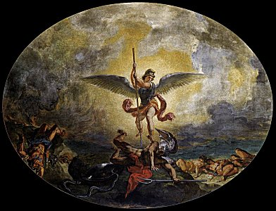

  
[Intangible Textual Heritage](../../index)  [Christianity](../index) 

------------------------------------------------------------------------

[Buy this Book at
Amazon.com](https://www.amazon.com/exec/obidos/ASIN/0385023510/internetsacredte)

------------------------------------------------------------------------

<table width="75%">
<colgroup>
<col style="width: 50%" />
<col style="width: 50%" />
</colgroup>
<tbody>
<tr class="odd">
<td width="50%" data-valign="TOP"></td>
<td width="50%" data-valign="CENTER"><h1 id="paradise-lost-and-regained">Paradise Lost and Regained</h1>
<h2 id="by-john-milton">by John Milton</h2>
<h3 id="and-1671">[1667 and 1671]</h3></td>
</tr>
</tbody>
</table>

------------------------------------------------------------------------

[Contents](#contents)    [Start Reading](pl01)

|                                                                                                                           |
|---------------------------------------------------------------------------------------------------------------------------|
|  |

------------------------------------------------------------------------

 

### Paradise Lost

[Book 1](pl01)  
[Book 2](pl02)  
[Book 3](pl03)  
[Book 4](pl04)  
[Book 5](pl05)  
[Book 6](pl06)  
[Book 7](pl07)  
[Book 8](pl08)  
[Book 9](pl09)  
[Book 10](pl10)  
[Book 11](pl11)  
[Book 12](pl12)  

### Paradise Regained

[Book 1](pr01)  
[Book 2](pr02)  
[Book 3](pr03)  
[Book 4](pr04)  
