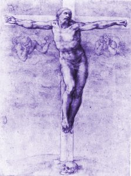

  
[Intangible Textual Heritage](../../index)  [Christianity](../index) 

------------------------------------------------------------------------

[Buy this Book at
Amazon.com](https://www.amazon.com/exec/obidos/ASIN/B002AMUDEE/internetsacredte)

------------------------------------------------------------------------

<table width="75%">
<colgroup>
<col style="width: 50%" />
<col style="width: 50%" />
</colgroup>
<tbody>
<tr class="odd">
<td width="50%" data-valign="TOP"> 
Michelangelo: Christ on the Cross [1541] (Public Domain Image)</td>
<td width="50%" data-valign="CENTER"><h1 id="the-man-of-sorrows" data-align="CENTER">The Man of Sorrows</h1>
<h2 id="by-john-nelson-darby" data-align="CENTER">by John Nelson Darby</h2>
<h4 id="no-date-pre-1882" data-align="CENTER">[no date (pre-1882)]</h4></td>
</tr>
</tbody>
</table>

------------------------------------------------------------------------

[Contents](#contents)    [Start Reading](mos00)    [Page
Index](pageidx)    [Text \[Zipped\]](mos.txt.gz)

------------------------------------------------------------------------

|                                                                                                                           |
|---------------------------------------------------------------------------------------------------------------------------|
|  |

This is John Nelson Darby's chapter by chapter commentary on the Gospel
of Luke. Darby was the founder of "dispensationalism", which among other
innovations, proposed the theory of the 'rapture.' Darby's ideas were
later propagated in the Scofield Reference Bible. --J.B. Hare

------------------------------------------------------------------------

 [Title Page](mos00)  
[Advertisements (facing title page)](mos01)  
[How to Use](mos02)  
[Isaiah LIII](mos03)  
[Index to Chapters](mos04)  
[Index of Subjects](mos05)  
[Chapter 1](mos06)  
[Chapter 2](mos07)  
[Chapter 3](mos08)  
[Chapter 4](mos09)  
[Chapter 5](mos10)  
[Chapter 6](mos11)  
[Chapter 7](mos12)  
[Chapter 8](mos13)  
[Chapter 9](mos14)  
[Chapter 10](mos15)  
[Chapter 11](mos16)  
[Chapter 12](mos17)  
[Chapter 13](mos18)  
[Chapter 14](mos19)  
[Chapter 15](mos20)  
[Chapter 16](mos21)  
[Chapter 17](mos22)  
[Chapter 18](mos23)  
[Chapter 19](mos24)  
[Chapter 20](mos25)  
[Chapter 21](mos26)  
[Chapter 22](mos27)  
[Chapter 23](mos28)  
[Chapter 24](mos29)  
