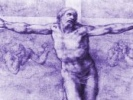

  
[Intangible Textual Heritage](../../index)  [Christianity](../index) 
[Index](index)  [Previous](mos01)  [Next](mos03) 

------------------------------------------------------------------------

[Buy this Book at
Amazon.com](https://www.amazon.com/exec/obidos/ASIN/B002AMUDEE/internetsacredte)

------------------------------------------------------------------------

  
*The Man of Sorrows*, by John Nelson Darby, \[n.d. (prior to 1882)\], at
Intangible Textual Heritage

------------------------------------------------------------------------

p. 5

# HOW TO USE.

THERE are three ways in which this volume may be helpfully used.

1\. By **reading straight through** as an ordinary book, making a pencil
note in the margin of portions suitable for meditation and careful
study.

2\. Taking **chapter by chapter**, first reading the chapter in the
Bible itself, then carefully noting the valuable and suggestive thoughts
by this able minister of the Word of God.

3\. As a **book of reference**. The *Subject Index* will readily
indicate where any incident or event mentioned in the Gospel may be
found. The Bible *chapters* are indicated at the head of each page, the
verses at the beginning of each paragraph. The **black type** clearly
indicates portions of the Gospel quoted.

Some of the quotations are from the Author's *New Translation* of the
New Testament, now supplied in thin paper pocket edition, cloth, 2/;
leather, 3/.

------------------------------------------------------------------------

[Next: Isaiah LIII](mos03)
