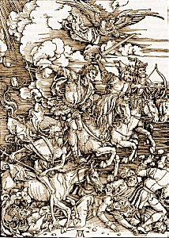

  
[Intangible Textual Heritage](../../index)  [Christianity](../index) 

------------------------------------------------------------------------

<table width="75%">
<colgroup>
<col style="width: 50%" />
<col style="width: 50%" />
</colgroup>
<tbody>
<tr class="odd">
<td width="50%" data-valign="TOP"> 
</td>
<td width="50%" data-valign="TOP"><h1 id="notes-on-the-book-of-the-revelation" data-align="CENTER">Notes on the Book of the Revelation</h1>
<h2 id="by-john-nelson-darby" data-align="CENTER">by John Nelson Darby</h2>
<h4 id="nd-ed." data-align="CENTER">[1876] (2nd ed.)</h4></td>
</tr>
</tbody>
</table>

------------------------------------------------------------------------

This is John Nelson Darby's commentary on the Book of Revelation. This
is the text of the second edition (the first edition was published in
London in 1839); Material added to the second edition is apparently
marked by square brackets in the text. Note that this book originally
had no chapters; the internal divisions into 'parts' is arbitrary. These
divisions were added by the redactor to assist low-bandwidth users of
this site.

------------------------------------------------------------------------

[Title Page](nbr00)  
[Part One](nbr01)  
[Part Two](nbr02)  
[Part Three](nbr03)  
[Part Four](nbr04)  
[Part Five](nbr05)  
[Charts](nbr06)  
