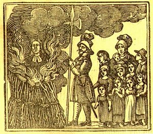

[Intangible Textual Heritage](../../index)  [Christianity](../index) 
[Index](index)  [Previous](nep21)  [Next](nep23) 

------------------------------------------------------------------------

THE BURNING OF MR. JOHN ROGERS

 

MR. JOHN ROGERS, minister of the gospel in London, was the first martyr
in Queen Mary's reign; and was burnt at Smithfield, February the
fourteenth, 1554. His wife, with nine small children, and one at her
breast, followed him to the stake, with which sorrowful sight he was not
in the least daunted, but with wonderful patience died courageously for
the gospel of JESUS CHRIST.

p. 25

A few days before his death, he wrote the following advice to his
children:--

GIVE ear, my children, to my word,  
  Whom God hath dearly bought;  
Lay up his laws within your heart,  
  And print them in your thought.

I leave you here a little book,  
  For you to look upon,  
That you may see your father's face,  
  When he is dead and gone,--

Who, for the hope of heavenly things,  
  While he did here remain,  
Gave over all his golden years  
  To prison and to pain;--

Where I, among my iron bands,  
  Enclosed in the dark,  
Not many days before my death,  
  Composed for you this work.

And for example to your youth,  
  To whom I wish all good,  
I send you here God's perfect truth,  
  And seal it with my blood;--

To on, my heirs of earthly things,  
  Whom I do leave behind,  
That you may read and understand,  
  And keep it in your mind;--

That as you have been heirs of that  
  Which once will wear away,  
You also may possess that part  
  Which never will decay.

Keep always God before your eyes,  
  With all your whole intent, p. 26  
Commit no sin in any wise,  
  But keep his commandments.

Abhor that arrant whore of Rome,  
  And all her blasphemies,  
And drink not of her cursed cup;  
  Obey not her decrees.

Give honor to your mother dear;  
  Remember well her pain;  
And recompense her, in her age,  
  With the like love again.

Be always ready for her help,  
  And let her not decay;  
Remember well your father all,  
  Who should have been your stay.

Give of your portion to the poor,  
  As riches do arise;  
Arid from the needy, naked soul,  
  Turn not away your eyes.

For he who doth not hear the cry  
  Of those who stand in need,  
Will cry himself; and not be heard,  
  When he does hope to speed.

If God hath given you increase,  
  And blessed well your store,  
Remember you are put in trust,  
  And should relieve the poor.

Beware of foul and filthy lusts;  
  Let such things have no place,  
Keep clean your vessels in the Lord,  
  That he may you embrace.

You are the temples of the Lord,  
  For you are dearly bought, p. 27  
And they who do defile the same  
  Will surely come to nought.

Be never proud, by any means,  
  Build not your house too high;  
But always have before your eyes  
  That you were born to die.

Defraud not him who hired is,  
  Your labor to sustain;  
But pay him still, without delay,  
  His wages for his pain.

And as you would that other men  
  Towards you should proceed,  
Do you the same to them again,  
  When they do stand in need.

Impart your portion to the poor  
  In money and in meat;  
And send the feeble, fainting son,  
  Of that which you do eat.

Ask counsel always of the wise  
  Give ear unto the end,  
And ne'er refuse the sweet rebuke  
  Of him who is your friend.

Be always thankful to the Lord,  
  With prayer and with praise,  
Begging of him to bless your work,  
  And to direct your ways.

Seek first, I say, the living God,  
  And always him adore,  
And then be sure that he will bless  
  Your basket and your store.

And I beseech Almighty God,  
  To replenish you with grace,p. 28  
That I may meet you in the heavens,  
  And see you face to face.

And though the fire my body burn,  
  Contrary to my kind,  
That I cannot enjoy your love,  
  According to my mind,--

Yet I do hope that when the heavens  
  Shall vanish like a scroll,  
I shall see you in perfect shape  
  In body and in soul.

And that I may enjoy your love,  
  And you enjov the land,  
I do beseech the living Lord  
  To hold you in his hand.

Though here iny body be adjudged  
  In flaming fire to fry,  
My soul, I trust, will straight ascend  
  To dwell with God on high.

What though this carcass smart awhile?  
  What though this life decay?  
My soul, I hope, will be with God,  
  And live with him for aye.

I know I am a sinner born,  
  From the original,  
And that I do deserve to die,  
  By my forefather's fall.

But by our Savior's precious blood,  
  Which on the cross was spilt,  
Who freely offered up his life,  
  To save our souls from guilt,--

I hope redemption I shall have,  
  And all who in him trust, p. 29  
When I shall see him face to face,  
  And live among the just.

Why, then, hould I fear death's grim look,  
  Since Christ for me did die?  
For king and Cesar, rich and poor,  
  The force of death must try.

When I am chained to the stake,  
  And fagots gird me round,  
Then pray the Lord my soul in heaven  
  May be with glory crowned.

Come, welcome, death, the end of fears,  
  I am prepared to die;  
These earthly flames will send my soul  
  Up to the Lord on high.

Farewell, my children, to the world,  
  Where you must yet remain;  
The Lord of hosts is your defenee  
  Till we do meet again.

Farewell, my true, my loving wife,  
  My children, and my friends;  
I hope in heaven to see you all,  
  When all things have their ends.

If you go on to serve the Lord,  
  As you have now begun,  
You shall walk safely all your days,  
  Until your life, be done.

God grant you so to end your days,  
  As he shall think it best,  
That I may meet you in the heavens,  
  Where I do hope to rest.

------------------------------------------------------------------------

[Next: Verses for Little Children](nep23)
