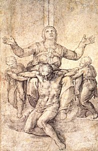

  
[Intangible Textual Heritage](../../index)  [Christianity](../index) 

------------------------------------------------------------------------

[Buy this Book at
Amazon.com](https://www.amazon.com/exec/obidos/ASIN/B002A7WEK0/internetsacredte)

------------------------------------------------------------------------

<table width="75%">
<colgroup>
<col style="width: 50%" />
<col style="width: 50%" />
</colgroup>
<tbody>
<tr class="odd">
<td width="50%" data-valign="TOP"> 
Michelangelo: Study for the Colonna Pieta (1538) [Public domain image]</td>
<td width="50%" data-valign="CENTER"><h1 id="the-dolorous-passion-of-our-lord-jesus-christ" data-align="CENTER">The Dolorous Passion of Our Lord Jesus Christ</h1>
<h2 id="anne-catherine-emmerich" data-align="CENTER">Anne Catherine Emmerich</h2>
<h4 id="section" data-align="CENTER">[1862]</h4></td>
</tr>
</tbody>
</table>

------------------------------------------------------------------------

[Contents](#contents)    [Start Reading](pjc00)    [Page
Index](pageidx)    [Text \[Zipped\]](pjc.txt.gz)

------------------------------------------------------------------------

|                                                                                                                           |
|---------------------------------------------------------------------------------------------------------------------------|
|  |

This is an account of the events leading up to the Crucifixion of Christ
by a 19th century German stigmatic and visionary, Anne Catherine
Emmerich. This once-obscure book recently achieved a much higher profile
because it was used as an inspiration for the screenplay of Mel Gibson's
controversial movie, The Passion of the Christ. A riveting 'you are
there' account of this pivotal event, the story is told with great
attention to small details, many not mentioned in the Gospels. This is
not a novelization; it is a recounting of Emmerich's ecstatic visions,
which were accompanied by painful and mysterious physical torments.
Emmerich was practically illiterate and this book was dictated by her,
which makes the fact that the narrative is so internally coherent all
the more compelling.

Some readers will note passages which by contemporary standards might be
considered anti-Semitic, particularly in the way that the Jewish
population is presented as having collective responsibility for the
death of Christ. Of course, without apologizing for this in the
slightest, it is to be noted that religious and secular institutions of
the time sanctioned anti-Semitism in one form or another, so this view
was not atypical. On the whole, however, the account considers each of
the numerous actors in the drama, Christian, Jewish, or Roman, as
individuals with particular motivations, strengths and weaknesses.

Emmerich was beatified on Sunday, October 3rd, 2004 by Pope John Paul
II, the final step before sainthood. Her feast day is the anniversary of
her death on February 9th, 1824.

------------------------------------------------------------------------

 [Title Page](pjc00)  
[Preface to the French Translation](pjc01)  
[Introduction](pjc02)  
[Life of Anne Catherine Emmerich](pjc03)  
[To the Reader](pjc04)  
[Mediation I. Preparations for the Pasch](pjc05)  
[Meditation II. The Supper-Room](pjc06)  
[Meditation III. Arrangements for eating the Paschal Lamb](pjc07)  
[Meditation IV. The Chalice used at the Last Supper](pjc08)  
[Meditation V. Jesus goes up to Jerusalem](pjc09)  
[Meditation VI. The Last Pasch](pjc10)  
[Meditation VII. The Washing of the Feet](pjc11)  
[Meditation VIII. Institution of the Holy Eucharist](pjc12)  
[Meditation IX. Private Instructions and Consecrations](pjc13)  

### The Passion

[Introduction](pjc14)  
[Chapter I. Jesus in the Garden of Olives](pjc15)  
[Chapter II. Judas and his Band](pjc16)  
[Chapter III. Jesus is arrested](pjc17)  
[Chapter IV. Means employed by the enemies of Jesus for carrying out
their designs against him](pjc18)  
[Chapter V. A Glance at Jerusalem](pjc19)  
[Chapter VI. Jesus before Annas](pjc20)  
[Chapter XVII. The Tribunal of Caiphas](pjc21)  
[Chapter VIII. Jesus before Caiphas](pjc22)  
[Chapter IX. The Insults received by Jesus in the Court of
Caiphas](pjc23)  
[Chapter X. The Denial of St. Peter](pjc24)  
[Chapter XI. Mary in the House of Caiphas](pjc25)  
[Chapter XII. Jesus confined in the subterranean Prison](pjc26)  
[Chapter XIII. The Morning Trial](pjc27)  
[Chapter XIV. The Despair of Judas](pjc28)  
[Chapter XV. Jesus is taken before Pilate](pjc29)  
[Chapter XVI. Description of Pilate's Palace and the adjacent
Buildings](pjc30)  
[Chapter XVII. Jesus before Pilate](pjc31)  
[Chapter XVIII. The Origin of the Way of the Cross](pjc32)  
[Chapter XIX. Pilate and his Wife](pjc33)  
[Chapter XX. Jesus before Herod](pjc34)  
[Chapter XXI. Jesus led back from the Court of Herod to that of
Pilate](pjc35)  
[Chapter XXI. The Scourging of Jesus](pjc36)  
[Chapter XXIII. Mary, during the Flagellation of our Lord](pjc37)  
[Chapter XXIV. Interruption of the Visions of the Passion by the
Appearance of St. Joseph under the form of a Child](pjc38)  
[Chapter XXV. Description of the personal Appearance of the Blessed
Virgin](pjc39)  
[Chapter XXVI. The Crowning with Thorns](pjc40)  
[Chapter XXVII. Ecce Homo](pjc41)  
[Chapter XXVIII. Reflections on the Visions](pjc42)  
[Chapter XXIX. Jesus condemned to be crucified](pjc43)  
[Chapter XXX. The Carriage of the Cross](pjc44)  
[Chapter XXXI. The first Fall of Jesus](pjc45)  
[Chapter XXXII. The second Fall of Jesus](pjc46)  
[Chapter XXXIII. Simon of Cyrene.--Third Fall of Jesus](pjc47)  
[Chapter XXXIV. The Veil of Veronica](pjc48)  
[Chapter XXXV. The fourth and fifth Falls of Jesus.--The Daughters of
Jerusalem](pjc49)  
[Chapter XXXVI. Jesus on Mount Golgotha.--Sixth and seventh Falls of
Jesus](pjc50)  
[Chapter XXXVII. The Departure of Mary and the holy Women of
Calvary](pjc51)  
[Chapter XXXVIII. The Nailing of Jesus to the Cross](pjc52)  
[Chapter XXXIX. Erection of the Cross](pjc53)  
[Chapter XL. Crucifixion of the Thieves](pjc54)  
[Chapter XLI. Jesus hanging an the Cross between two Thieves](pjc55)  
[Chapter XLII. First Word of Jesus on the Cross](pjc56)  
[Chapter XLIII. Eclipse of the Sun.--Second and third Word of Jesus on
the Cross](pjc57)  
[Chapter XLIV. The Fear felt by the Inhabitants of Jerusalem.--Fourth
Word of Jesus on the Cross](pjc58)  
[Chapter XLV. Fifth, sixth, and seventh Words of Jesus on the
Cross.--His Death](pjc59)  
[Chapter XLVI. The Earthquake.--Apparitions of the Dead in
Jerusalem](pjc60)  
[Chapter XLVII. The Request of Joseph of Arimathea to be allowed to have
the Body of Jesus](pjc61)  
[Chapter XLVIII. The Opening Of the Side of Jesus.--Death of the two
Thieves](pjc62)  
[Chapter XLIX. A Description of some Parts of ancient
Jerusalem](pjc63)  
[Chapter L. The Descent from the Cross](pjc64)  
[Chapter LI. The Embalming of the Body of Jesus](pjc65)  
[Chapter LII. The Body of our Lord placed in the Sepulchre](pjc66)  
[Chapter LIII. The Return from the Sepulchre.--Joseph of Arimathea is
put in Prison](pjc67)  
[Chapter LIV. On the Name of Calvary](pjc68)  
[Chapter LV. The Cross and the Wine-press](pjc69)  
[Chapter LVI. Apparitions on Occasion of the Death of Jesus](pjc70)  
[Chapter LVII. Guards are placed around the Tomb of Jesus](pjc71)  
[Chapter LVIII. A Glance at the Disciples of Jesus on Holy
Saturday](pjc72)  
[Chapter LIX. A detached Account of the Descent into Hell](pjc73)  
[Chapter LX. The Eve of the Resurrection](pjc74)  
[Chapter LXI. Joseph of Arimathea miraculously set at large](pjc75)  
[Chapter LXII. The Night of Resurrection](pjc76)  
[Chapter LXIII. The Resurrection of our Lord](pjc77)  
[Chapter LXIV. The holy Women at the Sepulchre](pjc78)  
[Chapter LXV. The Relation which was given by the Sentinels who were
placed around the Sepulchre](pjc79)  
[Chapter LXVI. The End of the Lenten Meditations](pjc80)  

### Appendix

[Detached Account of Longinus](pjc81)  
[Detached Account of Abenadar](pjc82)  
