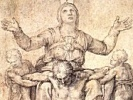

  
[Intangible Textual Heritage](../../index)  [Christianity](../index) 
[Index](index)  [Next](pjc01) 

------------------------------------------------------------------------

[Buy this Book at
Amazon.com](https://www.amazon.com/exec/obidos/ASIN/B002A7WEK0/internetsacredte)

------------------------------------------------------------------------

  
*The Dolorous Passion of Our Lord Jesus Christ*, by Anne Catherine
Emmerich, \[1862\], at Intangible Textual Heritage

------------------------------------------------------------------------

# The Dolorous Passion of Our Lord Jesus Christ

##### From the Meditations of

## Anne Catherine Emmerich

#### London, Burns and Lambert

#### \[1862\]

###### Scanned, proofed and formatted at Intangible Textual Heritage, September, 2004, by John Bruno Hare. This text is in the public domain in the United States because it was published prior to 1923.

------------------------------------------------------------------------

[Next: Preface to the French Translation](pjc01)
