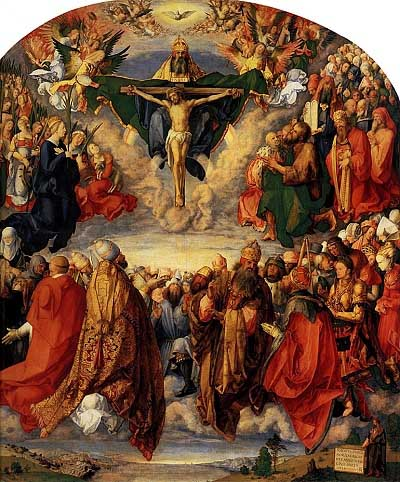

  
[Intangible Textual Heritage](../../index)  [Christianty](../index) 

------------------------------------------------------------------------

[Buy this Book at
Amazon.com](https://www.amazon.com/exec/obidos/ASIN/B00295S01A/internetsacredte)

------------------------------------------------------------------------

<table width="75%">
<colgroup>
<col style="width: 50%" />
<col style="width: 50%" />
</colgroup>
<tbody>
<tr class="odd">
<td width="50%" data-valign="TOP"> 
Adoration of the Trinity, Alberecht Duerer [1511] (Public Domain Image)</td>
<td width="50%" data-valign="CENTER"><h1 id="pageant-of-the-popes" data-align="CENTER">Pageant of the Popes</h1>
<h2 id="by-john-farrow" data-align="CENTER">by John Farrow</h2>
<h4 id="section" data-align="CENTER">[1942]</h4></td>
</tr>
</tbody>
</table>

------------------------------------------------------------------------

[Contents](#contents)    [Start Reading](ptp00)    [Page
Index](pageidx)    [Text \[Zipped\]](ptp.txt.gz)

------------------------------------------------------------------------

|                                                                                                                           |
|---------------------------------------------------------------------------------------------------------------------------|
|  |

This book contains a continuous history of the Papacy from the first
century up to the mid-20th, when it was written. The original book has
no chapter heads: the breakdown by century was added here. Farrow names
every pope and provides extensive background on them. There are good
popes, not a few bad popes, anti-popes (at one time there were three
claimants to the throne), some popes who reigned less than a week, and
numerous popes of humble origin.

The author is not afraid to confront the low points of papal history.
Some of the medieval popes lived like Asian despots, and even had harems
of concubines. The Renaissance popes, particularly the Borgias, raised
nepotism to a high art, while they brought high art into the Vatican. In
the 20th century successive Popes made open pacts with both Mussolini
and Hitler. Farrow, a devout and very conservative Catholic, points out
that the institution has endured and grown for two millennia, in spite
of the uneven quality of the popes themselves.

The book is full of interesting facts. For instance, the pope was not
declared infallible until a conclave in 1869. Napoleon imprisoned Pius
VI, and almost got him to sign over the Vatican to France. There was
only one English pope, Adrian IV, but quite a few French pontiffs. There
were a number of popes who were related, including fathers and sons.
Also of note is a useful [chronological table](ptp21) at the end which
lists every pope from St. Peter to Pius XII.

Production notes: The illustrations from this book were damaged by
cumulative exposure to environmental light (in the parlance of book
dealers, it was 'sunned'). I have attempted to bring out the details in
them by image processing. These are the best available images. --J. B.
Hare, 12 Mar 2008.

------------------------------------------------------------------------

 [Title Page](ptp00)  
[First Century](ptp01)  
[Second Century](ptp02)  
[Third Century](ptp03)  
[Fourth Century](ptp04)  
[Fifth Century](ptp05)  
[Sixth Century](ptp06)  
[Seventh Century](ptp07)  
[Eighth Century](ptp08)  
[Ninth Century](ptp09)  
[Tenth Century](ptp10)  
[Eleventh Century](ptp11)  
[Twelfth Century](ptp12)  
[Thirteenth Century](ptp13)  
[Fourteenth Century](ptp14)  
[Fifteenth Century](ptp15)  
[Sixteenth Century](ptp16)  
[Seventeenth Century](ptp17)  
[Eighteenth Century](ptp18)  
[Nineteenth Century](ptp19)  
[Twentieth Century](ptp20)  
[List of Popes](ptp21)  
[Index](ptp22)  
