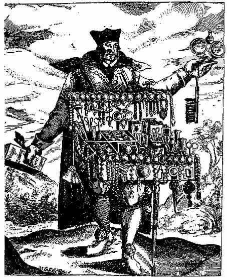

[Sacred-Texts](../../index) [Christianity](../index)

------------------------------------------------------------------------

<table data-align="center" width="75%">
<colgroup>
<col style="width: 50%" />
<col style="width: 50%" />
</colgroup>
<tbody>
<tr class="odd">
<td style="text-align: center;"> 
from a caricature of 1664</td>
<td><h1 id="angelus-silesius" data-align="center">Angelus Silesius</h1>
 

<h3 id="section" data-align="center">[1624-1677]</h3></td>
</tr>
</tbody>
</table>

------------------------------------------------------------------------

Angelus Silesius was a German mystic of the Counter-Reformation. He was
born and baptized Johannes Scheffler in 1624 in the province of Silesia.
In 1653, he converted to Catholicism from Lutheranism and spent the rest
of his life avidly trying to reconvert the people of Silesia. Today,
however, he is known primarily for his mystical poetry, which was cast
primarily in the form of 'Alexandrines', which are simple rhymed
couplets. Of course, they lose much in translation, and many seem quite
naïve, but the depth of feeling cannot be denied, and many more can be
seen to approach haiku and other short, mystical poetry from around the
world.

------------------------------------------------------------------------

[Angelus Silesius: Selections from *The Cherubinic
Wanderer*](scw/index), trans. with intro. by J. E. Crawford Flitch
\[1932\]  
[Alexandrines: translated from the "Cherubinischer Wandersmann" of
Angelus Silesius](alex/index), Julia Bilger \[1944\]  
   
[Angelus Silesius](../../journals/oc/pc-as), Paul Carus (OC vol. XXII,
5, pp. 291-297) \[1908\]  
