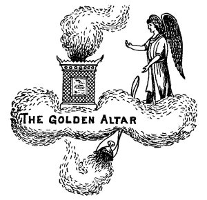

  
[Intangible Textual Heritage](../../index)  [Christianity](../index) 
[Revelation](../../bib/kjv/rev)  [Index](index)  [Previous](tbr035) 
[Next](tbr037) 

------------------------------------------------------------------------

### THE GOLDEN CENSER.

Rev. 8:2-5.

"And I saw the **SEVEN ANGELS** which stood before God; and to them were
given **SEVEN TRUMPETS**. And **ANOTHER ANGEL** came and stood at the
**ALTAR** (The Golden Incense Altar), having a **GOLDEN CENSER**; and
there was given unto him much **Incense**, that he should offer it with
the prayers of all saints upon the **GOLDEN ALTAR** which was **before
the Throne**. And the **smoke of the Incense**, which came with the
prayers of the saints, ascended up before God out of the Angel's hand.
And the Angel took the **CENSER** and **FILLED IT WITH FIRE OF THE
ALTAR**, and cast it **INTO THE EARTH**; and there were **VOICES**, and
**THUNDERINGS**, and **LIGHTNINGS**, and an **EARTHQUAKE**."

p. 69

   
The Golden Altar

Following the **SILENCE** in Heaven John saw "**SEVEN ANGELS**" of
official importance, for they stand in the presence of God, to whom
"**SEVEN TRUMPETS**" were given. Trumpets are used to call to war, to
worship, for the convocation of the people, to proclaim Festivals, as
the Year of Jubilee, the Feast of Tabernacles, and for Judgments. Ex.
19:16. Amos 3:6. Joshua 6:13-16. Zeph. 1:14-16. These "Seven Angels"
**prepared** themselves to sound. That is, they took the Trumpets that
were handed them and took up their positions where they could in turn
sound their Trumpets. But before the Trumpets were sounded John saw
**ANOTHER ANGEL** with a "**GOLDEN CENSER**" in his hand come and stand
before the "Golden Incense Altar." The name of this "Angel Priest" is
not given, and it is useless to speculate as to who he was. Some claim
it was Christ, because He is our "Great High Priest," but that is
immaterial. We are told that he was given much incense, and that he
offered with it the prayers of the "**ALL SAINTS**." These Saints were
the Saints of the Tribulation period, and their prayers were for
deliverance from their enemies. This will account for the remarkable act
of the "Angel Priest" of filling the Censer with **FIRE FROM OFF THE
ALTAR**, and casting it **on to the earth**, the effect of which was
seen in the **VOICES** and **THUNDERINGS**, that broke the **SILENCE**
of Heaven, and the **LIGHTNINGS** and **EARTHQUAKE** on the Earth. As
the same four things happen when the "Seventh Trumpet" sounds (Rev.
11:19), and the "Seventh Vial" is poured out, it is clear that the
"Seventh Seal," the "Seventh Trumpet," and the "Seventh Vial," all end
alike, and synchronize as to their ending, that is, all end at the
**same time**, the "**end of the Week**." The Judgments that follow on
the Earth as the Trumpets sound, and the Vials are poured out, are the
answers to the prayers of the Saints for vengeance on their enemies.

------------------------------------------------------------------------

[Next: First Trumpet (Hail--Fire--Blood)](tbr037)
