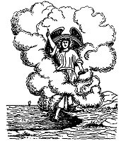

  
[Intangible Textual Heritage](../../index)  [Christianity](../index) 
[Revelation](../../bib/kjv/rev)  [Index](index)  [Previous](tbr044) 
[Next](tbr046) 

------------------------------------------------------------------------

p. 80

# The Interval Between the Sixth and Seventh Trumpets.

### 1. THE LITTLE BOOK.

Rev. 10:1-11.

 

"And I saw another '**MIGHTY ANGEL**' come down from Heaven, **clothed
with a cloud**: and a **Rainbow was upon His head**, and His **face was
as it were the Sun**, and His **feet as Pillars of Fire**: and He had in
His hand a **'LITTLE BOOK' open**: and He set His **right foot** on the
**SEA**, and His **left foot** on the **EARTH**, and cried with a loud
voice, as when a lion roareth: and when He had cried '**SEVEN
THUNDERS**' uttered their voices. And when the '**SEVEN THUNDERS**' had
uttered their voices, I was about to write: and I heard a voice from
Heaven saying unto me, **Seal up those things which the SEVEN THUNDERS
uttered, and write them not**. And the '**ANGEL**' which I saw stand
upon the sea and upon the earth lifted up His hand to Heaven, and swear
by Him that **LIVETH FOREVER AND EVER**, who created heaven, and the
things that therein are, and the earth, and the things that therein are,
and the sea, and the things which are therein, that there should be
**TIME NO LONGER**: but in the days of the voice of the '**SEVENTH
ANGEL**,' when he shall **begin to sound**, the '**MYSTERY OF GOD'
SHOULD BE FINISHED**, as He hath declared to His servants the Prophets.
And the voice which I heard from Heaven spake unto me again, and said,
Go and take the '**LITTLE BOOK**' which is open in the hand of the
'**ANGEL**' which standeth upon the sea and upon the earth. And I went
unto the '**ANGEL**,' and said unto him, Give me the '**LITTLE BOOK**.'
And he said unto me, Take it, and **eat it up**; and it shall make thy
**belly bitter**, but it shall he in thy **mouth sweet as honey**. And I
took the '**LITTLE BOOK**' out of the '**ANGEL'S**' hand, and **ate it
up**; and it was in my **mouth sweet as honey**; and as soon as I had
eaten it, my **belly was bitter**. And He said unto me, Thou must
prophesy again before many peoples, and nations, and tongues, and
kings."

p. 81

Who this "**MIGHTY ANGEL**" is we do not know unless he be Christ
Himself. In the Old Testament the Son of God was called the "**ANGEL OF
THE LORD**" (Ex. 3:2-18), and as we are now in that part of the Book of
Revelation that deals mainly with Israel it is nothing less than what we
should expect to hear, Christ spoken of as a "**MIGHTY ANGEL**." Then
the description of this "**MIGHTY ANGEL**" seems to point to the same
Person that John saw standing amid the "Lampstands" in chapter 1:12-16,
or Christ Himself. The "**ANGEL**" was clothed in a **CLOUD**, there was
a **RAINBOW** upon His head, His face was as it were the **SUN**, and
His feet as **PILLARS OF FIRE**. No mere angel was ever before or since
described in the Scriptures as appearing like that. Then He is described
as crying with a **loud voice**, as a **lion roareth**, and Christ is
spoken of in this Book (Rev. 5:5) as "**THE LION OF THE TRIBE OF
JUDAH**"; and in the chapter that follows this the same "**MIGHTY
ANGEL**" speaks of the "**Two Witnesses**," as "**MY WITNESSES**," which
is further indisputable evidence that this "**MIGHTY ANGEL**" is no
other than Christ Himself. This interpretation makes clear what follows.
For when this "**MIGHTY ANGEL**" places His right foot upon the sea, and
His left foot on the earth, and swears that there shall be "**TIME NO
LONGER**," or "**NO LONGER DELAY**" (margin), it is Christ taking formal
possession of the Earth and Sea, and declaring that there shall be **no
longer delay** in dispossessing the false claimant Satan.

When the "**MIGHTY ANGEL**" cried with a **loud voice**, John heard
"**SEVEN THUNDERS**" utter their voices. These "**THUNDERS**" spoke, for
John heard what they said, and as he had been commanded to write what he
should see and hear, he proceeded to write what the "voices" of the
"**SEVEN THUNDERS**" uttered, but he was told to "**seal up those things
which the 'SEVEN THUNDERS' uttered, and write them not**." What they
said has never as yet been revealed, but doubtless will be when the time
comes to make the revelation.

John was then told to--"Go, take the '**LITTLE BOOK**' which is open in
the hand of the '**ANGEL**' which standeth upon the sea and upon the
earth." John was at this time back again on the earth. And when John
took the "**LITTLE BOOK**," the "**ANGEL**" said to him--"Take, and
**eat it up**; and it shall make thy **belly bitter**, and it shall be
in thy **mouth sweet as honey**." And when John had **eaten** the
"**BOOK**" it was as the "**ANGEL**" had said, sweet to his mouth and
bitter to his stomach.

What was this "**LITTLE BOOK**"? Some claim that it was the "**SEVEN
SEALED BOOK**," now open, and therefore the "**TITLE DEED**" to the
Earth, and that the "**MIGHTY ANGEL**" held it in His hand, as He stood
with one foot on the sea and one foot on the earth, as His authority for
claiming possession. But the "**ANGEL**" does not make that use of it,
and if it were His "**TITLE DEED**" to the Earth it seems a strange
procedure for Him to give it to John to **eat**. Then it is described as
a "**LITTLE BOOK**," as if its contents were small. In that respect it
stands in marked contrast with the "**SEVEN SEALED BOOK**" whose

p. 82

numerous "Seals" and the time taken to break them, imply that it was of
considerable size. Then the effect upon John of the eating of the
"**LITTLE BOOK**" seems to indicate that it was more than a "Title
Deed." For it contained matter that when John first **ate it** (glanced
over it) was **sweet as honey to his mouth**, but when he had thoroughly
digested its contents was **bitter to his belly**. In other words the
"**LITTLE BOOK**" contained matter connected with John's work as a
Prophet, for the "**ANGEL**" immediately said to him--"Thou must
prophecy again before many peoples, and nations, and tongues, and
kings," which for ought we know John did.

This "**LITTLE BOOK**," here open, is probably the "**BOOK**" that
Daniel was told to "**SEAL UP**." Dan. 12:4, 9. That "Book" contained
things that were not to be revealed until the "**TIME OF THE END**." Not
the "**End Of Time**," but the "**End**" of the "**TIMES OF THE
GENTILES**," which synchronizes with the last **half** of Daniel's
"**SEVENTIETH WEEK**," and therefore with "**THE GREAT TRIBULATION
PERIOD**." If this supposition be true, then the "**LITTLE BOOK**" was a
foreview of the things that are to befall Daniel's People in the last
half of Daniel's "**SEVENTIETH WEEK**." The effect on John of reading
the "**LITTLE BOOK**" seems to confirm this view, for as he read of the
deliverances that were to come to his people, and of the final victory
of the Lamb, and the setting up of "The Kingdom," the "Book" was as
"**sweet as honey**" to his taste, but when he meditated upon the awful
sufferings that would come upon the world, and upon the Jews, under the
reign of the "**BEAST**" (Antichrist), and during the pouring out of the
"**VIALS**," it was **bitterness to his soul**.

**THE FINISHED MYSTERY**.

When the "**SEVENTH TRUMPET ANGEL**" shall **begin** to sound the
**"MYSTERY OF GOD" shall be finished**. This is not the "**Mystery of
the Church**" for that was finished by the taking out of the Church in
chapter four. That "Mystery" was unknown to the Prophets. The "**MYSTERY
OF GOD**" is the "Mystery" of why God permitted Satan to cause the "Fall
of Man" and thus bring sin, and misery, and death into the world. To the
Old Testament Prophets God revealed the fact that in His own good time
He would make clear this "**MYSTERY**," and when the "**SEVENTH
TRUMPET**" (that includes all that happens from chapter 11:15) sounds,
the "**MYSTERY OF GOD**" will be **finished**, for then the "**MYSTERY
of INIQUITY**" (Antichrist, 2. Thess. 2:6-10) will be revealed, in whom
Satan will incarnate himself after he is cast out of Heaven, and in his
destruction, and the "Binding of Satan," and the setting up of the
"Millennial Kingdom" of Christ, shall be fulfilled the promises to the
Prophets, that peace and righteousness shall reign on the earth. And
when, as the result of the "Renovation of the Earth by Fire," the
redeemed human race shall take up its abode upon a redeemed and restored
earth, and sin and rebellion shall forever be destroyed, the "**MYSTERY
OF GOD**," or why sin was permitted to wreck this world, will be
finished.

------------------------------------------------------------------------

[Next: 2. The Two Witnesses](tbr046)
