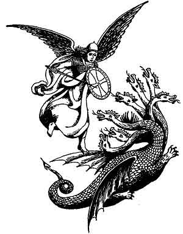

  
[Intangible Textual Heritage](../../index)  [Christianity](../index) 
[Revelation](../../bib/kjv/rev)  [Index](index)  [Previous](tbr050) 
[Next](tbr052) 

------------------------------------------------------------------------

p. 95

### 4. THE ARCHANGEL.

### (War In Heaven.)

Rev. 12:7-12.

 

"And there was '**WAR IN HEAVEN**': **MICHAEL and his angels** fought
against the **DRAGON**: and the **DRAGON** fought **and his angels**,
and prevailed not: neither was their place found any more in Heaven. And
the **GREAT DRAGON was cast out**, that old **SERPENT**, called the
**DEVIL**, and **SATAN**, which deceiveth the whole world: he was cast
out **into the earth**, and his angels were cast out with him. And I
heard a loud voice saying in Heaven, Now is come **salvation**, and
**strength**, and the **Kingdom of God**, and the **power of His
Christ**: for the **ACCUSER OF OUR BRETHREN IS CAST DOWN**, which
accused them before our God day and night. And they **overcame him**
(the Dragon) by the **BLOOD OF THE LAMB**, and by the **WORD OF THEIR
TESTIMONY**; and they loved not their lives unto the death (Martyr's
Death). Therefore rejoice, ye heavens, and ye that dwell in them. Woe to
the **INHABITERS OF THE EARTH AND OF THE SEA!** for the **DEVIL** is
come down unto you, having **great wrath**, because he knoweth that he
hath but a **SHORT TIME**." (3½ years.)

p. 96

The "**WAR IN HEAVEN**" is started by the attempt to **expel** the
**DRAGON** and his angels **From the Heavenlies**. That the **DRAGON**
(Satan) and his angels were not cast out of Heaven at the time of his
"**Rebellion**" (which antedates the present earth), and confined in
some "prison house," is clear, for he was at liberty to visit the Garden
of Eden and tempt Adam and Eve, and he had access to God in Heaven in
the days of Job, 2000 years before Christ (Job 1:1; 2:8), and he was
free to visit the earth in Christ's day and tempt Him in the Wilderness,
and later to sift Peter. His origin is more or less shrouded in mystery,
but one thing is certain, he is a "created being," and that of the most
exalted type. He was before his rebellion "**The Anointed Cherub That
Covereth**." That is, he was the guardian or protector of the "Throne of
God." He was perfect in all his ways from the day that he was created
until iniquity was found in him. In him was the "**fulness of wisdom**,"
and the "**perfection of beauty**," but it was his "**beauty**" that
caused the **pride** (1. Tim. 3:6) that was his downfall. He was clothed
in a garment that was covered with the most rare and precious gems, the
sardius, topaz, diamond, beryl, onyx, jasper, sapphire, emerald,
carbuncle, all woven in with gold. He dwelt in Eden, the Garden of God.
This probably refers not to the earthly Eden, but to the "Paradise of
God" on high, for Satan dwelt on the "Holy Mount of God." All this we
learn from Ezek. 28:11-19, where the Prophet has a "foreview" of the
Antichrist under the title of the "King of Tyrus," and as Antichrist
when he becomes the "**Beast**" is to be an incarnation of Satan, the
Prophet here describes Satan's original glory from which he fell, for
there has never as yet been such a King of Tyrus as here described. The
cause of Satan's rebellion, or fall, is given in Isa. 14:12-20. He is
there called "**LUCIFER, SON OF THE MORNING**." This was his glorious
title when he was created, and this world of ours was made, at which
time--"The '**Morning Stars**' (probably other glorious created ruling
beings like himself), sang together, and all the '**Sons of God**'
(angels) shouted for joy." Job 38:7.

It is well to note that the one here called "**LUCIFER**," is in verse
four (Isa. 14:4), also called the "**King of Babylon**." As there never
has been a King of Babylon like the one here described, the description
must be that of a **future** King of Babylon. And as "Antichrist" is to
have for his Capital City Babylon rebuilt, this is probably a "foreview"
by the Prophet of Antichrist as indwelt by "**LUCIFER**" (Satan) in that
day when he shall be King of Babylon, and also King of Tyrus.

The common notion is that Satan and his angels are imprisoned in Hell.
This is not true. The angels described in 2. Pet. 2:4, and Jude 6, as
having left their "**first estate**," and being "**reserved in
everlasting chains under darkness**," are not Satan's angels. They are a
special class of angels, spoken of as "Sons of God," whose sin of
marrying the "Daughters of Men" caused the Flood. Gen. 6:1-8. They are
the "Spirits in Prison" of whom Peter speaks in 1. Pet. 3:18-20. They
are now confined in "Tartarus" awaiting the "Great White Throne"
Judgment. Jude 6. As this Book of Revelation that we are now studying is
a prophecy of "**Things To Come**" that were

p. 97

**future** in the Apostle John's day, and it declares that Satan was
still in the Heavenlies at that time, A. D. 96, as he has not been cast
out since he must still be there.

He is a great "**Celestial Potentate**." He is the "**PRINCE OF THE
POWERS OF THE AIR**" (Eph. 2:2), and the "**GOD OF THIS WORLD**." 2.
Cor. 4:4. He is the "God" not of the earth, for that belongs to its
Maker--**GOD**. "The earth is the Lord's and the fulness thereof." He is
the "God" of the "**WORLD SYSTEMS**" of the habitable earth. These
"**World Systems**" embrace business, society, politics, and religion.
He is the Ruler of the "Powers of Darkness" of the "Spirit World" (Eph.
6:11-12), and his position is so exalted that even Michael the Archangel
dare not insult him. Jude 9. So mighty is he that man cannot
successfully resist him without Divine help.

Satan is a **King**, and has a **KINGDOM**. Of it Christ said--"If Satan
cast out Satan he is divided against himself; how then shall his
'**KINGDOM**' stand"? (Matt. 12:24-30.) Speaking of the "Evil Powers"
Paul wrote--"We wrestle not against flesh and blood, but against
'**Principalities**,' against '**Powers**,' against the '**Rulers of
Darkness Of This World**' (Age), against '**Spiritual Wickedness**' in
**HIGH PLACES**" (the Heavenlies). Eph. 6:12. From this we see that
Satan's Kingdom consists of "**Principalities**," "**Powers**," "**Age
Rulers of Darkness**," and "**Wicked Spirits**" in the Heavenlies. These
"Principalities" are ruled by "Princes" who control the nations of the
earth as in the days of Daniel the Prophet, when a Heavenly Messenger
was sent to Daniel, but was hindered "three weeks" from reaching him by
the "**Prince of the Kingdom of Persia**," Satan's ruling "Prince of
Persia," until Michael the Archangel came to his rescue. Dan. 10:10-14.

The opposing "Commanders in Chief" of the "War in Heaven" will be
**MICHAEL** and the **DRAGON** (Satan). We are first introduced to
Michael in the Book of Daniel, and his appearance here is a confirmation
that this part of the Book of Revelation is Jewish, and a continuation
or supplement to the Book of Daniel. Michael is called in the Book of
Daniel "**one of the CHIEF PRINCES**" (Dan. 10:13), "**YOUR PRINCE**"
(Dan. 10:21), and the "**GREAT PRINCE WHICH STANDETH FOR THY PEOPLE**."
Dan. 12:1. That is, Michael has been chosen from among the "Chief
Princes" that stand before God, to be the protector of Daniel's People,
the Jews. In Jude 9 he is called the "**ARCHANGEL**," and as there is
but one "Archangel" spoken of in the Bible, Michael must be he. He also
has something to do with the resurrection of the dead, for he is
associated with the "Resurrection" mentioned in Dan. 12:1-2, and he
contested with the Devil the resurrection of Moses (Jude 9), and the
"**Voice**" of the Archangel that will be heard when the "Dead in
Christ" shall rise (1. Thess. 4:16), will be the "voice" of **MICHAEL**.

When the "Dragon" is cast out of the "Heavenlies" there will be great
rejoicing in Heaven because the "**Accuser**" of Christ's "**Brethren**"
(the Jews) is cast down, but there will be "**woe**" for the
"**inhabitants of the earth**," for the "Dragon" will be filled with
"**great wrath**" because he knows that he will have but a "**short
time**" (3½

p. 98

years) to vent his wrath on the inhabitants of the earth before he is
chained and cast into the Bottomless Pit.

While Satan has been the "Accuser of the Brethren" in all Ages, the
context shows that reference is here made to the "**Jewish Remnant**"
(the brethren of Christ), who during the first 3½ years of the
"Tribulation Period" pass through great persecution, and die as
"martyrs." They are referred to in Rev. 6:9-11 as the "**souls of them
that were slain for the Word of God**," and we are here told (Rev.
12:11) that they overcame by the "**Blood of the Lamb**," and the
"**Word of their Testimony**," and died as "martyrs," for they "**loved
not their lives unto the death**." As they overcame by the "**Blood Of
The Lamb**," then the "**TIME**" of their overcoming must be subsequent
to the shedding of Christ's blood on Calvary, that is, Satan according
to this account, could not have been cast out of the "Heavenlies" prior
to the Crucifixion of Christ. When Jesus said--"I beheld Satan as
lightning **fall from heaven**" (Luke 10:18), He was not referring to
some past fall of Satan, but it was a prophetic utterance, by way of
anticipation, of his **future fall**, when he shall be hurled headfirst
out of Heaven by Michael the Archangel. As further evidence as to the
**time** of Satan's casting out, Daniel the Prophet tells us that it
will be at the "**Time of Trouble**" that is to come upon Daniel's
People, the Jews, and that "**Time of Trouble**" is the "**GREAT
TRIBULATION**." At that **time** Michael shall "**stand up**" to deliver
Daniel's People, and the result will be "**WAR IN HEAVEN**" and Daniel's
People shall be delivered, not from the "Great Tribulation," but out of
it.

When the Dragon and all the Principalities and Powers of evil that now
occupy the "Middle Heaven" of the Heavenlies, that is, the Heaven
between the atmosphere of our earth, and the "Third Heaven" where God
dwells, are cast out and down, then the Heavens will be **CLEAN**, for
they are not now clean in God's sight. Job 15:15. And as all these "Evil
Powers" will doubtless be imprisoned during the Millennium, with Satan,
the Heavens will be **CLEAN** during that period, and this will account
for the universal rule of righteousness and peace of those days.

------------------------------------------------------------------------

[Next: The Persecution of the ''Sun Clothed Woman''](tbr052)
