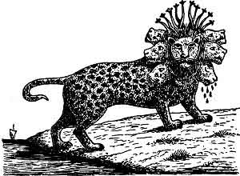

  
[Intangible Textual Heritage](../../index)  [Christianity](../index) 
[Revelation](../../bib/kjv/rev)  [Index](index)  [Previous](tbr053) 
[Next](tbr055) 

------------------------------------------------------------------------

p. 103

### 6. THE BEAST OUT OF THE SEA.

### The Incarnation Of "The Dragon," "The Anti-God." In "The Beast" Or "Anti-Christ."

Rev. 13:1-10.

 

"And I (**He**, the Dragon, R. V.) stood upon the sand of the sea and
(I) saw a '**BEAST**' rise up out of the **SEA** having '**SEVEN
HEADS**' and '**TEN HORNS**,' and upon his horns '**TEN CROWNS**,' and
upon his heads the name of **BLASPHEMY**. And the '**BEAST**' which I
saw was like a **LEOPARD**, and his **feet** were as the **feet of a
BEAR**, and his **mouth** as the **mouth of a LION**: and the
'**DRAGON**' gave him his **POWER**, and his **SEAT** (Throne), and
**GREAT AUTHORITY**. And I saw **one of his HEADS** as it were **wounded
to death**: and his deadly wound **was healed**: and **all the world
wondered after the 'BEAST.'** And they **worshipped** the '**DRAGON**'
which gave power unto the '**BEAST**,' and they **worshipped the
'BEAST,'** saying, **Who is like unto the 'BEAST'?** **Who is able to
make war with him?** And there was given unto him a mouth **speaking
great things and blasphemies**; and power was given unto him to continue
**forty and two months**. And he opened his mouth in **blasphemy against
God**, to **blaspheme His name**, and **His Tabernacle**, and **them
that dwell in Heaven**. And it was given unto him to **make war with the
saints, and to overcome them**: and power was given him over **all
kindreds**, and **tongues**, and **nations**. And **all that dwell upon
the earth shall WORSHIP HIM**, whose names are **not written** in the
'**BOOK OF LIFE**' of the Lamb slain from the foundation of the world.
If any man have an ear, let him hear. He that leadeth into captivity
shall go into captivity: he that killeth with the sword must be killed
with the sword. Here is the patience and the faith of the saints."

John next saw the "**Dragon**" standing on the seashore, and as he
stood, a "**Beast**" rose up out of the sea having "**SEVEN HEADS**" and
"**TEN HORNS**," and upon his "**Horns**" "**TEN CROWNS**," and upon his
"**Heads**" the name of **BLASPHEMY**, and the body of the "**Beast**"
was like a **LEOPARD**, and his **feet** were as the **feet of a BEAR**,
and his **mouth** as the **mouth of a LION**, and the "**DRAGON**"

p. 104

gave him his **POWER**, and his **SEAT** (Throne), and **GREAT
AUTHORITY**. This does not necessarily mean that the "Dragon" gave him
his **own throne**, but he gave him **power**, and **a throne**, and
**great authority**. As John was back on the Isle of Patmos, the "sea"
from which he saw the "**Beast**" arise was probably the Mediterranean,
though the "sea" in prophecy signifies the nations.

What does this "**COMPOSITE BEAST**" signify? This is not the first time
we have read in the Scriptures of a "**Beast**" coming up out of the
sea, so we must go back to the Book of Daniel for an explanation. While
Daniel was a Statesman and did not hold the "Prophetic Office," he had
the "Prophetic Gift," and was not only an interpreter of dreams, but a
Prophet, and to him was revealed the whole course of the "Times of the
Gentiles," and the character of its last "Great Leader" the
"**ANTICHRIST**." His prophecy is mainly concerned with the things that
shall befall his people, the Jews, in the "**LATTER DAYS**" (Dan.
10:14), and as we are now dealing with the things that shall come to
pass in the "Last" or "Seventieth Week," of Daniel's "Seventy Weeks," we
necessarily must turn back to the Book of Daniel for an explanation of
this symbol of the "**BEAST**." But before we take .that up it is
important to note that both the Old and New Testaments speak of a

"**MYSTERIOUS AND TERRIBLE PERSONAGE**"

who shall be revealed in the "Last Times." He is called by various
names.

**In The Old Testament**

"**The Assyrian**."--Isaiah 10:5-6; 30:27-33.  
"**King of Babylon**."--Isaiah 14:4.  
"**Lucifer**."--Isaiah 14:12.  
"**The Little Horn**."--Daniel 7:8; 8:9-12.  
"**A King Of Fierce Countenance**."--Dan. 8:23.  
"**The Prince That Shall Come**."--Dan. 9:26.  
"**The Wilful King**."--Dan. 11:36.

**In The New Testament**

"**The Man Of Sin**."--2. Thess. 2:3-8.  
"**Son Of Perdition**."--2. Thess. 2:3-8.  
"**That Wicked**."--2. Thess. 2:3-8.  
"**Antichrist**."--1. John 2:18.  
"**The Beast**."--Rev. 13:1-2.

Jesus also made a prophetic reference to him. "I am come in my
**Father's Name**, and ye receive me not; if another shall come in **his
own name**, him ye will receive." John 5:43.

------------------------------------------------------------------------

[Next: I. Isaiah's Foreview](tbr055)
