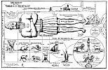

  
[Intangible Textual Heritage](../../index)  [Christianity](../index) 
[Revelation](../../bib/kjv/rev)  [Index](index)  [Previous](tbr055) 
[Next](tbr057) 

------------------------------------------------------------------------

### II. DANIEL'S FOREVIEW.

#### 1. The Colossus.

We now turn to Daniel. The Book of Daniel may be divided into two parts.
The first six chapters are Historical, the last six are Prophetical. The
Book contains one "Dream" by Nebuchadnezzar, and four "Visions" by
Daniel, all relating to the "Times of the Gentiles." Nebuchadnezzar in
his "Dream" saw a "**Great Image**" or "**COLOSSUS**." The Head of the
"Image" was of fine **gold**, its Breast and Arms of **silver**, its
Belly (Abdomen) and Thighs (Hips) of **brass**, its Legs of **iron**,
and its Feet of **iron and clay**. This Image was destroyed by a
"**Stone**" cut out of a mountain supernaturally. The "**Stone**" in
turn became a great mountain and filled the **WHOLE EARTH**. Dan.
2:31-35. The four metals of which the "**COLOSSUS**" was composed
represented **Four Worldwide Empires** which were to arise in
succession. Dan. 2:37-40. Four great Empires, and only four, were to
succeed each other in the government of the world, from Nebuchadnezzar
(B. C. 606) to the "Second Coming" of Christ--the Babylonian,
Medo-Persian, Grecian, and Roman. These Empires are not only made known
as to **number**, but their **names**, in the **order of their
succession**, are given. The First--"**BABYLONIAN**" is indicated by
Daniel while interpreting the vision to Nebuchadnezzar. "**THOU** art
this **Head of Gold**." Dan. 2:38. The Second--the "**MEDO-PERSIAN**,"
Daniel points out in

p. 106

 

[  
Click to enlarge](img/10600.jpg)  
Antichrist and the ''Times of the Gentiles''  

 

p. 107

his account of "Belshazzar's Feast," by the emphatic words--"In that
night was Belshazzar the King of the Chaldeans slain, and Darius the
**MEDIAN took the Kingdom**." Dan. 5:30-31. The Third--the
"**GRECIAN**," is mentioned in Dan. 8:20-21, "the **Ram** which thou
sawest having '**two horns**' are the kings of Media and Persia, and the
'**Rough Goat**' is the **King of Grecia** (Greece)." The Fourth--the
"**ROMAN**," is referred to in Dan. 9:26 as--"the **PEOPLE** of the
'**Prince**' that should destroy the city (Jerusalem) and the
Sanctuary," and we know that it was the **ROMANS** under Titus, that
destroyed Jerusalem in A. D. 70. While these Four Great Empires were to
follow each other in the order named, they were not to follow without a
break. The Babylonian lasted from B. C. 606 to B. C. 538. The
Medo-Persian from B. C. 538 to B. C. 330. The Grecian from B. C. 330 to
B. C. 323. Then the Grecian was broken up into four parts, Thrace,
Macedonia, Syria, and Egypt, and the last of these was conquered by the
Romans in B. C. 30, and the Roman Empire lasted from B. C. 30 to A. D.
364, when it was divided into its Eastern and Western Divisions. Since
then there has been no leading world Empire, and cannot be according to
this prophecy until Christ sets up His "**STONE**" or "**Millennial
Kingdom**," as represented by the "**Stone**" that smites the
"**COLOSSUS**" on its **feet**, for this "**STONE KINGDOM**" is to fill
the **whole earth**, and thus be universal. This "**STONE**" cannot be
Christianity, for it does not fill the earth **by degrees**, and thus
**crowd out** the "**COLOSSUS**," but it at **One Blow DEMOLISHES IT**.
The action of the "**STONE**" is that of **JUDGMENT** not **Grace**, and
is **SUDDEN** and **CALAMITOUS**. Again the **TIME** of the destruction
is not until **after the formation of the Toes**, and we know that the
"**TWO LIMBS**" did not appear until A. D. 364, and the "**TEN TOES**"
have not yet developed. The **TIME** when the "**STONE**" falls on the
"**FEET**" we are told is "**in the days of THOSE KINGS**" (Dan. 2:44),
that is the Kings represented by the "**Ten Toes**," which as we shall
see corresponds with the "**Ten Horns**" of Daniel's "Fourth Wild
Beast," Dan. 7:7-8, and with the "**Ten Kings**" of John's "**Beast**."
Rev. 17:12. The first Four Kingdoms were **literal Kingdoms**, and so
must the "**Stone Kingdom**" be, for it is to take the place of those
Kingdoms and **fill the whole** earth. It represents therefore the
"Millennial Kingdom" of Christ, for He is the "**STONE**" of the
Scriptures. Matt. 21:44.

From what has been said we see that the "**COLOSSUS**" of
"Nebuchadnezzar's Dream" symbolized the "**World Kingdoms**" in their
**Unity** and **Historical Succession**. Gentile dominion is represented
by a huge "**METALLIC MAN**." The **degeneration** of the "World
Kingdoms" is seen in the diminishing **value** of the metals used.
Silver is worth less than gold, brass than silver, iron than brass, and
clay than iron. The **weight** of the "**COLOSSUS**" also declines; the
specific gravity of gold is 19.5, of silver 10.47, of brass 8, of
cast-iron 5, and of clay 1.93. The "**Colossus**" is **TOP HEAVY**. The
character of the governing power also **deteriorates** from an
"**Absolute Monarchy**" under Nebuchadnezzar, to an "**Autocratic
Democracy**" symbolized by the mixture of the **iron** and **clay** of
the

p. 108

\[paragraph continues\] **Feet**. In other words the governing power
passes from the **Head**, the organ that ought to direct the members of
the body, to the **Feet**, which are only made to carry the body whither
the Head directs. We have dwelt thus at length on the "Colossus," for it
is only as we understand it, that we can understand the meaning of the
"Wild Beasts" that Daniel saw come up out of the sea.

------------------------------------------------------------------------

[Next: 2. The Vision of the ''Four Beasts.''](tbr057)
