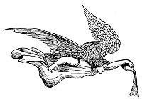

  
[Intangible Textual Heritage](../../index)  [Christianity](../index) 
[Revelation](../../bib/kjv/rev)  [Index](index)  [Previous](tbr066) 
[Next](tbr068) 

------------------------------------------------------------------------

p. 138

# The Seven Last Plagues or Vial Judgments.

 

Rev. 15:1.

"And I saw another **SIGN** in Heaven, great and marvellous, S**EVEN
ANGELS** having the '**SEVEN LAST PLAGUES**'; for in them is **filled
up** the **WRATH OF GOD**."

This is another "**SIGN**" or "**Wonder**." It was great and marvellous,
because it "**FILLED UP THE WRATH OF GOD**," that is, it **completed**
the pouring out of the **accumulated** "**WRATH OF GOD**."

------------------------------------------------------------------------

[Next: Prelude. The Sea of Glass](tbr068)
