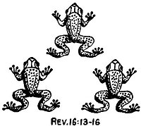

  
[Intangible Textual Heritage](../../index)  [Christianity](../index) 
[Revelation](../../bib/kjv/rev)  [Index](index)  [Previous](tbr075) 
[Next](tbr077) 

------------------------------------------------------------------------

### THE INTERVAL BETWEEN THE "SIXTH" AND "SEVENTH" VIALS.

### THREE UNCLEAN SPIRITS.

Rev. 16:13-16.

"And I saw **THREE UNCLEAN SPIRITS like frogs** come out of the mouth of
the 'Dragon,' and out of the mouth of the 'Beast,' and out of the mouth
of the 'False Prophet.' For they are the '**SPIRITS OF DEVILS**'
(Demons), working miracles, which go forth unto the 'Kings of the Earth'
and of the **whole world**, to gather them to the Battle of that 'Great
Day of God Almighty' (Armageddon). Behold I come as a thief. Blessed is
he that watcheth, and keepeth his garments, lest he walk naked, and they
see his shame. And he (they R. V.) gathered them together into a place
called in the Hebrew tongue Armageddon." (Har-Mageddon R. V.)

p. 145

 

   
REV. 16:13-16

 

Here we are told how the "Kings of the Earth" and their armies are to be
gathered for the "Battle of Armageddon." "**THREE UNCLEAN SPIRITS**"
like frogs, John does not say they were frogs, will come one out of the
mouth of the "Dragon," one out of the mouth of the "Beast," and one out
of the mouth of the "False Prophet." That they are not real frogs is
clear from their miracle working power. They are the "**SPIRITS OF
DEMONS**," working miracles, which go forth unto the "Kings of the
Earth," and of the whole world, to gather them to the "Battle of that
Great Day of God Almighty." They are the "**Seducing Spirits**" who go
forth preaching the "**DOCTRINE OF DEVILS**" in the "latter times" of
whom Paul warns Timothy. 1. Tim. 4:1. They are sent out by the
"**SATANIC TRINITY**," the "Dragon," the "Beast," and the "False
Prophet," on a **miracle working ministry**.

They are "**frog-like**" in that they come forth out of the pestiferous
quagmires of darkness, do their devilish work in the evening shadows of
"Man's Day," and creep, and croak, and defile, and fill the ears of the
nations with their noisy demonstrations, until they set the kings and
armies of the nations in enthusiastic commotion and movement toward the
Holy Land to crush out the effort to establish the Kingdom of Christ on
earth. We have an illustration of their method and purpose in the story
of the destruction of King Ahab. 1. Kings 22:20-38.

The power of a delusive and enthusiastic sentiment, however engendered,
to lead to destruction great hosts of men is seen in the Crusades to
recover the Holy Sepulchre at Jerusalem. If a religious
[fanaticism](errata.htm#3) could, at 9 different times, cause hundreds
of thousands of religious devotees to undergo unspeakable hardships for
a religious purpose, what will not the **miracle working wonders** of
the "**FROG-LIKE DEMONS**" of the last days of this Dispensation not be
able to do in arousing whole nations, and creating vast armies to march
in all directions from all countries, headed by their Kings, for the
purpose of preventing the establishment of the Kingdom of the King of
Kings in His own Land of Palestine?

------------------------------------------------------------------------

[Next: The Seventh Vial (Great Hail)](tbr077)
