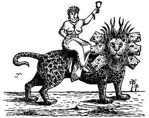

  
[Intangible Textual Heritage](../../index)  [Christianity](../index) 
[Revelation](../../bib/kjv/rev)  [Index](index)  [Previous](tbr078) 
[Next](tbr080) 

------------------------------------------------------------------------

p. 149

# The Seven Dooms.

### FIRST DOOM.

### ECCLESIASTICAL BABYLON.

### "MYSTERY

### BABYLON THE GREAT."

Rev. 17:1-18.

 

"And there came one of the 'Seven Angels' which had the 'Seven Vials,'
and talked with me, saying unto me, Come hither: I will chew unto thee
the Judgment of the '**GREAT WHORE**' that sitteth upon many waters;
with whom the kings of the earth have committed **fornication**, and the
inhabitants of the earth have been made **drunk with the wine of her
fornication**. So he carried me away in the spirit into the wilderness;
and I saw a '**WOMAN**' sit upon a '**SCARLET COLORED BEAST**,' full of
**names of blasphemy**, having '**SEVEN HEADS**' and '**TEN HORNS**.'
And the '**WOMAN**' was arrayed in **purple** and **scarlet color**, and
decked with **gold** and **precious stones** and **pearls**, having a
'**GOLDEN CUP**' in her hand full of **abominations and filthiness of
her fornication**: and upon her forehead was a name written

**MYSTERY,  
BABYLON THE GREAT,  
THE MOTHER OF HARLOTS AND  
ABOMINATIONS OF THE EARTH.**

And I saw the '**WOMAN**' drunken with the **blood of the saints**, and
with the **blood of the martyrs of Jesus**; and when I saw her, I
wondered with great admiration. And the Angel' said unto me, Wherefore
didst thou marvel? I will tell thee the **MYSTERY** of the '**WOMAN**,'
and of the **BEAST** that carrieth her, which hath the **SEVEN HEADS**
and **TEN HORNS**. The **BEAST** that thou sawest **was**, and **is
not**; and shall **ascend out of the BOTTOMLESS PIT**, and go into
**PERDITION**: and they that dwell on the earth shall wonder, whose
names were **not written** in the **'Book of Life' from the foundation
of the world**, when they behold p. 150 the
**BEAST** that **was**, and **is not**, and yet **is**. And here is the
mind which hath wisdom. The **SEVEN HEADS** are seven mountains, on
which the '**WOMAN**' sitteth. And there (they, the mountains R. V.) are
**SEVEN KINGS**: **five are fallen**, and **one is**, and **the other is
not yet come**: and when he cometh, he must continue a **short space**.
And the **BEAST** that **was**, and **is not**, even he is the
**EIGHTH**, and is **OF THE SEVENTH**, and goeth into Perdition. And the
**TEN HORNS** which thou sawest are **TEN KINGS**, which have received
no kingdoms as yet; but receive power **as kings** one hour with the
**BEAST**. These have one mind, and shall give their power and strength
unto the **BEAST**. These shall make war with the **LAMB**, and the
**LAMB** shall overcome them: for he is **LORD OF LORDS**, and **KING OF
KINGS**: and they that are with Him are **called**, and **chosen**, and
**faithful**. And he saith unto me, the waters which thou sawest, where
the **WHORE** sitteth, are **peoples**, and **multitudes**, and
**nations**, and **tongues**. And the **TEN HORNS** which thou sawest
upon the **BEAST**, these shall **hate the WHORE**, and shall make her
**desolate** and **naked**, and shall **eat her flesh**, and **burn her
with fire**. For God hath put in their hearts to fulfil His will, and to
agree, and give their kingdom unto the **BEAST**, until the words of God
shall be fulfilled. And the **WOMAN** which thou sawest is that great
city, which reigneth over the kings of the earth."

That the ancient city of Babylon restored is to play an important part
in the startling events of the last days of this Dispensation, is very
clear. This is seen from what is said of it in the seventeenth and
eighteenth chapters of the Book of Revelation. At first sight the two
chapters, which contain some things in common, are difficult to
reconcile, but when we get the "**Key**" the reconciliation is easy. The
seventeenth chapter speaks of a "Woman," and this "Woman" is called

**"MYSTERY,  
Babylon the Great,  
The Mother of Harlots  
And  
Abominations of the Earth."**

The eighteenth chapter speaks of a "**City**," a **literal city**,
called "Babylon the Great." That the "**Woman**" and the "**City**" do
not symbolize the same thing is clear, for what is said of the "Woman"
does not apply to a city, and what is said of the "**City**" does not
apply to a woman. The "**Woman**" is destroyed by the "**Ten Kings**,"
while the "**Kings of the Earth**" in the next chapter, "**bewail and
lament**" the destruction of the "**City**," which is not destroyed by
them, but by a mighty earthquake and fire. Again the "**Woman**" is
destroyed **Three and a Half Years BEFORE THE CITY**; and the fact that
the first verse of chapter eighteen says--"**after these things**," that
is after the destruction of the "**Woman**," what happens to the
"**City**" occurs, shows that the "**Woman**" and the "**City**" are not
one and the same. The "**Woman's**" name is

"**MYSTERY, Babylon the Great**."

"**Mystery!**" Where have we heard that word before, and in what
connection? Paul calls the Church a "Mystery" because it was not known
to the Old Testament Patriarchs and Prophets. Eph. 3:1-21.

p. 151

\[paragraph continues\] That Christ was to have a "Bride" was first
revealed to Paul (Eph. 5:23-32), and the "Mystery" that Antichrist is to
have a "bride" was first revealed to John on the Isle of Patmos. The
name of Antichrist's "bride" is "Babylon the Great." Some one may ask
why give to a "bride" the name of a "City"? The answer is that it is not
unusual in the Scriptures. When the same angel that showed John in this
chapter "Mystery, Babylon the Great," came to him in chapter 21:9-10 and
said--"Come hither, I will shew thee the Bride--'**The Lamb's Wife**',"
he showed John, instead of a woman, that great City, the "**Holy
Jerusalem**" descending out of Heaven from God. Here we see that a
"city" is called a "bride" because its **inhabitants**, and not the city
itself, are the **bride**. "Mystery, Babylon the Great," the "bride" of
Antichrist, then, is not a literal city, but a "**System**," a religious
and apostate "System." As the Church, the Bride of Christ, is composed
of regenerated followers of Christ, so "Mystery, Babylon the Great," the
bride of Antichrist, will be composed of the followers of all **False
Religions**.

The river Euphrates, on which the city of Babylon was built, was one of
the four branches into which the river that flowed through the Garden of
Eden was divided, and Satan doubtless chose the site of Babylon as his
headquarters from which to sally forth to tempt Adam and Eve. It was
doubtless here that the Antediluvian Apostasy had its source that ended
in the Flood. To this centre the "forces of Evil" gravitated after the
Flood, and "**Babel**" was the result. This was the origin of nations,
but the nations were not scattered abroad over the earth until Satan had
implanted in them the "**Virus**" of a doctrine that has been the
**source** of every false religion the world has ever known.

Babel, or Babylon, was built by Nimrod. Gen. 10:8-10. It was the seat of
the first great Apostasy. Here the "**Babylonian Cult**" was invented. A
system claiming to possess the highest wisdom and to reveal the divinest
secrets. Before a member could be initiated he had to "confess" to the
Priest. The Priest then had him in his power. This is the secret of the
power of the Priests of the Roman Catholic Church today.

Once admitted into this order men were no longer Babylonians, Assyrians,
or Egyptians, but members of a

**Mystical Brotherhood**,

over whom was placed a Pontiff or "High Priest," whose word was law. The
city of Babylon continued to be the seat of Satan until the fall of the
Babylonian and Medo-Persian Empires, when he shifted his Capital to
Pergamos in Asia Minor, where it was in John's day. Rev. 2:12, 13.

When Attalus, the Pontiff and King of Pergamos, died in B. C. 133, he
bequeathed the Headship of the "Babylonian Priesthood" to Rome. When the
Etruscans came to Italy from Lydia (the region of Pergamos), they
brought with them the Babylonian religion and rites. They set up a
Pontiff who was head of the Priesthood. Later the Romans accepted this
Pontiff as their civil ruler. Julius Caesar was made Pontiff of the
Etruscan Order in B. C. 74. In B. C. 63 he was made "Supreme Pontiff" of
the "Babylonian Order," thus becoming

p. 152

heir to the rights and titles of Attalus, Pontiff of Pergamos, who had
made Rome his heir by will. Thus the first Roman Emperor became the Head
of the "Babylonian Priesthood," and Rome the successor of Babylon. The
Emperors of Rome continued to exercise the office of "Supreme Pontiff"
until A. D. 376, when the Emperor Gratian, for Christian reasons,
refused it. The Bishop of the Church at Rome, Damasus, was elected to
the position. He had been Bishop 12 years, having been made Bishop in A.
D. 366, through the influence of the monks of Mt. Carmel, a college of
Babylonian religion originally founded by the priests of Jezebel. So in
A. D. 378 the Head of the "Babylonian Order" became the Ruler of the
"Roman Church." Thus Satan united

**Rome and Babylon  
In One Religious System**.

Soon after Damasus was made "supreme Pontiff" the "rites" of Babylon
began to come to the front. The worship of the Virgin Mary was set up in
A. D. 381. All the outstanding festivals of the Roman Catholic Church
are of Babylonian origin. Easter is not a Christian name. It means
"Ishtar," one of the titles of the Babylonian Queen of Heaven, whose
worship by the Children of Israel was such an abomination in the sight
of God. The decree for the observance of Easter and Lent was given in A.
D. 519. The "Rosary" is of Pagan origin. There is no warrant in the Word
of God for the use of the "Sign of the Cross." It had its origin in the
mystic "**Tau**" of the Chaldeans and Egyptians. It came from the letter
"**T**," the initial name of "**Tammuz**," and was used in the
"Babylonian Mysteries" for the same magic purposes as the Romish church
now employs it. **Celibacy**, the **Tonsure**, and the **Order of
Monks** and **Nuns**, have no warrant or authority from Scripture. The
Nuns are nothing more than an imitation of the "**Vestal Virgins**" of
Pagan Rome.

As to the word "**Mystery**," the Papal Church has always shrouded
herself in **mystery**. The mystery of "**Baptismal Regeneration**"; the
mystery of "**Miracle** and **Magic**" whereby the simple memorials of
the Lord's Supper are changed by the mysterious word
"**Transubstantiation**," from simple bread and wine into the **literal
Body and Blood of Christ**; the mystery of the "**Holy Water**"; the
mystery of "**Lights on the Altar**," the "**Mystery Plays**," and other
superstitious rites and ceremonies mumbled in a language that tends to
mystery, and tends to confusion which is the meaning of the word
Babylon.

All this was a "Mystery" in John's day, because the "Papal Church" had
not as yet developed; though the "**Mystery of Iniquity**" was already
at work (2. Thess. 2:7), but it is no longer a "Mystery" for it is now
easy to identify the "Woman"--"**Mystery, Babylon the Great**," which
John described, as the "**Papal Church**."

In Rev. 17:4 we read that the "Woman" "was arrayed in **purple** and
**scarlet color**, and decked with **gold** and **precious stones** and
**pearls**, having a '**Golden Cup**' in her hand full of
**abominations** and **filthiness of her fornications**."

p. 153

Now who does not know that **scarlet** and **purple** are the **colors**
of the Papacy? Of the different articles of attire specified for the
Pope to wear when he is installed into office **five** are **scarlet**.
A vest covered with **pearls**, and a mitre, adorned with **gold and
precious stones** was also to be worn. How completely this answers the
description of the Woman's dress as she sits upon the **Scarlet Colored
Beast**.

We are also told that the Woman was "**drunken** with the **blood of the
Saints**, and with the **blood of the Martyrs of Jesus**." While this
refers more particularly to the martyrs of the time of Antichrist, yet
who does not know, who has studied the history of the Christian Church
for the past nineteen centuries, that this is true of the Papal Church
during those centuries? One has only to read the history of the
persecutions of the early Christians and more particularly the story of
the "Inquisition" in Papal lands, to see that the Papal Church has been
"drunk" with the **blood of the Saints**.

The fact that the Woman sits on a "Scarlet Colored Beast" reveals the
fact that at that time the Beast (Antichrist) will support the Woman in
her ecclesiastical pretensions, or in other words, the Woman, as a
"State Church," will control and rule the State, and her long dream of
world-wide Ecclesiastical Supremacy will at last be realized, for John
tells us that "the waters which thou sawest, where the **'Whore'
sitteth**, are **Peoples**, and **Multitudes**, and **Nations** and
**Tongues**." That means that after the "**True Church**" (the Bride of
Christ) is taken out of the world the "**False**" or "**Papal Church**"
(the bride of Antichrist) will remain, and the professing body of
Christians (having the "form of Godliness without the power") left
behind, will largely enter the Papal Church, and it will become the
**Universal Church**. But this will continue for only a short time for
the "Ten Kings" of the "Federated Kingdom," finding their power
curtailed by the "Papal System" will "**hate The Whore**," and strip her
of her gorgeous apparel, confiscate her wealth (eat her flesh) and burn
her churches and cathedrals with fire. Rev. 17:16.

This will occur at the time the worship of the Beast is set up, for
Antichrist in his jealous hate will not permit any worship that does not
centre in himself.

The Beast upon which the Woman sits is 'introduced to show from whom the
Woman (the Papal Church) gets her power and sup-port after the True
Church has been "caught out," and also to show that the Beast
(Antichrist) and the Woman (the Papal Church) are not one and the same,
but separate. Therefore the Papacy is not Antichrist. For a description
of the "Scarlet Colored Beast" see the description of the "Beast out of
the Sea" of chapter 13:1-10.

From this foreview of the Papacy we see that the Papal Church is not a
**dying "System."** That she is to be revived and become a "**Universal
Church**," and in doing so is to commit fornication with the kings of
the earth, and that she shall again be "drunk with the blood" of the
martyrs of the Tribulation Period. The meaning of chapter seventeen of
the Book of Revelation is no longer a Mystery; the prophetic portrait of
the Woman there given corresponds too closely with the history of the
Papal Church to be a mere coincidence.

------------------------------------------------------------------------

[Next: Second Doom. Commercial Babylon](tbr080)
