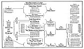

  
[Intangible Textual Heritage](../../index)  [Christianity](../index) 
[Revelation](../../bib/kjv/rev)  [Index](index)  [Previous](tbr086) 
[Next](tbr088) 

------------------------------------------------------------------------

### 2. THE FIRST RESURRECTION.

Rev. 20:4-6.

"And I saw Thrones, and they sat upon them, and Judgment was given unto
them.

"And I saw the **SOULS** of them that were **beheaded for the witness of
Jesus**, and for the **word of God**, and which **had not worshipped the
'Beast,' neither his 'Image,' neither had received his 'Mark' upon their
foreheads, or in their hands**. (These are the Tribulation Saints.) And
they (the 'Throne Sitters' and 'Tribulation Saints') lived and reigned
with Christ a thousand years. But the rest of the dead (Wicked Dead)
lived not again until the thousand years were finished. This (the
resurrection of the 'Throne Sitters,' and 'Tribulation Saints') is the
**FIRST RESURRECTION**.

"Blessed and holy is he that hath part in the '**FIRST RESURRECTION**':
on such the '**SECOND DEATH**' hath no power, but they shall be priests
of God and of Christ, and shall reign with Him a **THOUSAND YEARS**."

In this passage we meet for the first time the expression--"**THE FIRST
RESURRECTION**." In 1. Thess. 4:16, we read that the dead **IN CHRIST**
shall rise **FIRST**, but as no wicked are mentioned it is simply a
relative statement to show that the **living** Christians shall not be
caught away **before** the "Dead in Christ" shall be raised. This
passage speaks of two separate "Companies of Believers" who are to be
raised, each in their own order, at the "First Resurrection."

(1). The First Company is described by the words--"I saw Thrones, and
they sat upon them, and Judgment was given unto them." Now the only
"Company of Believers" that we see **sitting on Thrones** are the "Four
and Twenty Elders" of chapter 4:4-5. These as we have seen stand for the
Church, and were resurrected or caught

p. 177

 

[  
Click to enlarge](img/17700.jpg)  
The Resurrections  

 

p. 178

 

[  
Click to enlarge](img/17800.jpg)  
The Resurrections and Judgments  

 

p. 179

out **before** "The Tribulation," and are the "**Harvest**" of which
Christ and those who rose at the time of His Resurrection were the
"**First Fruits**." See the  "[Chart on](#img_17700) ."

(2). The Second Company is described by the words--"And I saw the
**SOULS** of them that were **beheaded for the witness of Jesus**, and
for the **word of God**, and which had **not worshipped the 'Beast,'
neither his 'Image,' neither had received his 'Mark' upon their
foreheads, or in their hands**." This Company is made up of those who
were slain for refusing to worship the "Beast" or his "Image," and
represent the "**Tribulation Saints**," or those who perish as martyrs
**after** the Church has been caught out, and during the "Tribulation
Period," and are the "**Gleanings**" of the "Harvest."

Now we read that these Two Companies "**lived**," that is, they were
dead but **lived again**, that is, had been raised **from the dead**,
for John saw the Tribulation Saints in their disembodied or **SOULISH**
state between death and the resurrection of the body. This clearly
teaches that both these Companies were resurrected and lived and were to
reign with Christ for a **1000 YEARS**, and not that only the
Tribulation Saints lived and would reign with Him during the 1000 Years.
Thus both Companies make up the **FIRST RESURRECTION SAINTS**.

In the next verse (5) we have another class or Company of per-sons
mentioned, called the "**REST OF THE DEAD**," who are not to live again
(that is, raised from the dead) until the 1000 Years are finished. Who
these dead are we are told in verse 12, where they are referred to as
the "**WICKED DEAD**." It is clear then that there are to be **TWO**
Resurrections of the dead, the first of the "**RIGHTEOUS**," and the
second of the "**WICKED**," and that these two Resurrections are to be
**1000 YEARS APART**.

But some object to the statement that there are to be **Two**
Resurrections, and say that we are not justified in basing such a
doctrine on a single statement in a symbolical book. But if we are to
reject the statements of the Word of God simply because they are
mentioned only **once**, then we must reject the doctrine of the "Virgin
Birth," for that was only mentioned once in the Old Testament before it
was fulfilled, but of the resurrection of the "Righteous" a 1000 years
before the "Wicked" we are told in this Book of Revelation **three**
times.

But we do not have to depend on this passage to prove that the
"Righteous" shall rise **before** the "Wicked," its value lies in the
fact that it gives us the **LENGTH OF TIME** (1000 years) between the
Two Resurrections. The Scriptures, while they speak of the Resurrection
of the "**JUST**" and the "**UNJUST**" (the Justified and the
Unjustified), Acts 24:15, and a Resurrection of "**LIFE**," and a
Resurrection of "**DAMNATION**" (John 5:28-29), also speak of an
"**OUT**" Resurrection "**FROM AMONG**" the dead, called in Luke
14:13-14, the Resurrection of the "**JUST**." In Luke 20:35-36 a
Resurrection is spoken of called a Resurrection "**FROM** (out from)
**THE DEAD**," and is an "**OUT**" Resurrection, because those who rise
are called the "**CHILDREN OF GOD**," being the children of "**THE**
(First or

p. 180

"out from") **RESURRECTION**." Again in Heb. 11:35, we read of a
"**BETTER RESURRECTION**," and all these references to a "**SPECIAL**"
Resurrection are made clear, and the "**time element**" and its
"**length**" (1000 years) between the Resurrection of the "**JUST**" and
"**UNJUST**" revealed in the passage we are considering.

There could be no statement more clear than--"**THE REST OF THE DEAD
LIVED NOT AGAIN UNTIL THE THOUSAND YEARS WERE FINISHED**," to show that
the "**Unrighteous Dead**" will not be raised until the **end of the
Millennium**. This at one stroke does away with the argument of those
who claim that **all the dead** will be raised at the **beginning** of
the Millennium, and shall have another chance to accept the Gospel and
be saved.

We read--"Blessed and holy is he that hath part in the '**FIRST
Resurrection**'; on such the '**SECOND DEATH**' hath no power." What is
the "**SECOND DEATH**"? First, what is **DEATH**? It is the separation
of the "**soul**" and "**spirit**" from the "**body**." That is the
"**FIRST DEATH**." At the Resurrection the "soul" and "spirit" are
**reunited** to the "body." This is true of both the Righteous and the
Wicked. But the Wicked after they have been raised are to be Judged at
the Great White Throne Judgment, and because their names are not found
written in the "Book of Life," they are sentenced to **die again**, that
is, their "**soul**" and "**spirit**" are again separated from their
"**body**," and they go to the "**LAKE OF FIRE**" **without a material
body**, and as "**soul**" and "**spirit**" are **incombustible** they
can remain in the flames of a **literal fire** for all eternity without
being consumed. This is the doom of the Wicked dead. The Rich Man in
Hell (Luke 16:19-31) was conscious and tormented in the flame after his
death, and he shall remain so until his body shall be raised from the
dead at the Resurrection of the Wicked, and when he shall be Judged and
condemned at the Great White Throne Judgment, and sentenced to **die
again**, his "soul" and "spirit" will descend to the "Lake of Fire" (the
Final Hell), where they will exist in a conscious state and in torment
for all eternity. But the "Second Death" has no terror for the
Righteous, for the promise is that it shall have **no power over them**.

------------------------------------------------------------------------

[Next: 3. The Millennium](tbr088)
