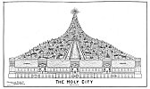

  
[Intangible Textual Heritage](../../index)  [Christianity](../index) 
[Revelation](../../bib/kjv/rev)  [Index](index)  [Previous](tbr094) 
[Next](tbr096) 

------------------------------------------------------------------------

### 3. THE NEW CITY.

Rev. 21:9-23.

"And there came unto me one of the 'Seven Angels' which had the 'Seven
Vials' full of the 'Seven Last Plagues,' and talked with me, saying,
Come hither, I will shew thee the **Bride**, the **LAMB'S WIFE**. And he
carried me away in the '**spirit**' to a great and high mountain, and
shewed me that **Great City THE HOLY JERUSALEM, descending out of
Heaven** from God, having the Glory of God; and her light was like unto
a stone most precious, even like a Jasper stone, **clear as crystal**;
and had a wall great and high, and had twelve gates, and at the gates,
twelve Angels, and names written thereon, which are the names of the
'Twelve Tribes' of the 'Children of Israel'; on the East three gates; on
the North three gates; on the South three gates; and on the West three
gates. And the wall of the City had twelve foundations, and in them the
names of the 'Twelve Apostles of the Lamb.' And he that talked with me
had a Golden Reed to measure the City, and the gates thereof, and the
wall thereof. And the City lieth **foursquare**, and the length is as
large as the breadth; and he measured the City with the Reed, 12,000
furlongs. The **length** and the **breadth** and the **height** of it
**are equal**. And he measured the wall thereof, a 144 cubits, according
to the measure of a man, that is, of the Angel. And the building of the
wall of it was of Jasper; and the City was **pure gold, like unto clear
glass**. And the foundations of the wall of the City were garnished with
all manner of precious stones. The first foundation was **Jasper**; the
second, **Sapphire**; the third, a **Chalcedony**; the fourth, an
**Emerald**; the fifth, **Sardonyx**; the sixth, **Sardius**; the
seventh, **Chrysolite**; the eighth, **Beryl**; the ninth, a **Topaz**;
the tenth, a **Chrysoprasus**; the eleventh, a **Jacinth**; the twelfth,
an **Amethyst**. And the twelve gates were **twelve pearls**; every
several gate was of one pearl; and the street of the City was **pure
gold**, as it were **transparent glass**. And I saw no Temple therein;
for the Lord God Almighty and the Lamb are the Temple of it. And the
City had no need of the Sun, neither of the Moon, to shine in it; for
the **Glory of God did lighten it**, and the **LAMB IS THE LIGHT
THEREOF**."

Rev. 22:5.

"And there shall be **no night** there; and they need no candle, neither
light of the Sun; for the Lord God giveth them light; and they shall
reign for ever and ever."

The Angel said to John--"Come hither, I will shew thee the **Bride** the
**LAMB'S WIFE**." Some claim that because the word "**WIFE**" is used
here, that **Israel** instead of the **Church**, is to be the **Bride**
of Christ. But we must not forget that this offer to show John the
**Bride**, was made **after** the Wedding of Christ to the Church, and
at this time she was no longer the **Bride** but had become the **WIFE**
of Christ, and should be thus spoken of. But instead of John being shown
a **Woman**, he was shown a **CITY**, the Holy Jerusalem, and as what
makes up a City is not its buildings and parks and business, but its
inhabitants, it is clear that the **Bride** and the **City** are
identical.

p. 204

 

[  
Click to enlarge](img/20400.jpg)  
The Holy City  

 

p. 205

\[paragraph continues\] That is, that the New Jerusalem is the home and
residence of the Bride, that is, the same as the Bride.

From this we see that there is not only to be a **New Heaven** and a
**New Earth**, there is also to be a **New City**. This City is the
place Jesus said He was going back to Heaven to prepare for His Bride
the Church. John 14:2-4. It is just such a place as we would expect the
Divine Architect to design and build. The description of it is
surpassingly grand. It is of Celestial origin. It is not Heaven itself,
for it comes down "out of Heaven." No mortal hands are employed in its
construction. It will take up its abode on the New Earth, and we see in
this why this present Earth will have to be renovated by fire, and why
there shall be "no more sea," for the New City is 12,000 furlongs, or
1500 miles square, and would reach from Maine to Florida, and from the
Atlantic Seaboard 600 miles to the west of the Mississippi River. In
other words would occupy more than one-half of the United States.

We are told that the length and breadth and the height of it **are
equal**. This does not necessarily imply that it is a Cube, for there is
another geometrical figure that has equal dimensions, and that is
a--**Pyramid**. This is its probable form, for a wall 144 cubits, or 216
feet thick, could not support a wall 1500 miles high, and a wall that
high would hide the pyramidal part of the City from view.

The 144 cubits (Rev. 21:17) then must refer to the "height" of the wall.
In this wall are 12 gates, 3 on each side, each gate of one Pearl, and
these gates are never closed.

The wall itself is of Jasper, and the foundations are garnished with all
manner of precious stones. The foundations contain the names of the
Twelve Apostles of the Lamb, and over the gates are the names of the
Twelve Tribes of Israel.

What a magnificent spectacle such' a city must present from a distance
with its pyramidal top surmounted by the light of the

"**Glory of God**."

"For the city had no need of the sun, neither of the moon, to shine in
it, for the '**Glory of God**' did lighten it, and **THE LAMB** is **THE
LIGHT THEREOF**." Rev. 21:23.

"And the gates of it shall not be shut at all. by day, for there shall
be **No Night There**." Rev. 21:25.

This refers to the City only, and not to the outlying parts of the New
Earth, for there will be day and night wherever the light of the City
does not reach.

The Pyramidal part of the City will doubtless be in the centre of the
City, and probably not occupy over one-half of the surface area, leaving
the remainder to be divided up into boulevards and broad avenues, with
numerous parks and residential sections. We are told that the City
itself is of **Pure Gold, Like Unto Clear Glass**. Rev. 21:18. If this
refers to the houses and homes of the inhabitants, then the redeemed are
to live in palaces of **Transparent Gold**, and the streets are to be of
the same material. Rev. 21:18, 21. We cannot imagine a city with such
dwellings and streets to be unclean or lack beauty.

------------------------------------------------------------------------

[Next: 4. The New Nations](tbr096)
