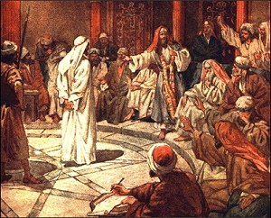

  
[Intangible Textual Heritage](../../index)  [Christianity](../index) 

------------------------------------------------------------------------

[Buy this Book on
Kindle](https://www.amazon.com/exec/obidos/ASIN/B002IVUDJW/internetsacredte)

------------------------------------------------------------------------

<table width="75%">
<colgroup>
<col style="width: 50%" />
<col style="width: 50%" />
</colgroup>
<tbody>
<tr class="odd">
<td width="50%" data-valign="TOP"> 
The Sanhedrin by James Jacques Joseph Tissot [19th c.] (Public Domain Image)</td>
<td width="50%" data-valign="CENTER"><h1 id="the-trial-of-christ" data-align="CENTER">The Trial of Christ</h1>
<h2 id="by-david-k.-breed" data-align="CENTER">by David K. Breed</h2>
<h4 id="section" data-align="CENTER">[1948]</h4></td>
</tr>
</tbody>
</table>

------------------------------------------------------------------------

[Contents](#contents)    [Start Reading](toc00)    [Page
Index](pageidx)    [Text \[Zipped\]](toc.txt.gz)

------------------------------------------------------------------------

|                                                                                                                           |
|---------------------------------------------------------------------------------------------------------------------------|
|  |

Could Jesus have gotten off on a technicality? Mr. Breed, a Missouri
attorney, presents the brief for acquittal, and then withdraws his
plea--on the basis that Jesus is fulfilling an ancient prophecy, and
must die anyway, to save mankind.

He points out major discrepancies between Jewish and Roman legal
procedures and the gospel accounts. For instance, the Sanhedrin, the
Jewish supreme court, would never have met on the Sabbath, nor condemned
a man to death on the same day as his trial. Roman law also gave
defendants many rights we now take for granted, such as the right to a
public trial, and to cross-examine witnesses, which were not followed
either.

Why care about this, the ultimate moot point? In particular, the actions
of the Sanhedrin in the Gospel narratives were used to inflame
anti-Semitism for centuries. This toxic stereotype seeped into every
aspect of the Jewish-Christian relationship. (see [this
book](../../jud/rio/index)). While Mr. Breed does not address this issue
directly, it is implicit in his thesis.

Some will say that Breed's conclusion is undermined by his evidence.
However, this book demonstrates that a devout Christian can use Biblical
criticism to reinforce their faith, and even renew it. Whether you
believe that Jesus was completely historical, or a fable based on
ancient memes of a dying god, this book will provide much food for
thought.

------------------------------------------------------------------------

 [Title Page and Front Matter](toc00)  
[Foreword](toc01)  
[Acknowledgement](toc02)  
[Table of Contents](toc03)  
[Chapter I. The Scope of our Study](toc04)  
[Chapter II. Legal Background and Sources of the Record](toc05)  
[Chapter III. The Record of the Trials](toc06)  
[Chapter IV. Reversible Errors](toc07)  
[Chapter V. Five Courts and Six Trials](toc08)  
[Chapter VI. Argument As To Jewish Trials](toc09)  
[Chapter VIII. Errors in the Roman Trials](toc10)  
[Chapter VIII. A Lesson in Citizenship](toc11)  
[Epilogue—Our Redeemer](toc12)  
[Appendix A. Lawyers in the Sanhedrin](toc13)  
[Appendix B. Bibliography](toc14)  
[Index](toc15)  
