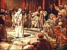

  
[Intangible Textual Heritage](../../index)  [Christianity](../index) 
[Index](index)  [Previous](toc05)  [Next](toc07) 

------------------------------------------------------------------------

[Buy this Book on
Kindle](https://www.amazon.com/exec/obidos/ASIN/B002IVUDJW/internetsacredte)

------------------------------------------------------------------------

  
*The Trial of Christ*, by David K. Breed, \[1948\], at Intangible
Textual Heritage

------------------------------------------------------------------------

p. 17

### CHAPTER III

### THE RECORD OF THE TRIALS

We have referred in a previous Chapter to the fact that the Gospels
refer in some detail to the Trial of Christ. Since we have referred to
the record on appeal as the legal basis for trial study, no record of an
actual court-reporter being extant, we include as the best record
available the passages given us in the Gospels. Those passages,
containing a record of The Trial of Christ are:

Matthew 26:57-27:2; 27:11-26;  
Mark 14:53-15:15;  
Luke 22:54-23:24; and,  
John 18:12-19:16; inclusive.

We quote the record, as given in the Authorized Version: [5](#fn_4)

ST. MATTHEW, in Chapters 26 and 27, verses as numbered:

*Chapter 26 of Matthew:*

"57. And they that had laid hold on Jesus

p. 18

led him away to Caiaphas the high priest, where the scribes and elders
were assembled.

58\. But Peter followed him afar off unto the high priest's palace, and
went in, and sat with the servants, to see the end.

59\. Now the chief priests, and elders, and all the council, sought
false witness against Jesus, to put him to death;

60\. But found none: yea, though many false witnesses came, yet found
they none. At the last came two false witnesses,

61\. And said, This fellow said, I am able to destroy the temple of God,
and to build it in three days.

62\. And the high priest arose, and said unto him, Answerest thou
nothing? what is it which these witness against thee?

63\. But Jesus held his peace. And the high priest answered and said
unto him, I adjure thee by the living God, that thou tell us whether
thou be the Christ, the Son of God.

64\. Jesus saith unto him, Thou hast said: nevertheless I say unto you,
Hereafter shall ye see the Son of man sitting on the right hand of
power, and coming in the clouds of heaven.

p. 19

65\. Then the high priest rent his clothes, saying, He hath spoken
blasphemy; what further need have we of witnesses? behold, now ye have
heard his blasphemy.

66\. What think ye? They answered and said, He is guilty of death.

67\. Then did they spit in his face, and buffeted him; and others smote
him with the palms of their hands,

68\. Saying, Prophesy unto us, thou Christ, Who is he that smote thee?

69\. Now Peter sat without in the palace: and a damsel came unto him,
saying, Thou also wast with Jesus of Galilee.

70\. But he denied before them all, saying, I know not what thou sayest.

71\. And when he was gone out into the porch, another maid saw him, and
said unto them that were there, This fellow was also with Jesus of
Nazareth.

72\. And again he denied with an oath, I do not know the man.

73\. And after a while came unto him they that stood by, and said to
Peter, Surely thou also art one of them; for thy speech bewrayeth thee.

p. 20

74\. Then began he to curse and to swear, saying, I know not the man.
And immediately the cock crew.

75\. And Peter remembered the word of Jesus, which said unto him, Before
the cock crow, thou shalt deny me thrice. And he went out, and wept
bitterly."

*Chapter 27 of Matthew:*

"When the morning was come, all the chief priests and elders of the
people took counsel against Jesus to put him to death;

2\. And when they had bound him, they led him away, and delivered him to
Pontius Pilate the governor."

.         .         .

"11. And Jesus stood before the governor: and the governor asked him,
saying, Art thou the King of the Jews? And Jesus said unto him, Thou
sayest.

12\. And when he was accused of the chief priests and elders, he
answered nothing.

13\. Then said Pilate unto him, Hearest thou not how many things they
witness against thee?

14\. And he answered him to never a word; insomuch that the governor
marvelled greatly.

p. 21

15\. Now at that feast the governor was wont to release unto the people
a prisoner, whom they would.

16\. And they had then a notable prisoner, called Barabbas.

17\. Therefore when they were gathered together, Pilate said unto them,
Whom will ye that I release unto you? Barabbas, or Jesus which is called
Christ?

18\. For he knew that for envy they had delivered him.

19\. When he was set down on the judgment seat, his wife sent unto him,
saying, Have thou nothing to do with that just man: for I have suffered
many things this day in a dream because of him.

20\. But the chief priests and elders persuaded the multitude that they
should ask Barabbas, and destroy Jesus.

21\. The governor answered and said unto them, Whether of the twain will
ye that I release unto you? They said, Barabbas.

22\. Pilate saith unto them, What shall I do then with Jesus which is
called Christ? They all say unto him, Let him be crucified.

23\. And the governor said, Why, what evil

p. 22

hath he done? But they cried out the more, saying, Let him be crucified.

24\. When Pilate saw that he could prevail nothing, but that rather a
tumult was made, he took water, and washed his hands before the
multitude, saying, I am innocent of the blood of this just person: see
ye to it.

25\. Then answered all the people, and said, His blood be on us, and on
our children.

26\. Then released he Barabbas unto them; and when he had scourged
Jesus, he delivered him to be crucified."

ST. MARK, in Chapters 14 and 15, verses as numbered:

*Chapter 14 of Mark:*

"53. And they led Jesus away to the high priest: and with him were
assembled all the chief priests and the elders and the scribes.

54\. And Peter followed him afar off, even into the palace of the high
priest: and he sat with the servants, and warmed himself at the fire.

55\. And the chief priests and all the council sought for witness
against Jesus to put him to death; and f ouiid none.

p. 23

56\. For many bare false witness against him, but their witness [6](#fn_5) agreed not together.

57\. And there arose certain, and bare false witness against him,
saying,

58\. We heard him say, I will destroy this temple that is made with
hands, and within three days I will build another made without hands.

59\. But neither so did their witness agree together.

60\. And the high priest stood up in the midst, and asked Jesus, saying,
Answerest thou nothing? what is it which these witness against thee?

61\. But he held his peace, and answered nothing. Again the high priest
asked him, and said unto him, Art thou the Christ, the Son of the
Blessed?

62\. And Jesus said, I am: and ye shall see the Son of man sitting on
the right hand of power, and coming in the clouds of heaven.

63\. Then the high priest rent his clothes,

p. 24

and saith, What need we any further witnesses?

64\. Ye have heard the blasphemy: what think ye? And they all condemned
him to be guilty of death.

65\. And some began to spit on him, and to cover his face, and to buffet
him, and to say unto him, Prophesy: and the servants did strike him with
the palms of their hands.

66\. And as Peter was beneath in the palace, there cometh one of the
maids of the high priest:

67\. And when she saw Peter warming himself, she looked upon him, and
said, And thou also wast with Jesus of Nazareth.

68\. But he denied, saying, I know not, neither understand I what thou
sayest. And he went out into the porch; and the cock crew.

69\. And a maid saw him again, and began to say to them that stood by,
This is one of them.

70\. And he denied it again. And a little after, they that stood by said
again to Peter, Surely thou art one of them: for thou art a Galilean,
and thy speech agreeth thereto.

71\. But he began to curse and to swear,

p. 25

saying, I know not this man of whom ye speak.

72\. And the second time the cock crew. And Peter called to mind the
word that Jesus said unto him, Before the cock crow twice, thou shalt
deny me thrice. And when he thought thereon, he wept."

*Chapter 15 of Mark:*

"And straightway in the morning the chief priests held a consultation
with the elders and scribes and the whole council, and bound Jesus, and
carried him away, and delivered him to Pilate.

2\. And Pilate asked him, Art thou the King of the Jews? And he
answering said unto him, Thou sayest it.

3\. And the chief priests accused him of many things: but he answered
nothing.

4\. And Pilate asked him again, saying, Answerest thou nothing? behold
how many things they witness against thee.

5\. But Jesus yet answered nothing; so that Pilate marvelled.

6\. Now at that feast he released unto them one prisoner, whomsoever
they desired.

7\. And there was one named Barabbas,

p. 26

which lay bound with them that had made insurrection with him, who had
committed murder in the insurrection.

8\. And the multitude crying aloud began to desire him to do as he had
ever done unto them.

9\. But Pilate answered them, saying, Will ye that I release unto you
the King of the Jews?

10\. For he knew that the chief priests had delivered him for envy.

11\. But the chief priests moved the people, that he should rather
release Barabbas unto them.

12\. And Pilate answered and said again unto them, What will ye then
that I shall do unto him whom ye call the King of the Jews?

13\. And they cried out again, Crucify him.

14\. Then Pilate said unto them, Why, what evil hath he done? And they
cried out the more exceedingly, Crucify him.

15\. And so Pilate, willing to content the people, released Barabbas
unto them, and delivered Jesus, when he had scourged him, to be
crucified."

ST. LUKE, in Chapters 22 and 23, verses as numbered:

p. 27

*Chapter 22 of Luke:*

"54. Then took they him, and led him, and brought him into the high
priest's house. And Peter followed afar off.

55\. And when they had kindled a fire in the midst of the hall, and were
set down together, Peter sat down among them.

56\. But a certain maid beheld him as he sat by the fire, and earnestly
looked upon him, and said, This man was also with him.

57\. And he denied him, saying, Woman, I know him not.

58\. And after a little while another saw him, and said, Thou art also
of them. And Peter said, Man, I am not.

59\. And about the space of one hour after another confidently affirmed,
saying, Of a truth this fellow also was with him: for he is a Galilean.

60\. And Peter said, Man, I know not what thou sayest. And immediately,
while he yet spake, the cock crew.

61\. And the Lord turned, and looked upon Peter. And Peter remembered
the word of the Lord, how he had said unto him, Before the cock crow,
thou shalt deny me thrice.

p. 28

62\. And Peter went out, and wept bitterly.

63\. And the men that held Jesus mocked him, and smote him.

64\. And when they had blindfolded him, they struck him on the face, and
asked him, saying, Prophesy, who is it that smote thee?

65\. And many other things blasphemously spake they against him.

66\. And as soon as it was day, the elders of the people and the chief
priests and the scribes came together, and led him into their council,
saying,

67\. Art thou the Christ? tell us. And he said unto them, If I tell you,
ye will not believe:

68\. And if I also ask you, ye will not answer me, nor let me go.

69\. Hereafter shall the Son of man sit on the right hand of the power
of God.

70\. Then said they all, Art thou then the Son of God? And he said unto
them, Ye say that I am.

71\. And they said, What need we any further witness? for we ourselves
have heard of his own mouth."

p. 29

*Chapter 23 of Luke:*

"And the whole multitude of them arose, and led him unto Pilate.

2\. And they began to accuse him, saying, We found this fellow
perverting the nation, and forbidding to give tribute to Caesar, saying,
that he himself is Christ a King.

3\. And Pilate asked him, saying, Art thou the King of the Jews? And he
answered him and said, Thou sayest it.

4\. Then said Pilate to the chief priests and to the people, I find no
fault in this man.

5\. And they were the more fierce, saying, He stirreth up the people,
teaching throughout all Jewry, beginning from Galilee to this place.

6\. When Pilate heard of Galilee, he asked whether the man were a
Galilean.

7\. And as soon as he knew that he belonged unto Herod's jurisdiction,
he sent him to Herod, who himself also was at Jerusalem at that time.

8\. And when Herod saw Jesus, he was exceeding glad: for he was desirous
to see him of a long season, because he had heard many things of him;
and he hoped to have seen some miracle done by him.

p. 30

9\. Then he questioned with him in many words; but he answered him
nothing.

10\. And the chief priests and scribes stood and vehemently accused him.

11\. And Herod with his men of war set him at nought, and mocked him,
and arrayed him in a gorgeous robe, and sent him again to Pilate.

12\. And the same day Pilate and Herod were made friends together: for
before they were at enmity between themselves.

13\. And Pilate, when he had called together the chief priests and the
rulers and the people,

14\. Said unto them, Ye have brought this man unto me, as one that
perverteth the people: and, behold, I, having examined him before you,
have found no fault in this man touching those things whereof ye accuse
him:

15\. No, nor yet Herod: for I sent you to him; and, lo, nothing worthy
of death is done unto him.

16\. I will therefore chastise him, and release him.

17\. (For of necessity he must release one unto them at the feast.)

p. 31

18\. And they cried out all at once, saying, Away with this man, and
release unto us Barabbas:

19\. (Who for a certain sedition made in the city, and for murder, was
cast into prison.)

20\. Pilate therefore, willing to release Jesus, spake again to them.

21\. But they cried, saying, Crucify him, crucify him.

22\. And he said unto them the third time, Why, what evil hath he done?
I have found no cause of death in him: I will therefore chastise him,
and let him go.

23\. And they were instant with loud voices, requiring that he might be
crucified. And the voices of them and of the chief priests prevailed.

24\. And Pilate gave sentence that it should be as they required."

ST. JOHN, in Chapters 18 and 19, verses as numbered:

*Chapter 18 of John:*

"12. Then the band and the captain and officers of the Jews took Jesus,
and bound him,

13\. And led him away to Annas first; for he

p. 32

was father in law to Caiaphas, which was the high priest that same year.

14\. Now Caiaphas was he, which gave counsel to the Jews, that it was
expedient that one man should die for the people.

15\. And Simon Peter followed Jesus, and so did another disciple: that
disciple was known unto the high priest, and went in with Jesus into the
palace of the high priest.

16\. But Peter stood at the door without. Then went out that other
disciple, which was known unto the high priest, and spake unto her that
kept the door, and brought in Peter.

17\. Then saith the damsel that kept the door unto Peter, Art not thou
also one of this man's disciples? He saith, I am not.

18\. And the servants and officers stood there, who had made a fire of
coals; for it was cold: and they warmed themselves: and Peter stood with
them, and warmed himself.

19\. The high priest then asked Jesus of his disciples, and of his
doctrine.

20\. Jesus answered him, I spake openly to the world; I ever taught in
the synagogue, and in the temple, whither the Jews always resort; and in
secret have I said nothing.

p. 33

21\. Why askest thou me? ask them which heard me, what I have said unto
them: behold, they know what I said.

22\. And when he had thus spoken, one of the officers which stood by
struck Jesus with the palm of his hand, saying, Answerest thou the high
priest so?

23\. Jesus answered him, If I have spoken evil, bear witness of the
evil: but if well, why smitest thou me?

24\. Now Annas had sent him bound unto Caiaphas the high priest.

25\. And Simon Peter stood and warmed himself. They said therefore unto
him, Art not thou also one of his disciples? He denied it, and said, I
am not.

26\. One of the servants of the high priest, being his kinsman whose ear
Peter cut off, saith, Did not I see thee in the garden with him?

27\. Peter then denied again: and immediately the cock crew.

28\. Then led they Jesus from Caiaphas unto the hall of judgment: and it
was early; and they themselves went not into the judgment hall, lest
they should be defiled; but that they might eat the passover.

p. 34

29\. Pilate then went out unto them, and said, What accusation bring ye
against this man?

30\. They answered and said unto him, If he were not a malefactor, we
would not have delivered him up unto thee.

31\. Then said Pilate unto them, Take ye him, and judge him according to
your law. The Jews therefore said unto him, it is not lawful for us to
put any man to death:

32\. That the saying of Jesus might be fulfilled, which he spake,
signifying what death he should die.

33\. Then Pilate entered into the judgment hall again, and called Jesus,
and said unto him, Art thou the King of the Jews?

34\. Jesus answered him, Sayest thou this thing of thyself, or did
others tell it thee of me?

35\. Pilate answered, Am I a Jew? Thine own nation and the chief priests
have delivered thee unto me: what hast thou done?

36\. Jesus answered, My kingdom is not of this world: if my kingdom were
of this world, then would my servants fight, that I should

p. 35

not be delivered to the Jews: but now is my kingdom not from hence.

37\. Pilate therefore said unto him, Art thou a king then? Jesus
answered, Thou sayest that I am a king. To this end was I born, and for
this cause came I into the world, that I should bear witness unto the
truth. Every one that is of the truth heareth my voice.

38\. Pilate saith unto him, What is truth? And when he had said this, he
went out again unto the Jews, and saith unto them, I find in him no
fault at all.

39\. But ye have a custom, that I should release unto you one at the
passover: will ye therefore that I release unto you the King of the
Jews?

40\. Then cried they all again, saying, Not this man, but Barabbas. Now
Barabbas was a robber."

*Chapter 19 of John:*

"Then Pilate therefore took Jesus, and scourged him.

2\. And the soldiers platted a crown of thorns, and put it on his head,
and they put on him a purple robe,

p. 36

3\. And said, Hail, King of the Jews! and they smote him with their
hands.

4\. Pilate therefore went forth again, and saith unto them, Behold, I
bring him forth to you, that ye may know that I find no fault in him.

5\. Then came Jesus forth, wearing the crown of thorns, and the purple
robe. And Pilate saith unto them, Behold the man!

6\. When the chief priests therefore and officers saw him, they cried
out, saying, Crucify him, crucify him. Pilate saith unto them, Take ye
him, and crucify him: for I find no fault in him.

7\. The Jews answered him, We have a law, and by our law he ought to
die, because he made himself the Son of God.

8\. When Pilate therefore heard that saying, he was the more afraid;

9\. And went again into the judgment hall, and saith unto Jesus, Whence
art thou? But Jesus gave him no answer.

10\. Then saith Pilate unto him, Speakest thou not unto me? knowest thou
not that I have power to crucify thee, and have power to release thee?

p. 37

11\. Jesus answered, Thou couldest have no power at all against me,
except it were given thee from above: therefore he that delivereth me
unto thee hath the greater sin.

12\. And from thenceforth Pilate sought to release him: but the Jews
cried out, saying, If thou let this man go, thou art not Caesar's
friend: whosoever maketh himself a king speaketh against Caesar.

13\. When Pilate therefore heard that saying, he brought Jesus forth,
and sat down in the judgment seat in a place that is called the
Pavement, but in the Hebrew, Gabbatha.

14\. And it was the preparation of the passover, and about the sixth
hour: and he saith unto the Jews, Behold your King!

15\. But they cried out, Away with him, away with him, crucify him.
Pilate saith unto them, Shall I crucify your King? The chief priests
answered, We have no king but Caesar.

16\. Then delivered he him therefore unto them to be crucified. And they
took Jesus, and led him away."

------------------------------------------------------------------------

### Footnotes

[17:5](toc06.htm#fr_4) We quote in the Order of
the Canon of Scripture, knowing most scholars hold Mark was the earliest
of the writers.

[23:6](toc06.htm#fr_5) Consult other translations
on this verse; compare, Thayer's *Greek-English Lexicon;* Revised
Standard says "their testimony did not agree"; Weymouth, accord;
Goodspeed, "their evidence did not agree"; from all of which we see that
the testimony was conflicting even from the mouths of false witnesses.

------------------------------------------------------------------------

[Next: Chapter IV. Reversible Errors](toc07)
