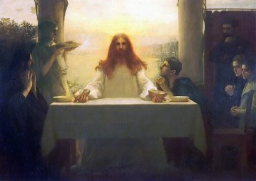

  
[Intangible Textual Heritage](../../index)  [Christianity](../index) 

------------------------------------------------------------------------

[Buy this Book on
Kindle](https://www.amazon.com/exec/obidos/ASIN/B002TX7KEA/internetsacredte)

------------------------------------------------------------------------

<table width="75%">
<colgroup>
<col style="width: 50%" />
<col style="width: 50%" />
</colgroup>
<tbody>
<tr class="odd">
<td width="50%" data-valign="TOP"> 
Jesus and the Disciples at Emmaus, by Dagnan-Bouvereret Pascal-Adolphe-Jean [Public Domain Image]</td>
<td width="50%" data-valign="CENTER"><h1 id="the-unknown-life-of-jesus-christ" data-align="CENTER">The Unknown Life of Jesus Christ</h1>
<h2 id="by-nicolas-notovitch" data-align="CENTER">by Nicolas Notovitch</h2>
<h4 id="section" data-align="CENTER">[1890]</h4></td>
</tr>
</tbody>
</table>

------------------------------------------------------------------------

[Contents](#contents)    [Start Reading](uljc00)    [Page
Index](pageidx)    [Text \[Zipped\]](uljc.txt.gz)

------------------------------------------------------------------------

|                                                                                                                           |
|---------------------------------------------------------------------------------------------------------------------------|
|  |

One of the mysteries of the Bible has always been where Jesus was during
his twenties. There is a huge gap in the biography from puberty until
about three years before the crucifixion. The simplest inference is that
he was working as a carpenter with his father and that nothing
remarkable happened to him during this period. This prosaic scenario,
Jesus as a salt-of-the-earth working man, is in character with the rest
of what we know about him, and there is no good reason to invalidate it.

One rumor that has circulated for years has been that Jesus went to
India during this time. There were well-established trade routes, so it
would not be impossible. If Alexander the Great got there several
centuries earlier, why not Jesus?

This book is the source of that rumor. In the late nineteenth century a
Russian, Nicolas Notovitch, published a travelogue of a trip through
India, into Kashmir, eventually reaching Ladakh in Tibet. At this point,
the book takes a sensational turn. A lama informs him that Jesus is
revered as a Boddhisattva, under the name Issa, by a splinter sect of
the Tibetan Buddhists. While Notovitch is convalescing from a broken
leg, an ancient manuscript read to him about Issa. This tells of Jesus
trekking to India to study the Vedas and Buddhism. Jesus stirs up a
caste war against the Brahmins and has to leave India. Then Jesus
returns home, stopping off briefly in Persia, where he preaches against
Zoroastrianism. This account was supposed to have been written shortly
after Jesus' death.

Of course, this caused quite a stir. Max Müller sent a letter to the
monastery where Notovitch had claimed to have made the discovery, and
they disavowed any knowledge of such a manuscript. There are many things
that don't add up in the "Life of Saint Issa." First of all, no
authentic Hindu or Buddhist text from that period references Jesus or
any of the events described in Notovitch. Jesus is described as having
studied in the Orissa area, but the ceremonial complexes, particularly
the Jagannath temple in Puri, date to the 12th century CE, over a
millennium later. Jesus is called Issa in this account, but this is an
Islamic name for him which was not used until much later.

This concept, however, has refused to die. Other travelers to Tibet,
such as Swami Abhedenada, Nicholas Roerich, and others claimed that they
have been told similar stories by monks. Possibly the monks were just
catering to what the visitor wanted to hear, a known problem for field
ethnologists. The controversial Ahmadiyya Muslims believe that Jesus
survived the crucifixion, and then fled to India, where he died of old
age. The 'channeled' [Aquarian Gospel of Jesus](../agjc/index) repeats
Notovitchs' narrative with much embellishment. The "Jesus in India"
story was also incorporated by Elizabeth Clare Prophet.

On the balance, there may be some core truth to this hypothesis which
has yet to be uncovered. There are some parallels between the
traditional stories of Krishna and Christ (not to mention the similar
names). The Hindus were well aware of the Greeks, and the Egyptian
Hermetic and Gnostic schools were more than likely influenced by
Hinduism. Buddhism and Christianity have more in common than their
adherents are usually willing to admit. It may not have happened exactly
as in Notovitch claimed, and there may not be an 'Issa Sutra' gathering
dust in some remote Tibetan lamasery. However, there are many points of
similarity between the first millennium religious movements of the Near
East and India which remain to be explored.

--J.B. Hare, 8/30/2006

------------------------------------------------------------------------

 [Title Page](uljc00)  
[Contents](uljc01)  
[Preface](uljc02)  
[A Journey in Thibet](uljc03)  
[Ladak](uljc04)  
[A Festival in a Gonpa](uljc05)  

### The Life of Saint Issa

[I](uljc06)  
[II](uljc07)  
[III](uljc08)  
[IV](uljc09)  
[V](uljc10)  
[VI](uljc11)  
[VII](uljc12)  
[VIII](uljc13)  
[IX](uljc14)  
[X](uljc15)  
[XI](uljc16)  
[XII](uljc17)  
[XIII](uljc18)  
[XIV](uljc19)  

 

[Resumé](uljc20)  
[Explanatory Notes](uljc21)  
