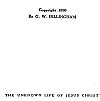

  
[Intangible Textual Heritage](../../index)  [Christianity](../index) 
[Index](index)  [Next](uljc01) 

------------------------------------------------------------------------

[Buy this Book on
Kindle](https://www.amazon.com/exec/obidos/ASIN/B002TX7KEA/internetsacredte)

------------------------------------------------------------------------

  
The Unknown Life of Jesus Christ, by Nicolas Notovitch \[1890\], at
Intangible Textual Heritage

------------------------------------------------------------------------

### THE UNKNOWN LIFE

###### OF

# JESUS CHRIST

###### By the Discoverer of the Manuscript

### NICOLAS NOTOVITCH

###### Translated by

##### J. H. CONNELLY and L. LANDSBERG

#### R. F. FENNO COMPANY

#### 16 East 17 Street

#### NEW YORK

\[1890\]

Scanned, proofed, and formatted at Intangible Textual Heritage, August
2006, by John Bruno Hare. This text is in the public domain in the
United States because it was published prior to 1923.

  [  
Click to enlarge](img/title.jpg)  
Title Page  

 
[  
Click to enlarge](img/verso.jpg)  
Verso  

------------------------------------------------------------------------

[Next: Contents](uljc01)

