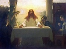

  
[Intangible Textual Heritage](../../index)  [Christianity](../index) 
[Index](index)  [Previous](uljc09)  [Next](uljc11) 

------------------------------------------------------------------------

[Buy this Book on
Kindle](https://www.amazon.com/exec/obidos/ASIN/B002TX7KEA/internetsacredte)

------------------------------------------------------------------------

  
The Unknown Life of Jesus Christ, by Nicolas Notovitch \[1890\], at
Intangible Textual Heritage

------------------------------------------------------------------------

### V.

1\. In his fourteenth year, young Issa, the Blessed One, came this side
of the Sindh and settled among the Aryas, in the country beloved by God.

p. 167

2\. Fame spread the name of the marvellous youth along the northern
Sindh, and when he came through the country of the five streams and
Radjipoutan, the devotees of the god Djaïne asked him to stay among
them.

3\. But he left the deluded worshippers of Djaïne and went to
Djagguernat, in the country of Orsis, where repose the mortal remains of
Vyassa-Krishna, and where the white priests of Brahma welcomed him
joyfully.

4\. They taught him to read and to understand the Vedas, to cure
physical ills by means of prayers, to teach and to expound the sacred
Scriptures, to drive out evil desires from man and make him again in the
likeness of God.

5\. He spent six years in Djagguernat, in

p. 168

\[paragraph continues\] Radjagriha, in
Benares, and in other holy cities. The common people loved Issa, for he
lived in peace with the Vaisyas and the Sudras, to whom he taught the
Holy Scriptures.

6\. But the Brahmins and the Kshatriyas told him that they were
forbidden by the great Para-Brahma to come near to those who were
created from his belly and his feet; [\*](#fn_0)

7\. That the Vaisyas might only hear the recital of the Vedas, and this
only on the festal days, and

8\. That the Sudras were not only forbidden to attend the reading of the
Vedas, but even to look on them; for they were condemned to perpetual
servitude, as slaves of the Brahmins, the Kshatriyas and even the
Vaisyas.

p. 169

9\. "Death alone can enfranchise them from their servitude," has said
Para-Brahma. "Leave them, therefore, and come to adore with us the gods,
whom you will make angry if you disobey them."

10\. But Issa, disregarding their words, remained with the Sudras,
preaching against the. Brahmins and the Kshatriyas.

11\. He declaimed strongly against man's arrogating to himself the
authority to deprive his fellow-beings of their human and spiritual
rights. "Verily," he said, "God has made no difference between his
children, who are all alike dear to Him."

12\. Issa denied the divine inspiration of the Vedas and the Puranas,
for, as he taught his followers,--"One law has been given to man to
guide him in his actions:

13\. "Fear the Lord, thy God; bend thy

p. 170

knees only before Him and bring to Him only the offerings which come
from thy earnings."

14\. Issa denied the Trimurti and the incarnation of Para-Brahma in
Vishnu, Siva, and other gods; "for," said he:

15\. "The eternal Judge, the eternal Spirit, constitutes the only and
indivisible soul of the universe, and it is this soul alone which
creates, contains and vivifies all.

16\. "He alone has willed and created. He alone has existed from
eternity, and IIis existence will be without end; there is no one like
unto Him either in the heavens or on the earth.

17\. "The great Creator has divided His power with no other being; far
less with inanimate objects, as you have been taught to

p. 171

believe, for He alone is omnipotent and all-sufficient.

18\. "He willed, and the world was. By one divine thought, He reunited
the waters and separated them from the dry land of the globe. He is the
cause of the mysterious life of man, into whom He has breathed part of
His divine Being.

19\. "And He has put under subjection to man, the lands, the waters, the
beasts and everything which He created, and which He himself preserves
in immutable order, allotting to each its proper duration.

20\. "The anger of God will soon break forth upon man; for he has
forgotten his Creator; he has filled His temples with abominations; and
he adores a multitude of creatures which God has subordinated to him;

21\. "And to gain favor with images of

p. 172

stone and metal, he sacrifices human beings in whom dwells part of the
Spirit of the Most  High;

22\. "And he humiliates those who work in the sweat of their brows, to
gain favor in the eyes of the idler who sitteth at a sumptuous table.

23\. "Those who deprive their brothers of divine happiness will
themselves be deprived of it; and the Brahmins and the Kshatriyas shall
become the Sudras of the Sudras, with whom the Eternal will stay
forever.

24\. "In the day of judgment the Sudras and the Vaisyas will be forgiven
for that they knew not the light, while God will let loose his wrath
upon those who arrogated his authority."

25\. The Vaisyas and the Sudras were filled with great admiration, and
asked Issa how

p. 173

they should pray, in order not to lose their hold upon eternal life.

26\. "Pray not to idols, for they cannot hear you; hearken not to the
Vedas where the truth is altered; be humble and humiliate not your
fellow-man.

27\. "Help the poor, support the weak, do evil to none; covet not that
which ye have not and which belongs to others."

------------------------------------------------------------------------

### Footnotes

[168:\*](uljc10.htm#fr_0) The Vaisyas and Sudras
castes.

------------------------------------------------------------------------

[Next: VI](uljc11)

