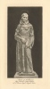
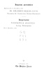
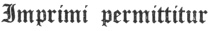

  
[Intangible Textual Heritage](../../index)  [Christianity](../index) 
[Index](index)  [Next](wosf01) 

------------------------------------------------------------------------

[Buy this Book at
Amazon.com](https://www.amazon.com/exec/obidos/ASIN/B00267RU8U/internetsacredte)

------------------------------------------------------------------------

*The Writings of St. Francis of Assisi*, tr. by Paschal Robinson,
\[1905\], at Intangible Textual Heritage

------------------------------------------------------------------------

# The Writings

###### of

## St. Francis of Assisi.

##### NEWLY TRANSLATED INTO ENGLISH WITH AN INTRODUCTION AND NOTES

###### BY

### FATHER PASCHAL ROBINSON

##### of the Order of Friars Minor

#### PHILADELPHIA

#### The Dolphin Press

#### \[1905\]

Scanned at Intangible Textual Heritage, August 2007. Proofed and
formatted by John Bruno Hare. This text is in the public domain in the
United States because it was published prior to 1923.

  [  
Click to enlarge](img/title0.jpg)  
First Title Page  

  [  
Click to enlarge](img/front.jpg)

  [  
Click to enlarge](img/title.jpg)  
Title Page  

 
[  
Click to enlarge](img/verso.jpg)  
Verso  

 

*Paterson die 26 Novembris, 1905*

FR. EDUARDUS BLECKE, O.F.M.

Provinciae SS. Nominis Jesu Minister Provincialis

\_\_\_\_\_\_\_\_\_

 

✠ PATRITIUS JOANNES

Archiep. Philadelphien.

*Die 8 Decembris, 1905*

 

TO THE  
MOST REVEREND

**Father Denis Schuler**

THE ONE HUNDRED AND FIFTH SUCCESSOR OF  
SAINT FRANCIS AS MINISTER GENERAL  
OF THE FRIARS MINOR

------------------------------------------------------------------------

[Next: Contents](wosf01)
