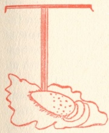
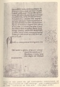

  
[Intangible Textual Heritage](../../index)  [Christianity](../index) 
[Index](index)  [Previous](wosf01)  [Next](wosf03) 

------------------------------------------------------------------------

[Buy this Book at
Amazon.com](https://www.amazon.com/exec/obidos/ASIN/B00267RU8U/internetsacredte)

------------------------------------------------------------------------

*The Writings of St. Francis of Assisi*, tr. by Paschal Robinson,
\[1905\], at Intangible Textual Heritage

------------------------------------------------------------------------

p. ix

### INTRODUCTION.

#### I.

|                     |
|---------------------|
|  |

THE writings of St. Francis may, as is obvious, be considered from more
than one point of view. Premising this, we are afforded a clue to the
difficulty which has led students of Franciscan sources to divide
themselves into two camps as to the objective value of these writings.
Indeed, one writer [1](#fn_0) goes so far as to
compare the attitude of modern scholars toward them to that of the
"Spiritual" and Conventual Friars respectively in the first century of
Franciscan history. For while one party, led by M. Paul Sabatier, [2](#fn_1) attaches what some regard as almost undue
weight to the writings of St. Francis as a source of our knowledge of
him, the other party, following Mgr. Faloci Pulignani, [3](#fn_2) displays, we are told, a tendency to
belittle their importance. The truth is, as Professor Müller long ago
pointed out, [4](#fn_3) that these writings
afford

p. x

us little if any information as to the life of their author, a fact
which may perhaps account for their comparative neglect by so many of
the Saint's biographers, but it is not less true that they bear the
stamp of his personality and reflect his spirit even more faithfully
than the Legends written down on the very morrow of his death by those
who had known him the best of all. [1](#fn_4) For
this reason they are well worth all the serious study that scholars
outside the Franciscan Order are now beginning to give to them.

To say that the writings of St. Francis reflect his personality and his
spirit is but another way of saying that they are at once formidably
mystic and exquisitely human; that they combine great elevation of
thought with much picturesqueness of expression. This twofold element,
which found its development later on in the prose of mystics like St.
Bonaventure and in the verse of poets like Jacopone da Todi, and which
has ever been a marked characteristic of Franciscan ascetic literature,
leads back to the writings of the Founder as to the humble upper waters
of a mighty stream. St. Francis had the soul of an ascetic and the heart
of a poet. His unbounded faith had an almost lyric sweetness about it;
his deep sense of the spiritual is often clothed with the character of
romance. This intimate union of the supernatural and the natural is
nowhere more strikingly manifested than in the writings of St. Francis,
which, after

p. xi

the vicissitudes of well nigh seven hundred winters, are still fragrant
with the fragrance of the Seraphic springtide.

Important as the doctrinal aspect of St. Francis’ writings must of
necessity be to all who would understand his life—since "the springs of
action are to be found in belief, and conduct ultimately rests upon
conviction "—it is foreign to the object of the present volume. I am
here concerned with the literary and historical aspect of these
writings. Suffice it to say that St. Francis’ doctrine, [1](#fn_5) which received, so to speak, the Divine
*Imprimatur* upon the heights of La Verna two years before his
death, [2](#fn_6) is nothing more or less than a
paraphrase of the Sermon on the Mount. Nowhere can there be found a
simpler literalness in the following of the "poverty, humility, and holy
Gospel of the Lord Jesus " than in the writings of St. Francis, and any
attempt to read into them the peculiar doctrines of the Abbot Joachim of
Flora, the Humiliati, the Poor Men

p. xii

of Lyons, or any of their nameless followers, is as unjust as it is
unjustifiable. Needless to add that St. Francis’ writings contain no new
message. Indeed, the frequency with which certain very old and familiar
aspects of the eternal truths are insisted upon by St. Francis in season
and out of season, is not unlikely to weary the average reader who does
not pause to look between the lines. This tendency to repeat himself,
which is habitual with St. Francis, does not necessarily bespeak any
dearth of ideas. On the contrary. His simple, childlike nature fastened
upon three or four leading thoughts "taken from the words of the Lord,"
which seemed to him all-sufficing, and these he works into his writings
over and over, tempering them to the needs of the different classes he
addresses as he understood them. If then we recall the circumstances
under which St. Francis wrote and the condition of those for whom his
writings were intended in the first instance, far from being bored, we
may gain something from each new repetition.

Because St. Francis loved Jesus and His Eucharistic Passion, ardently,
enthusiastically, almost desperately—to borrow Bossuet's adjectives—his
sympathy extended to every creature that suffered or rejoiced. His
writings are eloquent witnesses to this far-reaching, all-embracing
solicitude. They may be said to run over the whole gamut. Witness the
soft note touched in the letter to Brother Leo and the

p. xiii

deep masculine tone in which the Testament is pitched. On the whole,
however, his writings fall naturally under three heads: [1](#fn_7) those, like the Rules, which represent St.
Francis as legislator; those, like the Letter to a Minister, which show
us St. Francis as a spiritual father; and those, like the Praises and
Salutations, in which we see St. Francis as his earliest biographer saw
him—"not so much a man praying as prayer itself." [2](#fn_8)

It was Matthew Arnold, I believe, who first held St. Francis up to
English readers as a literary type [3](#fn_9)—a
type withal as distinct and formal as the author of the *Divine Comedy*.
But however true a poet—and without St. Francis no Dante—it is certain
that the *Poverello* was in no sense a man of letters. He was too little
acquainted with the laws of composition to advance very far in that
direction. His early years had been a bad preparation for study, and he
ever remained a comparative stranger to the ecclesiastical and classical
learning of his time, though probably his culture was larger than we
might be led to conclude from his repeated professions of ignorance and
the disparaging remarks of some of his early biographers. Through his
mother he seems to have got some acquaintance

p. xiv

with French; [1](#fn_10) he received elementary
instruction in reading and writing from the priests at San Giorgio, who
also taught him enough Latin to enable him to write it in later years
after a fashion, [2](#fn_11) and to understand
the ritual of the Church and its hymns, which he was wont to sing by the
wayside. But in considering St. Francis’ literary formation, we must
reckon largely with the education he picked up in the school of the
Troubadours, who at the close of the twelfth century were making for
refinement in Italy. [3](#fn_12) The imagery of
the c*hansons de gestes* seems to have exercised an abiding influence
upon St. Francis’ life and writings, as is evident from his own tale of
the Lady Poverty, which later inspired the pen of Dante and the brush of
Giotto. Witness, too, his frequent allusions to the Knights of the Round
Table; his desire that his Friars should become "the Lord's Jongleurs,"
and his habit of courtesy extended even to Sister Death. [4](#fn_13) On the other hand St. Francis was nothing
if not original. His writings abound not only in allegory and
personification, but also in quaint concepts and

p. xv

naïve deductions. His final argument is often a text of Holy Scripture,
which he uses with a familiarity and freedom altogether remarkable.
Indeed there are parts of his writings in which the interweaving of
Scriptural phrases is so intricate as almost to defy any attempt to
indicate them by references, the more so since the Biblical language
adopted by St. Francis is not always taken from the Bible, but often
from the Liturgy, Missal, and Breviary. [1](#fn_14) For the rest, as Celano puts it, "he left
empty ornaments and roundabout methods of speech and everything
belonging to pomp and to display to those who are ready to perish; for
his part he cared not for the bark, but for the pith; not for the shell,
but for the nut; not for the multiple, but for the one only sovereign
good." [2](#fn_15)

If we may judge from the two solitary autographic fragments of his that
have come down to us, [3](#fn_16) St. Francis
was not by any means a skilful penman. Be this as it may, St.
Bonaventure clearly implies that he had a secretary, [4](#fn_17) to whom

p. xvi

he dictated notes, and affirms with Celano that the Saint signed such
documents as called for his signature with the "sign *thau*," or capital
*T*. [1](#fn_18) Whether or not St. Francis’
practice of signing his name thus has any connection with Brother
Pacifico's vision of the large *T*, [2](#fn_19)
is a matter of conjecture and of small import. What is certain is that
St. Francis wrote little. The most characteristic of his extant writings
are very short, extremely simple in style, and without any trace of
pedantry. If some of the longer pieces seem to show the touch of a more
skilful hand than that of St. Francis, *idiota et simplex*, we need not
on this account feel any misgivings as to their authenticity. Whatever
assistance he may have received in pruning and embellishing certain of
his later compositions from Cæsar of Spires or another, no one who
examines these writings carefully can doubt but that they are the work
of the great Saint himself.

From a literary standpoint perhaps the most carefully composed bit of
St. Francis’ writing that has come down to us is the realistic picture
of the miser's death in the letter "To all the Faithful." More
interesting, however, to the student is the "Canticle of the Sun," not
only as an example of the simple, spontaneous Umbrian dialect rhyme
which St. Francis taught his poet followers to substitute for the
artificial versification

p. xvii

of courtly Latin and Provençal poets, but also because of the light it
throws on St. Francis’ literary method,—if method it may be called. His
piecemeal fashion of composing as the spirit moved him, is also manifest
in a very different work, the First Rule, as is evident from the
modification and additions this strange piece of legislation suffered
during the fourteen years it was in force. [1](#fn_20) St. Francis’ practice of returning to his
old writings, retouching and remoulding them, working them over and
inserting parts of them in his new ones, goes far toward explaining
difficulties which would otherwise arise from the resemblance between
his different compositions.

For the rest, even though St. Francis’ literary culture was incomplete,
his constant contemplation of the "things that are above" and the
perfect purity of his life whetted alike his understanding of
supernatural truth and of the human heart, and so it comes to pass that
his simple words, written down in the far-off thirteenth century and
with a fashion of speech different from ours, yet work wonders to this
day, while the tomes of many a learned doctor "leave all things as they
were before."

It remains to say a few words concerning the history of St. Francis’
writings before coming to the writings themselves.

p. xviii

#### II.

The history of the writings of St. Francis, from the time of their
composition in the far-off thirteenth century down to our own day, opens
up a most interesting field for speculation. Who, it may be asked, first
gathered these writings together? In answer to this question nothing
definite can be said, for the early Legends and Chronicles of the Order
are silent on the subject, and we must rest content to begin our inquiry
with the oldest MS. collections containing the writings of St. Francis.
Many such collections exist in mediæval codices, but any attempt to
classify these MSS. is, in the present state of our documentation, beset
by peculiar difficulties. Not the least of these difficulties arises
from the fact that even as in the Legends or Lives of St. Francis we can
distinguish a double current; [1](#fn_21) so,
too, in the early MS. collections two distinct families or categories
are found representing or rather illustrating the twofold tradition and
observance which date from the very beginnings of Franciscan
history. [2](#fn_22)

The first place among these collections belongs to the MS. numbered 338,
formerly in

 
[  
Click to enlarge](img/_01800.jpg)

PAGE OF THE ASSISI MS. 338 CONTAINING CONCLUSION OF
THE "SALUTATION OF THE VIRTUES" AND COMMENCEMENT OF THE "CANTICLE OF THE
SUN." (See page [xviii](#page_xviii).

p. xix

the Sacro Convento, but now in the municipal library at Assisi. Critics
who have studied this early codex are not in accord as to its age. [1](#fn_23) But it dates at least from the beginning
of the fourteenth century. It includes eleven of the nineteen works here
translated. They are contained in three parchment books in the following
order: fol. 12-16, The Second Rule of the Friars Minor; [2](#fn_24) fol. 16-18, The Testament; [3](#fn_25) fol. 18-23, Admonitions; [4](#fn_26) fol. 23-28, The Letter to All the
Faithful; [5](#fn_27) fol. 28-31, The Letter to
the General Chapter; [6](#fn_28) fol. 31-32,
Instruction to Clerics on the Holy Eucharist; [7](#fn_29) fol. 32, Salutation of the Virtues; [8](#fn_30) fol. 33, The Canticle of the Sun; [9](#fn_31) fol. 34, Paraphrase of the Lord's
Prayer; [10](#fn_32) fol. 34-43, The Office of
the Passion; [11](#fn_33) and fol. 43, The
Regulation for Hermitages. [12](#fn_34)

The same collection either wholly or in part is given in the well-known
fourteenth century compilation of *materia seraphica* known as *Fac
secundum exemplar* from the opening words of its prologue, and which may
be found in the

p. xx

\[paragraph continues\] Vatican MS. 4354,
the Berlin MS. 196, the Lemberg MS. 131, [1](#fn_35) and the Liegnitz MS. 12. [2](#fn_36) The Mazarin MSS. 989 and 1743, [3](#fn_37) as well as the Düsseldorf MS. 132, [4](#fn_38) may also be said to belong to this family
of codices which present the writings of St. Francis in practically the
same number and order as Mariano of Florence adopts in his *Chronicle*,
composed about 1500. [5](#fn_39)

We now come to the second collection of St. Francis’ writings, which is
often found along with the traditional *Legenda Trium Sociorum*, and the
*Speculum Perfectionis*. It is represented by the celebrated Florentine
codex at Ognissanti, [6](#fn_40) the codex 1/25
at St. Isidore's, Rome, [7](#fn_41) the Vatican
MS. 7650, [8](#fn_42) and the codex of the
Capuchin

p. xxi

convent at Foligno, [1](#fn_43) all of which
contain St. Francis’ works in almost the same order as that given by
Bartholomew of Pisa, in his *Liber Conformitatum*. [2](#fn_44)

This second collection of the writings of St. Francis differs from the
first one in several details. In the first place it omits the
Instruction to Clerics on the Holy Eucharist and adds the letter To a
Certain Minister. [3](#fn_45) Again, the Assisi
and Liegnitz MSS., which are typical examples of the first collection,
place the prayer, "O Almighty Eternal God," etc.,  [4](#fn_46) at the end of the letter to the General
Chapter, whereas in the Ognissanti MS. and others of the same family
this prayer is found elsewhere. So, too, in the Assisi and Liegnitz MSS.
the Salutation of the Virtues is inscribed "Salutation of the Virtues
which adorned the Soul of the Blessed Virgin Mary and which ought to
adorn the holy soul," while in the Ognissanti and kindred MSS. the title
of this piece reads: "Salutation of the Virtues and of their efficacy in
confounding Vices." These examples suffice to indicate that this twofold
family of MSS. includes also a two-fold

p. xxii

reading, as becomes more evident from the variants noted elsewhere in
the course of this work. Meanwhile, let us pass on from the MS.
collections of St. Francis’ writings to the

#### PRINTED EDITIONS.

Two diverse compilations, each containing part of the Opuscula, were
published at the beginning of the sixteenth century. The first of these,
known as the *Speculum Vitae B. Francisci et Sociorum ejus*, [1](#fn_47) and quarried largely from the *Actus Beati
Francisci*, contains (fol. 126-127) among various legends and other
narrations some of St. Francis’ prayers, and (fol. 189) also the First
Rule. The second compilation, which is of a much more polemic
character, [2](#fn_48) and which contains a
larger number of the *Opuscula*, appeared successively with some
variations in form at Rouen in 1509 as the *Speculum Minorum*, [3](#fn_49) at Salamanca in 1511 as the *Monumenta
Ordinis Minorum*, [4](#fn_50) and at Paris in
1512 as the

p. xxiii

\[paragraph continues\] *Firmamenta trium
Ordinum B. Francisci*. [1](#fn_51) The
seventeenth century saw the appearance of

#### WADDING'S EDITION.

The honor of making the first serious attempt to collect all the
writings of St. Francis belongs to the renowned Annalist of the Order,
Father Luke Wadding. [2](#fn_52) His celebrated
edition of the *Opuscula* [3](#fn_53) is
distributed in three parts: Part I contains the Letters, Prayers, and
the Testament; Part II, the Rules; and Part III, the Monastic
Conferences, the Office of the Passion and Canticles, followed by
Apophthegms, Colloquies, Prophecies, Parables, Examples, Benedictions,
etc.

Wadding's edition of the *Opuscula* differs mainly from all preceding
collections in this, that whereas the latter contained only those pieces
which as regards both matter and form were the handiwork of St. Francis,
Wadding felt justified in including among St. Francis’ writings many
*dicta* of the Saint found in the early Legends. For example, St.
Bonaventure [4](#fn_54) relates of St. Francis
"Non enim securum *esse putabat* earum formarum introrsus haurire
imagines."

p. xxiv

\[paragraph continues\] Wadding, in his
sixth Conference, by changing *putabat* into *puto*, gives this passage
as the *ipsissima verba* of St. Francis. Again, in the seventeenth
Conference, he entirely changes the form of what St. Bonaventure
elsewhere [1](#fn_55) relates of St. Francis
when he substitutes "Officium praedicationis Patri misericordiarum omni
sacrificio *est* acceptius" for "Istius Miserationis officium Patri
misericordiarum omni sacrificio *firmabat* acceptius."

Thus it comes to pass that in Wadding's edition, side by side with the
undisputed writings of St. Francis, we find doubtful, even. spurious,
extracts from different sources attributed to the Seraphic Father. It
must ever remain a matter of regret that Wadding, instead of following
the oldest MSS. that he had at hand, was content to transcribe the
incomplete and often interpolated parts of them he found in second-hand
compilations, like that of Mark of Lisbon. His work from our standpoint
is vitiated by imperfect research and unreliable criticism. But if
Wadding was more profuse than prudent in his attribution of Franciscan
fragments to the Founder, it must be remembered that he wrote at a time
when even the highest minds troubled themselves little enough about
literary exactness. For what we now glorify as "scientific criticism"
had not yet become the fashion. The faults therefore of Wadding's
edition of the *Opuscula* are largely the faults of

p. xxv

his time; and considering the difficulties to be overcome, the result of
his labors was very creditable. And if he had never undertaken the task
of collecting St. Francis’ writings, any attempt of ours to that end
would be surely more arduous, and perhaps not so fruitful.

Several editions of St. Francis’ writings have appeared since Wadding's
day, notably those published by de la Haye, [1](#fn_56) Von der Burg, [2](#fn_57) and Horoy. [3](#fn_58) But these editions are very imperfect.
Their authors, in spite of the advance made in historical criticism
since Wadding's day, have merely reproduced and rejuvenated the edition
of the great annalist. The same is true of the various translations of
the Opuscula,—they are simply Wadding in Italian, [4](#fn_59) English, [5](#fn_60) French, [6](#fn_61) German, [7](#fn_62) or Spanish, [8](#fn_63) as the case may be.

On the other hand, M. Sabatier's strictures on the "numerous
ecclesiastics" who have edited

p. xxvi

the writings of St. Francis, for not reprinting Wadding's comments on
them, are a trifle wide of the mark, seeing that their editions were
prepared mainly for a class of readers whose point of view is practical
and devotional, rather than theoretical and speculative, who read the
writings of the saints not merely as historical or literary documents,
but as words of spirit and of life. For such a clientele critical notes
would be caviare indeed.

The remarkable upgrowth of interest in the sources of early Franciscan
history that has characterized the literature of the past decade
accentuated the need of a more perfect edition of St. Francis’ writings.
The matter was soon taken in hand by the Friars Minor at
Quaracchi—already famous in the literary history of the Order—and in
1904 they issued the

#### FIRST CRITICAL EDITION

of the *Opuscula*. [1](#fn_64) Without
overlooking the internal character of each document, the Quaracchi
editors based their edition upon the early MS. tradition, weighing by
this standard all the various writings contained in the stereotyped
editions of St. Francis’ works, with the result that many a familiar
page that had come down to us on the good faith of Wadding was

p. xxvii

found wanting. Thus the seventeen letters commonly ascribed to St.
Francis have been reduced to six, the Rules of the Second and Third
Orders have been eliminated, only one of the twenty-eight monastic
conferences, and one of the seven blessings, are left; most of the
prayers have gone, and all the colloquies, prophecies, parables, etc.,
have likewise disappeared. Most likely the doubtful and suppositious
works thus excluded often embody the doctrine and ideas of St. Francis;
to a greater or lesser extent some of them may even be his in substance,
but as there is no good reason to believe they are his own composition
they are not entitled to a place among his writings.

The authentic works of St. Francis left to us then, according to the
Quaracchi edition, are the Admonitions, Salutation of the Virtues,
Instruction on the Blessed Sacrament, the First and Second Rules of the
Friars Minor, the Testament and Regulation for Hermitages, some
fragments from the Rule of the Clares, Six Letters, the Praises of God,
the Salutation of the Blessed Virgin, the *Chartula* containing the
*Laudes* and Benediction for Brother Leo, the prayer *Absorbeat*, and
the Office of the Passion.

The Quaracchi edition does not therefore embody any new matter, but it
contains for the first time in any edition of St. Francis’ works the
letter "To a Minister" in its entirety. For the rest, while purging the
text of St. Francis’ writings of the many doubtful and apocryphal

p. xxviii

pieces with which they had come to be burdened in the course of time,
the Quaracchi editors have perfected the text of the authentic writings
by their emendations and collations, notes and comments, thus conferring
the freedom of no small city upon the students of Franciscan sources.

The year 1904 also saw the publication, almost simultaneously, of two
other works dealing with the *Opuscula* of St. Francis, written by well
known professors at Bonn [1](#fn_65) and
Munich, [2](#fn_66) and both of real
value. [3](#fn_67) It would be foreign to our
present purpose to examine either of these works in detail. Suffice it
to say that they accord in substance almost completely with the
conclusions of the Quaracchi editors. If anything, they lean more on the
side of kindliness toward certain doubtful writings. Thanks to this
trilogy of works, and to certain learned criticisms which they have
called forth from Fr. Van

p. xxix

\[paragraph continues\] Ortroy, [1](#fn_68) M. Sabatier, [2](#fn_69) and Mr. Carmichael [3](#fn_70) among others, we are now in a position to
form a fairly accurate estimate of what St. Francis really *wrote*.

It is obvious, however, that in dealing with writings like those of St.
Francis we are left largely to the probabilities of criticism; and
criticism has by no means said the last word as to the authenticity of
certain pieces. It may yet take away from St. Francis some writings now
commonly ascribed to him; it may even give back to him others at present
with seemingly greater likelihood made over to one or another of his
immediate followers. But in the long run, to whatever criticism St.
Francis’ writings may be subjected, the main lines will always remain
the same. It may well be true as a recent writer [4](#fn_71) has remarked, that it is not yet the time
to essay a complete English edition of St. Francis’ writings, yet withal
the lack of any translation of these writings in English which aims at
fulfilling the requirements of modern criticism has led me to think that
English students of Franciscan literature might be glad to have some
such translation of them, however imperfect. To this end I have ventured

p. xxx

to prepare this humble volume, which may perhaps be suffered
tentatively, at least, to stand in the gap which it is not worthy
permanently to fill.

My first object, then, is to give a literal and, I hope, accurate
translation of the Latin text of the authentic writings of St. Francis
as it stands in the critical Quaracchi edition. The present volume,
however, represents something more than a mere translation of the
Quaracchi text. In the first place it is not restricted to the Latin
works of St. Francis, and as a consequence the "Canticle of the Sun,"
which does not figure in the Quaracchi edition, finds a place here. I
have often deviated from the order of the Quaracchi edition and have
distributed the critical notes throughout the book instead of relegating
them to the end. I have added an Introduction, Appendix, Bibliography
and Index, besides much original matter collected at Quaracchi and
elsewhere in Italy, when I was afforded an opportunity of consulting the
original MS. authorities. I should state that I have not translated all
the variants in the Latin text, but only such as change the sense. A
table I had made for the purpose of indicating the probable date of each
piece, I have omitted, since it remains a matter of pure conjecture when
many were written.

I am glad of this opportunity to record my sincere thanks to all those
who have assisted me in any way in the preparation of this volume. Not
only have I profited by the labors of the

p. xxxi

\[paragraph continues\] Fathers at
Quaracchi, but I have enjoyed the rare advantage of Fr. Leonard Lemmens’
personal interest in the work. To him, therefore, my grateful
recognition is first due. I wish further to acknowledge my indebtedness
to Mr. Montgomery Carmichael, who, amid his own literary labors, made
time to assist me with many helpful suggestions. Moreover, by placing at
my disposal all the references to Holy Scripture which occur in the
Office of the Passion, which he had looked up and translated, he has
afforded me very substantial aid. My thanks are also due to Father
Stephen Donovan, O.F.M., for his kind coöperation in collating the text
of the "Canticle of the Sun," in the Assisi MS., with other versions,
and for contributing the translation of it. For the generous loan of
books of reference I am under obligation to Mgr. O'Hare, Father John J.
Wynne, S.J., Fathers Ludger Beck, and Bede Oldegeering, O.F.M., and Mr.
John A. Tennant; for the gift of their own writings to Father Cuthbert,
O.S.F.C., Luigi Suttina, and Prof. A. G. Little; and for the photographs
here reproduced to Mgr. Faloci Pulignani, M. Paul Sabatier and Signor
Lunghi. I may perhaps be permitted to take this occasion to thank the
Guardians at the Portiuncula, La Verna, St. Damian's, and the Carceri,
as well as the Friars at St. Antony's and St. Isidore's at Rome, at
Ognissanti, Florence, and the Mother Abbess at Santa Chiara, for their
courtesy and hospitality.

p. xxxii

For the rest, it is with a clear sense of its many shortcomings and not
without some diffidence that I offer this volume to the public. I shall
be more than repaid for any labor its preparation may have entailed if
its publication conduces ever so little toward making St. Francis better
known and better loved. To this end I ask the reader to forget all that
may be mine within these pages, and to remember only the words of him
who, "saintlier than any among the saints, among sinners was as one of
themselves." [1](#fn_72)

FR. PASCHAL ROBINSON, O.F.M.,

Franciscan Convent, Paterson, N. J.  
Feast of St. Agnes of [Assisi](errata.htm#0), 1905.

------------------------------------------------------------------------

### Footnotes

[ix:1](wosf02.htm#fr_0) Prof. A. G. Little. See
*English Historical Review*, Oct., 1902, p. 652.

[ix:2](wosf02.htm#fr_1) M. Sabatier's views on
this point are summarized in his *Vie de S. François*, Paris, 1904. See
*Études des Sources*, p. xxxvi.

[ix:3](wosf02.htm#fr_2) Mgr. Faloci's opinion may
be found in his *Miscellanea Francescana*, Foligno, t. VII, p. 115 seq.

[ix:4](wosf02.htm#fr_3) *Die Anfänge des
Minoritenordens*, Freiburg, 1885, p. 3.

[x:1](wosf02.htm#fr_4) See *Opuscula*. Ed.
Quaracchi, p. vi.

[xi:1](wosf02.htm#fr_5) See on this subject the
long study of Cardinal Gabriel de Treio, given by Wadding in the
*Opuscula*. The full title is: "Gabriel, divina miseratione S. R. E.
Tituli S. Pancratii presbyter cardinalis de Treio, in epistola missa ad
R. admodum P. Lucam Wadingum." It is given in substance by Fr.
Apollinaris, O. F. M., in his *Doctrine Spirituelle de S. François*
(Paris, 1878). See also the *Bibliotheca Veterum Patrum* (Cologne,
1618), which ranks St. Francis among the Fathers.

[xi:2](wosf02.htm#fr_6)

" . . . nel crudo sasso, intra Tevere ed Arno,  
Da Cristo prese l’ultimo sigillo,  
Che le sue membra due anni portarno."  
                                         *Paradiso*, XI-114.

[xiii:1](wosf02.htm#fr_7) See Boehmer,
*Analekten*, p. xlv.

[xiii:2](wosf02.htm#fr_8) "Non tam orans quam
oratio factus." 2 Cel. 3, 51.

[xiii:3](wosf02.htm#fr_9) See his chapter on "
Pagan and Mediæval Religious Sentiment " in the *Essays on Criticism*.
Third edition, Macmillan, 1875, pp. 243-248.

[xiv:1](wosf02.htm#fr_10) See *Leg. III Soc.*,
10.

[xiv:2](wosf02.htm#fr_11) Eccleston speaks of
his "false Latin." See below, [p. 132](wosf17.htm#page_132).

[xiv:3](wosf02.htm#fr_12) Some of the greatest
troubadours of Provence were then sojourning in Italy. On their journeys
and influence there see Fauriel, *Histoire de la poésie Provençale*, t.
II, and three articles by the same author in the "Bibliothèque de
l’École des Chartes," t. III and IV. Fragments of their poems are given
by Monaci: *Testi antichi provenzali* (Rome, 1889).

[xiv:4](wosf02.htm#fr_13) See Görres: *Der hl.
Franciscus von Assisi, ein Troubadour* (Ratisbon, 1879).

[xv:1](wosf02.htm#fr_14) I have rendered all
Scripture phrases by the corresponding Douay Version; not, indeed, that
I wish to raise any vexatious question as to the relative merits of the
Douay and the English Authorized Version from a literary point of view,
but because, as every student of Franciscan literature must be aware,
the Biblical passages in the early documents are quoted from the
Vulgate, and the English Authorized Version is not and does not profess
to be a translation of the Vulgate. See *Franciscan Annals*, January,
1905, p. 8.

[xv:2](wosf02.htm#fr_15) 1 Cel. 1.

[xv:3](wosf02.htm#fr_16) See below, [p.
130](wosf17.htm#page_130).

[xv:4](wosf02.htm#fr_17) M. Sabatier (*Vie de S.
François*, p. 5) suggests that Brother Leo may have acted in this
capacity, and invokes the authority of Bernard of Besse to prove it.

[xvi:1](wosf02.htm#fr_18) For the testimony of
St. Bonaventure and Celano see below, [p. 147](wosf21.htm#page_147).

[xvi:2](wosf02.htm#fr_19) See Tract. de
Miraculis., *Anal. Bol.*, t. xviii, p. 115.

[xvii:1](wosf02.htm#fr_20) See below, [p.
27](wosf06.htm#page_27).

[xviii:1](wosf02.htm#fr_21) See Lemmens: De
duobus generibus vitarum S. P. Francisci in *Doct. Ant. Franc.*, P. II,
p. 9; and de Kerval: Les Sources de l’histoire de S. François in
*Bullettino Critico*, fasc. I, p. 3.

[xviii:2](wosf02.htm#fr_22) See Sabatier:
*Opuscules*, fasc. x, p. 133; also Boehmer: *Analekten*, p. vi.

[xix:1](wosf02.htm#fr_23) See Ehrle, S.J.: Die
historischen Handschriften des Klosters San Francesco in Assisi in
*Archiv für Litteratur*, etc., t. I, p.484; Mgr. Faloci Pulignani in the
*Miscell. Francescana*, t. VI, p. 46; M. Sabatier: *Vie de S. François*,
I, p. 370; and Professor Alessandri: *Inventario dei manoscritti della
biblioteca del conv. de S. Francesco di Assisi*, p. 57.

[xix:2](wosf02.htm#fr_24) See page
[64](wosf06.htm#page_64).

[xix:3](wosf02.htm#fr_25) See page
[81](wosf09.htm#page_81).

[xix:4](wosf02.htm#fr_26) See page
[5](wosf03.htm#page_5).

[xix:5](wosf02.htm#fr_27) See page
[98](wosf12.htm#page_98).

[xix:6](wosf02.htm#fr_28) See page
[111](wosf13.htm#page_111).

[xix:7](wosf02.htm#fr_29) See page
[23](wosf05.htm#page_23).

[xix:8](wosf02.htm#fr_30) See page
[20](wosf04.htm#page_20).

[xix:9](wosf02.htm#fr_31) See page
[152](wosf22.htm#page_152).

[xix:10](wosf02.htm#fr_32) See page
[139](wosf18.htm#page_139).

[xix:11](wosf02.htm#fr_33) See page
[155](wosf23.htm#page_155).

[xix:12](wosf02.htm#fr_34) See page
[89](wosf10.htm#page_89).

[xx:1](wosf02.htm#fr_35) See *Speculum
Perfectionis* (ed. Sabatier), p. clxxvi, for description of these three
MSS.

[xx:2](wosf02.htm#fr_36) See Sabatier: Le
Manuscrit de Liegnitz, in *Opuscules*, t. I, p. 33. This codex adds the
Salutation of the Blessed Virgin and the letter to Brother Leo.

[xx:3](wosf02.htm#fr_37) On these MSS. see
*Spec. Perf.* (ed. Sabatier), p. clxiv.

[xx:4](wosf02.htm#fr_38) This MS. adds the
example: *Fuit quidam miles*, etc. See *Actus B. Francisci* (ed.
Sabatier), cap. 66.

[xx:5](wosf02.htm#fr_39) The *Chronicle* of
Mariano, so often quoted by Wadding, is now lost. It comprised five
large volumes in folio. In the first of these he gives the catalogue of
St. Francis’ writings above referred to, and which is reproduced in the
Quaracchi edition after Wadding. I have not deemed it necessary to
translate it here. On Mariano and his works, see Sabatier: Bartholi, p.
137.

[xx:6](wosf02.htm#fr_40) On this MS. see
Minocchi: "La Legenda trium Sociorum," p. 13; also his "Nuovi Studii" in
the *Archiv. Storico Ital.*, t. XXIV, p. 266; see also Sabatier:
Bartholi, p. cxxxv.

[xx:7](wosf02.htm#fr_41) On this MS. see
Lemmens: *Doct. Ant. Franc.*, P. III, P. 52.

[xx:8](wosf02.htm#fr_42) On this MS. see
Sabatier: Bartholi, p. cxlvi.

[xxi:1](wosf02.htm#fr_43) On this MS. see
Faloci: *Misc. Frances.*, t. VII, p. 45; and Sabatier: *Opuscules*, t.
I, p. 359. It may be noted that the Foligno MS. conforms more to that of
St. Isidore's and the Vatican MS. rather to that of Ognissanti.

[xxi:2](wosf02.htm#fr_44) My references to the
*Conformities* are to the Milan edition of 1510. The edition published
in 1590, especially in the historical part, is mutilated and corrupted
at almost every page, as I can personally attest after a comparison of
it with several old MS. versions.

[xxi:3](wosf02.htm#fr_45) See below, [p.
121](wosf14.htm#page_121).

[xxi:4](wosf02.htm#fr_46) See below, [p.
118](wosf13.htm#page_118).

[xxii:1](wosf02.htm#fr_47) It was printed at
Venice "expensis domini Jordani de Dinslaken per Simonem de Lucre" in
1504, and at Metz "per Jasparem Hochffeder" in 1509. Both these editions
are identical. It was republished by Spoelberch at Antwerp in 1620.

[xxii:2](wosf02.htm#fr_48) It is largely a
collection of declarations and expositions of the Rule, and of statutes,
decrees, and privileges concerning the Order.

[xxii:3](wosf02.htm#fr_49) The *Speculum* Morin,
as it is called from the printer, Martin Morin, is now very rare. In a
copy at the National Library, at Paris, it is ascribed to Fr. John
Argomanez, a Spanish provincial. See *Études Franc.*, t. XIII, p. 317.

[xxii:4](wosf02.htm#fr_50) Also at Barcelona, in
1523. See Sbaralea: *Supplementum*, p. 51.

[xxiii:1](wosf02.htm#fr_51) On the edition
published at Venice, in 1513, see Sbaralea: *Supplem*., p. 196.

[xxiii:2](wosf02.htm#fr_52) See *The Life of
Father Luke Wadding*, by Fr. Joseph O'Shea, O.F.M.

[xxiii:3](wosf02.htm#fr_53) See Wadding: *B. P.
Francisci Assisiatis Opuscula*, Antwerp, 1623. See also his *Scriptores
Ordinis Minorum*, p. 112; and Sbaralea: *Supplem*., p. 244.

[xxiii:4](wosf02.htm#fr_54) *Leg. Maj.*, V, 5.

[xxiv:1](wosf02.htm#fr_55) *Leg. Maj.*, VIII, 1.

[xxv:1](wosf02.htm#fr_56) *Opera Omnia S.
Francisci*, Paris, 1641.

[xxv:2](wosf02.htm#fr_57) *Opera B. P.
Francisci*, Cologne, 1849.

[xxv:3](wosf02.htm#fr_58) *Sti Francisci
Assisiensis Opera Omnia*, Paris. 1880 (vol. VI of Bibliotheca
Patristica.)

[xxv:4](wosf02.htm#fr_59) *Oposculi di S.
Francesco*, by Fr. Bernardo da Fivizzano, O.M.Cap., Florence, 1880. The
Latin text is also given in this edition.

[xxv:5](wosf02.htm#fr_60) *Works of St.
Francis*. Translated by a Religious of the Order. London, 1890.

[xxv:6](wosf02.htm#fr_61) *Œuvres de S.
François*. Trans. of Berthaumier. Paris, 1864.

[xxv:7](wosf02.htm#fr_62) *Leben, Regel, and
Werke des h. Franziskus von Assisi*. By Hereneus Haid. Ratisbon, 1856.

[xxv:8](wosf02.htm#fr_63) *Obras Completas del
B. P. S. Francisco de Asis segun la coleccion del P. Wadingo*. Ternel,
1902.

[xxvi:1](wosf02.htm#fr_64) "*Opuscula Sancti
Patris Francisci Assisiensis* sec. Codices MSS. emendata et denuo edita
a PP. Collegii S. Bonaventurae. Ad Claras Aquas (Quaracchi), 1904."

[xxviii:1](wosf02.htm#fr_65) H. Boehmer:
*Analekten zur Geschichte des Franciscus von Assisi. S. Francisci
Opuscula*. Tübingen and Leipzig, 1904.

[xxviii:2](wosf02.htm#fr_66) W. Goetz: *Die
Quellen zur Geschichte des lit. Franciscus von Assisi*. Gotha, 1904. The
part of this work dealing with the *Opuscula* already appeared in the
*Zeitschrift für Kirchengeschichte*. As there is some difference between
the reprint and the original, I have quoted sometimes from one and
sometimes from the other.

[xxviii:3](wosf02.htm#fr_67) There is also an
excellent new French translation by Fr. Ubald d’Alençon, O.M.Cap.,—*Les
Opuscules de Saint Francois d’Assise* (Paris, Poussielgue, 1905). I have
quoted from it elsewhere. A critical Italian edition is in preparation
by Fr. Nicolò Dal-Gal, O.F.M., already well known for his contributions
to Franciscan history.

[xxix:1](wosf02.htm#fr_68) See *Analecta
Bollandiana*, fasc. III, p. 411.

[xxix:2](wosf02.htm#fr_69) Examen de quelques
travaux recents sur les Opuscules de Saint François, in *Opuscules*,
fasc. X.

[xxix:3](wosf02.htm#fr_70) "The Writings of St.
Francis," by Montgomery Carmichael, in the *Month*, January, 1904.

[xxix:4](wosf02.htm#fr_71) See *The Words of St.
Francis*, by Anne Macdonell, p. 7, London, 1904.

[xxxii:1](wosf02.htm#fr_72) 1. Cel. 29.

------------------------------------------------------------------------

[Next: I. Words of Admonition of Our Holy Father St. Francis](wosf03)
