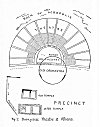

  
[Intangible Textual Heritage](../../index)  [Classics](../index) 
[Index](index)  [Previous](aar06)  [Next](aar08) 

------------------------------------------------------------------------

p. 119

# CHAPTER V

### TRANSITION FROM RITUAL TO ART: THE DROMENON ("THING DONE") AND THE DRAMA

PROBABLY most people when they go to a Greek play for the first time
think it a strange performance. According, perhaps, more to their
temperament than to their training, they are either very much excited or
very much bored. In many minds there will be left a feeling that,
whether they have enjoyed the play or not, they are puzzled: there are
odd effects, conventions, suggestions.

For example, the main deed of the Tragedy, the slaying of hero or
heroine, is not done on the stage. That disappoints some modern minds
unconsciously avid of realism to the point of horror. Instead of a fine
thrilling murder or suicide before his very eyes, the spectator is put
off with an account of the murder done off the stage. This account is
regularly given, and usually at considerable

p. 120

length, in a "messenger's speech." The messenger's speech is a regular
item in a Greek play, and though actually it gives scope not only for
fine elocution, but for real dramatic effect, in theory we feel it
undramatic, and a modern actor has sometimes much ado to make it
acceptable. The spectator is told that all these, to him, odd
conventions are due to Greek restraint, moderation, good taste, and yet
for all their supposed restraint and reserve, he finds when he reads his
Homer that Greek heroes frequently burst into floods of tears when a
self-respecting Englishman would have suffered in silence.

Then again, specially if the play be by Euripides, it ends not with a
"curtain," not with a great decisive moment, but with the appearance of
a god who says a few lines of either exhortation or consolation or
reconciliation, which, after the strain and stress of the action itself,
strikes some people as rather stilted and formal, or as rather flat and
somehow unsatisfying. Worse still, there are in many of the scenes long
dialogues, in which the actors wrangle with each other, and in which the
action does not advance so quickly as we wish. Or again, instead of

p. 121

beginning with the action, and having our curiosity excited bit by bit
about the plot, at the outset some one comes in and tells us the whole
thing in the prologue. Prologues we feel, are out of date, and the
Greeks ought to have known better. Or again, of course we admit that
tragedy must be tragic, and we are prepared for a decent amount of
lamentation, but when an antiphonal lament goes on for pages, we weary
and wish that the chorus would stop lamenting and *do* something.

 

At the back of our modern discontent there is lurking always this queer
anomaly of the chorus. We have in our modern theatre no chorus, and
when, in the opera, something of the nature of a chorus appears in the
ballet, it is a chorus that really dances to amuse and excite us in the
intervals of operatic action; it is not a chorus of doddering and
pottering old men, moralizing on an action in which they are too feeble
to join. Of course if we are classical scholars we do not cavil at the
choral songs; the extreme difficulty of scanning and construing them
alone commands a traditional respect; but if we are merely modern
spectators, we may be respectful,

p. 122

we may even feel strangely excited, but we are certainly puzzled. The
reason of our bewilderment is simple enough. These prologues and
messengers' speeches and ever-present choruses that trouble us are
ritual forms still surviving at a time when the *drama* has fully
developed out of the *dromenon*. We cannot here examine all these ritual
forms in detail; [1](#fn_34) one, however, the
chorus, strangest and most beautiful of all, it is essential we should
understand.

Suppose that these choral songs have been put into English that in any
way represents the beauty of the Greek; then certainly there will be
some among the spectators who get a thrill from the chorus quite unknown
to any modern stage effect, a feeling of emotion heightened yet
restrained, a sense of entering into higher places, filled with a larger
and a purer air--a sense of beauty born clean out of conflict and
disaster.

A suspicion dawns upon the spectator that, great though the tragedies in
themselves are, they owe their peculiar, their incommunicable beauty
largely to this element of the chorus which seemed at first so strange.

p. 123

Now by examining this chorus and understanding its function--nay, more,
by considering the actual *orchestra*, the space on which the chorus
danced, and the relation of that space to the rest of the theatre, to
the stage and the place where the spectators sat--we shall get light at
last on our main central problem: How did art arise out of ritual, and
what is the relation of both to that actual life from which both art and
ritual sprang?

 

The dramas of Æschylus certainly, and perhaps also those of Sophocles
and Euripides, were played not upon the stage, and not in the *theatre*,
but, strange though it sounds to us, in the *orchestra*. The *theatre*
to the Greeks was simply "the place of seeing," the place where the
spectators sat; what they called the skēnē or *scene*, was the tent or
hut in which the actors dressed. But the kernel and centre of the whole
was the *orchestra*, the circular *dancing-place* of the chorus; and, as
the orchestra was the kernel and centre of the theatre, so the chorus,
the band of dancing and singing men--this chorus that seems to us so odd
and even superfluous--was the centre and kernel and starting-point of
the drama. The chorus

p. 124

danced and sang that Dithyramb we know so well, and from the leaders of
that Dithyramb we remember tragedy arose, and the chorus were at first,
as an ancient writer tells us, just men and boys, tillers of the earth,
who danced when they rested from sowing and ploughing.

Now it is in the relation between the *orchestra* or dancing-place of
the chorus, and the *theatre* or place of the spectators, a relation
that shifted as time went on, that we see mirrored the whole development
from ritual to art--from *dromenon* to drama.

 

The orchestra on which the Dithyramb was danced was just a circular
dancing-place beaten flat for the convenience of the dancers, and
sometimes edged by a stone basement to mark the circle. This circular
orchestra is very well seen in the theatre of Epidaurus, of which a
sketch is given in [Fig. 1](#img_fig01). The orchestra here is
surrounded by a splendid *theatron*, or spectator place, with seats
rising tier above tier. If we want to realize the primitive Greek
orchestra or dancing-place, we must think these stone seats away.
Threshing-floors are used in Greece to-day as

p. 125

 

[  
Click to enlarge](img/fig01.jpg)  
Fig. 1. Theatre of Epidaurus. Showing Circular Orchestra  

 

p. 126

convenient dancing-places. The dance tends to be circular because it is
round some sacred thing, at first a maypole, or the reaped corn, later
the figure of a god or his altar. On this dancing-place the whole body
of worshippers would gather, just as now-a-days the whole community will
assemble on a village green. There is no division at first between
actors and spectators; all are actors, all are doing the thing done,
dancing the dance danced. Thus at initiation ceremonies the whole tribe
assembles, the only spectators are the uninitiated, the women and
children. No one at this early stage thinks of building a *theatre*, a
spectator place. It is in the common act, the common or collective
emotion, that ritual starts. This must never be forgotten.

The most convenient spot for a mere dancing-place is some fiat place.
But any one who travels through Greece will notice instantly that all
the Greek theatres that remain at Athens, at Epidaurus, at Delos,
Syracuse, and elsewhere, are built against the side of hills. None of
these are very early; the earliest ancient orchestra we have is at
Athens. It is a simple stone ring, but it is built against the steep
south side of the

p. 127

\[paragraph continues\] Acropolis. The oldest festival of Dionysos was,
as will presently be seen, held in quite another spot, in the *agora*,
or market-place. The reason for moving the dance was that the wooden
seats that used to be set up on a sort of "grand stand" in the
market-place fell down, and it was seen how safely and comfortably the
spectators could be seated on the side of a steep hill.

The spectators are a new and different element, the dance is not only
danced, but it is watched from a distance, it is a spectacle; whereas in
old days all or nearly all were worshippers acting, now many, indeed
most, are spectators, watching, feeling, thinking, not doing. It is in
this new attitude of the spectator that we touch on the difference
between ritual and art; the *dromenon*, the thing actually done by
yourself has become a *drama*, a thing also done, but abstracted from
your doing. Let us look for a moment at the psychology of the spectator,
at his behaviour.

 

Artists, it is often said, and usually felt, are so unpractical. They
are always late for dinner, they forget to post their letters and to
return the books or even money that is lent

p. 128

them. Art is to most people's minds a sort of luxury, not a necessity.
In but recently bygone days music, drawing, and dancing were no part of
a training for ordinary life, they were taught at school as
"accomplishments," paid for as "extras." Poets on their side equally
used to contrast art and life, as though they were things essentially
distinct.

"Art is long, and Time is fleeting."

\[paragraph continues\] Now commonplaces such as these, being
unconscious utterances of the collective mind, usually contain much
truth, and are well worth weighing. Art, we shall show later, is
profoundly connected with life; it is nowise superfluous. But, for all
that, art, both its creation and its enjoyment, is unpractical. Thanks
be to God, life is not limited to the practical.

When we say art is unpractical, we mean that art is *cut loose from
immediate action*. Take a simple instance. A man--or perhaps still
better a child--sees a plate of cherries. Through his senses comes the
stimulus of the smell of the cherries, and their bright colour urging
him, luring him to eat. He eats and is satisfied; the cycle of normal
behaviour is

p. 129

complete; he is a man or a child of action, but he is no artist, and no
art-lover. Another man looks at the same plate of cherries. His sight
and his smell lure him and urge him to eat. He does *not* eat; the cycle
is not completed, and, because he does not eat, the sight of those
cherries, though perhaps not the smell, is altered, purified from
desire, and in some way intensified, enlarged. If he is just a man of
taste, he will take what we call an "æsthetic" pleasure in those
cherries. If he is an actual artist, he will paint not the cherries, but
his vision of them, his purified emotion towards them. He has, so to
speak, come out from the chorus of actors, of cherry-eaters, and become
a spectator.

I borrow, by his kind permission, a beautiful instance of what he well
calls "Psychical Distance" from the writings of a psychologist. [1](#fn_35)

"Imagine a fog at sea: for most people it is an experience of acute
unpleasantness. Apart from the physical annoyance and remoter forms of
discomfort, such as delays, it is apt to produce feelings of peculiar
anxiety, fears of invisible dangers, strains of watching

p. 130

and listening for distant and unlocalized signals. The listless
movements of the ship and her warning calls soon tell upon the nerves of
the passengers; and that special, expectant tacit anxiety and
nervousness, always associated with this experience, make a fog the
dreaded terror of the sea (all the more terrifying because of its very
silence and gentleness) for the expert seafarer no less than the
ignorant landsman.

"Nevertheless, a fog at sea can be a source of intense relish and
enjoyment. Abstract from the experience of the sea-fog, for the moment,
its danger and practical unpleasantness; . . . direct the attention to
the features 'objectively' constituting the phenomena--the veil
surrounding you with an opaqueness as of transparent milk, blurring the
outlines of things and distorting their shapes into weird grotesqueness;
observe the carrying power of the air, producing the impression as if
you could touch some far-off siren by merely putting out your hand and
letting it lose itself behind that white wall; note the curious creamy
smoothness of the water, hypercritically denying as it were, any
suggestion of danger; and, above all, the strange

p. 131

solitude and remoteness from the world, as it can be found only on the
highest mountain tops; and the experience may acquire, in its uncanny
mingling of repose and terror, a flavour of such concentrated poignancy
and delight as to contrast sharply with the blind and distempered
anxiety of its other aspects. This contrast, often emerging with
startling suddenness, is like the momentary switching on of some new
current, or the passing ray of a brighter light, illuminating the
outlook upon perhaps the most ordinary and familiar objects--an
impression which we experience sometimes in instants of direst
extremity, when our practical interest snaps like a wire from sheer
over-tension, and we watch the consummation of some impending
catastrophe with the marvelling unconcern of a mere spectator."

 

It has often been noted that two, and two only, of our senses are the
channels of art and give us artistic material. These two senses are
sight and hearing. Touch and its special modifications, taste and smell,
do not go to the making of art. Decadent French novelists, such as
Huysmann, make their heroes

p. 132

revel in perfume-symphonies, but we feel that the sentiment described is
morbid and unreal, and we feel rightly. Some people speak of a cook as
an "artist," and a pudding as a "perfect poem," but a healthy instinct
rebels. Art, whether sculpture, painting, drama, music, is of sight or
hearing. The reason is simple. Sight and hearing are the distant senses;
sight is, as some one has well said, "touch at a distance." Sight and
hearing are of things already detached and somewhat remote; they are the
fitting channels for art which is cut loose from immediate action and
reaction. Taste and touch are too intimate, too immediately vital. In
Russian, as Tolstoi has pointed out (and indeed in other languages the
same is observable), the word for beauty (*krasota*) means, to begin
with, only that which pleases the sight. Even hearing is excluded. And
though latterly people have begun to speak of an "ugly deed" or of
"beautiful music," it is not good Russian. The simple Russian does not
make Plato's divine muddle between the good and the beautiful. If a man
gives his coat to another, the Russian peasant, knowing no foreign
language, will not say the man has acted "beautifully."

p. 133

To see a thing, to feel a thing, as a work of art, we must, then, become
for the time unpractical, must be loosed from the fear and the flurry of
actual living, must become spectators. Why is this? Why can we not live
and look at once? The *fact* that we cannot is clear. If we watch a
friend drowning we do not note the exquisite curve made by his body as
he falls into the water, nor the play of the sunlight on the ripples as
he disappears below the surface; we should be inhuman, æsthetic fiends
if we did. And again, why? It would do our friend no harm that we should
enjoy the curves and the sunlight, provided we also threw him a rope.
But the simple fact is that we *cannot* look at the curves and the
sunlight because our whole being is centred on acting, on saving him; we
cannot even, at the moment, fully feel our own terror and impending
loss. So again if we want to see and to feel the splendour and vigour of
a lion, or even to watch the cumbrous grace of a bear, we prefer that a
cage should intervene. The cage cuts off the need for motor actions; it
interposes the needful physical and moral distance, and we are free for
contemplation. Released from our own terrors, we see more and

p. 134

better, and we feel differently. A man intent on action is like a horse
in blinkers, he goes straight forward, seeing only the road ahead.

Our brain is, indeed, it would seem, in part, an elaborate arrangement
for providing these blinkers. If we saw and realized the whole of
everything, we should want to do too many things. The brain allows us
not only to remember, but, which is quite as important, to forget and
neglect; it is an organ of oblivion. By neglecting most of the things we
see and hear, we can focus just on those which are important for action;
we can cease to be potential artists and become efficient practical
human beings; but it is only by limiting our view, by a great
renunciation as to the things we see and feel. The artist does just the
reverse. He renounces doing in order to practise seeing. He is by nature
what Professor Bergson calls "distrait," aloof, absent-minded, intent
only, or mainly, on contemplation. That is why the ordinary man often
thinks the artist a fool, or, if he does not go so far as that, is made
vaguely uncomfortable by him, never really understands him. The artist's
focus, all his system

p. 135

of values, is different, his world is a world of images which are his
realities.

 

The distinction between art and ritual, which has so long haunted and
puzzled us, now comes out quite clearly, and also in part the relation
of each to actual life. Ritual, we saw, was a re-presentation or a
pre-presentation, a re-doing or pre-doing, a copy or imitation of life,
but,--and this is the important point,--always with a practical end. Art
is also a representation of life and the emotions of life, but cut loose
from immediate action. Action may be and often is represented, but it is
not that it may lead on to a practical further end. The end of art is in
itself. Its value is not mediate but *im*mediate. Thus ritual *makes, as
it were, a bridge between real life and art*, a bridge over which in
primitive times it would seem man must pass. In his actual life he hunts
and fishes and ploughs and sows, being utterly intent on the practical
end of gaining his food; in the *dromenon* of the Spring Festival,
though his acts are unpractical, being mere singing and dancing and
mimicry, his *intent* is practical, to induce the return of his
food-supply.

p. 136

\[paragraph continues\] In the drama the representation may remain for a
time the same, but the intent is altered: man has come out from action,
he is separate from the dancers, and has become a spectator. The drama
is an end in itself.

 

We know from tradition that in Athens ritual became art, a *dromenon*
became the drama, and we have seen that the shift is symbolized and
expressed by the addition of the *theatre*, or spectator-place, to the
orchestra, or dancing-place. We have also tried to analyse the meaning
of the shift. It remains to ask what was its cause. Ritual does not
always develop into art, though in all probability dramatic art has
always to go through the stage of ritual. The leap from real life to the
emotional contemplation of life cut loose from action would otherwise be
too wide. Nature abhors a leap, she prefers to crawl over the ritual
bridge. There seem at Athens to have been two main causes why the
*dromenon* passed swiftly, inevitably, into the drama. They are, first,
the decay of religious faith; second, the influx from abroad of a new
culture and new dramatic material.

It may seem surprising to some that the

p. 137

decay of religious faith should be an impulse to the birth of art. We
are accustomed to talk rather vaguely of art "as the handmaid of
religion"; we think of art as "inspired by" religion. But the decay of
religious faith of which we now speak is not the decay of faith in a
god, or even the decay of some high spiritual emotion; it is the decay
of a belief in the efficacy of certain magical rites, and especially of
the Spring Rite. So long as people believed that by excited dancing, by
bringing in an image or leading in a bull you could induce the coming of
Spring, so long would the *dromena* of the Dithyramb be enacted with
intense enthusiasm, and with this enthusiasm would come an actual
accession and invigoration of vital force. But, once the faintest doubt
crept in, once men began to be guided by experience rather than custom,
the enthusiasm would die down, and the collective invigoration no longer
be felt. Then some day there will be a bad summer, things will go all
wrong, and the chorus will sadly ask: "Why should I dance my dance?"
They will drift away or become mere spectators of a rite established by
custom. The rite itself will die down, or it will live on

p. 138

only as the May Day rites of to-day, a children's play, or at best a
thing done vaguely "for luck."

The spirit of the rite, the belief in its efficacy, dies, but the rite
itself, the actual mould, persists, and it is this ancient ritual mould,
foreign to our own usage, that strikes us to-day, when a Greek play is
revived, as odd and perhaps chill. A *chorus*, a band of dancers there
must be, because the drama arose out of a ritual dance. An *agon*, or
contest, or wrangling, there will probably be, because Summer contends
with Winter, Life with Death, the New Year with the Old. A tragedy must
be tragic, must have its *pathos*, because the Winter, the Old Year,
must die. There must needs be a swift transition, a clash and change
from sorrow to joy, what the Greeks called a *peripeteia*, a
*quick-turn-round*, because, though you carry out Winter, you bring in
Summer. At the end we shall have an Appearance, an Epiphany of a god,
because the whole gist of the ancient ritual was to summon the spirit of
life. All these ritual forms haunt and shadow the play, whatever its
plot, like ancient traditional ghosts; they underlie and

p. 139

sway the movement and the speeches like some compelling rhythm.

Now this ritual mould, this underlying rhythm, is a fine thing in
itself; and, moreover, it was once shaped and cast by a living spirit:
the intense immediate desire for food and life, and for the return of
the seasons which bring that food and life. But we have seen that, once
the faith in man's power magically to bring back these seasons waned,
once he began to doubt whether he could really carry out Winter and
bring in Summer, his emotion towards these rites would cool. Further, we
have seen that these rites repeated year by year ended, among an
imaginative people, in the mental creation of some sort of daimon or
god. This dæmon, or god, was more and more held responsible on his own
account for the food-supply and the order of the Horne, or Seasons; so
we get the notion that this dæmon or god himself led in the Seasons;
Hermes dances at the head of the Charites, or an Eiresione is carried to
Helios and the Horne. The thought then arises that this man-like dæmon
who rose from a real King of the May, must himself be approached and
dealt with as a man, bargained with,

p. 140

sacrificed to. In a word, in place of *dromena*, things done, we get
gods worshipped; in place of sacraments, holy bulls killed and eaten in
common, we get sacrifices in the modern sense, holy bulls offered to yet
holier gods. The relation of these figures of gods to art we shall
consider when we come to sculpture.

So the *dromenon*, the thing done, wanes, the prayer, the praise, the
sacrifice waxes. Religion moves away from drama towards theology, but
the ritual mould of the *dromenon* is left ready for a new content.

Again, there is another point. The magical *dromenon*, the Carrying out
of Winter, the Bringing in of Spring, is doomed to an inherent and
deadly monotony. It is only when its magical efficacy is intensely
believed that it can go on. The life-history of a holy bull is always
the same; its magical essence is that it should be the same. Even when
the life-dæmon is human his career is unchequered. He is born,
initiated, or born again; he is married, grows old, dies, is buried; and
the old, old story is told again next year. There are no fresh personal
incidents, peculiar to one particular dæmon. If the drama rose from the
Spring Song only, beautiful it might

p. 141

be, but with a beauty that was monotonous, a beauty doomed to sterility.

We seem to have come to a sort of *impasse*, the spirit of the
*dromenon* is dead or dying, the spectators will not stay long to watch
a doing doomed to monotony. The ancient moulds are there, the old
bottles, but where is the new wine? The pool is stagnant; what angel
will step down to trouble the waters?

 

Fortunately we are not left to conjecture what *might* have happened. In
the case of Greece we know, though not as clearly as we wish, what did
happen. We can see in part why, though the *dromena* of Adonis and
Osiris, emotional as they were and intensely picturesque, remained mere
ritual; the *dromenon* of Dionysos, his Dithyramb, blossomed into drama.

Let us look at the facts, and first at some structural facts in the
building of the theatre.

We have seen that the orchestra, with its dancing chorus, stands for
ritual, for the stage in which all were worshippers, all joined in a
rite of practical intent. We further saw that the *theatre*, the place
for the

p. 142

spectators, stood for art. In the orchestra all is life and dancing; the
marble *seats* are the very symbol of rest, aloofness from action,
contemplation. The seats for the spectators grow and grow in importance
till at last they absorb, as it were, the whole spirit, and give their
name *theatre* to the whole structure; action is swallowed up in
contemplation. But contemplation of what? At first, of course, of the
ritual dance, but not for long. That, we have seen, was doomed to a
deadly monotony. In a Greek theatre there was not only orchestra and a
spectator-place, there was also a *scene* or *stage*.

The Greek word for stage is, as we said, *skenè*, our scene. The *scene*
was not a stage in our sense, *i. e.* a platform raised so that the
players might be better viewed. It was simply a tent, or rude hut, in
which the players, or rather dancers, could put on their ritual dresses.
The fact that the Greek theatre had, to begin with, no permanent stage
in our sense, shows very clearly how little it was regarded as a
spectacle. The ritual dance was a *dromenon*, a thing to be done, not a
thing to be looked at. The history of the Greek stage is one long story
of the

p. 143

encroachment of the stage on the orchestra. At first a rude platform or
table is set up, then scenery is added; the movable tent is translated
into a stone house or a temple front. This stands at first outside the
orchestra; then bit by bit the *scene* encroaches till the sacred circle
of the dancing-place is cut clean across. As the drama and the stage
wax, the *dromenon* and the orchestra wane.

This shift in the relation of dancing-place and stage is very clearly
seen in [Fig. 2](#img_fig02), a plan of the Dionysiac theatre at Athens
([p. 144](#page_144)). The old circular orchestra shows the dominance of
ritual; the new curtailed orchestra of Roman times and semicircular
shape shows the dominance of the spectacle.

Greek tragedy arose, Aristotle has told us, from the leaders of the
Dithyramb, the *leaders* of the Spring Dance. The Spring Dance, the mime
of Summer and Winter, had, as we have seen, only one actor, one actor
with two parts--Death and Life. With only one play to be played, and
that a one-actor play, there was not much need for a stage. A *scene*,
that is a *tent*, was needed, as we saw, because all the dancers had to
put on their

p. 144

 

[  
Click to enlarge](img/fig02.jpg)  
Dionysiac Theatre at Athens  

 

p. 145

ritual gear, but scarcely a stage. From a rude platform the prologue
might be spoken, and on that platform the Epiphany or Appearance of the
New Year might take place; but the play played, the life-history of the
life-spirit, was all too familiar; there was no need to look, the thing
was to dance. You need a stage--not necessarily a raised stage, but a
place apart from the dancers--when you have new material for your
players, something you need to look at, to attend to. In the sixth
century B.C., at Athens, came the great innovation. Instead of the old
plot, the life-history of the life-spirit, with its deadly monotony, new
plots were introduced, not of life-spirits but of human individual
heroes. In a word, Homer came to Athens, and out of Homeric stories
playwrights began to make their plots. This innovation was the death of
ritual monotony and the *dromenon*. It is not so much the old that dies
as the new that kills.

 

Æschylus himself is reported to have said that his tragedies were
"slices from the great banquet of Homer." The metaphor is not a very
pleasing one, but it expresses a truth.

p. 146

\[paragraph continues\] By Homer, Æschylus meant not only our *Iliad*
and *Odyssey*, but the whole body of Epic or Heroic poetry which centred
round not only the Siege of Troy but the great expedition of the *Seven
Against Thebes*, and which, moreover, contained the stories of the
heroes before the siege began, and their adventures after it was ended.
It was from these heroic sagas for the most part, though not wholly,
that the *myths* or plots of not only Æschylus but also Sophocles and
Euripides, and a host of other writers whose plays are lost to us, are
taken. The new wine that was poured into the old bottles of the
*dromena* at the Spring Festival was the heroic saga. We know as an
historical fact, the name of the man who was mainly responsible for this
inpouring--the great democratic tyrant Peisistratos. We must look for a
moment at what Peisistratos found, and then pass to what he did.

He found an ancient Spring *dromenon*, perhaps well-nigh effete. Without
destroying the old he contrived to introduce the new, to add to the old
plot of Summer and Winter the life-stories of heroes, and thereby arose
the drama.

p. 147

Let us look first, then, at what Peisistratos found.

The April festival of Dionysos at which the great dramas were performed
was not the earliest festival of the god. Thucydides [1](#fn_36) expressly tells us that on the 12th day of
the month Anthesterion, that is in the quite early spring, at the turn
of our February and March, were celebrated *the more ancient Dionysia*.
It was a three-days' festival. [2](#fn_37) On
the first day, called "Cask-opening," the jars of new wine were
broached. Among the Bœotians the day was called not the day of Dionysos,
but the day of the Good or Wealthy Daimon. The next day was called the
day of the "Cups"--there was a contest or *agon* of drinking. The last
day was called the "Pots," and it, too, had its "Pot-Contests." It is
the ceremonies of this day that we must notice a little in detail; for
they are very surprising. "Casks," "Cups," and "Pots," sound primitive
enough. "Casks" and "Cups" go well with the wine-god, but the "Pots"
call for explanation.

The second day of the "Cups," joyful

p. 148

though it sounds, was by the Athenians counted unlucky, because on that
day they believed "the ghosts of the dead rose up." The sanctuaries were
roped in, each householder anointed his door with pitch, that the ghost
who tried to enter might catch and stick there. Further, to make
assurance doubly sure, from early dawn he chewed a bit of buckthorn, a
plant of strong purgative powers, so that, if a ghost should by evil
chance go down his throat, it should at least be promptly expelled.

For two, perhaps three, days of constant anxiety and ceaseless
precautions the ghosts fluttered about Athens. Men's hearts were full of
nameless dread, and, as we shall see, hope. At the close of the third
day the ghosts, or, as the Greeks called them, *Keres*, were bidden to
go. Some one, we do not know whom, it may be each father of a household,
pronounced the words: "Out of the door, ye Keres; it is no longer
Anthesteria," and, obedient, the Keres were gone.

But before they went there was a supper for these souls. All the
citizens cooked a *panspermia* or "Pot-of-all-Seeds," but of this
Pot-of-all-Seeds no citizen tasted. It was made

p. 149

over to the spirits of the under-world and Hermes their daimon, Hermes
"Psychopompos," Conductor, Leader of the dead.

 

We have seen how a forest people, dependent on fruit trees and berries
for their food, will carry a maypole and imagine a tree-spirit. But a
people of agriculturists will feel and do and think quite otherwise;
they will look, not to the forest but to the earth for their returning
life and food; they will sow seeds and wait for their sprouting, as in
the gardens of Adonis. Adonis seems to have passed through the two
stages of Tree-Spirit and Seed-Spirit; his effigy was sometimes a tree
cut down, sometimes his planted "Gardens." Now seeds are many,
innumerable, and they are planted in the earth, and a people who bury
their dead know, or rather feel, that the earth is dead man's land. So,
when they prepare a pot of seeds on their All Souls' Day, it is not
really or merely as a "supper for the souls," though it may be that
kindly notion enters. The ghosts have other work to do than to eat their
supper and go. They take that supper "of all seeds," that panspermia,
with them down to the world below,

p. 150

that they may tend it and foster it and bring it back in autumn as a pot
of *all fruits*, a *pankarpia*.

 

"Thou fool, that which thou sowest is not quickened except it die."

 

The dead, then, as well as the living--this is for us the important
point--had their share in the *dromena* of the "more ancient Dionysia."
These agricultural spring *dromena* were celebrated just outside the
ancient city gates, in the *agora*, or place of assembly, on a circular
dancing-place, near to a very primitive sanctuary of Dionysos which was
opened only once in the year, at the Feast of Cups. Just outside the
gates was celebrated yet another festival of Dionysos equally primitive,
called the "Dionysia in the Fields." It had the form though not the date
of our May Day festival. Plutarch [1](#fn_38)
thus laments over the "good old times": "In ancient days," he says, "our
fathers used to keep the feast of Dionysos in homely, jovial fashion.
There was a procession, a jar of wine and a *branch*; then some one
dragged in a goat,

p. 151

another followed bringing a wicker basket of figs, and, to crown all,
the phallos." It was just a festival of the fruits of the whole earth:
wine and the basket of figs and the branch for vegetation, the goat for
animal life, the phallos for man. No thought here of the dead, it is all
for the living and his food.

 

Such sanctities even a great tyrant might not tamper with. But if you
may not upset the old you may without irreverence add the new.
Peisistratos probably cared little for, and believed less in, magical
ceremonies for the renewal of fruits, incantations of the dead. We can
scarcely picture him chewing buckthorn on the day of the "Cups," or
anointing his front door with pitch to keep out the ghosts. Very wisely
he left the Anthesteria and the kindred festival "in the fields" where
and as they were. But for his own purposes he wanted to do honour to
Dionysos, and also above all things to enlarge and improve the rites
done in the god's honour, so, leaving the old sanctuary to its fate, he
built a new temple on the south side of the Acropolis where the present
theatre

p. 152

now stands, and consecrated to the god a new and more splendid precinct.

He did not build the present theatre, we must always remember that. The
rows of stone seats, the chief priest's splendid marble chair, were not
erected till two centuries later. What Peisistratos did was to build a
small stone temple (see [Fig. 2](#img_fig02)), and a great round
orchestra of stone close beside it. Small fragments of the circular
foundation can still be seen. The spectators sat on the hill-side or on
wooden seats; there was as yet no permanent *theātron* or
spectator-place, still less a stone stage; the *dromena* were done on
the dancing-place. But for spectator-place they had the south slope of
the Acropolis. What kind of wooden stage they had unhappily we cannot
tell. It may be that only a portion of the orchestra was marked off.

 

Why did Peisistratos, if he cared little for "magic and ancestral
ghosts, take such trouble to foster and amplify the worship of this
maypole-spirit, Dionysos? Why did he add to the Anthesteria, the
festival of the family ghosts and the peasant festival "in the fields,"

p. 153

a new and splendid festival, a little later in the spring, the *Great
Dionysia*, or *Dionysia of the City*? One reason among others was
this--Peisistratos was a "tyrant."

Now a Greek "tyrant" was not in our sense "tyrannical." He took his own
way, it is true, but that way was to help and serve the common people.
The tyrant was usually raised to his position by the people, and he
stood for democracy, for trade and industry, as against an idle
aristocracy. It was but a rudimentary democracy, a democratic tyranny,
the power vested in one man, but it stood for the rights of the many as
against the few. Moreover, Dionysos was always of the people, of the
"working classes," just as the King and Queen of the May are now. The
upper classes worshipped then, as now, not the Spirit of Spring *but
their own ancestors*. But--and this was what Peisistratos with great
insight saw--Dionysos must be transplanted from the fields to the city.
The country is always conservative, the natural stronghold of a landed
aristocracy, with fixed traditions; the city with its closer contacts
and consequent swifter changes, and, above all, with its acquired, not
inherited, wealth, tends towards

p. 154

democracy. Peisistratos left the Dionysia "in the fields," but he added
the Great Dionysia "in the city."

Peisistratos was not the only tyrant who concerned himself with the
*dromena* of Dionysos. Herodotos [1](#fn_39)
tells the story of another tyrant, a story which is like a window
opening suddenly on a dark room. At Sicyon, a town near Corinth, there
was in the *agora* a *heroon*, a hero-tomb, of an Argive hero, Adrastos.

"The Sicyonians," says Herodotos, "paid other honours to Adrastos, and,
moreover, they celebrated his death and disasters with tragic choruses,
not honouring Dionysos but Adrastos." We think of "tragic" choruses as
belonging exclusively to the theatre and Dionysos; so did Herodotus, but
clearly here they belonged to a local hero. His adventures and his death
were commemorated by choral dances and songs. Now when Cleisthenes
became tyrant of Sicyon he felt that the cult of the local hero was a
danger. What did he do? Very adroitly he brought in from Thebes another
hero as rival to Adrastos. He then split up the worship of Adrastos;
part of

p. 155

his worship, and especially his sacrifices, he gave to the new Theban
hero, but the tragic choruses he gave to the common people's god, to
Dionysos. Adrastos, the objection-able hero, was left to dwindle and
die. No local hero can live on without his cult.

The act of Cleisthenes seems to us a very drastic proceeding. But
perhaps it was not really so revolutionary as it seems. The local hero
was not so very unlike a local *dæmon*, a Spring or Winter spirit. We
have seen in the Anthesteria how the paternal ghosts are expected to
look after the seeds in spring. The more important the ghost the more
incumbent is this duty upon him. *Noblesse oblige*. On the river
Olynthiakos [1](#fn_40) in Northern Greece stood
the tomb of the hero Olynthos, who gave the river its name. In the
spring months of Anthesterion and Elaphebolion the river rises and an
immense shoal of fish pass from the lake of Bolbe to the river of
Olynthiakos, and the inhabitants round about can lay in a store of salt
fish for all their needs. "And it is a wonderful fact that they never
pass by the monument of Olynthus. They say that

p. 156

formerly the people used to perform the accustomed rites to the dead in
the month Elaphebolion, but now they do them in Anthesterion, *and that
on this account the fish come up in those months only* in which they are
wont to do honour to the dead." The river is the chief source of the
food-supply, so to send fish, not seeds and flowers, is the dead hero's
business.

Peisistratos was not so daring as Cleisthenes. We do not hear that he
disturbed or diminished any local cult. He did not attempt to move the
Anthesteria with its ghost cult; he only added a new festival, and
trusted to its recent splendour gradually to efface the old. And at this
new festival he celebrated the deeds of other heroes, not local but of
greater splendour and of wider fame. If he did not bring Homer to
Athens, he at least gave Homer official recognition. Now to bring Homer
to Athens was like opening the eyes of the blind.

 

Cicero, in speaking of the influence of Peisistratos on literature,
says: "He is said to have arranged in their present order the works of
Homer, which were previously in

p. 157

confusion." He arranged them not for what we should call "publication,"
but for public recitation, and another tradition adds that he or his son
fixed the order of their recitation at the great festival of "All
Athens," the Panathenaia. Homer, of course, was known before in Athens
in a scrappy way; now he was publicly, officially promulgated. It is
probable, though not certain, that the "Homer" which Peisistratos
prescribed for recitation at the Panathenaia was just our *Iliad* and
*Odyssey*, and that the rest of the heroic cycle, all the remaining
"slices" from the heroic banquet, remained as material for dithyrambs
and dramas. The "tyranny" of Peisistratos and his son lasted from 560 to
501 B.C.; tradition said that the first dramatic contest was held in the
new theatre built by Peisistratos in 535 B.C., when Thespis won the
prize. Æschylus was born in 525 B.C.; his first play, with a plot from
the heroic saga, the *Seven Against Thebes*, was produced in 467 B.C. It
all came very swiftly, the shift from the dithyramb as Spring Song to
the heroic drama was accomplished in something much under a century. Its
effect on the whole of Greek life and religion--nay, on the whole

p. 158

of subsequent literature and thought--was incalculable. Let us try to
see why.

 

Homer was the outcome, the expression, of an "heroic" age. When we use
the word "heroic" we think vaguely of something brave, brilliant,
splendid, something exciting and invigorating. A hero is to us a man of
clear, vivid personality, valiant, generous, perhaps hot-tempered, a
good friend and a good hater. The word "hero" calls up such figures as
Achilles, Patroklos, Hector, figures of passion and adventure. Now such
figures, with their special virtues, and perhaps their proper vices, are
not confined to Homer. They occur in any and every heroic age. We are
beginning now to see that heroic poetry, heroic characters, do not arise
from any peculiarity of race or even of geographical surroundings, but,
given certain social conditions, they may, and do, appear anywhere and
at any time. The world has seen several heroic ages, though it is,
perhaps, doubtful if it will ever see another. What, then, are the
conditions that produce an heroic age? and why was this influx of heroic
poetry, coming just when it did, of such immense influence

p. 159

on, and importance to, the development of Greek dramatic art? Why had it
power to change the old, stiff, ritual dithyramb into the new and living
drama? Why, above all things, did the democratic tyrant Peisistratos so
eagerly welcome it to Athens?

In the old ritual dance the individual was nothing, the choral band, the
group, every-thing, and in this it did but reflect primitive tribal
life. Now in the heroic *saga* the individual is everything, the mass of
the people, the tribe, or the group, are but a shadowy background which
throws up the brilliant, clear-cut personality into a more vivid light.
The epic poet is all taken up with what he called *klea andron*,
"glorious deeds of men," of individual heroes; and what these heroes
themselves ardently long and pray for is just this glory, this personal
distinction, this deathless fame for their great deeds. When the armies
meet it is the leaders who fight in single combat. These glorious heroes
are for the most part kings, but not kings in the old sense, not
hereditary kings bound to the soil and responsible for its fertility.
Rather they are leaders in war and adventure; the homage

p. 160

paid them is a personal devotion for personal character; the leader must
win his followers by bravery, he must keep them by personal generosity.
Moreover, heroic wars are oftenest not tribal feuds consequent on tribal
raids, more often they arise from personal grievances, personal
jealousies; the siege of Troy is undertaken not because the Trojans have
raided the cattle of the Achæans, but because a single Trojan, Paris,
has carried off Helen, a single Achæan's wife.

Another noticeable point is that in heroic poems scarcely any one is
safely and quietly at home. The heroes are fighting in far-off lands or
voyaging by sea; hence we hear little of tribal and even of family ties.
The real centre is not the hearth, but the leader's tent or ship. Local
ties that bind to particular spots of earth are cut, local differences
fall into abeyance, a sort of cosmopolitanism, a forecast of
pan-Hellenism, begins to arise. And a curious point--all this is
reflected in the gods. We hear scarcely anything of local cults, nothing
at all of local magical maypoles and Carryings-out of Winter and
Bringings-in of Summer, nothing whatever of "Suppers" for the souls, or
even of worship

p. 161

paid to particular local heroes. A man's ghost when he dies does not
abide in its grave ready to rise at springtime and help the seeds to
sprout; it goes to a remote and shadowy region, a common, pan-Hellenic
Hades. And so with the gods themselves; they are cut clean from earth
and from the local bits of earth out of which they grew--the sacred
trees and holy stones and rivers and still holier beasts. There is not a
holy Bull to be found in all Olympus, only figures of men, bright and
vivid and intensely personal, like so many glorified, transfigured
Homeric heroes.

In a word, the heroic spirit, as seen in heroic poetry, is the outcome
of a society cut loose from its roots, of a time of migrations, of the
shifting of populations. [1](#fn_41) But more is
needed, and just this something more the age that gave birth to Homer
had. We know now that before the northern people whom we call Greeks,
and who called themselves Hellenes, came down into Greece, there had
grown up in the basin of the Ægean a civilization splendid, wealthy,
rich in art and already ancient, the civilization that has come to light
at Troy, Mycenæ, Tiryns, and most of

p. 162

all in Crete. The adventurers from North and South came upon a land rich
in spoils, where a chieftain with a band of hardy followers might sack a
city and dower himself and his men with sudden wealth. Such conditions,
such a contact of new and old, of settled splendour beset by unbridled
adventure, go to the making of a heroic age, its virtues and its vices,
its obvious beauty and its hidden ugliness. In settled, social
conditions, as has been well remarked, "most of the heroes would sooner
or later have found themselves in prison."

A heroic age, happily for society, cannot last long; it has about it
while it does last a sheen of passing and pathetic splendour, such as
that which lights up the figure of Achilles, but it is bound to fade and
pass. A heroic *society* is almost a contradiction in terms. Heroism is
for individuals. If a society is to go on at all it must strike its
roots deep in some soil, native or alien. The bands of adventurers must
disband and go home, or settle anew on the land they have conquered.
They must beat their swords into plowshares and their spears into
pruning-hooks. Their gallant, glorious leader must become a sober,
home-keeping, law-giving

p. 163

and law-abiding king; his followers must abate their individuality and
make it subserve a common social purpose.

Athens, in her sheltered peninsula, lay somewhat outside the tide of
migrations and heroic exploits. Her population and that of all Attica
remained comparatively unchanged; her kings are kings of the stationary,
law-abiding, state-reforming type; Cecrops, Erechtheus, Theseus, are not
splendid, flashing, all-conquering figures like Achilles and Agamemnon.
Athens might, it would seem, but for the coming of Homer, have lain
stagnant in a backwater of conservatism, content to go on chanting her
traditional Spring Songs year by year. It is a wonderful thing that this
city of Athens, beloved of the gods, should have been saved from the
storm and stress, sheltered from what might have broken, even shattered
her, spared the actual horrors of a heroic *age*, yet given heroic
*poetry*, given the clear wine-cup poured when the ferment was over. She
drank of it deep and was glad and rose up like a giant refreshed.

 

We have seen that to make up a heroic age there must be two factors, the
new and the

p. 164

old; the young, vigorous, warlike people must seize on, appropriate, in
part assimilate, an old and wealthy civilization. It almost seems as if
we might go a step farther, and say that for every great movement in art
or literature we must have the same conditions, a contact of new and
old, of a new spirit seizing or appropriated by an old established
order. Anyhow for Athens the historical fact stands certain. The amazing
development of the fifth-century drama is just this, the old vessel of
the ritual Dithyramb filled to the full with the new wine of the heroic
*saga*; and it would seem that it was by the hand of Peisistratos, the
great democratic tyrant, that the new wine was outpoured.

 

Such were roughly the outside conditions under which the drama of art
grew out of the *dromena* of ritual. The racial secret of the individual
genius of Æschylus and the forgotten men who preceded him we cannot hope
to touch. We can only try to see the conditions in which they worked and
mark the splendid new material that lay to their hands. Above all things
we can see that this material, these Homeric *saga*, were just fitted

p. 165

to give the needed impulse to art. The Homeric *saga* had for an
Athenian poet just that remoteness from immediate action which, as we
have seen, is the essence of art as contrasted with ritual.

Tradition says that the Athenians fined the dramatic poet Phrynichus for
choosing as the plot of one of his tragedies the Taking of Miletus.
Probably the fine was inflicted for political party reasons, and had
nothing whatever to do with the question of whether the subject was
"artistic" or not. But the story may stand, and indeed was later
understood to be, a sort of allegory as to the attitude of art towards
life. To understand and still more to contemplate life you must come out
from the choral dance of life and stand apart. In the case of one's own
sorrows, be they national or personal, this is all but impossible. We
can ritualize our sorrows, but not turn them into tragedies. We cannot
stand back far enough to see the picture; we want to be doing, or at
least lamenting. In the case of the sorrows of others this standing back
is all too easy. We not only bear their pain with easy stoicism, but we
picture it dispassionately at a safe distance; we feel

p. 166

*about* rather than *with* it. The trouble is that we do not feel
enough. Such was the attitude of the Athenian towards the doings and
sufferings of Homeric heroes. They stood towards them as spectators.
These heroes had not the intimate sanctity of home-grown things, but
they had sufficient traditional sanctity to make them acceptable as the
material of drama.

Adequately sacred though they were, they were yet free and flexible. It
is impiety to alter the myth of your local hero, it is impossible to
recast the myth of your local dæmon--that is fixed forever--his
conflict, his *agon*, his death, his *pathos*, his Resurrection and its
heralding, his Epiphany. But the stories of Agamemnon and Achilles,
though at home these heroes were local *daimones*, have already been
variously told in their wanderings from place to place, and you can
mould them more or less to your will. More-over, these figures are
already personal and individual, not representative puppets, mere
functionaries like the May Queen and Winter; they have life-histories of
their own, never quite to be repeated. It is in this blend of the
individual and the general, the personal and

p. 167

the universal, that one element at least of all really great art will be
found to lie; and just here at Athens we get a glimpse of the moment of
fusion; we see a definite historical reason why and how the universal in
*dromena* came to include the particular in drama. We see, moreover, how
in place of the old monotonous plots, intimately connected with actual
practical needs, we get material cut off from immediate reactions, seen
as it were at the right distance, remote yet not too remote. We see, in
a word, how a ritual enacted year by year became a work of art that was
a "possession for ever."

 

Possibly in the mind of the reader there may have been for some time a
growing discomfort, an inarticulate protest. All this about *dromena*
and drama and dithyrambs, bears and bulls, May Queens and Tree-Spirits,
even about Homeric heroes, is all very well, curious and perhaps even in
a way interesting, but it is not at all what he expected, still less
what he wants. When he bought a book with the odd incongruous title,
*Ancient Art and Ritual*, he was prepared to put up with some remarks on
the artistic side of ritual,

p. 168

but he did expect to be told something about what the ordinary man calls
art, that is, statues and pictures. Greek drama is no doubt a form of
ancient art, but acting is not to the reader's mind the chief of arts.
Nay, more, he has heard doubts raised lately--and he shares them--as to
whether acting and dancing, about which so much has been said, are
properly speaking arts at all. Now about painting and sculpture there is
no doubt. Let us come to business.

To a business so beautiful and pleasant as Greek sculpture we shall
gladly come, but a word must first be said to explain the reason of our
long delay. The main contention of the present book is that ritual and
art have, in emotion towards life, a common root, and further, that
primitive art develops normally, at least in the case of the drama,
straight out of ritual. The nature of that primitive ritual from which
the drama arose is not very familiar to English readers. It has been
necessary to stress its characteristics. Almost everywhere, all over the
world, it is found that primitive ritual consists, not in prayer and
praise and sacrifice, but in mimetic dancing. But it is in Greece, and
perhaps Greece only,

p. 169

in the religion of Dionysos, that we can actually trace, if dimly, the
transition steps that led from dance to drama, from ritual to art. It
was, therefore, of the first importance to realize the nature of the
dithyramb from which the drama rose, and so far as might be to mark the
cause and circumstances of the transition.

Leaving the drama, we come in the next chapter to Sculpture; and here,
too, we shall see how closely art was shadowed by that ritual out of
which she sprang.

------------------------------------------------------------------------

### Footnotes

[122:1](aar07.htm#fr_34) See Bibliography at end
for Professor Murray's examination.

[129:1](aar07.htm#fr_35) Mr. Edward Bullough,
*The British Journal of Psychology* (1912), p. 88.

[147:1](aar07.htm#fr_36) II, 15.

[147:2](aar07.htm#fr_37) See my *Themis*, p.
289, and *Prolegomena*, p. 35.

[150:1](aar07.htm#fr_38) De Cupid. div. 8.

[154:1](aar07.htm#fr_39) V, 66.

[155:1](aar07.htm#fr_40) *Aiken*. VIII, ii, 334
f. See my *Prolegomena*, p. 54.

[161:1](aar07.htm#fr_41) Thanks to Mr. H. M.
Chadwick's *Heroic Age* (1912).

------------------------------------------------------------------------

[Next: Chapter VI. Greek Sculpture](aar08)
