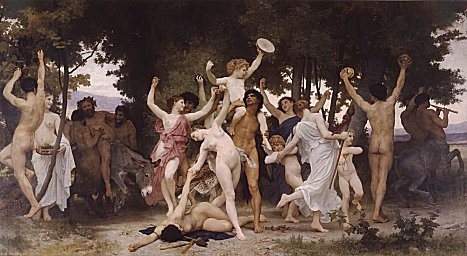

  
[Intangible Textual Heritage](../../index)  [Classics](../index) 

------------------------------------------------------------------------

<table width="75%">
<colgroup>
<col style="width: 50%" />
<col style="width: 50%" />
</colgroup>
<tbody>
<tr class="odd">
<td width="50%" data-valign="TOP"> 
</td>
<td width="50%" data-valign="TOP"><h1 id="ancient-art-and-ritual" data-align="CENTER">Ancient Art and Ritual</h1>
<h2 id="by-jane-harrison" data-align="CENTER">by Jane Harrison</h2>
<h4 id="section" data-align="CENTER">[1913]</h4></td>
</tr>
</tbody>
</table>

------------------------------------------------------------------------

[Title Page](aar00)  
[Prefatory Note](aar01)  
[Contents](aar02)  
[Chapter I. Art and Ritual](aar03)  
[Chapter II. Primitive Ritual: Pantomimic Dances](aar04)  
[Chapter III. Seasonal Rites: The Spring Festival](aar05)  
[Chapter IV. The Spring Festival in Greece](aar06)  
[Chapter V. Transition From Ritual To Art](aar07)  
[Chapter VI. Greek Sculpture](aar08)  
[Chapter VII. Ritual, Art and Life](aar09)  
[Bibliography](aar10)  
[Index](aar11)  
