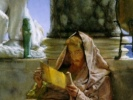

  
[Intangible Textual Heritage](../../../index)  [Classics](../../index) 
[Apollonius of Tyana](../index)  [Index](index)  [Previous](aot07) 
[Next](aot09) 

------------------------------------------------------------------------

[Buy this Book at
Amazon.com](https://www.amazon.com/exec/obidos/ASIN/156459131X/internetsacredte)

------------------------------------------------------------------------

  
*Apollonius of Tyana*, by G.R.S. Mead, \[1901\], at Intangible Textual
Heritage

------------------------------------------------------------------------

p. 65

### SECTION VII

#### EARLY LIFE

Apollonius was born [\*](#fn_74) at Tyana, a city in the south of
Cappadocia, somewhen in the early years of the Christian era. His
parents were of ancient family and considerable fortune (i. 4). At an
early age he gave signs of a very powerful memory and studious
disposition, and was remarkable for his beauty. At the age of fourteen
he was sent to Tarsus, a famous centre of learning of the time, to
complete his studies. But mere rhetoric and style and the life of the
"schools" were little suited to his serious disposition, and he speedily
left for Ægæ, a town on the sea-coast east of Tarsus. Here he found
surroundings more suitable to his needs, and plunged with ardour into
the study of philosophy. He became intimate with the priests of the
temple of Æsculapius, where cures were still wrought, and

p. 66

enjoyed the society and instruction of pupils and teachers of the
Platonic, Stoic, Peripatetic, and Epicurean schools of philosophy; but
though he studied all these systems of thought with attention, it was
the lessons of the Pythagorean school upon which he seized with an
extraordinary depth of comprehension, [\*](#fn_75) and that, too, although his teacher,
Euxenus, was but a parrot of the doctrines and not a practiser of the
discipline. But such parrotting was not enough for the eager spirit of
Apollonius; his extraordinary "memory," which infused life into the dull
utterances of his tutor, urged him on, and at the age of sixteen "he
soared into the Pythagorean life, winged by some greater one." [†](#fn_76) Nevertheless he retained his affection for
the man who had told him of the way, and rewarded him handsomely (i. 7).

When Euxenus asked him how he would begin his new mode of life he
replied: "As doctors purge their patients." Hence he refused to touch
anything that had animal life in it, on the ground that it densified the
mind and rendered it impure. He considered that the only pure form of
food was what the earth produced, fruits and vegetables. He also
abstained from wine, for though it was made from fruit, "it rendered
turbid the

p. 67

æther [\*](#fn_77) in the soul" and "destroyed
the composure of the mind." Moreover, he went barefoot, let his hair
grow long, and wore nothing but linen. He now lived in the temple, to
the admiration of the priests and with the express approval of
Æsculapius, [†](#fn_78) and he rapidly became so
famous for his asceticism and pious life, that a saying [‡](#fn_79) of the Cilicians about him became a
proverb (i. 8).

At the age of twenty his father died (his mother having died some years
before) leaving a considerable fortune, which Apollonius was to share
with his elder brother, a wild and dissolute youth of twenty-three.
Being still a minor, Apollonius continued to reside at Ægæ, where the
temple of Æsculapius had now become a busy centre of study, and echoed
from one end to the other with the sound of lofty philosophical
discourses. On coming of age he returned to Tyana to endeavour to rescue
his brother from his vicious life. His brother had apparently exhausted
his legal share of the property, and Apollonius at once made over half
of his own

p. 68

portion to him, and by his gentle admonitions restored him to his
manhood. In fact he seems to have devoted his time to setting in order
the affairs of the family, for he distributed the rest of his patrimony
among certain of his relatives, and kept for himself but a bare
pittance; he required but little, he said, and should never marry (i.
13).

He now took the vow of silence for five years, for he was determined not
to write on philosophy until he had passed through this wholesome
discipline. These five years were passed mostly in Pamphylia and
Cilicia, and though he spent much time in study, he did not immure
himself in a community or monastery but kept moving about and travelling
from city to city. The temptations to break his self-imposed vow were
enormous. His strange appearance drew everyone's attention, the
laughter-loving populace made the silent philosopher the butt of their
unscrupulous wit, and all the protection he had against their scurrility
and misconceptions was the dignity of his mien and the glance of eyes
that now could see both past and future. Many a time he was on the verge
of bursting out against some exceptional insult or lying gossip, but
ever he restrained himself with the words: "Heart, patient be, and thou,
my tongue, be still" [\*](#fn_80) (i. 14).

p. 69

Yet even this stern repression of the common mode of speech did not
prevent his good doing. Even at this early age he had begun to correct
abuses. With eyes and hands and motions of the head, he made his meaning
understood, and on one occasion, at Aspendus in Pamphylia, prevented a
serious corn riot by silencing the crowd with his commanding gestures
and then writing what he had to say on his tablets (i. 15).

So far, apparently, Philostratus has been dependent upon the account of
Maximus of Ægæ, or perhaps only up to the time of Apollonius’ quitting
Ægæ. There is now a considerable gap in the narrative, and two short
chapters of vague generalities (i. 16, 17) are all that Philostratus can
produce as the record of some fifteen or twenty [\*](#fn_81) years, until Damis’ notes begin.

After the five years of silence, we find Apollonius at Antioch, but this
seems to be only an incident in a long round of travel and work, and it
is probable that Philostratus brings Antioch into prominence merely
because what little he had learnt of this period of Apollonius’ life, he
picked up in this much-frequented city.

p. 70

\[paragraph continues\] Even from
Philostratus himself we learn incidentally later on (i. 20; iv. 38) that
Apollonius had spent some time among the Arabians, and had been
instructed by them. And by Arabia we are to understand the country south
of Palestine, which was at this period a regular hot-bed of mystic
communities. The spots he visited were in out-of-the-way places, where
the spirit of holiness lingered, and not the crowded and disturbed
cities, for the subject of his conversation, he said, required "*men*
and not people." [\*](#fn_82) He spent his time
in travelling from one to another of these temples, shrines, and
communities; from which we may conclude that there was some kind of a
common freemasonry, as it were, among them, of the nature of initiation,
which opened the door of hospitality to him.

But wherever he went, he always held to a certain regular division of
the day. At sun-rise he practised certain religious exercises alone, the
nature of which he communicated only to those who had passed through the
discipline of a "four years" (? five years’) silence. He then conversed
with the temple priests or the heads of the community, according as he
was staying in a Greek or non-Greek temple with public rites,

p. 71

or in a community with a discipline peculiar to itself apart from the
public cult. [\*](#fn_83)

He thus endeavoured to bring back the public cults to the purity of
their ancient traditions, and to suggest improvements in the practices
of the private brotherhoods. The most important part of his work was
with those who were following the inner life, and who already looked
upon Apollonius as a teacher of the hidden way. To these his comrades
(ἑταίρους) and pupils (ὁμιλητάς), he devoted much attention, being ever
ready to answer their questions and give advice and instruction. Not
however that he neglected the people; it was his invariable custom to
teach them, but always after midday; for those who lived the inner
life, [†](#fn_84) he said, should on day's
dawning enter the presence of the Gods, [‡](#fn_85) then spend the time till mid-day in giving
and receiving instruction in holy things, and not till after noon devote
themselves to human affairs. That is to say, the morning was devoted by
Apollonius to the divine science, and the afternoon to instruction in
ethics and practical life. After the day's work he bathed iii cold
water, as did so many of the mystics of

p. 72

the time in those lands, notably the Essenes and Therapeuts (i. 16).

"After these things," says Philostratus, as vaguely as the writer of a
gospel narrative, Apollonius determined to visit the Brachmanes and
Sarmanes. [\*](#fn_86) What induced our
philosopher to make so long and dangerous a journey nowhere appears from
Philostratus, who simply says that Apollonius thought it a good thing
for a young man [†](#fn_87) to travel. It is
abundantly evident, however, that Apollonius never travelled merely for
the sake of travelling. What he does he does with a distinct purpose.
And his guides on this occasion, as he assures his disciples who tried
to dissuade him from his endeavour and refused to accompany him, were
wisdom and his inner monitor (dæmon). "Since ye are faint hearted," says
the solitary pilgrim, "I bid you farewell. As for myself I must go
whithersoever wisdom and my inner self may lead me. The Gods are my
advisers and I can but rely on their counsels" (i. 18).

------------------------------------------------------------------------

### Footnotes

[65:\*](aot08.htm#fr_74) Legends of the
wonderful happenings at his birth were in circulation, and are of the
same nature as all such birth-legends of great people.

[66:\*](aot08.htm#fr_75) ἀρρήτῳ τινὶ σοφία
ξυνέλαβε.

[66:†](aot08.htm#fr_76) Sci., than his tutor;
namely, the "memory" within him, or his "dæmon."

[67:\*](aot08.htm#fr_77) This æther was
presumably the mind-stuff.

[67:†](aot08.htm#fr_78) That is to say
presumably he was encouraged in his efforts by those unseen helpers of
the temple by whom the cures were wrought by means of dreams, and help
was given psychically and mesmerically.

[67:‡](aot08.htm#fr_79) "Where are you hurrying?
Are you off to see the youth?"

[68:\*](aot08.htm#fr_80) Compare Odyssey, xx.
18.

[69:\*](aot08.htm#fr_81) I am inclined to think,
however, that Apollonius was still a youngish man when he set out on his
Indian travels, instead of being forty-six, as some suppose. But the
difficulties of most of the chronology are insurmountable.

[70:\*](aot08.htm#fr_82) φήσας οὐκ ἀνθρώπων
ἑαυτῷ δεῖν, ἀλλ᾽ ἀνδρῶν.

[71:\*](aot08.htm#fr_83) ἰδιότροπα.

[71:†](aot08.htm#fr_84) τοὺς οὕτω φιλοσοφοῦντας.

[71:‡](aot08.htm#fr_85) That is to say,
presumably, spend the time in silent meditation.

[72:\*](aot08.htm#fr_86) That is the Brāhmans
and Buddhists. Sarman is the Greek corruption of the Sanskrit Shramaṇa
and Pâli Samaṇo, the technical term for a Buddhist ascetic or monk. The
ignorance of the copyists changed Sarmanes first into Germanes and then
into Hyrcanians!

[72:†](aot08.htm#fr_87) This shows that
Apollonius was still young, and not between forty and fifty, as some
have asserted. Tredwell (p. 77) dates the Indian travels as 41-54 a.d.

------------------------------------------------------------------------

[Next: Section VIII. The Travels of Apollonius](aot09)
