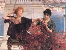
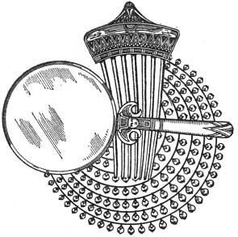

  
[Intangible Textual Heritage](../../index)  [Classics](../index) 
[Index](index)  [Previous](aph05)  [Next](aph07) 

------------------------------------------------------------------------

[Buy this Book at
Amazon.com](https://www.amazon.com/exec/obidos/ASIN/B000EP89M2/internetsacredte)

------------------------------------------------------------------------

  
*Aphrodite*, by Pierre Louys, \[1932\], at Intangible Textual Heritage

------------------------------------------------------------------------

p. 48

### Chapter Five

### THE MIRROR, THE COMB AND THE NECKLACE

SHE had a special beauty. Her hair seemed two masses of gold but it was
too abundant and weighted her forehead with two deep shadow-laden waves
which swallowed up the ears and wound seven-fold upon the nape of the
neck. The nose was delicate with slender nostrils which sometimes
palpitated above the rounded, mobile corners of the full and tinted
mouth. The pliant line of the body undulated with each step, animated by
the balancing of the beautiful hips under the rounded, swaying waist.

When she was no more than ten steps from the young man she turned her
gaze toward him. Demetrios trembled. They were extraordinary eyes, blue,
but deep and brilliant at the same time, moist, weary, in tears and in
fire, almost closed under the weight of the lashes and the lids. They
looked, these eyes, as the sirens sing. He who passed into their light
was inevitably taken. She knew it well and used them skilfully; but she
counted more on indifference affected toward the man whom so much
unfeigned love had not been able to touch sincerely.

The navigators who have sailed over the purple seas beyond the Ganges
tell that they have seen, under the waters, rocks which are of
lodestone. When vessels pass near them, the nails and the ironwork

p. 49

tear themselves away toward the submarine cliff and unite with it
forever. And that which was a rapid ship, a dwelling, a living being,
becomes no more than a flotilla of planks dispersed by the wind, driven
by the tides. Thus Demetrios himself was lost before two great magnetic
eyes and all his strength fled from him.

She lowered her eyelids and passed near him.

He could have cried out with impatience. His fists clenched; he was
afraid that he could not recover a calm attitude, for he must speak to
her. However, he accosted her with the customary words.

"I salute thee," he said.

"I salute thee also," replied the passing one.

Demetrios continued, "Whither goest thou, so little hurried?"

"I return."

"All alone?"

"All alone."

And she made a movement to resume her promenade.

Then Demetrios thought that perhaps he was deceived in judging her a
courtesan. For some time past the wives of the magistrates and of the
functionaries had dressed and tinted themselves like the daughters of
pleasure. This one might be a person very honorably known and it was
without irony that he finished his questions thus: "To thy husband?"

Resting her hands on the parapet behind her, she began to laugh.

Demetrios bit his lip and hazarded, almost timidly, "Seek him not. Thou
hast begun too late. There is no longer any one here."

p. 50

"Who told thee I was seeking? I am walking alone and seek nothing."

"Whence camest thou, then? For thou hast not put on all these jewels for
thyself—and here is a silken veil . . ."

"Wouldst thou have me go out naked or dressed in wool like a-slave? I
dress myself only for my pleasure; I love to know that I am beautiful
and, while walking, I look at my fingers to see all my rings."

"Thou shouldst have a mirror in thine hand and look at nothing but thine
eyes. They were not born at Alexandria, those eyes. Thou art a Jewess, I
hear it in thy voice which is softer than ours."

"No, I am not a Jewess. I am a Galilæan."

"How dost thou call thyself—Miriam or Noemi?"

"My Syrian name . . . thou shalt not know it. It is a royal name which
no one bears here. My friends call me Chrysis, which is a compliment
thou mightest have paid me."

He put his hand on her arm.

"Oh! no, no," she said mockingly, "it is much too late for those
pleasantries. Let me return quickly. It is almost three hours since I
arose; I am dying of fatigue."

Leaning over she took her foot in her hand.

"See how my little thongs hurt me. They were pulled much too tight. If I
do not loosen them in an instant I will have a mark on my foot and that
will be pretty indeed when someone embraces me! Let me go quickly. Ah!
what a nuisance! If I had known, I would not have stopped. My yellow
veil is all crumpled at the waist—look!"

Demetrios passed his hand over his forehead; then with the disengaged

p. 51

tone of a man who condescends to make his choice, he murmured, "Show me
the way."

"I will certainly not!" cried Chrysis with an astonished air.

"Thou dost not even ask if it is my pleasure. 'Show me the way!'.

How he says that! Dost thou take me for a girl of the porneion? Dost
thou know if I am free? Hast thou followed me in the streets? Hast thou
noticed the doors where I am welcome? Hast thou counted the men who
believe themselves loved of Chrysis? 'Show me the way!' I will not show
it to thee, so please thee! Remain here or go, but elsewhere than with
me!"

"Thou dost not know who I am. . . ."

"Thou? Come, come! Thou art Demetrios of Sais; thou hast made the statue
of my goddess; thou art the lover of my queen and the master of my city.
But for me thou art but a handsome slave because thou hast seen me and
because thou lovest me."

She drew nearer and pursued with a coaxing voice, "Yes—thou lovest me.
Oh! do not speak—I know what thou wilt tell me; thou lovest no one, thou
art loved. Thou art the Well-Beloved, the Cherished, the Idol. Thou hast
refused Glykera who had refused Antiochos. Demonassa who had sworn to
die virgin would have entrapped thee if thy two Lybian slaves had not
thrust her from the door. Callistion the well-named, despairing of
approaching thee, bought the house which is opposite thine and in the
morning shows herself in the opening of the window. Thou thinkest I do
not know all that? But everything is told, among women. The night of
thine arrival at Alexandria they spoke to me of thee; and since then not
a single day has passed on which thy name has not been pronounced before
me. I know even the things thou hast forgotten. Poor little Phyllis
hanged herself day

p. 52

before yesterday at the bar of thy door, did she not? Well—it is a
fashion which spreads. Lydia has done like Phyllis; I saw leer this
evening as I passed; she was quite blue but tears on her cheeks were not
yet dry. Thou dost not know who Lydia is? . . . A child of fifteen years
whom her mother had sold last month to a ship captain of Samos who
passed the night at Alexandria before going up the river to Thebes. She
carne to me. I gave her advice; she knew absolutely nothing, not even
how to play at dice. I often took her in my bed, because she had no
place to sleep. And she loved thee! If thou couldst have heard her call
thy name! . . . She wished to write to thee. Dost thou understand? I
told her it was not worth the trouble . . ."

Demetrios watched her without hearing.

"Yes, it is all the same to thee, is it not?" continued Chrysis. "Thou
didst not love her. It is I whom thou lovest. Thou hast not even heard
what I have just told thee. I am sure thou couldst not repeat a word of
it. Thou art well occupied wondering how my eyelids are made, how good
my mouth must be, how soft my hair. Ah! how many others know that! All,
all have desired my beauty: men, young men, old men, children, women,
young girls. Last year I danced before twenty thousand persons and I
know thou wert not one of them. Dost thou believe that I hide myself?
Ah! why that! All women have seen me at the bath.

All men have seen me. Thou alone thou shalt never again see me. I refuse
thee—I refuse thee! Of what I am, of what I feel, of my beauty, of my
love, thou shalt know nothing, ever—ever! Thou art an abominable man, a
coxcomb, cruel, insensitive and cowardly! I do not know why one of us
has not had hate

p. 53

enough to kill you both, one with the other, thou the first and thy
queen next."

Demetrios calmly seized her by the arms without a word of reply.

She had a moment of anguish; but suddenly straightened her back and said
in a low voice, "Ah! I do not fear that, Demetrios! Let me rise, thou
art hurting my arms."

They were silent for a few moments; then Demetrios continued, "This must
stop, Chrysis. Thou knowest well I will not injure thee. But let me
follow thee. So proud as thou art, it is a glory which will cost thee
dear—to refuse Demetrios."

Chrysis remained silent.

He continued more gently, "What dost thou fear?"

"Thou art accustomed to the love of others. Dost thou know what one
should give to a woman who does not love?" He grew impatient.

"I will give thee the gold of the world. I have it here in Egypt."

"I have it in my hair. I am tired of gold. I do not want gold. I wish
for but three things. Wilt thou give them to nee?"

Demetrios felt that she was going to demand the impossible. He looked at
her anxiously. But she began to smile and said in a slow voice, "I wish
for a silver mirror to reflect my eyes in my eyes.

"Thou shalt have it. What more wishest thou? Say quickly."

"I wish a comb of carved ivory to plunge into my hair like a net into
the sunlit water."

"Then?"

"Thou wilt give me my comb?"

"Surely. Finish."

p. 54

"I wish a pearl necklace to spread over my breast when I shall dance for
thee the nuptial dances of my country."

He raised his eyebrows.

"That is all?"

"Thou wilt give me my necklace?"

"The one which shall please thee."

Her voice became very tender. "The one which shall please me? Ah! that
is exactly what I wished to ask thee. Wilt thou let me choose my
presents?"

"Of course."

"Thou swearest it?"

"I swear it."

"What oath dost thou make?"

"Name it."

"By the Aphrodite which thou hast sculptured."

"I swear by the Aphrodite. But why this precaution?"

"Well . . . I was not quite sure. Now I am."

She raised her head. "I have chosen my gifts."

Demetrios became restless once more and asked, "So soon?"

"Yes . . . Dost thou think that I would accept any silver mirror bought
from a merchant of Smyrna or from some unknown courtesan? I wish that of
my friend Bacchis who cheated me last week and who derided me evilly at
a little party which she had with Tryphera, Mousarion and some other
young fools who brought the whole thing to me. It is a mirror of which
she is very fond because it once belonged to Rhodopis—she who was a
slave with Æsop and was brought back by the brother of Sappho. Thou
knowest that she is a very celebrated courtesan. Her mirror is
magnificent. They say that Sappho has gazed in it and because

p. 55

of that Bacchis keeps it jealously. She has nothing more precious in the
world; but I know where thou wilt find it. She told me one night when
she was drunk. It is under the third stone of the altar. It is there she
puts it every evening when she goes out at sunset. Go tomorrow to her
house at that hour and fear nothing; her slaves go out with her."

"It is madness!" cries Demetrios. "Dost thou wish me to steal?"

"Dost thou not love me? I thought that thou didst love me. And then,
hast thou not sworn? I thought that thou hadst sworn. If I am mistaken,
let us speak no more of it."

He understood that she would ruin him but let himself be drawn away
without a struggle, almost voluntarily. "I will do what thou sayest," he
replied.

"Oh! I know very well thou wilt do it. But thou didst hesitate at first.
I can understand that. It is not an ordinary gift; I would not demand it
from a philosopher. I demand it from thee. I know well thou wilt give it
to me."

She played an instant with the peacock plumes of her round fan, then,
suddenly:

"Ah! . . . Neither do I wish a comb of common ivory bought from a vender
of the town. Thou didst tell me I might choose, didst thou not? Very
well, I wish  I wish the comb of carved ivory which is in the hair of
the High Priest's wife. It is much more precious still than the mirror
of Rhodopis. It comes from a queen of Egypt who lived a long, long time
ago and whose name is so difficult I cannot pronounce it. So the ivory
is very old and yellow as though it were gilded. They have graved upon
it a young girl who passes through a marsh of lotos taller than she,
where she walks upon the tips of her toes to avoid getting wet

p. 56

\[paragraph continues\] . . . It is truly
a beautiful comb . . . I will be content when thou givest it to me . . .
I have also a little grudge against the one who possesses it. Last month
I offered a blue veil to the Aphrodite; I saw it the next day upon the
head of this woman. It was a little hasty and I was angry at her. Her
comb will repay me for my veil."

"And how will I get it?" demanded Demetrios.

"Ah; that will be a little more difficult. She is an Egyptian, thou
knowest, and she dresses her two hundred plaits but once a year like the
other women of her race. But I wish my comb tomorrow and thou wilt kill
her to get it. Thou hast sworn an oath."

She made a little grimace at Demetrios, who was looking at the ground.
Then she finished thus, very quickly, "I have chosen my necklace also. I
wish the seven row necklace of pearls which is about the neck of the
Aphrodite."

Demetrios started. "Ah! this time, it is too much! Thou shalt not laugh
at me to the end! Nothing, dost thou hear—nothing! neither the mirror
nor the comb nor the necklace shalt thou have . . ."

But she closed his mouth with her hand and resumed her coaxing tone: "Do
not say that. Thou knowest well thou wilt give me this also. I am very
certain of it. I shall have the three gifts. Thou wilt come to me
tomorrow evening and the day after tomorrow if thou wishest and every
evening. At thine hour I will be there, in the costume thou preferrest,
tinted as thy taste pleases, my hair dressed to thy fancy, ready for thy
caprices. If thou wish-est but tenderness, I will cherish thee as a
child. If thou wishest silence I will be silent . . . When thou wouldst
have me sing—Ah! thou wilt see, Well-Beloved! I know the songs of all
countries.

p. 57

\[paragraph continues\] I know those which
are soft as the murmur of springs, others which are terrible as
approaching thunder. I know some so naïve and so fresh that a young girl
could sing them to her mother; and I know those they would not sing at
Lampsakos; I know some that Elephantis would have blushed to hear and
that I would not dare to sing. Nights when thou wishest me to dance I
will dance until morning. I will dance quite clothed, with my tunic
dragging, or under a veil, or with a corselet. I shall dance with
flowers upon my head and in my floating hair, tinted like a divine
image. I know how to balance the hands, round the arms—thou shalt see! I
dance on the tips of my toes, moving lightly across the rugs. I know all
the dances of Aphrodite, those that they dance before Urania and those
that they dance in honor of Astarte. I know even those which they dare
not dance. I will dance for thee all the loves. Thou shalt see! The
queen is richer than I but in all the palace there is not a chamber so
enchanting as mine. I will not tell thee what thou wilt find there.
There are things so lovely that I could not give thee an idea of them
and others which are so rare that I have no words with which to tell of
them. And then, dost thou know what surpasses all the rest? Chrysis—whom
thou lowest and whom thou dost not yet know. Yes, thou hast seen my
face, but thou dost not know how fair I am. Ah! Ah! . . . Ah! Ah! Thou
wilt have many surprises. Ah! how thou wilt adore me, how thou wilt
tremble in my arms, how thou wilt swoon for love of me. And how good my
mouth will be! Ah! my kisses!"

Demetrios threw upon her a despairing look. She continued, tenderly:
"What—thou wilt not give me a poor old silver mirror when thou wilt have
all my hair like a golden forest in thy hands?"

p. 58

Demetrios wished to touch it . . .

She drew back and said, "Tomorrow."

"Thou shalt have it," he murmured.

"And thou wilt not take for me a little ivory comb which pleases me when
thou wilt have my two arms like two branches of ivory around thy neck?"

He attempted to caress them . . . She drew them back and repeated,
"Tomorrow.

"I will bring it to thee," he said, very low.

"Ah! I knew it well!" cried the courtesan. "And thou wilt give me also
the necklace of pearls which is about the neck of the Aphrodite and for
which I will give thee more kisses in thy mouth than there are pearls in
the sea!"

Demetrios, supplicating, advanced his head . . . Her vivid gaze
overwhelmed his as she lent her luxurious lips . . .

When he opened his eyes she was already far away. A little shadow, more
dim, darted behind her floating veil.

He walked vaguely toward the town, his head bent under an inexpressible
shame.

 

------------------------------------------------------------------------

[Next: Chapter Six. The Virgins](aph07)
