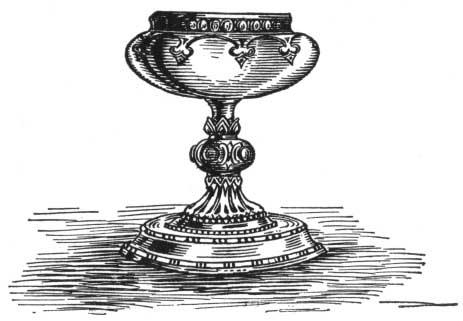

  
[Intangible Textual Heritage](../../index)  [Classics](../index) 
[Index](index)  [Previous](aph12)  [Next](aph14) 

------------------------------------------------------------------------

[Buy this Book at
Amazon.com](https://www.amazon.com/exec/obidos/ASIN/B000EP89M2/internetsacredte)

------------------------------------------------------------------------

  
*Aphrodite*, by Pierre Louys, \[1932\], at Intangible Textual Heritage

------------------------------------------------------------------------

p. 106

### Chapter Five

### THE INVITATION

TOWARD the middle of the night, Chrysis was awakened by three knocks at
the door. She had slept the whole day between the two Ephesians; they
might have been taken for three sisters together. Rhodis was cuddled
against the Galilæan; Myrtocleia slept face down, her eyes upon her arm
and her back uncovered.

Chrysis disengaged herself carefully, took three steps upon the bed,
descended, and partly opened her door.

A sound of voices came from the entrance.

"Who is it, Djala? who is it?" she asked.

"It is Naucrates who wishes to speak with thee. I am telling him that
thou art not free."

"Oh, how stupid! Certainly I am free. Enter, Naucrates, I am in my
room."

And she returned to the bed.

Naucrates stood for 'some time on the threshold as though he feared
being indiscreet. The two musicians opened sleep-laden eyes but could
not tea: themselves from their dreams.

"Seat thyself," said Chrysis. "I have no coquetries to make between us.
I know thou hast not come for me. What wishest thou of me?"

p. 107

Naucrates was a well-known philosopher who for more than twenty years
had been the lover of Bacchis and had never deceived her, more through
indolence than by fidelity. His gray hair was trimmed short, his beard
pointed after the manner of Demosthenes and his moustache cut even with
his lips. He wore a large white garment of seamless wool.

"I have come with an invitation for thee," he said. "Bacchis gives,
tomorrow, a dinner to be followed by a festival. We will be seven, if
thou comest. Do not fail us."

"A festival? What is the occasion?"

"She will free her handsomest slave, Aphrodisia. There will be dancers
and auletrides. I believe thy two friends are engaged, and for that
reason they should not be here. The others are rehearsing even now at
Bacchis’s."

"Oh! that is true," cried Rhodis, "we had forgotten it. Arise, Myrto, we
are very late."

But Chrysis protested. "No! Not yet! How wicked thou art to take my
women-friends away from me! If I had suspected that, I would not have
received thee. Oh! see, they are already prepared!"

"Our robes are not complicated," said the child. "And we are of
beautiful enough to spend a long time dressing."

"Will I see you at the temple, at least?"

"Yes, tomorrow morning; we will bring doves. I am taking a drachma from
thy purse, Chrysé; we have nothing with which to buy them. Until
tomorrow."

They ran out. Naucrates looked for some time at the door closed after
them; then he folded his arms and, turning toward

p. 108

\[paragraph continues\] Chrysis, said in a
low voice, "Good. Thou conductest thyself well."

"How?"

"Dost thou think this can endure for long? If it continues thus, we will
be forced to go to Bathyllos . . ."

"Ah! no!" cried Chrysis, "I will never admit that! I know very well
people make that comparison. But it is foolish and I am astonished that
thou, who professest to think, should not understand how absurd it is."

"And what difference dost thou find?"

"There is no question of difference. There is no relation between the
one and the other; that is clear."

"I do not say thou art wrong. I wish to know thy reasons."

"Oh! they can be given briefly; listen carefully. Woman is, in point of
love, a finished instrument. From head to foot, she is made uniquely,
marvelously, for love. She alone knows how to love. She alone knows how
to be loved. Consequently, love between women is perfect; between man
and woman it is not as pure; between men it is mere friendship. That is
all," said Chrysis.

"Thou art hard on Plato, my girl."

"The great men are not, any more than gods, great in all circumstances.
Pallas understands nothing of commerce, Sophocles knew not how to paint,
Plato knew not how to love. Philosophers, poets, orators—those who
appeal to his name—are no better, and however admirable they may be in
their own art, in love they are simpletons. Believe me, Naucrates, I
feel I am right."

The philosopher made a gesture. "Thou art a little irreverent,"

he said, "but I by no means feel thou art wrong. My indignation

p. 109

was not real. There is something charming in the friendship of two young
women, provided they are both quite willing to remain wholly feminine,
to retain their long hair, wear womanly clothing, and refrain from
artificial imitation of men, as though, illogically, they envied the
gross sex which they despise so prettily. Yes, their alliance is
remarkable because their bodies are not mated and their emotion is by so
much the more refined. They do not embrace as do men with women; they
feel more delicately the. supreme emotion. Their joy is not violent.
They know nothing of brutal actions and because of this they are
superior to Bathyllos. Human love is distinguished from the stupid heat
of animals only by two divine functions: the caress and the kiss. Now
these are the only things known to the women of whom we are speaking.
They have even brought them to perfection."

"One can do no better," said Chrysis, puzzled. "But then why dost thou
reproach me?"

"I reproach thee for being an hundred thousand. Already a large number
of women do not enjoy themselves except in the company of other women.
Soon you will receive us no more, even as a last resort. I am scolding
thee from jealousy."

Here Naucrates found that the conversation had lasted long enough and he
arose, simply. "I can tell Bacchis she may count on thee?" he asked.

"I will come," replied Chrysis.

The philosopher kissed her and went out slowly.

Then she clasped her hands and spoke aloud, although she was alone.

"Bacchis . . . Bacchis . . . He comes from her and does not

p. 110

know? . . . Is the mirror still there, then? . . . Demetrios has
forgotten me . . . If he has hesitated the first day, I am lost; he will
do nothing . . . But it is possible that all is done! Bacchis has other
mirrors which she uses oftener. Perhaps she does not know yet . . .
Gods! Gods! No way of hearing, and perhaps . . . Ah! Djala! Djala!"

The slave entered.

"Give me my dice," said Chrysis. "I wish to cast."

And she threw four little dice into the air.

"Oh! . . . Oh! . . . Djala, look; the cast of Aphrodite!"

Thus was called a rather rare throw by which the cubes all presented a
different face. There were exactly thirty-five chances to one against
this arrangement. It was the best cast of the game.

Djala observed coldly, "What didst thou ask?"

"That is true," said Chrysis, disappointed, "I forgot to make a wish. I
thought, indeed, of something, but I said nothing. Does that count the
same?"

"I think not; thou must begin again."

A second time Chrysis threw the dice. "The cast of Midas, now. What dost
thou think of it?"

"It is hard to say. Good and bad. It is a throw which is explained by
the following one. Begin again with a single die."

A third time Chrysis interrogated the play; but as soon as the die had
fallen she stammered: "The . . . the point of Kios!"

And she burst into sobs.

Djala said nothing, herself uneasy. Chrysis wept upon the couch, her
hair spread out around her head. At length she turned with a movement of
anger. "Why didst thou make me begin again? I am sure the first throw
counted."

p. 111

"If thou didst make a wish, yes. If thou didst not, no. Thou alone
knowest," said Djala.

"Beside, the dice prove nothing. It is a Greek game. I do not believe in
it. I will try something else."

She dried her tears and crossed the room. She took a box of white chips
on a tablet, counted out twenty-two, then, with the point of a pearl
clasp, she graved upon them, one after the other, the twenty-two letters
of the Hebrew alphabet. They were the arcana of the Kabala which she had
learned in Galilee. "Here is something I trust. Here is something which
never deceives," she said. "Raise the fold of thy robe; that will be my
bag."

She threw the twenty-two counters into the slave's tunic, repeating
mentally, "Shall I wear the necklace of Aphrodite? Shall I wear the
necklace of Aphrodite? Shall I wear the necklace of Aphrodite?"

And she drew out the tenth arcanum which clearly betokened: "Yes."

 

------------------------------------------------------------------------

[Next: Chapter Six. The Rose of Chrysis](aph14)
