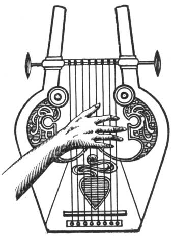

  
[Intangible Textual Heritage](../../index)  [Classics](../index) 
[Index](index)  [Previous](aph14)  [Next](aph16) 

------------------------------------------------------------------------

[Buy this Book at
Amazon.com](https://www.amazon.com/exec/obidos/ASIN/B000EP89M2/internetsacredte)

------------------------------------------------------------------------

  
*Aphrodite*, by Pierre Louys, \[1932\], at Intangible Textual Heritage

------------------------------------------------------------------------

p. 119

### Chapter Seven

### THE ENCHANTED LYRE

HE walked rapidly in the hope of finding Chrysis still upon the road
which led to the town, fearing, if he delayed longer, lest he again lose
his courage and desire.

The road, white with heat, was so bright that Demetrios closed his eyes
as in the noonday sun. He went thus without looking before him and
nearly collided with four black slaves who walked at the head of a new
procession, when a little, singing voice said, softly:

"Well-Beloved! how glad I am!"

He raised his head; it was Queen Berenice reclining on her elbow in her
litter.

She ordered:

"Stop, bearers!" and held out her arms to her lover. Demetrios was much
annoyed; but he could not refuse and he ascended with a sulky air.

Then Queen Berenice, mad with joy, drew herself on her hands to the
depths of the litter, and rolled among the cushions like a playful
kitten.

For this litter was a room and twenty-five slaves carried it. Twelve
women could lie in it at ease, scattered upon the dull blue rug among
the cushions and stuffs; and its height was such that

p. 120

one could not touch the roof, even with the tip of a fan. It was more
long than wide, closed in front and on the two sides by three very
yellow curtains which flared with light. The back was of cedar wood,
draped with a long veil of orange silk. Above this brilliant wall, the
great golden hawk of Egypt spread out its stiffened wings: lower,
sculptured in ivory and silver, the antique symbol of Astarte opened
over a lighted lamp which contended with the day in imperceptible
reflections. Below, Queen Berenice reclined between two Persian slaves
who waved about her two fans of peacock feathers.

With her eyes, she invited the young sculptor to her side, and repeated,
"Well-Beloved, I am glad."

She laid his hand on her cheek. "I was seeking thee, Well-Beloved. Where
wert thou? I have not seen thee since day before yesterday. If I had not
met thee, I would presently be dead of sorrow. All alone in this great
litter, I was so bored. Passing over the bridge of the Hermes, I threw
all my jewels into the water. to make circles. Thou seest, I have no
more rings or necklaces. I look like a little poor girl at thy feet."

She turned toward him and kissed him. The two fan-bearers crouched a
little farther away and when Queen Berenice began to speak very low, put
their fingers to their ears to make a pretense of not hearing.

Demetrios did not reply, scarcely listened, remained abstracted. He saw,
of the young queen, only the scarlet smile of her mouth and the black
cushion of her hair which she always dressed loosely as a rest for her
languid head.

She said, "Well-Beloved, I have wept in the night. My arms moved to
caress thee, but my hand found nowhere thy hand

p. 121

which I kiss today. I waited for thee in the morning, but since the full
moon thou hast not come. I sent slaves into all parts of the town and
killed them myself when they returned without thee. Where wert thou?
Wert thou at the temple? Thou wert not in the gardens with chose foreign
women? No, I see that by thine eyes. Then what wert thou doing, so far
from me? Thou wert before the statue? Yes, am sure of it, thou wert
there. Thou lovest it more than me, now. It is quite like me, it has my
eyes, my lips; so it is that which thou seekest. I am a poor abandoned
creature. Thou art tired of me; I perceive it well. Thou thinkest of thy
marbles and thine ugly statues as though I were not more beautiful than
them all and, at the very least, living and loving and kind, ready for
what thou wilt accept, resigned to what thou refusest. But thou wishest
nothing of me. Thou hast not desired to be a king, thou hast not wished
to be a god and adored in a temple of thine own. Thou art scarcely
willing to love me, any more.

She drew up her feet under her and leaned on her hand. "I would do
anything to see thee at the palace, Well-Beloved. If thou seekest me no
longer, tell me who attracts thee; she shall be my friend. The . . . the
women of my court . . . are beautiful. I have twelve who, since their
birth, have been kept in my gynæceum and do not even know that risen
exist. . . . Thou shalt see them all if thou wilt come to see me after
them. . . . And I have others with me who have been found more
attractive than the sacred priestesses. Say a word; I have also a
thousand foreign slaves; those whom thou wishest shall be delivered. I
will dress them like myself in yellow silk and gold and silver.

p. 122

"But no, thou art the handsomest and coldest of men. Thou lovest no one,
thou allowest thyself to be loved, thou pityest, in charity, those in
whom thine eyes kindle love. Thou permittest me to adore thee, but as a
horse allows itself to be curried, looking elsewhere. Thou art full of
condescension. Ah, gods! Ah, gods! I shall finish by doing without thee,
young coxcomb whom all the town adores and whom no one can make weep. I
have not only women at the palace, I have vigorous Ethiopians who have
chests of bronze and arms knotted with muscles. In their company I will
quickly forget thy dainty nature and thy pretty beard. I will rest from
being in love. But the day when I shall be certain that thine absent
eyes will disturb me no more and that I can replace thy lips, I shall
send thee from the heights of the bridge of Hermes to join my necklaces
and rings like a jewel worn too long! Ah! it is well to be a queen!"

She straightened up and seemed to wait. But Demetrios still remained
impassive and no more moved than if he had not heard her. She continued
angrily, "Thou hast not understood?"

He leaned nonchalantly on his elbow and said, in a very natural voice,
"The idea of a tale has come to me."

 

"Once upon a time, long before Thrace had been conquered by thy father's
ancestors, it was inhabited by wild animals and a few terrified men.

"The animals were very beautiful; there were lions ruddy as the sun,
tigers striped like the evening and bears black as night.

"Then men were small and flat-nosed, covered with old shabby skins,
armed with clumsy lances and ungraceful bows. They dwelt in holes in the
mountains closed with monstrous blocks

p. 123

which they rolled with difficulty. Their lives were passed in hunting.
There was blood in the forests.

"The country was so dismal that the gods had deserted it. When, in the
whiteness of the morning, Artemis left Olympus, her way was never that
which would have led toward the north. The wars which took place there
never interested Ares. The absence of flutes and citheri turned Apollo
aside. The triple Hecate shone there alone, like a Medusa face over a
petrified land.

"Now a man came to dwell there, who was of a happier race and went not
clad in skins like the mountain savages.

"He wore a long white robe which dragged a little behind him. He loved
to wander at night in the moonlight, through the soft clearings of the
woods, holding in his hand a little tortoise-shell fin which were
planted two auroch's horns between which three silver cords were
stretched.

"When his fingers touched the cords, a delicious music passed from them,
much softer than the sound of springs or the phrases of the wind in the
trees or the movements of wheat. The first time he played, three
sleeping tigers awoke, so prodigiously charmed that they did him no
harm, but approached as near as they could and withdrew when he ceased.
The next day there were yet more of them, and wolves, and hyenas, and
serpents erect upon their tails.

"So that, after a very short time, the animals came themselves to beg
him to play for them. It often happened that a single bear came to him
and went away contented with three marvelous chords. In return for his
complaisances, the wild beasts gave him food and protected hint from the
men.

"But he tired of this fastidious life. He became so sure of his

p. 124

genius and of the pleasure he gave the beasts that he no longer tried to
play well. The animals were always satisfied provided it were he. Soon
he refused to give them even this satisfaction, and indifferently,
ceased to play. All the forest mourned; nevertheless, the bits of meat
and the savory fruits were not wanting before the threshold of the
musician. They continued to nourish him and loved him even more. The
heart of animals is made so.

"Now one day as, leaning against his open door, he watched the sun
descend behind the motionless trees, a lioness passed nearby. He made a
movement to re-enter as though he feared embarrassing solicitations. But
the lioness paid no attention to him and passed, simply.

"Then he asked her, astonished: 'Why dost thou not ask me to play?' She
replied that she did not care about it. He said to her: 'Thou dost not
know me?' She replied: 'Thou art Orpheos.' He continued: 'And thou dost
not wish to hear me?' She repeated: 'I do not wish to.'—'Oh!' he cried.
'Oh! how I am to be pitied! It is just for thee I would have liked to
play. Thou art much more beautiful than the others and thou shouldst
understand so much better. If thou wilt listen to me only an hour, I
will give thee all thou canst dream of!' She replied: 'I demand that
thou steal the fresh meats that belong to the men of the plain. I demand
that thou murder the first man whom thou meetest. I demand that thou
take the victims they have offered to thy gods and that thou lay all at
my feet!' He thanked her for demanding no more, and did as she exacted.

"For an hour he played before her; but afterwards he broke his lyre and
lived as though he were dead."

p. 125

The queen sighed: "I can never understand allegories. Explain it to me,
Well-Beloved. What does it mean?"

He arose. "I have not told it for thee to understand. I have told thee a
story to calm thee a little. Now it is late. Farewell, Berenice."

She began to weep. "I was sure of it! I was sure of it!"

He laid her like a child upon her yielding bed of soft stuffs, smilingly
placed a kiss upon her unhappy eyes, and descended calmly from the great
moving litter.

 

------------------------------------------------------------------------

[Next: Chapter One. The Arrival](aph16)
