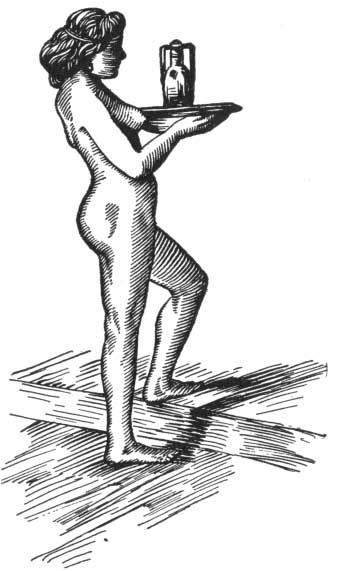

  
[Intangible Textual Heritage](../../index)  [Classics](../index) 
[Index](index)  [Previous](aph15)  [Next](aph17) 

------------------------------------------------------------------------

[Buy this Book at
Amazon.com](https://www.amazon.com/exec/obidos/ASIN/B000EP89M2/internetsacredte)

------------------------------------------------------------------------

  
*Aphrodite*, by Pierre Louys, \[1932\], at Intangible Textual Heritage

------------------------------------------------------------------------

p. 126 p. 127

# BOOK THREE

p. 128 p. 129

### Chapter One

### THE ARRIVAL

BACCHIS had been a courtesan for more than twenty-five years. That is to
say, she was approaching her fourth decade and the character of her
beauty had changed several times.

Her mother who, for a long time, had been the director of her house and
the counsellor of her life, had given her principles of conduct and
economy which had enabled her gradually to acquire a considerable
fortune, upon which she could draw without reckoning at the age where
magnificence of entertainment must compensate for lessening splendor of
the person.

Thus, in place of buying adult slaves at a high price in the market—an
expense which so many others considered necessary and which was
ruinous—she had contented herself for ten years with a single negress,
and had prepared for the future, free of cost, a numerous household
which would later become an asset.

Seven very beautiful mulattresses were born of her slave, and also three
boys whom she had disposed of, because male servants make jealous
lovers. She had named the seven girls after the seven planets, and had
chosen for them different occupations corresponding as nearly as
possible to the names they bore. Heliope was the slave of the day,
Selemis the slave of the night, Arete guarded the door, Aphrodisia
attended to the bed, Hermione

p. 130

made the purchases and Cronomagira presided in the kitchen. Finally,
Diomede, the stewardess, attended to the accounts and responsibilities.

Aphrodisia was the favorite slave, the prettiest, the best loved. She
often joined her mistress in entertaining visitors. Therefore she was
excused from all servile work in order to keep her arms delicate and her
hands soft. By an exceptional favor her hair was not covered, so that
she was often taken for a free woman; and this very evening she was to
be freed, at the enormous price of thirty-five minæ.

The seven slaves of Bacchis, all well grown and admirably disciplined,
were such a source of pride for her that she never went out without
having them in her train, at the risk of leaving her house empty. It was
through this imprudence that Demetrios entered the house so easily; but
she was still ignorant of her misfortune when she gave the festival to
which Chrysis was invited.

 

This evening, Chrysis was the first to arrive.

She was dressed in a green robe, embroidered with enormous rose branches
which flowered upon her bosom.

Arete opened the door for her before she had time to knock and,
following the Greek custom, conducted her into a little room, took off
her red shoes and gently washed her bare feet; then she perfumed her
wherever it was necessary, for the guests were spared every trouble,
even that of making their toilette before going in to dinner. Then she
presented her a comb and pins to order her headdress, as well as unguent
and dry tints for her lips and cheeks.

p. 131

When Chrysis was finally ready, she asked the slave, "Who are the
shades?"

Thus were called all the guests save one alone who was the invited. This
one, in whose honor the repast was given, brought with him whom he
pleased, and the "shades" had no care other than to bring their
couch-cushion and to be well behaved.

To Chrysis’s question, Arete replied:

"Naucrates has asked Philodemos with his mistress Faustina whom he
brought from Italy. He has also asked Phrasilas and Timon, and thy
friend Seso of Knidos."

At that very moment Seso entered. "Chrysis!"

"My dear!"

The two women embraced and overflowed with exclamations at the happy
chance which brought them together again.

"I feared I would be late," said Seso. "Poor Archytas delayed me. . . ."

"What, still he?"

"It is always the same thing. Whenever I go to dine in the town he
imagines that everybody is going to paw me. Then he must be consoled
beforehand, and that takes time! Ah! my dear! If he only knew me better!
I scarcely wish to deceive him. He is jealous enough, as it is!"

"And his child? Has anybody seen it yet, that thou knowest?"

"I should hope not! The third month—the little wretch! But it does not
annoy me yet. When it does—it will leave quickly."

"I know how you feel," said Chrysis. "Do not let it disfigure you.
Children age women. Yesterday I saw Philemation, our little friend of
former times who has been living for three years at

p. 132

\[paragraph continues\] Bubastis with a
grain-merchant's family. Dost thou know what she said to me, the first
thing? 'Ah! If thou couldst see what it has done to me!' And she had
tears in her eyes. I told her that she was still pretty, but she
repeated: 'If thou couldst see! If thou couldst remember!' weeping like
another Byblis. Then I saw she almost wanted me to agree with her, and I
asked her to show me what she meant. My dear—her skin—like leather! And
thou knowest how beautiful it was. One could not bear to look at the
knuckles, they were so red. Do not ruin thine, Seso. Keep young and
white as you are. A woman's complexion is more precious than her
jewels."

While speaking thus, the two women finished their toilettes. Then they
entered, together, the banquet hall where Bacchis stood waiting, her
waist clasped by apodesmes and her neck laden with golden necklaces
which graduated up to her chin.

"Ah! pretty dears, what a good idea of Naucrates’ it was to invite you
both this evening."

"We congratulate ourselves that it occurs here," replied Chrysis,
without appearing to understand the allusion. And, in order to say
something spiteful at once, she added: "How is Doryclos?"

That was a very rich young lover who had just left Bacchis to marry a
Sicilian.

". . . I have sent him away," said Bacchis, brazenly.

"You don't say!"

"Yes. They say he is going to marry out of spite. But I expect him the
morrow of his wedding. He is mad about me."

While asking, "Where is Doryclos?" Chrysis had thought: "Where is thy
mirror?" but Bacchis’s eyes did not look at her directly and she could
read nothing in them except vague and

p. 133

meaningless trouble. However, Chrysis had time to clear up this question
and, in spite of her impatience, she could resign herself to await a
more favorable occasion.

She was about to continue the conversation when she was prevented by the
arrival of Philodemos, Faustina and Naucrates, who constrained Bacchis
to fresh politenesses. They fell into ecstasies over the poet's
embroidered garment and over the diaphanous robe of his Roman mistress.
This young girl, little conversant with Alexandrian customs, had thought
to Hellenize herself thus, not knowing that such a costume was incorrect
at a feast where hired dancers, similarly half clothed, were to appear.
Bacchis gave no sign of noticing this error, and she found amiable
phrases to compliment Faustina upon her heavy, brilliant, blue-black
hair drowned in striking perfumes. This she wore held up with a golden
pin over the nape of her neck, to avoid spots of perfume upon her light
silken garment.

They were about to take places at the table when the seventh guest
entered; it was Timon, a young man whose absence of principle was a
natural gift, but who had found, in the teachings of the philosophers of
his time, some superior reasons approving his character.

"I have brought someone," he said, laughing.

"Who is it?" demanded Bacchis.

"A certain Demo, who is from Mendes."

"Demo! you don't mean it, my friend! She is a girl of the cheapest
sort!"

"Oh, very well. I will not insist on it," said the young man.

"I just made her acquaintance at the corner of the Canopic way.

p. 134

She asked me to give her a dinner and I brought her to thee. If thou
wilt not . . ."

"This Timon is incredible," declared Bacchis.

She called a slave. "Heliope, go tell thy sister that she will find a
woman at the door and that she is to drive her away with a beating. Go."

She turned, looking for someone.

"Phrasilas has not come?"

 

------------------------------------------------------------------------

[Next: Chapter Two. The Dinner](aph17)
