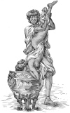

  
[Intangible Textual Heritage](../../index)  [Classics](../index) 
[Index](index)  [Previous](aph18)  [Next](aph20) 

------------------------------------------------------------------------

[Buy this Book at
Amazon.com](https://www.amazon.com/exec/obidos/ASIN/B000EP89M2/internetsacredte)

------------------------------------------------------------------------

  
*Aphrodite*, by Pierre Louys, \[1932\], at Intangible Textual Heritage

------------------------------------------------------------------------

p. 153

### Chapter Four

### BACCHANALIA WITH BACCHIS

WHEN she arrived once more before Bacchis’s doorway, she was filled with
the delicious sense of relaxation and cooling. The clouds were gone from
her brow. Her mouth had softened. She mounted the steps and crossed the
threshold.

Since Chrysis had left the hall, the festivities had developed like a
flame.

Other friends had come in whom the twelve dancers had welcomed wildly.
Crushed wreaths strewed the ground with flowers. In a corner, a leathern
bottle of Syracusan wine poured out a golden river which flowed under
the table.

Philodemos, beside Faustina, was singing the verses he had written about
her, as he played with the material of her robe, "O, feet," he sang, "O
rosy knees and handsome limbs! O perfect form! O you who madden me—warm
hands, sweet voice! Roman thou art, and brown, and do not sing the verse
of Sappho; but did not Perseus himself love the Indian Andromeda?"

Meanwhile, Seso, prone on the table in the midst of the scattered fruit,
and completely beclouded by the vapors of the Egyptian wine, cooled her
flesh in a sherbet of snow and repeated with comic solicitude: "Drink,
little one. Thou art thirsty. Drink, my little one. Drink. Drink.
Drink."

p. 154

Aphrodisia, still a slave, triumphantly celebrated her last night of
servitude in the tradition of all Alexandrian orgies. In obedience to
this, she had accepted three suitors early in the festivities. But her
obligations were not confined to that; until the end of the night,
following the custom regarding women slaves who were to be made free,
she had to prove by unflagging vivacity that her new dignity was in no
wise a usurpation.

Standing alone behind a column, Naucrates and Phrasilas debated
courteously upon the respective worth of Arcesilas and Carneade.

At the other end of the hall, Myrtocleia was protecting Rhodis against
an over-pressing banqueter. As soon as they saw Chrysis enter, the two
Ephesians ran to her.

"Let us go, my Chrysè. Theano remains; but we are going."

"I will stay also," said the courtesan. And she stretched out on her
back upon a great bed covered with roses.

A noise of voices and falling coins drew her attention; it was Theano
who, to mimic her sister, had taken the fancy, amidst laughter and
cries, to parody the Fable of Danæ. The saucy impiety of the child
amused all the feasters, for it was long past the time when a
thunderbolt would have exterminated mockers of the Immortal. But the
play was broken up, as might be expected.

To console her, a new diversion had to be invented. Two dancing-girls
slid an enormous silver-gilt crater, filled to the brim with wine, into
the middle of the hall, and someone, seizing Theano by the feet, made
her drink, head down, shaken by a burst of laughter which she could no
longer control.

This idea met with such success that everyone gathered around, and when
the flute-player was put upon her feet and they saw her

p. 155

  [  
Click to enlarge](img/15500.jpg)

p. 156 p. 157

little face inflamed by the congestion and streaming with wine drops, so
general a mirth swept over everyone there that Bacchis said to Selemis:

"A mirror; a mirror! let her see herself so!"

The slave brought a bronze mirror.

"No! not that one. The mirror of Rhodopis. She is worth it."

With a bound, Chrysis sprang up.

A rush of blood mounted to her cheeks, then receded and she remained
quite pale, her heart bounding against her ribs, her eyes fixed upon the
door through which the slave had gone out.

This instant would decide her whole life. Her last hope was about to
vanish or be realized.

Around her the festival continued. A crown of iris, thrown at random,
struck her upon the mouth, leaving upon her lips the sharp taste of
pollen. A man poured over her head a little vial of perfume which ran
off too quickly, wetting her shoulder. The spatters from a brimming cup
into which a pomegranate was thrown spotted her silken tunic and
penetrated to her skin.

 

The absent slave did not return.

Chrysis held her stony pallor, motionless as a sculptured goddess. The
rhythmic and monotonous plaint of a love-sick girl not far away measured
the passing time. It seemed to her that this woman had groaned thus
since the day before. She would have liked to wrench something, break
her fingers, cry out.

At last Selemis returned, empty-handed.

"The mirror?" demanded Bacchis.

"It is . . . it is not there . . . It is . . . it is . . . stolen,"
stammered the servant.

p. 158

Bacchis uttered a cry so piercing that all became still and a horrible
silence suddenly suspended the tumult.

From every part of the immense hall, men and women gathered around;
there was but a little open space where Bacchis stood in a frenzy,
before her the slave who had fallen upon her knees.

"Thou sayest . . . thou sayest!" she yelled.

And as Selemis made no reply, she caught her violently by the throat.

"It is thou who hast stolen it, is it not? It is thou! Answer! I will
have thee whipped into speech, miserable little wench!"

Then a terrible thing happened. The child, in a frenzy of fear, the fear
of suffering, the fear of death, the most present fear she had ever
known, cried precipitately, "It is Aphrodisia! It is not I! It is not
I!"

"Thy sister!"

"Yes, yes!" cried the mulattresses. "It is Aphrodisia who has taken it!"

And they dragged before Bacchis their sister, who had just swooned.

------------------------------------------------------------------------

[Next: Chapter Five. The Crucifixion](aph20)
