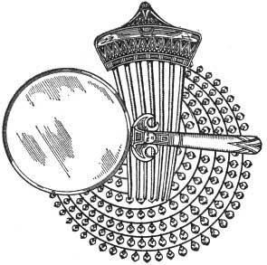

  
[Intangible Textual Heritage](../../index)  [Classics](../index) 
[Index](index)  [Previous](aph20)  [Next](aph22) 

------------------------------------------------------------------------

[Buy this Book at
Amazon.com](https://www.amazon.com/exec/obidos/ASIN/B000EP89M2/internetsacredte)

------------------------------------------------------------------------

  
*Aphrodite*, by Pierre Louys, \[1932\], at Intangible Textual Heritage

------------------------------------------------------------------------

p. 166

### Chapter Six

### ENTHUSIASM

SO the thing was done. Chrysis had the proof.

If Demetrios had resolved to commit the first crime, the two others must
have followed without delay. A man of his rank would consider murder and
even sacrilege to be less dishonoring than theft.

He had obeyed; therefore he was captive. This free, impassive, cold man,
he too submitted to slavery, and his mistress, his dominator, was she,
Chrysis, Sarah of the land of Gennesaret.

Ah! to think of it, repeat it, cry it aloud, to be alone! Chrysis
precipitated herself from the clamor-filled house and ran quickly,
straight before her, met full in the face by the morning breeze, cooled
at last.

She followed to the Agora the street which led to the sea and at whose
end the spars of eight hundred vessels huddled like gigantic reeds. Then
she turned to the right, before the immense avenue of the Drome where
the dwelling of Demetrios stood. A tremor of pride enveloped her and she
passed before the windows of her future lover; but she was too clever to
seek him before he sought her. She traversed the long road to the
Canopic Gate and threw herself upon the ground between two aloes.

He had done it. He had done all for her, doubtless more than

p. 167

any lover had ever done for any woman. She could not weary of repeating
it and affirming her triumph. Demetrios, the Well-Beloved, the
impossible and hopeless dream of so many feminine hearts, had exposed
himself, for her, to every peril, every shame, every voluntary remorse.
He had even denied the ideal of his thoughts, he had despoiled his work
of the miraculous necklace, and this day, already dawning, would see the
lover of the goddess at the feet of his new idol.

"Take me! take me!" she cried. She adored him now. She called him, she
desired him. The three crimes, in her spirit, transformed themselves
into heroic actions, for which, in return, she would never have enough
tenderness, enough passion, to give. With what an incomparable flame,
then, would burn this unique love of two beings equally young, equally
fair, equally loved by each other and united forever after surmounting
so many obstacles?

Together they would depart, they would leave the queen's city, they
would set sail for mysterious lands, for Amathus, for Epidaurus or even
for the unknown Rome which was the second city of the world after
immense Alexandria, and which was undertaking the conquest of the earth.
What would they not do, wherever they might be! What joy would be
foreign to them, what human felicity would not envy theirs and pale
before their enchanted passage!

Chrysis arose, dazzled. She stretched out her arms, raised her
shoulders, breathed deeply. A sensation of languor and of increasing joy
swelled in her heart. She resumed her homeward journey.

Opening the door of her room, she was surprised to see that nothing,
since the day before, had changed beneath her roof. The little objects
of her toilette, the table, the shelves, appeared to her

p. 168

insufficient to surround her new life. She broke some which reminded her
too directly of old, useless lovers and for which she conceived a sudden
hatred. If she spared others, it was not that she cared more for them
but because she feared to denude her room in case Demetrios had formed
the project of passing the night there.

She undressed slowly. The vestige of the orgy fell from her tunic,
crumbs of cake, hairs, rose leaves.

With her hand, she freed her waist from the girdle and plunged her
fingers into her hair to loosen its mass. But before lying down on the
bed, the desire seized her to repose an instant upon the rugs of the
terrace where the coolness of the air was so delicious.

She ascended.

The sun, risen only a few instants before, reposed upon the horizon like
a huge, swollen orange.

A great palm tree with a curved trunk dropped its mass of dewy green
leaves over the parapet. Chrysis crushed them to her tingling skin and
shivered, her arms folded before her.

Her eyes wandered over the town, which whitened little by little. The
violet mists of the dawn arose from the silent streets and fainted in
the lucid air.

Suddenly an idea sprang forth in her mind, increased, dominated, made
her delirious: Demetrios, he who had already done so much, why should he
not kill the queen, he who could be king? And then . . .

And then, this enduring ocean of houses, of palaces, temples, porticoes,
colonnades, which floated before her eyes from the Western Necropolis to
the Gardens of the Goddess: Bruchion, the Hellenic town, dazzling and
regular; Rhacotis, the Egyptian town,

p. 169

before which the light-flooded Paneion arose like an acropolitan
mountain; the Great Temple of Serapis with a façade horned by two long
rosy obelisks; the Great Temple of Aphrodite, surrounded by the murmurs
of three hundred thousand palm trees and of numberless waters; the
Temple of Persephone and the Temple of Arsinoe, the two sanctuaries of
Poseidon, the three towers of Isis Pharis, the seven columns of Isis
Lochias, and the Theater and the Hippodrome and the Stadion where
Psittacos had run against Nicosthene, and the tomb of Stratonice and the
tomb of the god Alexander—Alexandria! Alexandria—the sea, the men, the
colossal marble Pharos whose mirrors saved men from the sea!
Alexandria—the city of Berenice and of the eleven Ptolemaic kings,
Physcos, Philometor, Epiphanios, Philadelphos! Alexandria—fulfillment of
all dreams, the crown of all glories conquered during three thousand
years in Memphis, Thebes, Athens, Corinth, by the chisel, by the reed,
by the compass and by the sword!

Farther yet, the Delta, riven by the seven tongues of the Nile, Sais,
Bubastis, Heliopolis; then, rising toward the south, the ribbon of
fertile earth, the Heptanome where twelve hundred temples to all the
gods lay in a vista along the banks of the river; and, farther, the
Thebaid, Diospolis, the Elephantine Isle, the impassable cataracts, the
Isle of Argo . . . Merœ . . . the Unknown; and even, could one believe
the traditions of the Egyptians, the land of fabulous lakes whence
escapes the antique Nile, lakes so vast that one loses the horizon while
traversing their purple floods and so high in the mountains that the
stars, distant no more, reflect in them like golden fruits—all that,
all, would

p. 170

be the kingdom, the domain, the property of Chrysis the courtesan!

She raised her arms, suffocating, as though she thought herself able to
touch the sky. And as she moved thus she saw, slowly passing at her
left, a huge bird with black wings, flying toward the high seas.

 

------------------------------------------------------------------------

[Next: Chapter Seven. Cleopatra](aph22)
