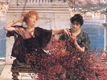

  
[Intangible Textual Heritage](../../index)  [Classics](../index) 
[Index](index)  [Previous](aph33) 

------------------------------------------------------------------------

[Buy this Book at
Amazon.com](https://www.amazon.com/exec/obidos/ASIN/B000EP89M2/internetsacredte)

------------------------------------------------------------------------

  
*Aphrodite*, by Pierre Louys, \[1932\], at Intangible Textual Heritage

------------------------------------------------------------------------

The following advertisements appeared in the original volume. They are
reproduced here for completeness.—JBH

### UNIFORM WITH THIS VOLUME

THE ADVENTURES OF BARON MUNCHAUSEN, RASPE

*With Illustrations by Gustave Doré*

AGAINST THE GRAIN, JORIS KARL HUYSMANS

*With Illustrations by Arthur Zaidenberg*

THE PICTURE OF DORIAN, GRAY OSCAR WILDE

*With Illustrations by Lui Trugo*

THE RUBAIYAT OF OMAR KHAYYAM, EDWARD FITZGERALD

*With Illustrations by Edmund J. Sullivan*

THAÏS, ANATOLE FRANCE

*With Illustrations by Arthur Zaidenberg*

CANDIDE, VOLTAIRE

*With Illustrations by Mahlon Blaine*

SALOME, OSCAR WILDE

*With Illustrations by Aubrey Beardsley*

THE ROMANCE OF THE QUEEN PÉDAUQUE, ANATOLE FRANCE

*With Illustrations by Alexander King*

PLEASANT QUESTIONS OF LOVE, GIOVANNI BOCCACCIO

*With Illustrations by Alexander King*

THE GIRL WITH THE GOLDEN EYES, HONORÉ DE BALZAC

*With Illustrations by Frank J. Buttera*

THE FABLES OF ÆSOP Compiled by WILLIS L. PARKER

*With Illustrations by Charles H. Bennett*

A SENTIMENTAL JOURNEY, LAURENCE STERNE

*With Illustrations by Mahlon Blaine*

ALICE'S ADVENTURES IN WONDERLAND AND THROUGH THE LOOKING GLASS, LEWIS
CARROLL

*With Illustrations by John Tenniel*

GREEN MANSIONS, W. H. HUDSON

*With Illustrations by Keith Henderson*

CYRANO DE BERGERAC, EDMOND ROSTAND

*With Illustrations by Nino Carbe*

SAMUEL PEPYS' DIARY, Edited by WILLIS L. PARKER

*With Illustrations by Randolph Adler*

A SHROPSHIRE LAD, A. E. HOUSMAN

*With Illustrations by Elinore Blaisdell*

SANINE: A RUSSIAN LOVE NOVEL, MICHAEL ARTZIBASHEV

*With Illustrations by Cameron Wright*

FRANKENSTEIN, MARY W. SHELLEY

*With Illustrations by Nino Carbe*

THE CONFESSIONS OF AN ENGLISH OPIUM-EATER, THOMAS DE QUINCEY

*With Illustrations by Lawrence W. Chaves*

APHRODITE PIERRE LOUYS

*With Illustrations by Frank J. Buttera*

FAUST, JOHANN WOLFGANG VON GOETHE

*With Illustrations by Harry Clarke*

THE BEST-KNOWN WORKS OF W. S. GILBERT

*With Illustrations by the Author*

NANA: THE HISTORY OF A FRENCH COURTESAN, ÉMILE ZOLA

*With Illustrations by Fred A. Mayer*

LYSISTRATA, ARISTOPHANES

*With Illustrations by Norman Lindsay*

THE FAIRY TALES OF HANS CHRISTIAN ANDERSEN AND CHARLES PERRAULT

*With Illustrations by Harry Clarke*

 

 

THE ILLUSTRATED EDITIONS CO., INC.  
THE THREE SIRENS PRESS  
104 FIFTH AVENUE, NEW YORK CITY

 

 

 
