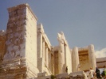

  
[Intangible Textual Heritage](../../index)  [Classics](../index) 
[Index](index)  [Previous](app36)  [Next](app38) 

------------------------------------------------------------------------

[Buy this Book at
Amazon.com](https://www.amazon.com/exec/obidos/ASIN/0674035011/internetsacredte)

------------------------------------------------------------------------

  
*Ancilla to the Pre-Socratic Philosophers*, by Kathleen Freeman,
\[1948\], at Intangible Textual Heritage

------------------------------------------------------------------------

p. 73

### 42. HIPPOCRATES OF CHIOS

Hippocrates of Chios flourished during the latter half of the
fifth century B.C.

(Aeschylus was the name of one of his
pupils).

He was the first to write a text-book of mathematics, called the
*Elements*. Parts of it were incorporated by Simplicius in his
Commentary on the *Physics* of Aristotle; but the work itself is lost.

------------------------------------------------------------------------

[Next: 43. Theodôrus of Cyrênê](app38)
